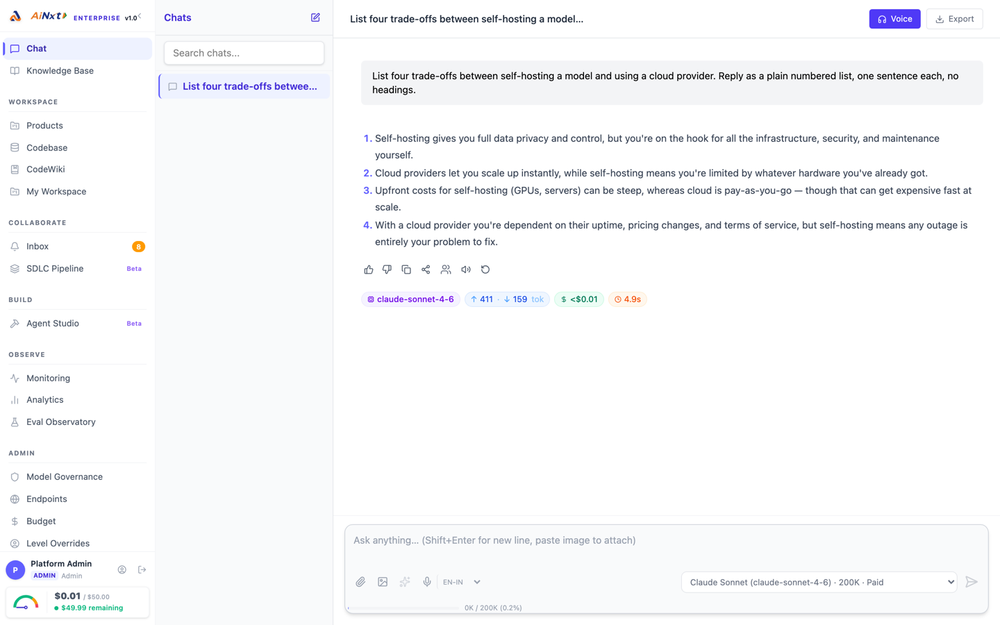
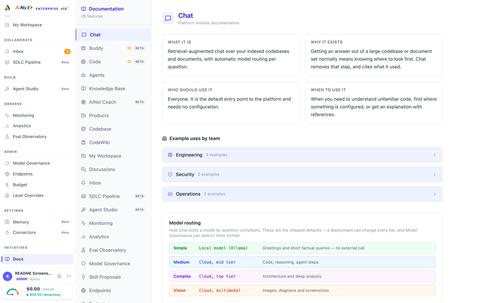
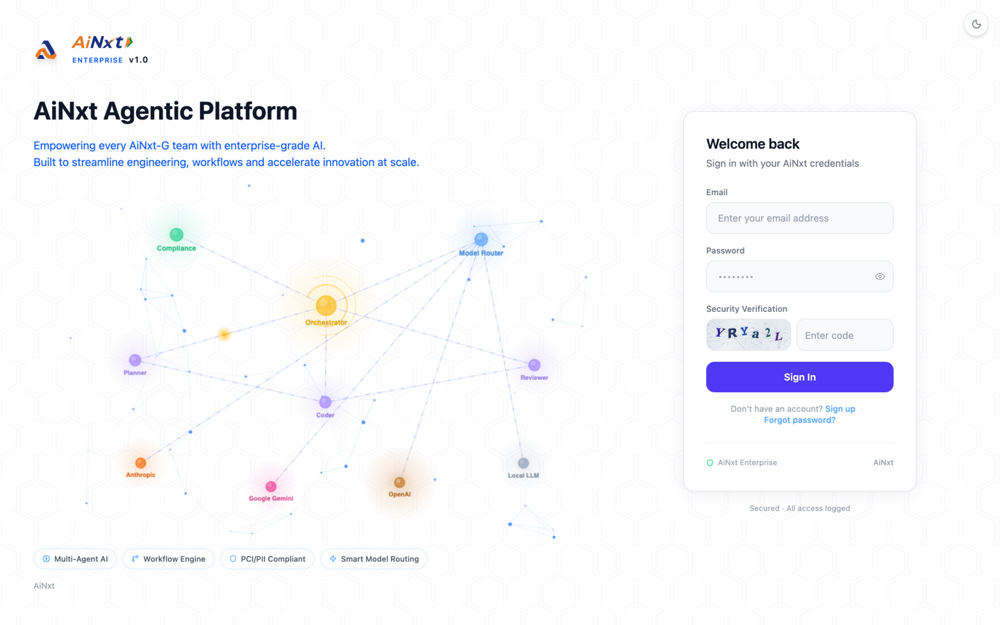

<p align="center">
  <!-- Brand-approved lockups from assets/Logo/. The light file is the transparent
       version for light backgrounds; the dark file is the navy-plate version, which
       stays legible on GitHub's dark theme. PNG rather than SVG because GitHub
       sanitises inline SVG in Markdown. -->
  <picture>
    <source media="(prefers-color-scheme: dark)" srcset="assets/Logo/ainxt-wordmark-dark.png">
    
  </picture>
</p>

# AiNxt Enterprise

[](OSSMETADATA)

> **Open-source AI platform for enterprise agentic workflows.**
> Build, deploy, and govern AI agents, document pipelines, and multi-model LLM workflows — all in one platform.

<!-- Badges are static shields.io labels and need no repo URL.
     BEFORE PUBLISHING: replace the npci/ainxt-enterprise paths in the
     install command and git clone URL below with the real org/repo. -->


<p align="center">
  
</p>
<p align="center">
  <sub>A real answer from a running install — note the model, token counts, cost and
  latency recorded against every turn, and the spend gauge bottom-left. More screens
  under <a href="#what-the-platform-actually-gives-you">What the platform actually gives you</a>.</sub>
</p>

---

## Get running in one command

```bash
curl -fsSL https://raw.githubusercontent.com/npci/ainxt-enterprise/main/install.sh | bash
```

That is the whole setup. The installer checks Docker, asks which AI model
provider you want, generates your secrets, then starts PostgreSQL, Redis,
Ollama, the API and the web UI, creates the database schema, and prints your
first-login password.

When it finishes, open **<http://localhost:5173/portal/>** and sign in as
`admin@ainxt.local` with the password it printed.

**Requirements:** Docker with ~8 GB of memory available, and about 15 GB of disk.
Nothing else — no Python, Node or PostgreSQL install needed. First run takes
5-15 minutes while the images build.

### Supported platforms

| Platform | Status | Notes |
|---|---|---|
| **macOS** (Apple silicon / Intel) | Verified | Docker Desktop. Tested on macOS 14, arm64 |
| **Linux** (x86_64 / arm64) | Verified | Tested on Ubuntu 24.04. `lsof` and `openssl` are optional — the installer falls back if either is missing. If `docker info` says permission denied, add yourself to the `docker` group |
| **Windows** | Via WSL2 | Run the installer from a **WSL2 shell** with Docker Desktop's WSL integration enabled for your distro. It is a bash script and will not run in PowerShell or `cmd` |

The default stack uses named volumes only — no host bind mounts — so paths behave
identically on all three. (The opt-in `observability` profile does bind-mount
`prometheus.yml` and `grafana/provisioning`; on Windows run that profile from
inside WSL2 so the paths resolve.)

<details>
<summary>Already cloned the repo, or want to see the script first?</summary>

```bash
git clone https://github.com/npci/ainxt-enterprise.git
cd ainxt-enterprise
less install.sh        # it is ~300 lines of plain bash, read it first
./install.sh
```

Fully non-interactive, for CI:

```bash
AINXT_PROVIDER=none ./install.sh --yes
```

`AINXT_PROVIDER` accepts `anthropic`, `openai`, `gemini`, `ollama` or `none`. If
the matching `*_API_KEY` is already exported, the installer reuses it instead of
prompting.

</details>

<details>
<summary>Prefer to run it natively instead of in Docker?</summary>

```bash
./install.sh --local
```

Native mode runs **the API and the web UI as normal processes on your machine**,
with only PostgreSQL, Redis and Ollama in Docker. You get the vite dev server
with hot reload, and a `.venv` you can attach a debugger to. It needs Python
3.10+ and Node 18+ locally.

It also handles the things that bite on a developer machine:

- **Port clashes.** If you already run PostgreSQL on 5432, Redis on 6379 or
  Ollama on 11434, it moves the containers to the next free port and records
  that in `.env` — rather than the backend silently connecting to *your*
  PostgreSQL and failing later with `role "postgres" does not exist`.
- **File storage.** `.env.example` points at `/var/lib/ainxt`, which a non-root
  user cannot create; native mode keeps storage in `./data` instead.
- **`gunicorn.conf.py` does not read `.env`**, so the installer exports
  everything into the environment before starting the server.

| | |
|---|---|
| `./stop-local.sh` | stop the API and UI (datastores keep running) |
| `tail -f log/gateway.out` | API log |
| `tail -f log/ai-ui.out` | UI log |
| `source .venv/bin/activate` | use the virtualenv directly |
| `docker compose stop postgres redis ollama` | stop the datastores too |

The UI is at **<http://localhost:5173/>** in native mode (no `/portal/` prefix —
that only applies to the production build).

</details>

<details>
<summary>Do you need an API key?</summary>

No — choose **Ollama** and everything runs locally and free, with no key and no
data leaving your machine. The installer pulls `llama3.2` (~2 GB) for you, and
requests for the `local` model are served by it and will **never** fall back to a
cloud provider: if the local model is down, the request fails with an explicit
error rather than quietly sending your prompt off the machine.

Choose Anthropic, OpenAI or Google instead if you want frontier-model quality;
you will need a paid key from that provider. You can also pick "decide later",
and add a key to `.env` afterwards.

</details>

### Is it working?

The installer runs this for you at the end, and you can run it again at any time:

```bash
./doctor.sh
```

It reports every part of the install as ✓ working, ✗ broken, or · not enabled,
and each ✗ comes with the command to fix it. Exit status is 0 only when nothing
**required** is broken, so it also works as a CI gate:

```bash
./doctor.sh --json      # machine-readable, same exit status
./doctor.sh --local     # for the native install
```

The checks assert on artifacts rather than exit codes — table counts in the
`ainxt` schema, the per-database KV probes inside `/health`, whether a
deliberately-wrong login is *rejected* rather than raising a 500, whether
`index.html` actually references a built bundle. A container being "up" is not
taken as evidence that the thing inside it works.

### Everyday commands

| | |
|---|---|
| `docker compose logs -f gateway` | follow the API logs |
| `docker compose ps` | what is running |
| `docker compose down` | stop everything, keep your data |
| `docker compose down -v` | stop and **delete all data** |
| `docker compose up -d --build` | rebuild after pulling changes |
| `docker compose run --rm gateway python db/migrate.py` | run migrations on their own |
| `./doctor.sh` | re-check the install and print what is broken |

Prefer to run the backend and frontend directly on your machine instead of in
containers? See [Quick Start](#quick-start) below.

---

## 📖 Documentation

All documentation is markdown in this repository — there is no separate docs site to
build or host, and nothing to download.

**Start here:** [Quick Start](#quick-start) below takes a clean machine to a running
platform. [Quick Start (TL;DR)](#quick-start-tldr) is the same thing as a copy-paste block.

| Document | What it covers |
|---|---|
| [`docs/GETTING_STARTED.md`](docs/GETTING_STARTED.md) | Prerequisites, install, configuration, first login, optional features, troubleshooting |
| [`docs/README.md`](docs/README.md) | Index of the 587 per-module reference pages in `docs/` |
| [`CONTRIBUTING.md`](CONTRIBUTING.md) | Development setup, coding standards, DCO sign-off |
| [`SUPPORT.md`](SUPPORT.md) | Where to ask questions |
| [`SECURITY.md`](SECURITY.md) | Reporting vulnerabilities — **do not open a public issue** |
| [`compliance/`](compliance/) | SBOMs and third-party notices |

---


## How this fits with the other AiNxt repositories

AiNxt is published as four separate repositories. They are **not** a monorepo
and you do not need all of them — but they do have a required order, and
picking the wrong starting point is the most common way to get stuck.

**You are here: `ainxt-enterprise`** — the Platform, and the thing everything else points at.

```
   ainxt-code                ┌────────────────────────────────────────┐
   IDE plugins ─────────────►│   AiNxt Enterprise  (ainxt-enterprise) │
   VS Code / IntelliJ        │   FastAPI  ·  http://localhost:8000    │
                             │   /ainxt/v1/api/*  (+ .../v1/chat/…)   │
   ainxt-cli ───────────────►│   React UI ·  http://localhost:5173    │
   terminal agent            └───────┬──────────────────────┬─────────┘
                                     │                      │
                 PostgreSQL · Redis ─┘                      │ optional sidecar
                 + a model provider                         │ (RUNTIME_URL)
                 (Ollama, vLLM, OpenAI, ...)                ▼
                                              ┌───────────────────────────┐
                                              │ AiNxt Runtime (ainxt-os)  │
                                              │ ainxt-runtimed  ·  :8080  │
                                              └───────────────────────────┘
```

| Repository | What it is | Port | Do you need it? |
|---|---|---|---|
| **`ainxt-enterprise`** — AiNxt Platform | The gateway. Python/FastAPI. Serves `/ainxt/v1/api/*` (auth, budgets, skills, admin) and an OpenAI-compatible `/ainxt/v1/api/v1/chat/completions`. Ships a React UI. The OpenAI-compatible route is `/ainxt/v1/api/v1/chat/completions` (not `/v1/chat/completions`) and is **disabled by default** — set `ENABLE_RAW_OPENAI_API=true`, or use a managed endpoint. | `8000` (API), `5173` (UI) | **Start here.** The CLI's `login` and the IDE plugins both depend on it. |
| **`ainxt-cli`** — terminal agent | A TUI coding agent, also runs headless for CI. | — | Optional. Works against the Platform, or against any OpenAI-compatible endpoint if you only want raw model access and no accounts. |
| **`ainxt-code`** — IDE plugins | VS Code extension and IntelliJ plugin. | — | Optional. **Requires the Platform** — it calls `/ainxt/v1/api/*`, so an OpenAI-compatible server such as vLLM is not a substitute. |
| **`ainxt-os`** — AiNxt Runtime | A Rust network service (`ainxt-runtimed`) for governed turns: compliance gates, replay, ledger, graph. | `8080` | Optional. The Platform can use it as a sidecar (`RUNTIME_URL`), and it also runs standalone behind any authenticating front end. |

**The dependency you cannot skip:** PostgreSQL and Redis for the Platform, and at
least one model provider somewhere. Nothing in this suite bundles a model.

**A note on ports.** The Platform binds **`8000`** by default and
`ainxt-runtimed` binds `8080`. If a client reports "gateway not reachable",
check the port first.

Be careful here, because the Platform repository is not self-consistent about
it: `.env.example` sets `BIND=0.0.0.0:9001` and its README says `9001`, but
`gunicorn.conf.py` never loads `.env`, so `BIND` is unset unless you export it
yourself and the server falls back to `0.0.0.0:8000` — which is also what the
`Dockerfile` exposes and health-checks. **8000 is what you actually get.** If
you want 9001, export `BIND` into the environment before starting the server,
and set `AINXT_GATEWAY_URL` on the clients to match.

---

## Table of Contents

- [Get running in one command](#get-running-in-one-command)
- [Is it working?](#is-it-working)
- [Documentation](#-documentation)
- [Overview](#overview)
- [What the platform actually gives you](#what-the-platform-actually-gives-you)
- [Desktop application](#desktop-application)
- [CLI and IDE access](#cli-and-ide-access)
- [Features](#features)
- [Architecture](#architecture)
- [Prerequisites](#prerequisites)
- [Quick Start](#quick-start)
- [Environment Variables](#environment-variables)
- [LLM Configuration](#llm-configuration)
- [Project Structure](#project-structure)
- [Contributing](#contributing)
- [Security](#security)
- [License](#license)


---

## Overview

AiNxt Platform is a full-stack, production-grade AI platform that provides:

- **Agentic workflows** — chain AI agents with tools, memory, and guardrails
- **Document intelligence** — ingest, parse, embed, and query documents at scale
- **Multi-model LLM routing** — unified proxy for OpenAI, Anthropic, Google Gemini, and local models (Ollama)
- **ABStudio** — visual agent and workflow builder (React + FastAPI)
- **Enterprise integrations** — Jira, Confluence, GitLab, GitHub, Slack, Teams, WhatsApp
- **Guardrails** — PII detection, compliance scanning, content safety
- **Observability** — OpenTelemetry tracing, Prometheus metrics, structured logging

---

## What the platform actually gives you

Everything below is a screen in the left sidebar of the running platform. The
grouping is the sidebar's own. Nothing here is aspirational — if it is listed, it
is in this repository.

Two columns need reading before the table: **Desktop** means the feature is
unavailable in a browser and needs the desktop application; **Default** flags the
three screens that are switched *off* on a fresh install, so you will not see
them until you enable them.

| Screen | What it is for | Desktop | Default |
|---|---|:--:|---|
| **Chat** | Retrieval-augmented chat over indexed code and documents, with per-question model routing | | on |
| **Buddy** | AI office assistant — reads documents, drafts content, produces Office files, acts through connectors | ✅ | on |
| **Code** | Local coding agent: opens a repo on your machine, edits files, runs commands, streams every diff | ✅ | on |
| **Knowledge Base** | Upload documents into the vector index; query them with a Domain → Product → Version → Document scope picker | | on |
| **AiNxt Coach** | Scores how you use the platform across six practice categories and suggests better prompts | | **off** — set `ENABLE_COACH=true` |
| **Products** | The product and department registry — see below | | on |
| **Codebase** | Connect and index repositories so everything else can retrieve from them | | on |
| **CodeWiki** | Generated, browsable documentation for an indexed repository | | on |
| **My Workspace** | Your own saved chats, documents, agent runs and files — see below | | on |
| **Discussions** | Internal Q&A forum with voting and accepted answers, plus an `@AiNxt` bot | | **off** — set `ENABLE_DISCUSSIONS=true` |
| **Inbox** | Approvals waiting on you, job completions, digests, alerts | | on |
| **SDLC Pipeline** | Multi-step delivery pipelines with human approval gates that resume where they paused | | on |
| **Agent Studio** | Visual builder for agents and multi-step chains | | on |
| **Monitoring** | Live health: service checks, queue depth, circuit breakers, error rates | | on |
| **Analytics** | Usage and cost across users, departments, products and models | | on |
| **Eval Observatory** | Run evaluations and track output quality across models and prompt versions | | on |
| **Model Governance** | Control which models each user, department or product may reach | | on |
| **Endpoints** | Named API endpoints and their access, for calling the platform programmatically | | on |
| **Budget** | Spend limits per user, department and product, enforced at request time | | on |
| **Level Overrides** | Grant or revoke a temporary access-level elevation, with an expiry | | on |
| **Email Broadcast** | Announcements to a selected audience | | **off** until an admin is permitted |
| **Memory** | What the platform remembers about you across sessions, and how to clear it | | on |
| **Connectors** | Governed access to Gmail, Google Calendar, Google Drive, Microsoft 365, Slack, GitHub, GitLab, Jira, Confluence, Zoom, DocuSign | | on |
| **Buddy Setup** | Desktop-side configuration: which folder the agent may use, which local tools are allowed | ✅ | on |
| **Docs** | This same catalogue, inside the running platform | | on |

Two more screens are reachable by URL but deliberately not in the sidebar:
`/agents` (build and run individual agents — Agent Studio supersedes it for most
uses) and `/skill-proposals` (review queue for skills the platform synthesised
itself).

<p align="center">
  
</p>
<p align="center">
  <sub>The same catalogue inside the platform — <b>Docs</b> in the sidebar.</sub>
</p>

### Products vs My Workspace

These two sound alike and are not related. The distinction matters because almost
every other screen scopes by one of them.

| | **Products** | **My Workspace** |
|---|---|---|
| Whose | The organisation's | Yours alone |
| Holds | Products, the departments that own them, and who leads each | Chats you kept, documents you generated, agent runs, files |
| Used by | Knowledge-base namespaces, budgets, governance rules, analytics breakdowns — they all scope by product or department | Nothing else. It is a personal record |
| Who can open it | `ad_level` 2 and below — Director and above | Everyone, and each person sees only their own |
| When you touch it | At setup, and when teams or ownership change | Whenever a result is worth returning to |

If a budget, a governance rule or an analytics chart is grouped in a way you did
not expect, **Products** is where that grouping is defined.

### What needs the desktop application

Three screens cannot work in a browser, because they drive a local CLI process
and read and write files on your own machine — capabilities a web page does not
have:

- **Buddy** — the office assistant, so it can open your local documents
- **Code** — the coding agent, so it can edit your real working copy
- **Buddy Setup** — the folder grant and local-tool permissions for both

They are **hidden in the browser rather than shown and broken**: open the
platform in Chrome and those three are simply absent from the sidebar. That is
deliberate, and it is why the screenshots above do not show them.

Everything else in the table works identically in a browser and in the desktop
application. See [Desktop application](#desktop-application) for how to build it.

---

## Desktop application

Most of this README describes the web platform, because that is what the
one-command setup gives you. The desktop application is a separate Electron
wrapper around the same React front end, and it exists for one reason: three
features need access to your local filesystem and a local process, which a
browser cannot give them. See
[What needs the desktop application](#what-needs-the-desktop-application).

It is not a separate product and it does not have its own backend — it points at
the same gateway.

### Building it

```bash
cd desktop
npm install

# Run against a local dev server or a running gateway
AINXT_DEV=1 npm start      # loads the Vite dev server from ai-ui/
npm start                  # loads the production UI from the gateway

# Package for distribution — artifacts land in desktop/dist/
npm run build:mac          # DMG + ZIP, arm64 and x64
npm run build:win          # ZIP, x64
npm run build:all          # macOS + Windows
npx electron-builder --linux   # AppImage — configured, but has no npm script
```

Full detail, including the tray, global hotkey and icon requirements, is in
[`desktop/README.md`](desktop/README.md).

### The CLI dependency

Buddy and Code drive the `ainxt` CLI as a child process, so the CLI must be
present on the machine. It is **not bundled into the packaged application**. The
app looks for it in this order:

1. `BUDDY_CLI_BIN` — an explicit absolute path
2. `resources/bin/` inside the packaged app, if a build bundled one
3. `$AINXT_BIN_DIR`, default `~/.ainxt/bin` — where the CLI's own installer puts it
4. `ainxt` on your `PATH`
5. a sibling `ainxt-cli` checkout with a release build

If none of those match, the app tells you the install command and offers to run
it for you. It asks first, because installing means fetching and executing a
script from the network.

---

## CLI and IDE access

The CLI and the IDE extensions are separate repositories, but they authenticate
against **this** platform and are governed by it — the same model routing, budget
enforcement, compliance checks and audit trail apply whether a request arrives
from the browser, the CLI or an editor.

### Creating a key

API keys are personal, created from the running platform:

1. Sign in and open **Profile → API keys** (your avatar, bottom-left).
2. Create a key with a label describing where it will be used, e.g. `laptop-cli`.
3. **Copy it immediately.** The raw key is shown once and never again — only a
   hash is stored, so a lost key must be replaced rather than recovered.

| | |
|---|---|
| Format | `{slug}-{uuid4}` — distinguishable from a JWT, which has three dot-separated segments |
| Limit | 5 active keys per user; creating a sixth is refused until you revoke one |
| Lifetime | 180 days by default (`API_KEY_LIFETIME_DAYS`) |
| Expiry warning | An inbox notification and email 15 days before expiry (`API_KEY_EXPIRING_SOON_DAYS`) |
| Revoking | Same screen — takes effect immediately |
| Endpoint | `POST /ainxt/v1/api/profile/api-keys`, if you would rather script it |

The desktop application mints its own key labelled `desktop:*` and recycles it,
so it does not consume your five.

### Using it

Send the key as a bearer token. The platform accepts either a JWT (browser
session) or an API key (CLI, IDE, scripts) on the same header:

```
Authorization: Bearer <your-api-key>
```

An OpenAI-compatible surface is served, so most existing tooling works by
changing the base URL and key:

| Path | Purpose |
|---|---|
| `/ainxt/v1/api/v1/chat/completions` | OpenAI-compatible completions |
| `/ainxt/v1/api/v1/models` | Model catalogue you are permitted to use |
| `/ainxt/v1/api/{slug}/v1/chat/completions` | Same, scoped to a named endpoint from the **Endpoints** screen |

The `{slug}` form is what the **Endpoints** screen creates. Use it when a team or
an external system should have its own addressable, separately revocable route
rather than sharing a personal key.

Which models you actually get back depends on **Model Governance**, and spend
counts against **Budget** exactly as it does in the browser. A key does not
escape either.

---

## Features

| Category | Capabilities |
|----------|-------------|
| **AI Agents** | Multi-step reasoning, tool use, memory, sandboxed code execution |
| **Document Pipeline** | PDF, DOCX, PPTX, XLSX, HTML ingestion → chunking → vector embedding → RAG |
| **LLM Proxy** | Unified API for Claude, GPT, Gemini, Ollama; circuit breaking, retry, spend tracking |
| **ABStudio** | Visual drag-and-drop agent/workflow builder with live chat panel |
| **Guardrails** | NeMo-based runtime guardrails, PII redaction |
| **Integrations** | Jira, Confluence, GitLab, GitHub, Slack, Teams, WhatsApp, Zoho CRM |
| **Auth** | JWT, LDAP/AD, Keycloak (OIDC), RBAC |
| **Observability** | OTLP tracing, Prometheus metrics, structured JSON logs |
| **Sandbox** | Docker-based isolated code execution |

---

## Architecture

```
┌─────────────────────────────────────────────────────────────┐
│                        Clients                              │
│          ai-ui (React/Vite)   ABStudio (React/Vite)         │
└────────────────────┬────────────────────┬───────────────────┘
                     │                    │
┌────────────────────▼────────────────────▼────────────────────┐
│                  gateway.py  (FastAPI)                       │
│   routers/  │  middleware/  │  agents/  │  guardrails/       │
└──────┬──────────────┬──────────────────┬─────────────────────┘
       │              │                  │
┌──────▼──────┐ ┌─────▼──────┐ ┌─────────▼───────┐
│  PostgreSQL │ │    Redis   │ │  services/      │
│  + pgvector │ │  (cache/   │ │  embed_svc      │
│  (main DB + │ │   queues)  │ │  privacy_svc    │
│  vector DB) │ └────────────┘ │  translate_svc  │
└─────────────┘                │  llm_proxy      │
                               │  discussions_svc│
                               └─────────────────┘
```

**Key components:**

| Component | Description |
|-----------|-------------|
| `gateway.py` | FastAPI application entrypoint — all HTTP routes |
| `agents/` | AI agent definitions, tool registry, memory |
| `guardrails/` | Runtime safety, PII detection, compliance |
| `core/` | Document parsing, config, crypto, key management |
| `services/llm_proxy/` | Outbound LLM proxy (Claude, OpenAI, Gemini) |
| `services/embed_svc/` | Embedding microservice |
| `ABStudio/` | Visual agent/workflow builder (full-stack) |
| `ai-ui/` | Main platform React UI |
| `sandbox/` | Docker-based isolated code execution |
| `connectors/` | External system connectors (Git, Jira, etc.) |
| `db/` | SQLAlchemy models, migrations, SQL scripts |
| `workers/` | Background job workers (RQ) |

---

## Prerequisites

| Requirement | Version | Notes |
|-------------|---------|-------|
| Python | 3.10+ | 3.12 recommended |
| Node.js | 18+ | 20 LTS recommended |
| PostgreSQL | 15+ | With `pgvector` extension |
| Redis | 7+ | For caching and job queues |
| Docker | 20+ | Optional — for sandbox execution |

---

## Quick Start

> **Full setup guide:** [`docs/GETTING_STARTED.md`](docs/GETTING_STARTED.md)
> covers prerequisites, LLM configuration, optional features (SMTP, LDAP, Kafka),
> seed scripts, Docker quickstart, and troubleshooting.

### 1. Prerequisites

- Python 3.10+
- Node.js 18+
- PostgreSQL 15+ with [pgvector](https://github.com/pgvector/pgvector) extension
- Redis 7+
- An LLM: [Ollama](https://ollama.ai) (free, local) **or** OpenAI/Anthropic API key

### 2. Clone and configure

```bash
git clone <your-repo-url>
cd ainxt-platform

# Copy the default config — safe defaults, no organisation-specific infrastructure needed
cp .env.example .env
```

Edit `.env` — at minimum set these:

```env
# Database (required)
POSTGRES_HOST=localhost
POSTGRES_PASSWORD=your-db-password
JWT_SECRET=your-strong-random-secret

# LLM — choose one:
LOCAL_LLM_BASE_URL=http://localhost:11434   # Ollama (free, no API key)
# OPENAI_API_KEY=sk-...                     # OpenAI
# ANTHROPIC_API_KEY=sk-ant-...              # Anthropic / Claude
```

### 3. Backend setup

```bash
# Create virtual environment
python -m venv venv
source venv/bin/activate        # Windows: venv\Scripts\activate

# Install dependencies
pip install -r requirements.txt

# Run database migrations (creates all tables including OSS-required ones)
python db/migrate.py

# (Optional) Seed example data — agents, skills, and HOD
# (Head of Department) budget/approval mappings
# - The default admin user is auto-created on first gateway boot — no need to run this first
# - Without this, the platform works fine but the HOD budget/governance
#   screens show empty data
python scripts/seed.py

# Start the platform.
# NOT `python gateway.py` — that file defines the FastAPI `app` but has no
# `__main__` block, so running it directly imports the module and exits without
# binding a socket. Use an ASGI server:
gunicorn gateway:app -c gunicorn.conf.py
# ...or, for a single-process dev server:
#   python -m uvicorn gateway:app --host 127.0.0.1 --port 8000
```

On first boot, the platform will:
1. Auto-create a default admin user if the database is empty
2. Print the credentials to the console — the password is randomly generated
   and shown **once**, so copy it before clearing the terminal:
   ```
   ============================================================
     AiNxt — Default admin user created
   ============================================================
     Email    : admin@ainxt.local
     Password : <generated — shown once>
   ============================================================
   ```
   To choose the password yourself instead, set `SEED_ADMIN_PASSWORD` in `.env`
   before first boot. If you lose a generated password, use **Forgot password**
   on the login page.
3. Show a startup config check — what's working and what needs configuration

Backend available at: **http://localhost:8000**
API docs at: **http://localhost:8000/docs** (ReDoc: **/redoc**, spec: **/openapi.json**)

> **Why 8000 and not 9001?** `gunicorn.conf.py` binds `${BIND:-0.0.0.0:8000}`
> and does **not** load `.env`, so the `BIND=0.0.0.0:9001` line in
> `.env.example` has no effect unless you export it yourself
> (`set -a; . ./.env; set +a`). 8000 is also what the `Dockerfile` exposes and
> health-checks. Note that `PLATFORM_BASE_URL` still defaults to `:9001`; set it
> to match wherever you actually bound if your deployment emits absolute URLs.

### 4. Frontend setup

```bash
cd ai-ui
npm install
npm run dev
```

Frontend available at: **http://localhost:5173**

Open the browser, log in with `admin@ainxt.local` and the password printed at first boot, then change it in **Profile → Security**.

---

## Quick Start (TL;DR)

```bash
# 1. Clone and configure
git clone <your-repo-url> && cd ainxt-platform
cp .env.example .env
# Edit .env: set POSTGRES_PASSWORD, JWT_SECRET, and one LLM provider

# 2. Start infrastructure (Postgres + Redis + Ollama)
docker compose up -d
docker exec ainxt-ollama ollama pull llama3.2        # free local LLM
docker exec ainxt-ollama ollama pull nomic-embed-text # embeddings

# 3. Backend (Terminal 1)
python -m venv venv && source venv/bin/activate
pip install -r requirements.txt
python db/migrate.py      # create all tables (required)
# python scripts/seed.py  # optional — seeds example agents, skills, HOD mappings
gunicorn gateway:app -c gunicorn.conf.py   # :8000, auto-creates admin on first boot

# 4. Frontend (Terminal 2)
cd ai-ui && npm install && npm run dev   # starts on :5173

# 5. Login
# Email: admin@ainxt.local  |  Password: printed once in the backend console
# Change password after first login: Profile → Security
```

<p align="center">
  
</p>

```bash
```

---

## Environment Variables

All configurable variables are documented in [`.env.example`](.env.example).

| Section | Key Variables | Description |
|---------|--------------|-------------|
| **Deployment** | `APP_ENV`, `DEPLOYMENT_MODE` | `development` / `production` |
| **Auth** | `JWT_SECRET`, `SECRET_KEY` | Token signing secrets |
| **PostgreSQL** | `DATABASE_URL`, `POSTGRES_DB`, `POSTGRES_PASSWORD` | Main database |
| **PGVector** | `PGVECTOR_DB`, `PGVECTOR_PASSWORD` | Vector database |
| **Redis** | `REDIS_URL`, `REDIS_PASSWORD` | Cache and job queues |
| **LLM Providers** | `OPENAI_API_KEY`, `ANTHROPIC_API_KEY`, `OLLAMA_BASE_URL` | AI model access |
| **CORS** | `CORS_ALLOWED_ORIGINS` | Comma-separated allowed origins. Unset = no cross-origin browser requests allowed (same-origin/API calls still work) |
| **CORS (optional dev convenience)** | `CORS_DEFAULT_ORIGINS`, `CORS_DEV_EXTRA_ORIGIN` | Only used when `CORS_ALLOWED_ORIGINS` is unset; both default to empty (no origins added) |
| **SSL/TLS** | `SSL_VERIFY`, `SSL_CA_BUNDLE` | TLS verification settings |
| **LDAP** | `LDAP_URL`, `LDAP_BASE_DN`, `LDAP_BIND_PASSWORD` | Directory auth |
| **Integrations** | `JIRA_URL`, `GITLAB_TOKEN`, `SLACK_BOT_TOKEN` | External services |
| **Observability** | `OTLP_ENDPOINT`, `LOG_LEVEL` | Tracing and logging |
| **HSM** | *(optional extra)* | See [HSM Support](#hsm-support) |

> **Security note:** Never commit `.env` to version control. `.env` is listed in `.gitignore`.

---

## LLM Configuration

AiNxt supports multiple LLM backends, controlled entirely by environment variables — no code changes needed.

### Option A — Local model via Ollama (dev / offline)

```env
OPENAI_COMPATIBLE_BASE_URL=http://localhost:11434/v1
OPENAI_COMPATIBLE_API_KEY=not-needed
FACTORY_BASE_URL=http://localhost:11434/v1
FACTORY_API_KEY=not-needed
FACTORY_MODEL=llama3.2
LLM_PROXY_TOKEN=
```

### Option B — Cloud providers (OpenAI / Anthropic / Gemini)

```env
OPENAI_API_KEY=<your-key>
ANTHROPIC_API_KEY=<your-key>
GEMINI_API_KEY=<your-key>
```

### Option C — Via LLM Proxy service

Route all LLM calls through the platform's built-in proxy (`services/llm_proxy/`) for compliance, PCI redaction, circuit breaking, and spend tracking:

```env
OPENAI_COMPATIBLE_BASE_URL=http://<proxy-host>:8003
FACTORY_BASE_URL=http://<proxy-host>:8003
FACTORY_MODEL=claude-sonnet-4-6
LLM_PROXY_TOKEN=<shared-secret>
```

**Supported models (proxy mode):**

| Model | Provider |
|-------|----------|
| `claude-sonnet-4-6` | Anthropic |
| `claude-haiku-4-5-20251001` | Anthropic |
| `claude-opus-4-7` | Anthropic |
| `gpt-5-mini` | OpenAI |
| `gpt-5.4` | OpenAI |
| `gemini-2.5-flash` | Google |
| Any Ollama model | Local |

---

## HSM Support

Hardware Security Module (HSM) support for key unwrapping is **optional**. The platform runs without HSM using `BASE:`-prefixed keys (plain base64 DEKs).

To enable HSM support:

```bash
pip install -e ".[hsm]"   # requires internal py-hsm-client package
```

Set `HSM_CONFIG_PATH=/path/to/hsm-config.yml` in your `.env`.

Without HSM, all keys must be `BASE:`-prefixed in the `keys_table`. See `core/ckms/` for details.

---

## Project Structure

```
ainxt-platform/
├── gateway.py                  # FastAPI entrypoint
├── requirements.txt            # Python runtime dependencies
├── pyproject.toml              # Project metadata + optional extras ([hsm], [dev])
├── .env.example                # Environment variable template (88 vars)
├── .npmrc                      # Pins public npm registry for contributors
│
├── ai-ui/                      # Main platform UI (React + Vite)
├── ABStudio/                   # Visual agent/workflow builder
│   ├── frontend/               #   React UI
│   ├── backend/                #   FastAPI backend
│   └── skills/                 #   Anthropic skill scripts
│
├── agents/                     # AI agent definitions and tool registry
├── guardrails/                 # Runtime safety, PII detection, NeMo guardrails
├── core/                       # Config, document parsing, crypto, key management
├── db/                         # SQLAlchemy models, Alembic migrations, SQL scripts
├── routers/                    # FastAPI route handlers
├── services/                   # Microservices
│   ├── llm_proxy/              #   Outbound LLM proxy
│   ├── embed_svc/              #   Embedding service
│   ├── privacy_svc/            #   PII/privacy service
│   ├── translate_svc/          #   Translation service
│   └── discussions_svc/        #   Discussions/comments service
├── workers/                    # Background job workers (RQ)
├── workflows/                  # Workflow definitions
├── connectors/                 # External connectors (Git, Jira, MCP)
├── sandbox/                    # Docker-based isolated code execution
├── tools/                      # Agent tool implementations
├── scripts/                    # Seed and utility scripts
└── tests/                      # Test suite
```

---

## Contributing

**Contributions are not open yet.** This project is published under Apache-2.0 as
source-available: you may use, modify and redistribute it under the licence. External
pull requests and issues are **not currently accepted or triaged**, and no commitment
is made to review or respond to them. See [CONTRIBUTING.md](CONTRIBUTING.md) for the
posture and for the workflow the maintaining team follows — which is the workflow
external contributions will follow when they open.

**Security vulnerabilities are the exception** and may be reported privately at any
time — see [SECURITY.md](SECURITY.md).

When contributions do open, every commit will require a
[DCO sign-off](CONTRIBUTING.md#developer-certificate-of-origin-dco) (`git commit -s`),
and [CODE_OF_CONDUCT.md](CODE_OF_CONDUCT.md) applies.

---

## Security

To report a security vulnerability, please see [SECURITY.md](SECURITY.md) for our responsible disclosure process.

Do **not** open a public GitHub issue for security vulnerabilities.

---


## License

AiNxt Platform is licensed under the **Apache License, Version 2.0**.
See [LICENSE](LICENSE) for the full license text.


## Disclaimer

Licensed under the Apache License, Version 2.0. You may obtain a copy of the
licence at <http://www.apache.org/licenses/LICENSE-2.0> or in [`LICENSE`](LICENSE).

Unless required by applicable law or agreed to in writing, this software is
distributed on an **"AS IS" BASIS, WITHOUT WARRANTIES OR CONDITIONS OF ANY KIND**,
either express or implied. See the licence for the specific language governing
permissions and limitations, in particular §7 (Disclaimer of Warranty) and §8
(Limitation of Liability).

<!-- Worded from Apache-2.0's own text on purpose. The more familiar
     "free software / redistribute / no warranty" disclaimer paragraph that many
     projects use is the GPL's own "How to Apply These Terms" boilerplate. Pasting
     it into an Apache-2.0 project reads as a GPL notice and a licence scanner will
     classify it as one, so it is avoided here rather than reproduced. -->
