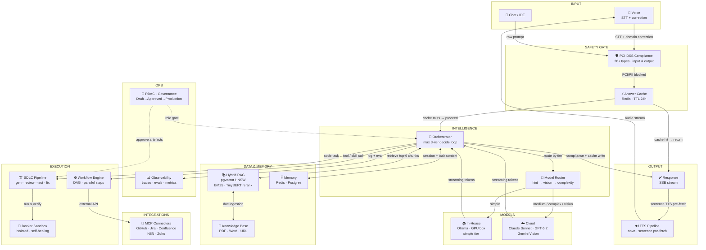

```mermaid
graph TD
    subgraph IN["  INPUT  "]
        U1["🎤 Voice\nSTT + correction"]
        U2["💬 Chat / IDE"]
    end

    subgraph SAFETY["  SAFETY GATE  "]
        G["🛡️ PCI·DSS Compliance\n20+ types · input & output"]
        CA["⚡ Answer Cache\nRedis · TTL 24h"]
    end

    subgraph BRAIN["  INTELLIGENCE  "]
        O["🧠 Orchestrator\nmax 3-iter decide loop"]
        MR["🔀 Model Router\nhint → vision → complexity"]
    end

    subgraph MODELS["  MODELS  "]
        ML["🏠 In-House\nOllama · GPU box\nsimple tier"]
        MC["☁️ Cloud\nClaude Sonnet · GPT-5.2\nGemini Vision"]
    end

    subgraph DATA["  DATA & MEMORY  "]
        RAG["📚 Hybrid RAG\npgvector HNSW\nBM25 · TinyBERT rerank"]
        MEM["🗄️ Memory\nRedis · Postgres"]
        KB["📂 Knowledge Base\nPDF · Word · URL"]
    end

    subgraph EXEC["  EXECUTION  "]
        WF["⚙️ Workflow Engine\nDAG · parallel steps"]
        SDLC["🏗️ SDLC Pipeline\ngen · review · test · fix"]
        SB["🐳 Docker Sandbox\nisolated · self-healing"]
    end

    subgraph INTEG["  INTEGRATIONS  "]
        MCP["🔗 MCP Connectors\nGitHub · Jira · Confluence\nN8N · Zoho"]
    end

    subgraph OPS["  OPS  "]
        OBS["📊 Observability\ntraces · evals · metrics"]
        GOV["🔐 RBAC · Governance\nDraft→Approved→Production"]
    end

    subgraph OUT["  OUTPUT  "]
        R["✅ Response\nSSE stream"]
        TTS["🔊 TTS Pipeline\nnova · sentence pre-fetch"]
    end

    U1 -->|"STT + domain correction"| G
    U2 -->|"raw prompt"| G
    G -->|"PCI/PII blocked"| CA
    CA -->|"cache miss → proceed"| O
    CA -->|"cache hit → return"| R

    O <-->|"retrieve top-6 chunks"| RAG
    O <-->|"session + task context"| MEM
    RAG <-->|"doc ingestion"| KB
    O -->|"route by tier"| MR
    MR -->|"simple"| ML
    MR -->|"medium / complex / vision"| MC
    ML -->|"streaming tokens"| O
    MC -->|"streaming tokens"| O

    O -->|"tool / skill call"| WF
    O -->|"code task"| SDLC
    SDLC -->|"run & verify"| SB
    WF -->|"external API"| MCP
    O -->|"log + eval"| OBS
    O -->|"compliance + cache write"| R
    R -->|"sentence TTS pre-fetch"| TTS
    TTS -->|"audio stream"| U1

    GOV -.->|"role gate"| O
    GOV -.->|"approve artefacts"| SDLC
```
