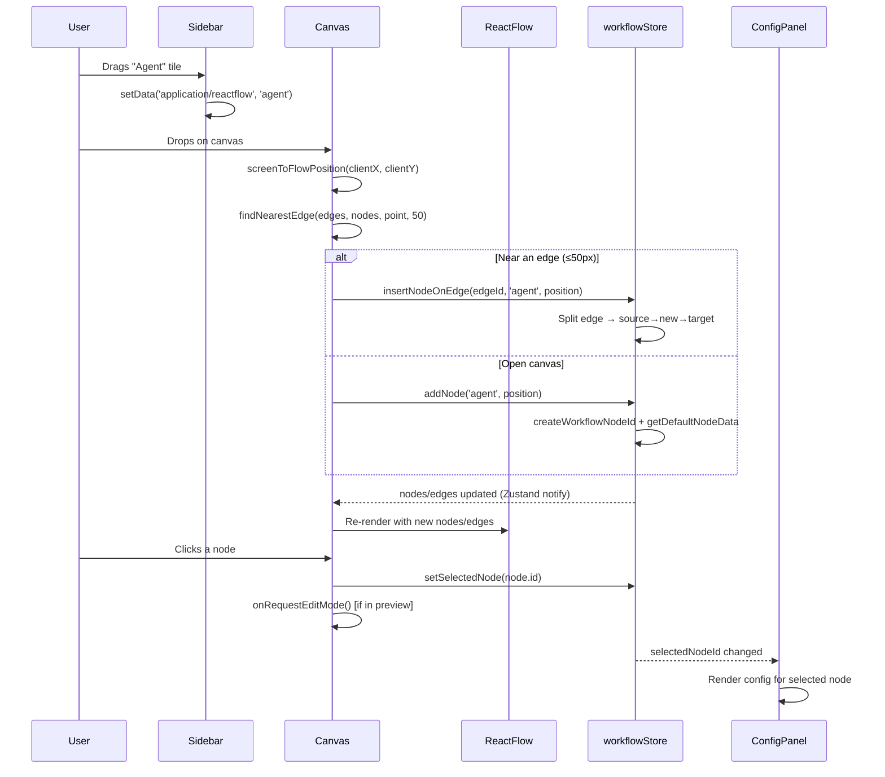
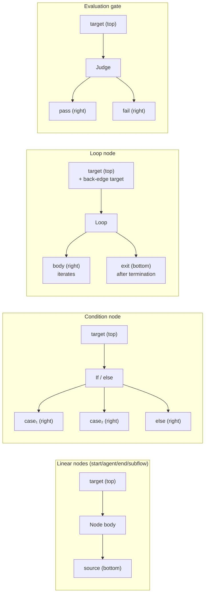
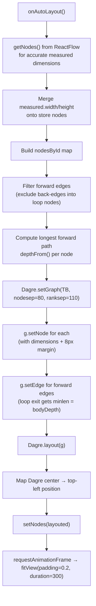
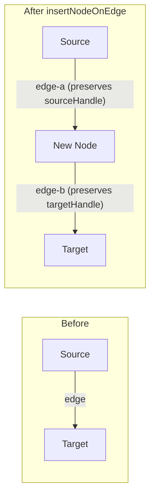
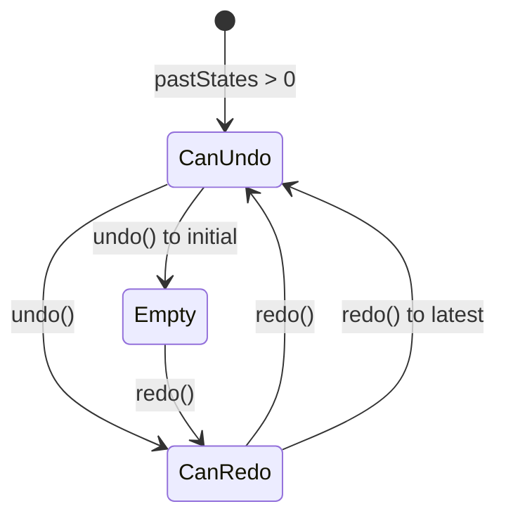
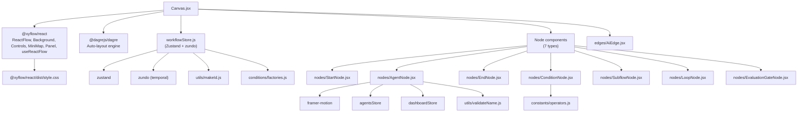
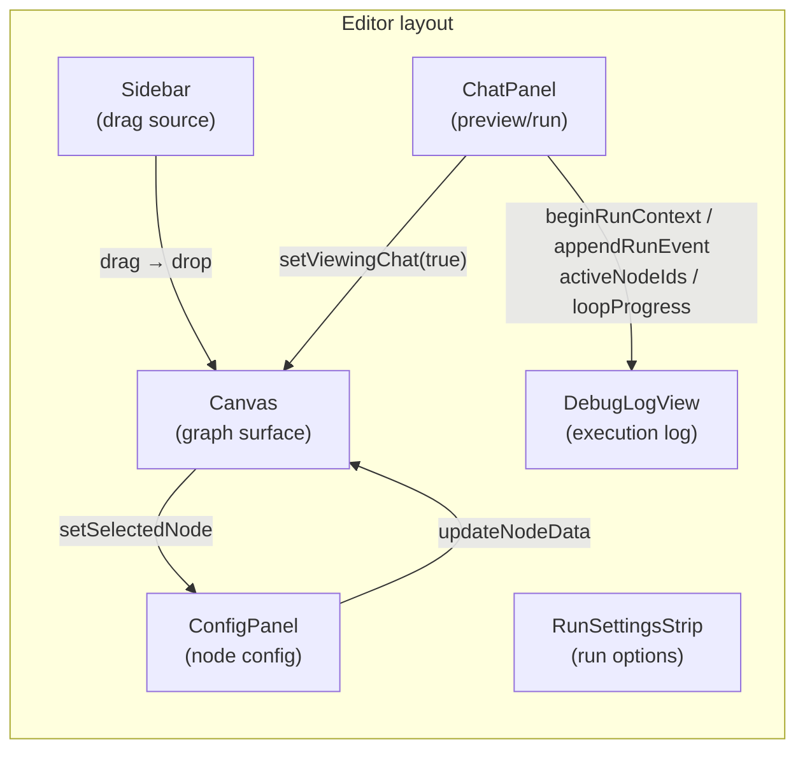

# Canvas Module

> **File:** `ABStudio/frontend/src/features/workflows/editor/Canvas.jsx`
> **Parent module:** [workflow_editor](#) (sibling of ChatPanel, ConfigPanel, DebugLogView, Sidebar, etc.)

## 1. Introduction

The **Canvas** is the interactive graph-editing surface at the heart of ABStudio's workflow builder. It renders the workflow as a node-and-edge diagram using [React Flow](https://reactflow.dev/) (`@xyflow/react`), letting users visually compose multi-agent pipelines by dragging nodes from a palette, wiring connections, inserting nodes onto edges, auto-arranging the layout, and undoing/redoing changes.

The Canvas is a **pure presentation + interaction layer** — it owns no workflow state of its own. All nodes, edges, selection, execution status, and undo/redo history live in the shared [workflowStore](#) (a Zustand store wrapped with `zundo` temporal middleware). The Canvas reads from that store, forwards React Flow change events into it, and delegates every mutation (add node, insert-on-edge, connect, remove) to store actions.

### Core responsibilities

| Responsibility | How |
|---|---|
| Render the workflow graph | `<ReactFlow>` with custom `nodeTypes` and `edgeTypes` |
| Drag-and-drop node creation | `onDrop` → `addNode` or `insertNodeOnEdge` (drop-on-edge) |
| Connection validation | `isValidConnection` (no self-loops, no duplicates) |
| Auto-layout | Dagre-based `getLayoutedNodes` with cycle-aware ranking |
| Selection routing | `onNodeClick` → `setSelectedNode` → opens [ConfigPanel](#) |
| Undo / Redo | Keyboard shortcuts + toolbar buttons → `zundo` temporal store |
| MiniMap overview | `minimapNodeColor` per-type colour mapping |
| Edge interaction | Hover tracking + delegated to custom [AiEdge](#) component |

---

## 2. Architecture

### 2.1 Component diagram

```mermaid
graph TB
    subgraph "Workflow Editor (parent)"
        Sidebar["Sidebar<br/>Node palette (drag source)"]
        Canvas["Canvas<br/>React Flow surface"]
        ConfigPanel["ConfigPanel<br/>Node configuration"]
        ChatPanel["ChatPanel<br/>Preview / run chat"]
        DebugLogView["DebugLogView<br/>Execution timeline"]
    end

    subgraph "State (Zustand + zundo)"
        Store["workflowStore<br/>nodes, edges, selection,<br/>execution, chat, runContext"]
        Temporal["zundo temporal store<br/>undo / redo history"]
    end

    subgraph "Node renderers"
        StartNode["StartNode"]
        AgentNode["AgentNode"]
        EndNode["EndNode"]
        ConditionNode["ConditionNode"]
        SubflowNode["SubflowNode"]
        LoopNode["LoopNode"]
        EvalGate["EvaluationGateNode"]
    end

    subgraph "Edge renderer"
        AiEdge["AiEdge<br/>Bezier + insert/delete buttons"]
    end

    subgraph "Layout engine"
        Dagre["Dagre<br/>rank-based auto-layout"]
    end

    Sidebar -- "drag start<br/>application/reactflow" --> Canvas
    Canvas -- "onNodeClick → setSelectedNode" --> ConfigPanel
    Canvas -- "reads nodes/edges" --> Store
    Canvas -- "onNodesChange / onConnect / addNode" --> Store
    Canvas -- "undo() / redo()" --> Temporal
    Canvas -- "nodeTypes map" --> StartNode & AgentNode & EndNode & ConditionNode & SubflowNode & LoopNode & EvalGate
    Canvas -- "edgeTypes map" --> AiEdge
    Canvas -- "onAutoLayout → getLayoutedNodes" --> Dagre
    AgentNode -- "reads activeNodeIds,<br/>savedAgents, savedWorkflows" --> Store
    ConditionNode -- "reads activeNodeIds" --> Store
    LoopNode -- "reads activeNodeIds,<br/>loopProgress" --> Store
    EvalGate -- "reads activeNodeIds" --> Store
    AiEdge -- "insertNodeOnEdge / removeEdge<br/>hoveredEdgeId / activeNodeIds" --> Store
```

### 2.2 Data flow: user interaction → store → re-render

---

## 3. Node type registry

The Canvas maps React Flow node `type` strings to React components via the `nodeTypes` constant. Each node component is a self-contained renderer that reads its own execution/selection state from the store.

| `type` key | Component | Handles | Notes |
|---|---|---|---|
| `start` | `StartNode` | target (top) | Singleton — workflow entry point |
| `agent` | `AgentNode` | target (top), source (bottom) | LLM agent; shows name, tools, skills, HITL badge, name-conflict indicator |
| `end` | `EndNode` | target (top) | Singleton — workflow exit |
| `condition` | `ConditionNode` | target (top), source (right) × N cases + `else` | Branching fork; renders case expressions inline |
| `subflow` | `SubflowNode` | target (top), source (bottom) | Links to an existing saved workflow or agent |
| `loop` | `LoopNode` | target (top), source `body` (right), source `exit` (bottom) | Iteration; shows progress badge + bar during execution |
| `evaluation_gate` | `EvaluationGateNode` | target (top), source `pass` (right), source `fail` (right) | LLM judge gate; routes by score ≥ threshold |

> **Backend counterpart:** The `evaluation_gate` node type is dispatched by `NativeEngine._traverse → _route_evaluation_gate` in [engine_native_engine](#). Loop back-edges (`body` handle) are driven by the loop engine via `stop_at={loop_id}`.

### Node handle topology

---

## 4. Auto-layout engine (Dagre)

The `onAutoLayout` callback and `getLayoutedNodes` helper produce a top-to-bottom ranked layout. The algorithm is deliberately **cycle-aware** because loop nodes create legitimate back-edges (agent → loop `target`) that would poison a naive rank-based layout.

### 4.1 Layout process

### 4.2 Key design decisions

- **Back-edge exclusion (`isLayoutBackEdge`):** Any edge whose `target` is a `loop` node is excluded from Dagre ranking. These edges still render as curves but don't distort node placement.
- **Loop exit depth (`depthFrom`):** The loop's `exit` edge (source handle `exit`) is given `minlen = bodyDepth` so the End node lands below the entire loop body rather than floating up beside the loop.
- **Dimension fallbacks (`NODE_DIMENSIONS`):** Per-type fallback sizes are used when React Flow hasn't measured a node yet. The condition node (160px tall) and evaluation gate (140px tall) get larger fallbacks because they render inline content.
- **Safety margin:** 8px is added to every node's measured height so Dagre leaves breathing room between ranks.

---

## 5. Drop-on-edge insertion

When a node is dropped near an existing edge (within 50px of the edge midpoint), the Canvas calls `insertNodeOnEdge` instead of `addNode`. This atomically splits the edge into two and wires the new node in between.

The `findNearestEdge` helper computes the midpoint of each edge (using node positions + fallback dimensions) and returns the closest edge within the threshold. This is also available via the [AiEdge](#) component's `+` button, which calls the same store action at the edge's label midpoint.

---

## 6. Edge rendering & interaction

All edges are normalised to the custom `ai-edge` type via the `renderedEdges` memo. The [AiEdge](#) component provides:

- **Bezier path** with curvature 0.34
- **Insert button (`+`):** Opens a menu of insertable node types (agent, condition, loop, subflow — not start/end since those are singletons)
- **Delete button (`×`):** Calls `removeEdge`
- **Hover visibility:** Action buttons appear on edge hover (`hoveredEdgeId` in store)
- **Execution animation:** Edge animates when its source node is in `activeNodeIds` (actively executing)

---

## 7. Undo / Redo

Undo/redo is powered by **zundo**'s temporal middleware wrapping the Zustand store. The Canvas integrates with it in two ways:

1. **Keyboard shortcuts** (`useEffect` keydown listener):
   - `Ctrl/Cmd + Z` → `temporal.getState().undo()`
   - `Ctrl/Cmd + Y` or `Ctrl/Cmd + Shift + Z` → `temporal.getState().redo()`
   - Ignored when focus is in an `INPUT`, `TEXTAREA`, or `contentEditable` element

2. **Toolbar buttons** (top-right `<Panel>`):
   - Subscribe to `temporal` state to track `canUndo` / `canRedo`
   - Disabled state reflects availability (`pastStates.length > 0` / `futureStates.length > 0`)

---

## 8. Connection validation

The `isValidConnection` callback enforces two rules:

1. **No self-loops:** `connection.source === connection.target` → rejected
2. **No duplicate edges:** Checks for an existing edge with the same `source`, `target`, `sourceHandle`, and `targetHandle` → rejected

> **Note:** Cycle detection is **not** enforced at connection time. The store's `hasIllegalCycle` function (which permits loop-body back-edges) is used at save/execution time, not during interactive wiring. This lets users temporarily create cycles while rearranging before the final validation pass.

---

## 9. MiniMap colour mapping

The `minimapNodeColor` helper assigns soft, light-theme-tuned fills per node type:

| Node type | Colour | Hex |
|---|---|---|
| `start` | Teal | `#0d9488` |
| `agent` | Indigo | `#4f46e5` |
| `end` | Green | `#059669` |
| `condition` | Amber | `#d97706` |
| `subflow` | Indigo (lighter) | `#6366f1` |
| `loop` | Sky | `#0ea5e9` |
| `evaluation_gate` | Amber (lighter) | `#f59e0b` |
| default | Gray | `#6b7280` |

The MiniMap is pannable and zoomable, with a subtle mask (`rgba(15, 23, 42, 0.04)`) and indigo stroke for the viewport outline.

---

## 10. Store integration

The Canvas subscribes to the following slices and actions from `workflowStore`:

| Store field / action | Usage in Canvas |
|---|---|
| `nodes`, `edges` | Render data (read) |
| `onNodesChange`, `onEdgesChange` | Forward React Flow change events |
| `onConnect` | New connection → `addEdge` |
| `addNode(type, position)` | Drop on open canvas |
| `insertNodeOnEdge(edgeId, type, position)` | Drop on / near an edge |
| `setNodes(layouted)` | Apply auto-layout result |
| `setSelectedNode(id)` | Node click / pane click |
| `setHoveredEdgeId(id)` | Edge hover tracking |
| `temporal.undo()` / `temporal.redo()` | Undo / redo |

### Execution-time visual feedback

During workflow execution, the store updates `activeNodeIds` (currently executing nodes) and `loopProgress` (per-loop iteration state). Node components read these directly from the store to show:
- **Executing state:** Pulsing/animated node border
- **Success/error status:** Green/red node styling
- **Loop progress:** Round counter badge + progress bar (LoopNode)
- **Edge animation:** Animated dash flow on edges whose source is executing (AiEdge)

---

## 11. Dependencies

### External libraries

| Library | Purpose |
|---|---|
| `@xyflow/react` | Core graph rendering, pan/zoom, handles, change events |
| `@dagrejs/dagre` | Rank-based auto-layout algorithm |
| `framer-motion` | Node entrance/hover animations (used by node components) |
| `zustand` | State management (via workflowStore) |
| `zundo` | Temporal (undo/redo) middleware for Zustand |

---

## 12. Relationship to sibling editor components

The Canvas is one panel within the workflow editor layout. It cooperates with its siblings through the shared store:

- **Sidebar:** Provides draggable node tiles. Sets `application/reactflow` data transfer type on drag start. Conditionally disables the End tile if an End node already exists.
- **ConfigPanel:** Reacts to `selectedNodeId` from the store. Edits node `data` via `updateNodeData`, which triggers Canvas re-render. Also handles condition case editing, loop configuration, subflow linking, and trigger setup.
- **ChatPanel:** Drives execution. Updates `activeNodeIds`, `loopProgress`, `runContext`, and chat state in the store. The Canvas and its nodes reactively reflect execution status. When in preview/chat mode, clicking a node on the Canvas calls `onRequestEditMode()` to switch back to edit mode and open the ConfigPanel.
- **DebugLogView:** Consumes `runContext.rows` and `runHistory` to render the execution timeline. No direct interaction with Canvas.

---

## 13. Backend contract

The Canvas produces a graph of nodes and edges that is serialized and sent to the backend for execution. Key mappings:

| Frontend concept | Backend counterpart |
|---|---|
| Node `type` + `data` | `Workflow` model nodes in [app_models](#) (`AgentNode`, `ConditionNode`, `StartNode`, `EndNode`, `McpNode`, etc.) |
| Edges with `sourceHandle` / `targetHandle` | `Edge` model in [app_models](#) |
| Loop `body` / `exit` handles | `NativeEngine` loop traversal with `stop_at` |
| Evaluation gate `pass` / `fail` handles | `NativeEngine._route_evaluation_gate` |
| `pruneToConnectedSubgraph` | Backend receives only Start→End reachable nodes |
| `hasIllegalCycle` | Pre-execution validation (loop-body back-edges allowed) |

The execution API is exposed via [api_execution](#) (`run_workflow`, `run_workflow_stream`, `resume_workflow_stream_endpoint`), and the engine implementation lives in [engine_native_engine](#) (`NativeEngine`).

---

## 14. Key functions reference

### `getLayoutedNodes(nodes, edges)`
Produces Dagre-laid-out node positions. Excludes loop back-edges from ranking, computes forward-path depth to push loop exits below their bodies, and converts Dagre center coordinates to React Flow top-left coordinates.

### `findNearestEdge(edges, nodes, point, threshold)`
Returns the edge whose midpoint is closest to `point` within `threshold` pixels. Used for drop-on-edge detection. Uses fallback node dimensions (`NODE_W=200`, `NODE_H=64`) for midpoint calculation.

### `getNodeDimensions(node)`
Resolves a node's width/height by preferring React Flow's `measured` dimensions, falling back to per-type `NODE_DIMENSIONS`, and adding an 8px height safety margin.

### `isLayoutBackEdge(edge, nodesById)`
Returns `true` for any edge whose target is a `loop` node (the body return path). These edges are excluded from Dagre ranking to prevent cycle-induced node scattering.

### `minimapNodeColor(node)`
Maps node `type` to a soft hex colour for the MiniMap overview.

### `isValidConnection(connection)`
Validates new connections: rejects self-loops and duplicate edges (same source/target/handles).

### `onAutoLayout()`
Orchestrates auto-layout: enriches store nodes with React Flow measurements, calls `getLayoutedNodes`, applies results via `setNodes`, and fits the view with a 300ms animation.

### `onDrop(event)`
Handles drag-and-drop: converts screen coordinates to flow position, checks for nearby edges (drop-on-edge), and calls the appropriate store action.

---

## 15. CSS & visual configuration

The Canvas uses several React Flow configuration options:

- **Background:** Dot grid, `rgba(116, 139, 170, 0.42)`, 28px gap, 1.35 size
- **Snap to grid:** 28×28px grid
- **Connection line:** Bezier type, indigo stroke (`#4f46e5`), 2.25px width
- **Default viewport:** `{ x: 0, y: 0, zoom: 1 }`
- **Attribution:** Hidden (`proOptions.hideAttribution: true`)
- **Delete key:** Disabled (`deleteKeyCode={null}`) — deletion is handled via ConfigPanel and edge buttons

The toolbar panel (top-right) contains auto-layout, undo, and redo buttons with SVG icons and tooltip/aria-label accessibility attributes.
