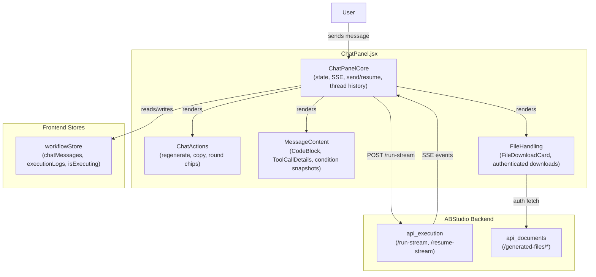
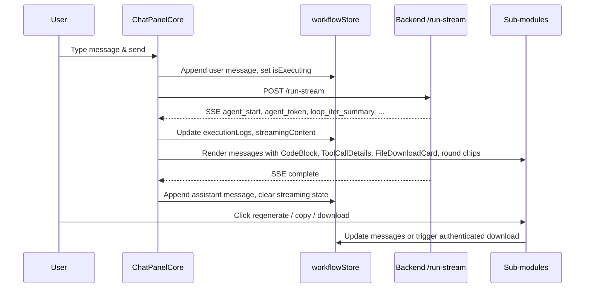

# ChatPanel Module Overview

## Purpose

The **ChatPanel** module is the workflow execution chat surface in the ABStudio workflow editor. It renders an interactive, streaming chat interface where users can send prompts, watch workflow runs progress, inspect agent thinking timelines, approve human-in-the-loop (HITL) tool calls, and download generated files. The module consumes Server-Sent Events (SSE) from the backend execution endpoints and maps them into a live transcript of user and assistant messages.

## Architecture

`ChatPanel.jsx` is organized as a single file containing four logical sub-modules. The main component orchestrates state, streaming, and rendering, while the sub-modules handle focused responsibilities.

### Component Breakdown

| Sub-module | Responsibility |
|---|---|
| **ChatPanelCore** | Main React component: local state, SSE stream handling, send/resume logic, thread history loading, attachment handling, HITL cards, and message mapping. |
| **ChatActions** | Message-level action handlers (`handleRegenerate`, `handleCopy`) and timeline rendering helper (`renderRoundChip`) for loop iterations. |
| **MessageContent** | Specialized renderers for code blocks, tool-call argument cards, and loop-condition evaluation snapshots. |
| **FileHandling** | Generated-file discovery, authenticated download cards, and markdown link overrides for `/generated-files/*` URLs. |

### Data Flow

## Core Components Documentation

- **[ChatPanelCore](ChatPanelCore.md)** — Main component state, SSE handling, send/resume, thread history, attachments, and HITL cards.
- **[ChatActions](ChatActions.md)** — Regenerate, copy, and loop-round chip rendering.
- **[MessageContent](MessageContent.md)** — `CodeBlock`, `ToolCallDetails`, and `renderConditionSnapshot`.
- **[FileHandling](FileHandling.md)** — `FileDownloadCard`, `fallbackDownload`, and authenticated generated-file downloads.

## Key Dependencies

- **[workflowStore](workflowStore.md)** — Provides `chatMessages`, `executionLogs`, `isExecuting`, and run context.
- **[api_execution](api_execution.md)** — Backend endpoints that stream workflow execution events.
- **[api_documents](api_documents.md)** — Serves generated files consumed by `FileHandling`.
- **[utils/threadHelpers.js](utils.md)** — Maps backend history to UI messages.
- **[utils/editorPersistence.js](utils.md)** — Persists composer drafts per workflow/thread.