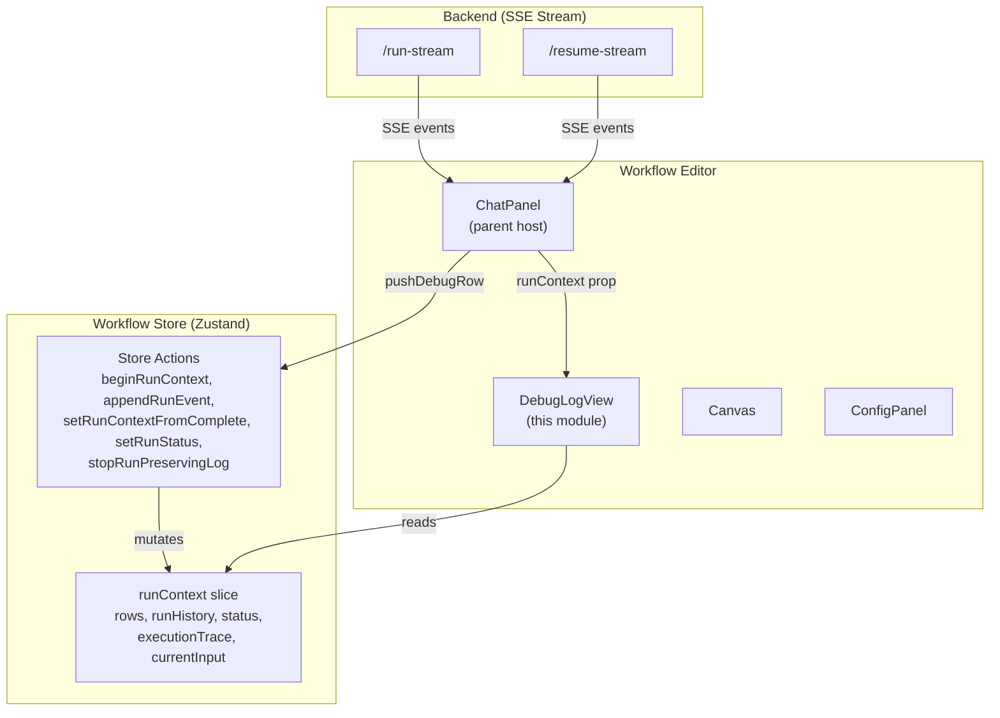
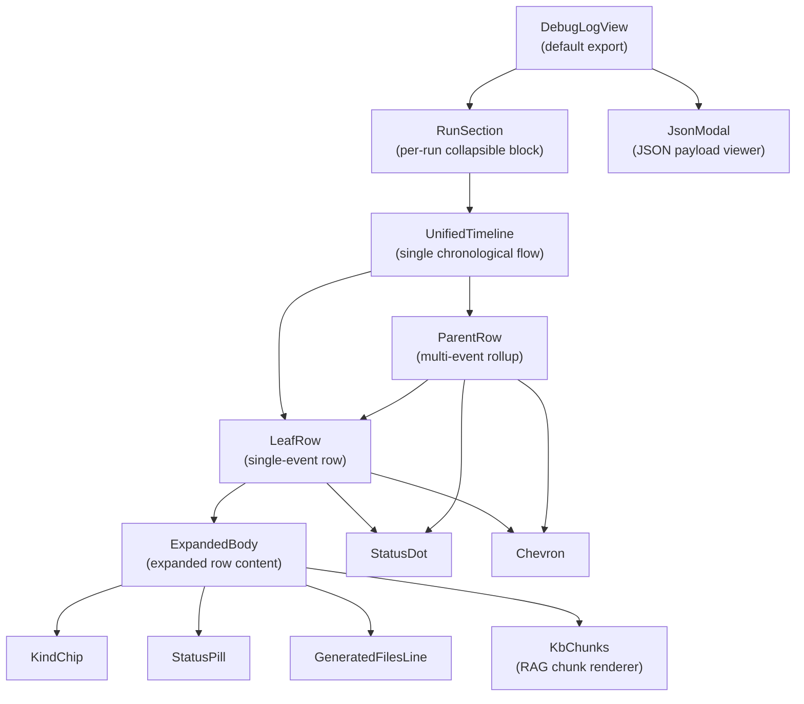
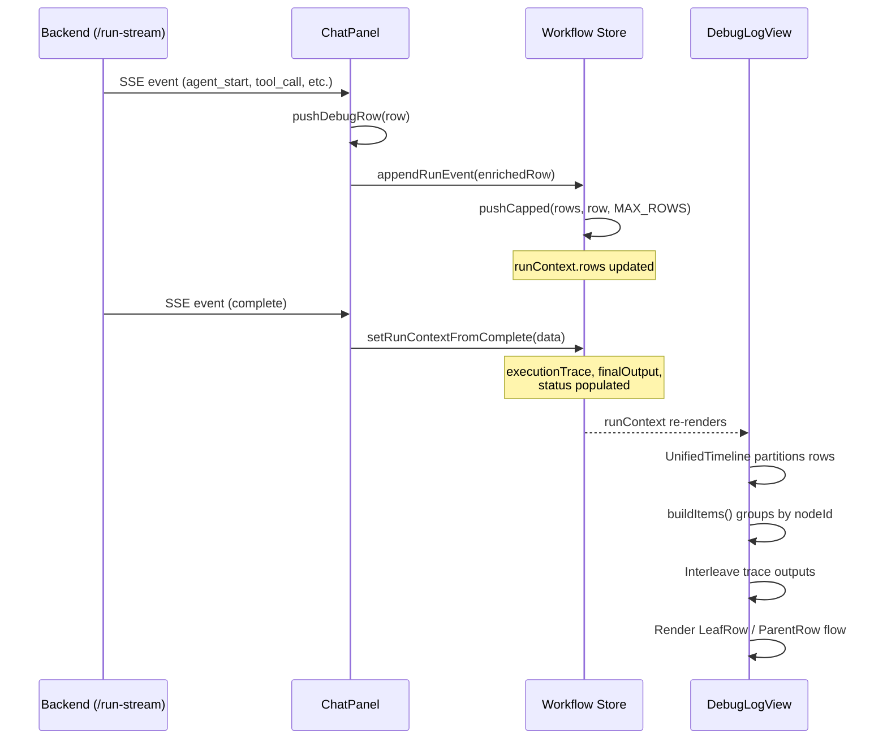
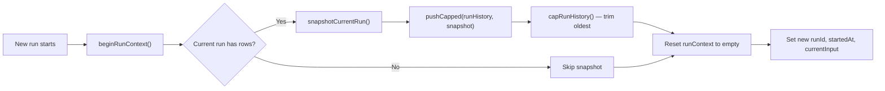
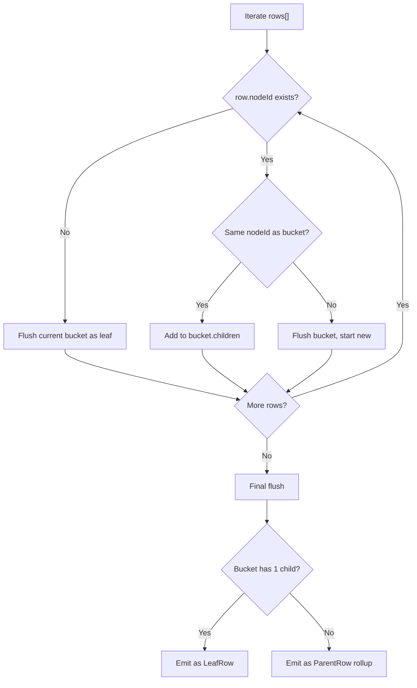

# DebugLogView

## Overview

The **DebugLogView** module is a React component that provides a unified, real-time execution timeline for workflow runs in ABStudio's Build Studio. It replaces the chat-messages and composer inside the workflow ChatPanel with a single scrollable, phase-ordered list that traces a run end-to-end — from user input, through per-node agent execution, to final output and token usage metadata.

The module was designed to eliminate the duplication that plagued the previous "Debug Logs" and "Session Context" tab split (which duplicated ~44% of its rows). Every fact now appears exactly once in a continuous chronological flow: **INPUT → EXECUTION → OUTPUT → METADATA**.

---

## Architecture

### Module Position

DebugLogView lives within the **workflow editor** sub-tree of the ABStudio frontend. It is a full-swap overlay rendered inside the `ChatPanel` when the user toggles the debug (bug) icon. The chat body (messages + composer) is hidden via CSS during the swap, preserving all chat state (streaming text, attachments, HITL widgets) so toggling back is seamless.



### Component Hierarchy



---

## Core Components

### `DebugLogView` (default export)

The top-level container. Receives `runContext` from the workflow store (via ChatPanel) and renders:

1. A **header** with title, minimize, and close buttons.
2. A **body** containing either an empty state ("No debug events yet") or a list of `RunSection` blocks — one per run (current + archived history), ordered newest-first with the newest auto-expanded.
3. A **JsonModal** for inspecting raw event payloads.

**Props:**

| Prop | Type | Description |
|------|------|-------------|
| `runContext` | `object` | The `runContext` slice from the workflow store, containing `runId`, `rows`, `runHistory`, `status`, `currentInput`, `finalOutput`, `executionTrace`, `startedAt`. |
| `onClose` | `function` | Callback to fully close the debug log view. |
| `onMinimize` | `function?` | Callback to minimize (keeps the log; reopen from bug icon). Falls back to `onClose`. |

**Run composition logic:** The component merges the current run (top-level `runContext` fields) with archived prior runs from `runContext.runHistory`. Runs are numbered oldest→newest ("Run 1" is the first triggered) but rendered newest-first. Only runs that produced rows are shown.

---

### `RunSection`

A collapsible block representing a single workflow run. Renders a header with the run label ("Run N"), row count, date/time, and a status pill. The newest run is auto-expanded; older archived runs start collapsed.

**Props:**

| Prop | Type | Description |
|------|------|-------------|
| `run` | `object` | The run context object for this run. |
| `label` | `string` | Display label (e.g., "Run 1"). |
| `defaultOpen` | `boolean` | Whether the section starts expanded. |
| `onViewJSON` | `function` | Callback to open the JsonModal with a row's payload. |

---

### `UnifiedTimeline`

The heart of the module. Renders a single top-to-bottom chronological flow for one run:

```
Input        (user prompt)
Start        (workflow_start)
Node A       (agent_start … agent_complete rolled up)
Node A ▸ Output   (from execution_trace[A].output)
Node B
Node B ▸ Output
End
Tokens (approx)
Status
```

**Key behaviors:**

- **Partitioning:** Splits `rows` by `kind` into `Input`, `Output`, `Tokens (approx)`, and execution rows. Input is placed at the top, tokens near the end, and output is either inlined per-node or shown as a final row.
- **Execution trace interleaving:** For each execution item (leaf or parent), the component looks up a matching `execution_trace` step by `nodeId` and, if found, inserts a synthetic "Node ▸ Output" leaf row directly below it.
- **Deduplication:** The final Output row is suppressed if its text matches the last surfaced per-node trace output, preventing double-listing.
- **Orphan trace steps:** Trace steps whose `node_id` didn't map to any execution row (rare, subagent-only workflows) are surfaced at the end so no output is lost.

**Props:**

| Prop | Type | Description |
|------|------|-------------|
| `run` | `object` | The full run context. |
| `onViewJSON` | `function` | Callback to open JsonModal. |

---

### `LeafRow`

Renders a single timeline event as one collapsed line by default:

```
● {nodeLabel}              {HH:MM:SS}
  small grey sub-line {title}
```

Clicking the row toggles an `ExpandedBody`. Used both at the top level for ungrouped events and as a nested child inside an expanded `ParentRow`.

**Props:**

| Prop | Type | Description |
|------|------|-------------|
| `row` | `object` | The event row data. |
| `onViewJSON` | `function` | Callback to open JsonModal. |
| `nested` | `boolean?` | Whether this is a child inside a ParentRow. |
| `traceStep` | `object?` | Matching execution-trace step for metadata enrichment. |
| `traceStepIndex` | `number?` | Index of the trace step. |

---

### `ParentRow`

A rollup row used when multiple consecutive SSE events share the same `nodeId` (e.g., `agent_start` → `tool_call_start` → `tool_call_result` → `agent_complete`). The closed row shows the rolled-up label and worst-case status; expanding reveals each sub-event as a nested `LeafRow`.

**Status rollup:** The parent's status mirrors the worst sub-status using a rank ordering: `error (4) > stopped (3.5) > pending (3) > running (2) > done (1)`.

**Props:**

| Prop | Type | Description |
|------|------|-------------|
| `rollup` | `object` | Contains `nodeId`, `nodeLabel`, `children[]`, `status`, `summary`, `tsLast`. |
| `onViewJSON` | `function` | Callback to open JsonModal. |
| `traceStep` | `object?` | Matching execution-trace step. |
| `traceStepIndex` | `number?` | Index of the trace step. |

---

### `ExpandedBody`

The content rendered inside an expanded row (leaf or parent). Displays:

- **Kind chip** and **status pill**.
- **Duration/closed-at** timestamp if available.
- **Trace metadata bits** (agent name, char count, engine, tokens) when a matching trace step exists — this is the merge point that eliminates the old Session Context tab.
- **Detail text**, **KB hint**, and **generated files** summary.
- **KbChunks** block for RAG retrieval events.
- **Snippet** (truncated payload preview).
- **"View JSON"** button for the SSE payload.
- **"View trace JSON"** button when a trace step is available.

---

### `JsonModal`

A modal dialog for inspecting raw JSON payloads. Features:

- Pretty-printed JSON with syntax via `JSON.stringify(payload, null, 2)`.
- **Copy JSON** button with clipboard fallback for insecure contexts (uses `document.execCommand('copy')` when `navigator.clipboard` is unavailable).
- Copy-feedback flag that shows "Copied!" for ~1.5 seconds.
- Backdrop click closes the modal.

**Props:**

| Prop | Type | Description |
|------|------|-------------|
| `row` | `object\|null` | The row whose `raw` payload to display. `null` renders nothing. |
| `onClose` | `function` | Callback to close the modal. |

---

### `KbChunks`

Renders every retrieved RAG chunk with its source, per-chunk score (or explicit "n/a" when the retriever doesn't expose one), and full untruncated text. This gives operators the "which chunks qualified and what was the score" surface they need.

**Display elements:**
- Summary line: retrieval mode, chunk count, overall confidence.
- Per-chunk: index, source filename, score (or "n/a (not exposed by retriever)"), qualified badge.
- Full chunk text in a `<pre>` block.

**Props:**

| Prop | Type | Description |
|------|------|-------------|
| `raw` | `object` | The raw `kb_retrieval` event payload containing `chunks`, `mode`, `confidence`. |

---

### Presentational Components

| Component | Purpose |
|-----------|---------|
| `StatusDot` | Colored dot indicating row status (`running`, `pending`, `done`, `error`, `stopped`, `idle`). Color driven by CSS class. |
| `StatusPill` | Text pill with status label (e.g., "In progress", "Success", "Failed"). |
| `KindChip` | Badge showing the row's kind (e.g., "Agent", "Tool", "Knowledge", "Subflow", "HITL", "Swarm"). |
| `Chevron` | Expand/collapse arrow icon. Rotation driven by parent's `.open` CSS class. |
| `GeneratedFilesLine` | Summarizes generated files (up to 3 names + "N more"). |

---

## Data Flow

### Event Accumulation Pipeline

The DebugLogView does not fetch data itself. It is a pure consumer of the `runContext` slice in the workflow store. The data flow is:



### Row Shape

Each row in `runContext.rows` has the following shape (enriched by `pushDebugRow` in ChatPanel):

```javascript
{
    id: string,           // unique row id
    ts: string,           // ISO timestamp
    nodeId: string|null,  // workflow node id (null for lifecycle events)
    nodeLabel: string,    // human-readable label (from node.data.name)
    title: string,        // short description
    detail: string,       // longer text (error message, output, etc.)
    status: string,       // 'running' | 'pending' | 'done' | 'error' | 'stopped' | 'idle' | 'info'
    kind: string|null,    // 'Input' | 'Start' | 'End' | 'Output' | 'Tokens' | 'Agent' | 'Tool' | 'Knowledge' | 'Sub-agent' | 'Swarm' | 'HITL' | 'Subflow' | 'Loop'
    group: string,        // legacy grouping (unused by UnifiedTimeline)
    raw: object,          // original SSE event payload
    generatedFiles: array|null,
    kbHint: string,       // KB mode hint (e.g., "Knowledge base: hybrid")
    tsClosed: string,     // timestamp when event closed (for duration display)
}
```

### Run Context Shape

The `runContext` slice from the workflow store:

```javascript
{
    runId: string|null,
    startedAt: string|null,
    status: string,           // 'idle' | 'running' | 'done' | 'error' | 'stopped'
    currentInput: string,     // user's chat message
    finalOutput: string,      // assistant's final response
    executionTrace: array,    // per-node trace steps from backend
    loopContext: object|null,
    rows: array,              // accumulated event rows
    rowIdByNode: object,      // nodeId → rowId lookup
    runHistory: array,        // archived prior runs (newest-first)
}
```

### Run History Management

When a new run begins (`beginRunContext`), the current run is snapshotted via `snapshotCurrentRun` and pushed into `runHistory` (capped by `capRunHistory` to `MAX_ARCHIVED_ROWS` total rows across all archived runs). This allows the user to scroll back and inspect any prior run in the same chat session.



---

## Row Grouping Logic

The `buildItems` function reduces the flat `rows[]` array into either `LeafRow` items or `ParentRow` rollups. Grouping is **consecutive-only** and keyed by `nodeId`:



**Key rules:**
- Rows without a `nodeId` (run lifecycle events, swarm planner, etc.) are **never grouped** — they remain standalone leaves.
- A bucket with only one child is emitted as a leaf (avoids "(1 step)" labels on common short paths).
- A bucket with multiple children is emitted as a parent rollup whose status is the worst of all children.

---

## SSE Event Types Handled

The ChatPanel (parent) maps the following SSE event types from the backend into debug rows. Each row is stamped with a `kind` that DebugLogView uses for chip badges and partitioning:

| SSE Event | Row Kind | Description |
|-----------|----------|-------------|
| `start` | `Input`, `Start` | User input + workflow start bookends |
| `agent_start` | `Agent` (or `Subflow`) | Node initiated |
| `agent_progress` | `Agent` | Intermediate agent status update |
| `agent_token` | — | Streaming token (no row; tracked for stats) |
| `agent_complete` | `Agent` | Node completed with output + usage |
| `agent_retry` | `Agent` | Model retry notice |
| `agent_fallback` | `Agent` | Model fallback notice |
| `tool_call_start` | `Tool` | Tool invocation began |
| `tool_call_result` | `Tool` | Tool returned result |
| `kb_retrieval` | `Knowledge` | RAG chunks retrieved |
| `subagent_start` | `Sub-agent` | Sub-agent delegation began |
| `subagent_complete` | `Sub-agent` | Sub-agent finished |
| `swarm_plan` | `Swarm` | Swarm planner completed |
| `swarm_error` | `Swarm` | Swarm failed to run |
| `condition_routed` | `Condition` | Condition node routed to a branch |
| `loop_iteration_start` | `Loop` | Loop iteration began |
| `loop_condition_eval` | `Loop` | Loop condition evaluated |
| `loop_complete` | `Loop` | Loop finished |
| `loop_iteration_summary` | `Loop` | Per-iteration summary |
| `loop_evaluation` | `Loop` | LLM judge decision |
| `loop_final_summary` | `Loop` | Final loop summary |
| `hitl_interrupt` | `HITL` | Human-in-the-loop pause |
| `hitl_resumed` | `HITL` | Run resumed after HITL |
| `workflow_retrying` | `Agent` | Engine retrying failed node |
| `complete` | `End`, `Output`, `Tokens` | Run completion bookends + usage |
| `error` | — (error status) | Run error |

---

## Token Estimation

The backend does not report per-node LLM usage in its SSE stream. The ChatPanel approximates token usage using the industry rule of thumb of **~1 token per 4 characters** (English text). This estimate:

- Is computed per-node from visible input + output text length at `agent_complete` time.
- Under-counts true usage (misses system prompt, tool definitions, intermediate tool-calling turns).
- Is clearly labelled in the JSON payload as a char-based estimate.
- Falls back to backend-reported `usage` when available (on the `complete` event).

The workflow-total token row aggregates per-node estimates and displays either the backend usage (when available) or the char-based estimate with a breakdown of input/output chars and SSE chunks streamed.

---

## Dependencies

### Internal Dependencies

| Dependency | Relationship |
|------------|-------------|
| [ChatPanel](ChatPanel.md) | **Parent host.** Toggles DebugLogView as a full-swap overlay. Owns the SSE event loop that populates `runContext` via `pushDebugRow`. |
| [workflowStore](workflowStore.md) (implied) | **Data source.** The `runContext` slice (`rows`, `runHistory`, `status`, `executionTrace`, `currentInput`, `finalOutput`) and store actions (`beginRunContext`, `appendRunEvent`, `setRunContextFromComplete`, `setRunStatus`, `stopRunPreservingLog`) drive all data into DebugLogView. |

### External Dependencies

| Package | Usage |
|---------|-------|
| `react` | `useMemo`, `useState` hooks for memoisation and local component state. |

No other external libraries are imported — the module is self-contained with inline SVG icons and CSS class references (styles are defined in the global stylesheet, not CSS modules).

---

## Interaction Patterns

### Expand/Collapse Behavior

- Every `LeafRow` and `ParentRow` starts **collapsed**.
- Clicking the row header toggles expansion.
- The `Chevron` icon rotates via CSS based on the parent's `.open` class.
- Error rows are visually distinct (red dot + red left-stripe) but do **not** auto-expand — the user must click to see the full error body.
- Expanded content includes metadata, snippets, KB chunks, generated files, and JSON view buttons.

### JSON Inspection

- The **"View JSON"** button opens `JsonModal` with the row's `raw` SSE payload.
- The **"View trace JSON"** button (available when a matching execution-trace step exists) opens `JsonModal` with the trace step data, shaped via `traceStepToRow` to match the `{raw, nodeLabel}` contract.
- The modal supports copy-to-clipboard with a fallback for insecure HTTP contexts.

### Multi-Run Navigation

- Each run is wrapped in a `RunSection` with a collapsible header.
- The newest run is auto-expanded; older runs start collapsed.
- Runs are numbered oldest→newest but rendered newest-first.
- Run history is capped to prevent unbounded memory growth (see `capRunHistory` and `pushCapped` in the workflow store).

### Minimize vs. Close

- **Minimize** (down-arrow icon): Hides the debug view but keeps the log data. The user can reopen from the bug icon in the ChatPanel header. Falls back to `onClose` if no `onMinimize` handler is provided.
- **Close** (× icon): Hides the debug view. Same visual effect as minimize from the user's perspective — the log data persists in the store regardless.

---

## Visual Contract

The module follows a strict visual contract for the unified timeline:

```
┌─────────────────────────────────────────────────────┐
│  Debug Log                              [▾]  [×]    │
├─────────────────────────────────────────────────────┤
│  ▾ Run 2 · 15 rows    Mon, 15 Jan 2024 14:32:05  ●  │
│  ┌───────────────────────────────────────────────┐  │
│  │ ● Input                          14:32:05  ▾  │  │
│  │   What is the revenue trend?                   │  │
│  ├───────────────────────────────────────────────┤  │
│  │ ● Start                          14:32:05  ▾  │  │
│  │   Workflow execution started                   │  │
│  ├───────────────────────────────────────────────┤  │
│  │ ● Data Analyst (3 steps)         14:32:06  ▾  │  │
│  │   Agent execution successful                   │  │
│  ├───────────────────────────────────────────────┤  │
│  │ ● Data Analyst ▸ Output          14:32:08  ▾  │  │
│  │   Revenue increased 15% YoY…                   │  │
│  ├───────────────────────────────────────────────┤  │
│  │ ● End                            14:32:08  ▾  │  │
│  │   Workflow execution finished                  │  │
│  ├───────────────────────────────────────────────┤  │
│  │ ● Tokens (approx)                14:32:08  ▾  │  │
│  │   ~1,250 tokens (est. from 5,000 chars)        │  │
│  ├───────────────────────────────────────────────┤  │
│  │ ● Status                         14:32:08     │  │
│  │   [Success]                                    │  │
│  └───────────────────────────────────────────────┘  │
│                                                     │
│  ▸ Run 1 · 8 rows     Mon, 15 Jan 2024 14:28:12  ●  │
└─────────────────────────────────────────────────────┘
```

**Status dot colors** (driven by CSS classes):
- `running` — blue/pulsing
- `pending` — amber
- `done` — green
- `error` — red
- `stopped` — grey
- `idle` — grey

---

## Helper Functions

| Function | Purpose |
|----------|---------|
| `worstStatus(a, b)` | Returns the higher-ranked status between two values. Rank: `error > stopped > pending > running > done`. |
| `fmtClock(ts)` | Formats an ISO timestamp as `HH:MM:SS` (24-hour). |
| `fmtDateHeader(ts)` | Formats an ISO timestamp as `Mon, 15 Jan 2024`. |
| `extractSnippet(row)` | Extracts a short human-readable snippet from an event's raw payload based on event type. |
| `truncate(s, n)` | Collapses whitespace and truncates to `n` chars (default 320) with an ellipsis. |
| `traceMetaBits(step)` | Extracts metadata bits (agent, char count, engine, tokens) from a trace step for inline display. |
| `traceStepToRow(step, idx)` | Shapes a trace step into the `{raw, nodeLabel}` format for JsonModal. |
| `traceStepByNodeId(executionTrace)` | Builds an O(1) `Map<nodeId, {step, idx}>` lookup from the execution trace. |
| `traceOutputStrings(step)` | Converts a trace step's `output` field into a preview + full string for inline output rows. |
| `nodeOutputRow(nodeLabel, nodeId, step, stepIndex)` | Builds a synthetic row for per-node output from an execution-trace step. |
| `buildItems(rows)` | Reduces flat rows into leaf/parent items grouped consecutively by `nodeId`. |

---

## Design Decisions

### Why a Unified Timeline (No Tabs)?

The previous design used separate "Debug Logs" and "Session Context" tabs that duplicated ~44% of their rows (input, output, status, node events appeared in both). The unified timeline ensures every fact appears exactly once in chronological order, making it easier to trace a run end-to-end.

### Why Consecutive-Only Grouping?

Grouping is keyed by `nodeId` and only merges **consecutive** events. This preserves event order in the UI and means lifecycle events ("Run started", "Run completed", errors without a `nodeId`) stay as standalone leaf rows rather than being absorbed into an unrelated node's rollup.

### Why Char-Based Token Estimation?

The backend's SSE stream does not include per-node LLM usage data. Counting SSE chunks was misleading (a 2000-char document producing a 1980-char summary showed "21 chunks" instead of ~1000 tokens). The char-based estimate (`chars / 4`) is a much better order-of-magnitude signal, clearly labelled as an estimate, and falls back to backend-reported usage when available.

### Why Not Auto-Expand Error Rows?

Error rows are visually distinct (red dot + red left-stripe) so the user immediately sees something went wrong. Auto-expanding would push subsequent rows out of view, disrupting the chronological scan. The user clicks to inspect the full error body on demand.

### Why Clipboard Fallback?

`navigator.clipboard` is unavailable in insecure contexts (some internal test rigs run over `http://`). The `JsonModal`'s copy button falls back to a hidden `<textarea>` + `document.execCommand('copy')` so the button always works.
