# AiNxt Enterprise — On-Premise Deployment Reference

**A bank-grade, network-segregated, dual-site deployment of AiNxt Enterprise on
physical servers.**

This document describes how AiNxt Enterprise is deployed inside a large regulated
enterprise — the reference deployment is NPCI (National Payments Corporation of
India), where the platform serves 2,000+ employees across an active–passive
two-site estate of physical servers with a single controlled internet egress
point.

It is written to be **reproducible**. Every architectural decision is explained,
every port and environment variable is named, and the rationale for each choice is
given, so that you can adapt the shape to your own estate rather than copy it
blindly.

> **On the numbers and names in this document**
>
> Hostnames, IP ranges, VLAN IDs and domain names throughout are **representative
> placeholders**, not the real values of any production environment. The
> *architecture*, the *server counts*, the *port assignments*, the *service
> placement* and the *rationale* are real. Substitute your own naming.

---

## Table of contents

1. [Who this is for](#1-who-this-is-for)
2. [What actually gets deployed](#2-what-actually-gets-deployed)
3. [Physical topology](#3-physical-topology)
4. [Network zoning and the port matrix](#4-network-zoning-and-the-port-matrix)
5. [The runtime layer — pm2](#5-the-runtime-layer--pm2)
6. [LLM serving and the egress boundary](#6-llm-serving-and-the-egress-boundary)
7. [Data tier](#7-data-tier)
8. [The event pipeline](#8-the-event-pipeline)
9. [Identity — Active Directory to ad_level](#9-identity--active-directory-to-ad_level)
10. [Privacy, guardrails and PII redaction](#10-privacy-guardrails-and-pii-redaction)
11. [Request lifecycle end to end](#11-request-lifecycle-end-to-end)
12. [Disaster recovery](#12-disaster-recovery)
13. [Build and release into an air-gapped estate](#13-build-and-release-into-an-air-gapped-estate)
14. [Bring-up sequence](#14-bring-up-sequence)
15. [Observability](#15-observability)
16. [Secrets and key management](#16-secrets-and-key-management)
17. [Sizing guidance](#17-sizing-guidance)
18. [Troubleshooting](#18-troubleshooting)
19. [Appendix A — collecting your own port matrix](#appendix-a--collecting-your-own-port-matrix)
20. [Appendix B — assumptions and deployment-specific gaps](#appendix-b--assumptions-and-deployment-specific-gaps)

---

## 1. Who this is for

Read this if you are deploying AiNxt Enterprise into an environment where **the
one-command `install.sh` is not an option** — because you have physical servers
rather than one host, network segmentation between tiers, an internet egress
policy, an existing Active Directory, and a regulator who will ask where the data
went.

If you want the platform running on a laptop in five minutes, use
[`../README.md`](../README.md) and stop there. If you want it running on nine
servers per site across two sites, continue.

**Prerequisite knowledge:** you should already have read
[`GETTING_STARTED.md`](GETTING_STARTED.md), which covers what each configuration
value *means*. This document covers where each one *goes*.

---

## 2. What actually gets deployed

AiNxt is not a single process. Before topology makes sense, here is the full
inventory of what has to run somewhere.

| Component | What it is | Language / runtime |
|---|---|---|
| `gateway.py` | The FastAPI application — every HTTP route, auth, routing, orchestration | Python, ASGI |
| `workers/kafka_consumer.py` | **Required.** Consumes platform events and writes chat history, audit, usage and pipeline rows to Postgres | Python |
| `workers/*.py` | RQ worker pools — chat, doc, index, agent, kb, sdlc, security, codewiki, connector, coach | Python, RQ |
| `workers/cowork_scheduler.py` | Cron-like scheduler for recurring tasks and digests | Python |
| `services/embed_svc/` | Embedding + reranking microservice | Python, ASGI |
| `services/privacy_svc/` | PII detection and redaction microservice | Python, ASGI |
| `services/llm_proxy/` | Outbound LLM proxy — holds cloud API keys, fronts OpenAI / Anthropic / Gemini | Python, ASGI |
| Ollama | Local model server for in-house LLMs | Go binary |
| `ai-ui/` | The main React SPA — built to static assets, served by nginx | Static after build |
| `ABStudio/` | Visual agent and workflow builder (React + FastAPI) | Static + Python |
| PostgreSQL | Primary relational store | 15+ |
| PostgreSQL + pgvector | Vector store for embeddings | 15+ with `pgvector` |
| Redis | Cache, RQ job queues, session and rate-limit state | 7+ |
| Kafka | Event bus carrying chat, audit and usage events | 3.7+ (KRaft) |
| Prometheus / Grafana / Loki | Metrics, dashboards, log aggregation | — |

**The one thing people get wrong:** `workers/kafka_consumer.py` is not optional.
The gateway *publishes* chat turns, audit records and model-usage rows to Kafka; it
does not write them to Postgres itself. If the consumer is not running, the
platform appears to work perfectly and silently records nothing. Every compliance
question you will later be asked depends on this one process staying up.

---

## 3. Physical topology

### 3.1 The simple picture

Before any hostnames or port numbers, this is the whole system in seven boxes.
Each box is one *kind* of machine, and the number underneath is how many of that
kind there are at each site.

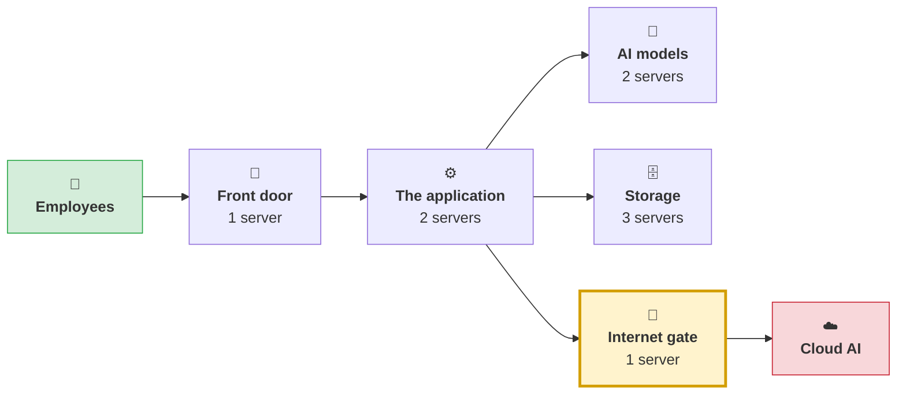

Reading it left to right:

| Box | In plain terms | Why it exists |
|---|---|---|
| **Employees** | People using the platform in a browser | 2,000+ of them |
| **Front door** | The only machine staff actually connect to | Everything arrives here first, so there is one place to secure |
| **The application** | The machines that do the thinking and coordinating | Two of them, so losing one does not take the platform down |
| **AI models** | Machines that run the AI models the organisation owns | Kept apart because running a model is slow and heavy, and would otherwise make the whole site feel sluggish |
| **Storage** | Databases and queues — where everything is remembered | Separated by job: one for records, one for search, one for queues |
| **Internet gate** | The single machine allowed to reach the outside world | So there is exactly one door out, and it can be watched |
| **Cloud AI** | External AI services, used only when needed | Reached *only* through the gate, never directly |

**The one thing to take away:** everything internal talks freely, but only the
Internet gate can leave the building. That single constraint is most of the
security design.

All nine of these machines exist twice — once at the main site, once at a backup
site that takes over if the first one fails. [Disaster recovery](#12-disaster-recovery)
covers that.

### 3.2 The detailed view

The same system with real hostnames and network zones. Ports are deliberately
left out here — they are all in [the port matrix](#42-port-matrix).

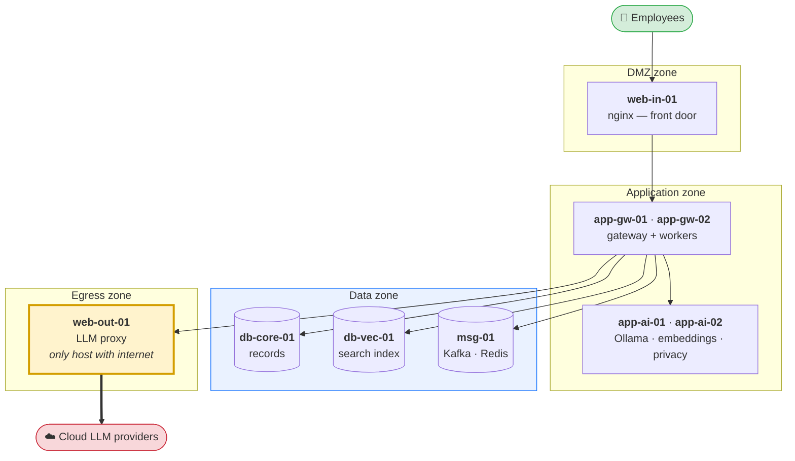

### 3.3 Server roles in detail

| Host | Zone | Runs | Why it is separate |
|---|---|---|---|
| `web-in-01` | DMZ | nginx: TLS termination, static `ai-ui` assets, reverse proxy to gateways | The only host users reach. Keeps TLS certs and the public surface out of the application zone. |
| `web-out-01` | Egress | `services/llm_proxy` | **The only host in the estate with internet routing.** Every outbound cloud LLM call funnels through it, so egress is one firewall rule and one audit log, not N. |
| `app-gw-01` | App | `gateway` (one pm2 process, N gunicorn workers), RQ worker pools, `kafka_consumer`, `cowork_scheduler` | Stateless. Scaled by gunicorn workers within the host, by nginx across hosts. |
| `app-gw-02` | App | `gateway` (one pm2 process, N gunicorn workers), RQ worker pools | Second gateway host — capacity and in-site redundancy. |
| `app-ai-01` | App | Ollama, `embed_svc` (embeddings + reranker), `privacy_svc` | Inference has a completely different resource profile to request handling: it saturates CPU/GPU for seconds at a time. Co-locating it with the gateway would make every HTTP request contend with a model load. |
| `app-ai-02` | App | Ollama, `embed_svc`, `privacy_svc` | Second inference host. Indexing runs can occupy one for a long time; two keeps interactive chat responsive. |
| `db-core-01` | Data | PostgreSQL — users, chats, audit, budgets, governance, workflow state | — |
| `db-vec-01` | Data | PostgreSQL + `pgvector` — embeddings and vector search | Vector similarity scans are memory-hungry and have an access pattern nothing like OLTP. A large KB re-index on a shared instance degrades every login. AiNxt supports this split natively via `PGVECTOR_HOST` / `PGVECTOR_PORT`. |
| `msg-01` | Data | Kafka broker, Redis | Both are stateful infrastructure with disk-durability requirements; grouping them keeps that footprint on one backup and monitoring regime. |

### 3.4 Why gateway and inference are split

This is the single most consequential placement decision, so it is worth stating
plainly.

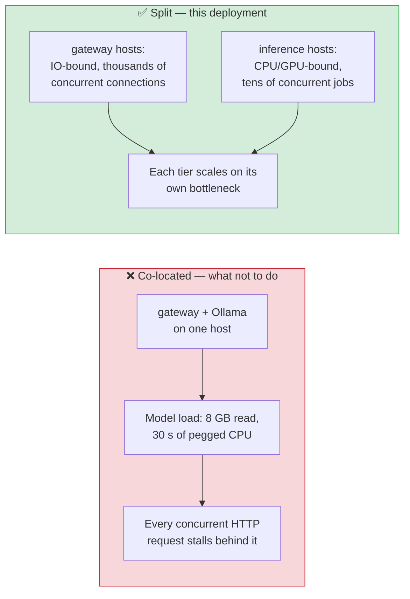

A gateway process is IO-bound — it holds open SSE streams and waits on network. An
Ollama process is compute-bound. Put them on the same host and the tier that is
easy to scale (gateways) is throttled by the tier that is expensive to scale
(inference). Splitting them means you add gateway capacity with a cheap VM and
inference capacity with a GPU box, independently.

---

## 4. Network zoning and the port matrix

### 4.1 Zone model

Four zones, with traffic permitted only in the directions shown. Everything not
listed is denied by default.

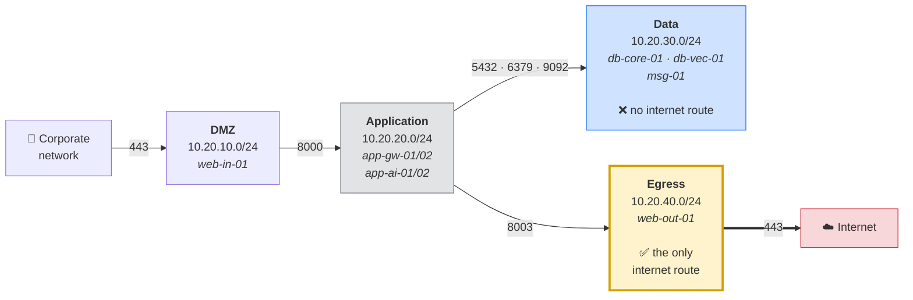

The property that matters for audit: **the data zone has no route to the internet,
and the application zone has no route to the internet.** Only the egress zone
does, and the only thing in it is the LLM proxy. A regulator's question of "how
could data leave?" has exactly one answer, on one host, with one log.

### 4.2 Port matrix

Ports below are the platform's defaults, taken from the code and configuration
templates. Verify against your own hosts using
[Appendix A](#appendix-a--collecting-your-own-port-matrix).

| Source | Destination | Port | Protocol | Purpose |
|---|---|---|---|---|
| Corporate network | `web-in-01` | 443 | HTTPS | User access to the platform |
| Corporate network | `web-in-01` | 80 | HTTP | Redirect to 443 only |
| `web-in-01` | `app-gw-01/02` | 8000 | HTTP | Reverse proxy to gateway (`BIND` default `0.0.0.0:8000`) |
| `app-gw-01/02` | `app-ai-01/02` | 11434 | HTTP | Ollama — local model inference |
| `app-gw-01/02` | `app-ai-01/02` | 8001 | HTTP | `embed_svc` — embeddings and reranking (`EMBED_SVC_PORT`) |
| `app-gw-01/02` | `app-ai-01/02` | 8002 | HTTP | `privacy_svc` — PII detection and redaction (`PRIVACY_SVC_PORT`) |
| `app-gw-01/02` | `web-out-01` | 8003 | HTTP | `llm_proxy` — cloud LLM calls (`LLM_PROXY_URL`) |
| `app-gw-01/02` | `db-core-01` | 5432 | TCP | PostgreSQL (`POSTGRES_HOST`) |
| `app-gw-01/02` | `db-vec-01` | 5432 | TCP | pgvector (`PGVECTOR_HOST` / `PGVECTOR_PORT`) |
| `app-gw-01/02` | `msg-01` | 6379 | TCP | Redis (`REDIS_HOST` / `REDIS_PORT`) |
| `app-gw-01/02` | `msg-01` | 9092 | TCP | Kafka broker |
| `app-ai-01/02` | `db-vec-01` | 5432 | TCP | Only if `embed_svc` writes vectors directly — see note below |
| `app-gw-01/02` | AD/LDAP servers | 636 | LDAPS | Directory authentication and nightly sync (`LDAP_URL`) |
| `app-gw-01/02` | SMTP relay | 587 / 25 | SMTP | Notifications, digests, broadcasts |
| `web-out-01` | Internet | 443 | HTTPS | **The only permitted egress in the estate** |
| Site A data hosts | Site B data hosts | 5432 | TCP | PostgreSQL streaming replication |
| Site A `msg-01` | Site B `msg-01` | 6379 | TCP | Redis replication |
| Monitoring host | all hosts | 9100 | HTTP | Prometheus `node_exporter` |
| Monitoring host | `app-gw-01/02` | 8000 | HTTP | Prometheus scrape of `/metrics` |

> **Port 8003 collision warning.** `services/llm_proxy` defaults to 8003 (see
> `services/llm_proxy/main.py`); `translate_svc`'s address is set via
> `TRANSLATE_SVC_URL` in `.env.example`. In this topology they are on
> different hosts, so there is no conflict — but if you ever co-locate them,
> make sure their ports don't collide.

---

## 5. The runtime layer — pm2

### 5.1 Why pm2 rather than Docker or systemd

This deployment runs the Python services directly under **pm2**, the Node.js
process manager. That is an unusual choice for a Python stack and deserves a
justification:

- **No container runtime to certify.** In a regulated estate, introducing Docker
  to production means a security review of the daemon, the registry, the image
  supply chain and the privilege model. pm2 runs processes as an unprivileged
  user on a hardened host — nothing new to certify.
- **One process manager for the whole estate.** The gateway, every worker pool
  and each microservice are declared in one JSON file per host and driven by the
  same handful of commands. Operators learn one tool.
- **Restart limits and boot persistence** without writing a systemd unit per
  process.

Docker Compose remains fully supported and is what `install.sh` uses — see
[`../docker-compose.yml`](../docker-compose.yml). Kubernetes is a reasonable
choice at larger scale. pm2 is what suits *this* estate; pick what suits yours.

### 5.2 How the gateway is scaled

This is easy to get wrong, so it is worth stating precisely. Concurrency and
redundancy come from two different places.

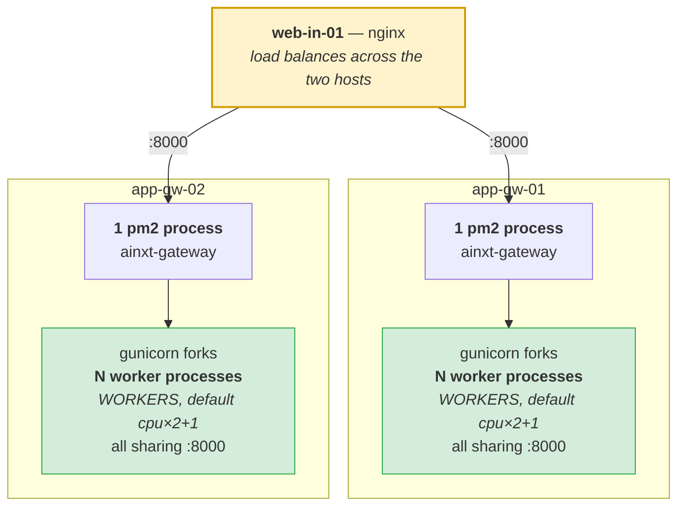

- **Concurrency within a host** comes from **gunicorn workers**. One pm2 process
  runs gunicorn, which forks `WORKERS` child processes (default
  `cpu_count * 2 + 1`, see [`../gunicorn.conf.py`](../gunicorn.conf.py)), all
  sharing the bind on `0.0.0.0:8000`.
- **Redundancy across hosts** comes from **nginx**, which load-balances the two
  gateway hosts.

pm2 therefore supervises **exactly one entry per service** and forks nothing
itself. Letting pm2 fork instances *as well* as gunicorn would nest two process
managers and make restart behaviour unpredictable, so there is no `instances`
key in the configuration and gunicorn owns the worker model.

### 5.3 Process layout per host

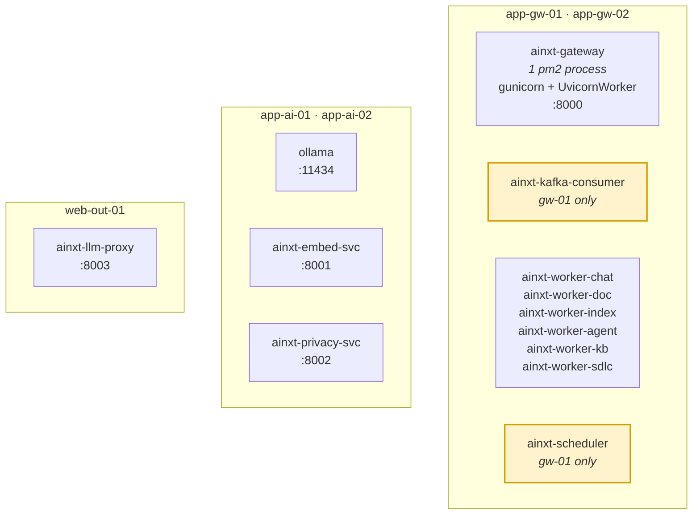

> **Site singletons.** `ainxt-kafka-consumer` and `ainxt-scheduler` are
> highlighted because they must run as **exactly one instance across the whole
> site**, not one per host. Two consumers in the same group would be harmless;
> two schedulers would fire every recurring job twice. Their pm2 files exist on
> `app-gw-01` only, and must not be present on `app-gw-02`.

### 5.4 The pm2 configuration files

Each service has **its own pm2 JSON file**, named after the service:

```
AiNxt-Gateway.json
AiNxt-LLM-Proxy.json
...one per service
```

There is no single combined file — a service is started, stopped and restarted
by naming its own JSON, which keeps one service's restart from touching any
other.

Which files a host needs depends on its role:

| Host | pm2 files present |
|---|---|
| `app-gw-01` | Gateway, each RQ worker pool, **plus** the Kafka consumer and the scheduler |
| `app-gw-02` | Gateway and each RQ worker pool — **not** the consumer or scheduler |
| `app-ai-01` / `app-ai-02` | Embedding service, privacy service, Ollama |
| `web-out-01` | LLM proxy only |

The `app-gw-01` / `app-gw-02` difference is the site-singleton rule from
[§5.3](#53-process-layout-per-host): the consumer and scheduler exist on one
gateway host only.

#### Settings that matter

Four configuration choices are worth getting right, because each has a failure
mode that is not obvious:

| Setting | Value | Why |
|---|---|---|
| `interpreter` | `none` | These are Python processes, not Node scripts. Without it pm2 runs them through Node and they fail immediately. |
| *(no instances key)* | — | gunicorn already forks `WORKERS` processes and binds `:8000`. Letting pm2 fork as well nests two process managers — see [§5.2](#52-how-the-gateway-is-scaled). |
| `kill_timeout` | 30 s gateway, 60 s LLM proxy | Lets in-flight LLM calls and open SSE streams drain before `SIGKILL`. The proxy gets longer because cloud calls can run for a minute or more. |
| `cwd` | the repository root | Workers resolve module paths relative to it; started from elsewhere, imports fail. |

Worker-pool sizes are passed as arguments to `workers/start_workers.py`
(`--chat --n 30`, `--index --n 20`, and so on). The reasoning behind each count
is documented in
[that file](../workers/start_workers.py) — read it before changing them. The doc
pool in particular is capped deliberately: exceeding it saturates the LLM proxy
and causes cascading timeouts across *every* queue, not just the doc queue.

### 5.5 Operational commands

| Task | Command |
|---|---|
| Start a service | `pm2 start AiNxt-Gateway.json` |
| Stop a service | `pm2 stop AiNxt-Gateway.json` |
| Restart a service | `pm2 restart AiNxt-Gateway.json` |
| Persist the process list across reboot | `pm2 save` |

Substitute the relevant file name — `AiNxt-LLM-Proxy.json` on the egress host,
and so on for each service.

Run `pm2 save` after the first successful start on each host, and again whenever
the set of processes changes — it snapshots the current list so services come
back after a reboot.

> **Deploying a release** restarts the gateway, ending in-flight requests on that
> host. Do the two gateway hosts one at a time — `pm2 restart ainxt-gateway` on
> `app-gw-01`, confirm it is serving, then `app-gw-02` — and nginx keeps the
> platform available throughout.

---

## 6. LLM serving and the egress boundary

### 6.1 Two paths, one boundary

AiNxt reaches models by two entirely separate routes, and the distinction is the
core of the security posture.

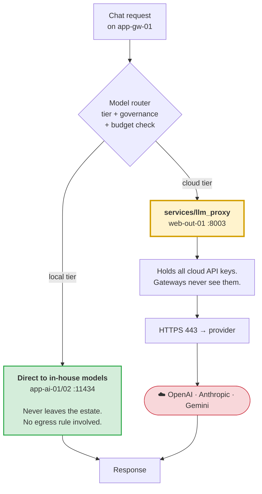

**Path 1 — in-house models, direct.** The gateway connects straight to Ollama on
`app-ai-01/02:11434`. No proxy, no egress, no internet. This is the default path
and carries the majority of traffic.

**Path 2 — cloud models, via the proxy.** The gateway calls
`http://web-out-01:8003`. The proxy holds the API keys and makes the outbound
call. `web-out-01` is the only host with an internet route.

### 6.2 Why the proxy is worth a whole server

Three properties fall out of the design, each of which would otherwise cost real
effort:

1. **API keys exist on exactly one host.** Compromising a gateway yields no cloud
   credentials. Rotating a key is one file on one machine.
2. **Egress is one firewall rule.** "Which of our servers can talk to the
   internet?" has a one-line answer that a security review can verify in seconds.
3. **Every cloud call is logged in one place.** Cost attribution, rate limiting
   and the audit trail for "what left the building" all have a single chokepoint.

### 6.3 Configuration

On the **gateway hosts**, point at the proxy and at the local models:

```bash
# ── Cloud path: everything goes through the egress host ──
LLM_PROXY_URL=http://web-out-01.ainxt.corp.internal:8003
LLM_PROXY_TOKEN=<shared-secret>

# ── Local path: direct to the inference hosts, no proxy ──
OLLAMA_BASE_URL=http://app-ai-01.ainxt.corp.internal:11434
EMBED_SVC_URL=http://app-ai-01.ainxt.corp.internal:8001
PRIVACY_SVC_URL=http://app-ai-01.ainxt.corp.internal

# ── Prefer in-house models; cloud only as a last resort ──
CHAT_FALLBACK_CHAIN=local:<your-local-model>,local:<your-second-local>,haiku
```

On **`web-out-01`** only:

```bash
# The only host in the estate that holds cloud credentials.
OPENAI_API_KEY=...
ANTHROPIC_API_KEY=...
GEMINI_API_KEY=...

# Only if outbound HTTPS must traverse a corporate forward proxy:
FORWARD_PROXY_URL=http://corp-proxy.internal:3128
```

> **Do not set `LLM_PROXY_URL` on `web-out-01`.** The proxy would then attempt to
> call itself.

### 6.4 Fetching keys from CKMS instead of `.env`

If you run a central key management service, the proxy can pull credentials at
startup rather than reading them from disk — so no plaintext key is written to
the filesystem at all:

```bash
PROXY_KEY_FETCH_URL=http://ckms.internal/internal/ckms/keys
PROXY_KEY_FETCH_TIMEOUT_SEC=5
```

With this set, leave the `*_API_KEY` variables empty. The proxy fetches them into
memory on boot. A restart re-fetches, so rotation requires no file edit — but note
that the proxy will not start if CKMS is unreachable, which is the correct
failure mode.

### 6.5 Load-balancing the inference tier

Two inference hosts, but the environment variables above name only one. Options,
in increasing order of effort:

- **Split by role** — point `OLLAMA_BASE_URL` at `app-ai-01` and
  `EMBED_SVC_URL` at `app-ai-02`, separating interactive chat inference from
  batch embedding work. Simple, and it protects chat latency from index runs.
- **Split by host** — `app-gw-01` uses `app-ai-01`, `app-gw-02` uses `app-ai-02`.
  Even distribution, but a failed inference host takes half your capacity with it.
- **Front both with nginx** on the app VLAN and point every gateway at the VIP.
  Real load balancing and real failover; one more component to run.

---

## 7. Data tier

### 7.1 Two PostgreSQL instances, deliberately

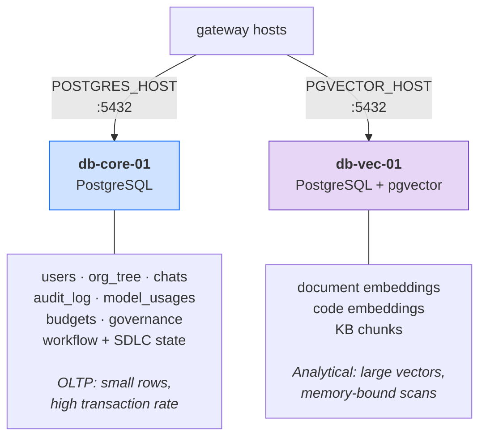

AiNxt supports the split natively — `PGVECTOR_HOST` and `PGVECTOR_PORT` are
separate configuration values precisely so the vector store can live on its own
server. The reason to use that capability:

A knowledge-base re-index writes millions of high-dimensional vectors and drives
sustained memory pressure and IO. On a shared instance that contention lands on
the same buffer pool serving logins, chat history reads and audit writes. Users
experience an index job as "the platform is slow today". Separating them means an
index run can saturate `db-vec-01` without a single login slowing down.

### 7.2 Configuration

```bash
# ── Relational store ──
POSTGRES_HOST=db-core-01.ainxt.corp.internal

# ── Vector store — a different physical server ──
PGVECTOR_HOST=db-vec-01.ainxt.corp.internal
```

The remaining `POSTGRES_*` credentials and `PGVECTOR_PORT` are documented in
[`../.env.example`](../.env.example); only the two host values above are specific
to this topology. The check that matters is simply
`PGVECTOR_HOST` ≠ `POSTGRES_HOST`.

### 7.3 Redis

```bash
REDIS_HOST=msg-01.ainxt.corp.internal
```

Redis carries three distinct workloads: RQ job queues, response and embedding
caches, and session/rate-limit state. Only the first is truly durability-critical
— a lost cache entry is a cache miss, but a lost queue entry is a lost job.
Configure AOF persistence accordingly.

### 7.4 Kafka

A single broker on `msg-01` per site. See
[the event pipeline](#8-the-event-pipeline) for why it is mandatory rather than
optional, and [Appendix B](#appendix-b--assumptions-and-deployment-specific-gaps)
for the availability trade-off a single broker implies.

---

## 8. The event pipeline

### 8.1 Why it is not optional

The gateway does **not** write chat history, audit records or usage rows to
Postgres. It publishes them to Kafka. `workers/kafka_consumer.py` reads them and
performs the writes.

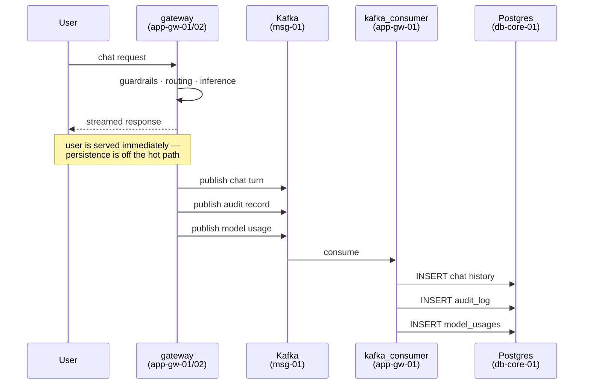

Decoupling persistence from the request keeps chat latency low. The cost is a
dependency most operators discover too late:

> **If `kafka_consumer` is down, the platform works perfectly and records
> nothing.** Chats succeed. Users are happy. Audit rows are never written, usage
> is never costed, budgets never decrement. Then a regulator asks for six months
> of audit history and it is not there.

Consumer offsets mean a restart replays the backlog, so a short outage is
recoverable. But it must be **monitored as a tier-1 service**, not treated as a
background job. See [Observability](#15-observability) for the alert.

### 8.2 What flows through it

| Event | Consumer writes to | Why it matters |
|---|---|---|
| Chat turn | `chats`, `messages` | User-visible history |
| Audit record | `audit_log` | Regulatory retention |
| Model usage | `model_usages` | Cost attribution, budget enforcement |
| Thread / SDLC state | pipeline tables | Approval gates resume correctly |
| Budget event | budget tables | Spend limits enforced at request time |
| Agent run | agent tables | Analytics and evaluation |
| Coach signal | coach tables | Usage scoring |

---

## 9. Identity — Active Directory to `ad_level`

### 9.1 The model

Every user carries an integer `ad_level` from **0 to 6**, where **0 is the most
senior executive and 6 the most junior**. It is defined in `db/models.py`:

```python
ad_level = Column(Integer, nullable=False, default=6)
# 0=most senior exec, 6=junior; can_approve = ad_level<=3
```

New users default to 6 — the least privileged value — and are elevated only by a
directory sync. That default is the right way round: a sync failure leaves someone
under-privileged, never over-privileged.

### 9.2 How the level is derived

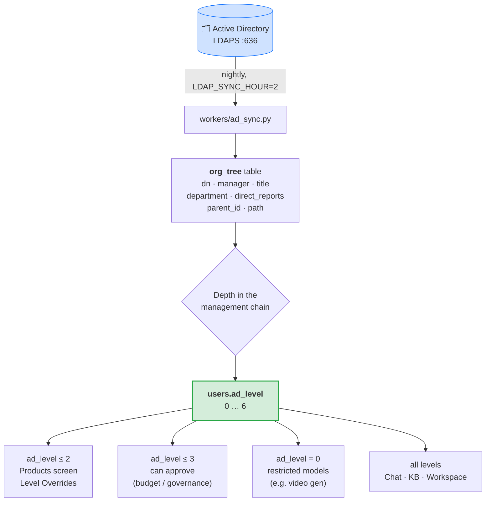

The nightly sync walks the AD manager chain and materialises it into `org_tree`.
Each user's depth in that chain becomes their `ad_level`. The CEO sits at the root
with level 0; an individual contributor sits at the leaves with level 6. Because
it is derived from the reporting structure rather than a hand-maintained mapping
table, a reorganisation in AD propagates to platform permissions the following
night with no administrative action.

> **Historical note.** Earlier versions mapped AD job titles to bands via a
> `title_band_map` table with `ILIKE` patterns. That table is dropped by migration
> Part M in `db/migrate.py` and replaced by `org_tree`. If you are reading older
> documentation that references `title_band_map` or `resolve_band()`, it describes
> the superseded mechanism.

### 9.3 What each level gates

| Level | Typical grade | Gains |
|---|---|---|
| 0 | CEO | Everything, including access-gated models |
| 1 | MD / ED | — |
| 2 | Director / SVP | **Products** screen, **Level Overrides** (grant temporary elevation) |
| 3 | VP / Head of Department | **Approval authority** for budget and governance requests |
| 4 | Senior Manager | — |
| 5 | Manager / Senior Engineer | — |
| 6 | Engineer / Analyst / Trainee | Chat, Knowledge Base, My Workspace, Agent Studio |

Map your own grades onto 0–6 before the first sync. The thresholds baked into the
code are `≤ 3` for approval authority (`APPROVAL_AD_LEVEL`) and `≤ 2` for
organisational administration.

### 9.4 Configuration

```bash
LDAP_ENABLED=true
LDAP_URL=ldaps://ad.corp.internal:636
LDAP_AUTO_PROVISION=true
LDAP_SYNC_HOUR=2

# Level assigned before the first sync classifies a user.
DEFAULT_AD_LEVEL=6
# Most senior level permitted to approve budget/governance requests.
APPROVAL_AD_LEVEL=3
```

Bind DN, base DN, credentials and the user filter are ordinary LDAP settings —
see [`../.env.example`](../.env.example). The four values above are the ones that
change platform behaviour rather than merely describe your directory.

> **`APPROVAL_AD_LEVEL` defaults to 6 in the OSS configuration**, which means
> everyone can approve — appropriate for a small team with no hierarchy, wrong for
> an enterprise. Set it to `3` (or wherever your approval authority sits) as part
> of initial configuration, not later.

### 9.5 Temporary elevation

`user_level_overrides` grants a time-boxed `ad_level` uplift, surfaced in the
**Level Overrides** screen. Two rules are enforced in the data model:

- The granter must be `ad_level ≤ 2`.
- The granted level must be **no more senior than the granter's own** — nobody can
  elevate someone above themselves.

Overrides survive the nightly `org_tree` sync, so a delegation during someone's
leave is not silently reverted at 02:00.

---

## 10. Privacy, guardrails and PII redaction

These are the platform features switched **on** in this deployment, and the reason
a dedicated `privacy_svc` gets a place on the inference hosts.

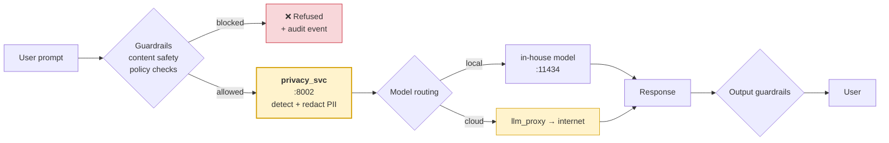

The ordering matters: **PII redaction happens before routing**, so a prompt that
is about to leave the estate via the cloud path has already been scrubbed. A
redaction service that ran after the routing decision would be closing the door
after the fact.

```bash
PRIVACY_SVC_URL=http://app-ai-01.ainxt.corp.internal
PRIVACY_SVC_PORT=8002
PRIVACY_FLOOR_ENFORCE=true    # enforce the privacy floor rather than warn
```

`PRIVACY_FLOOR_ENFORCE=true` is the difference between the privacy policy being
advisory and being enforced. Leave it on.

---

## 11. Request lifecycle end to end

### The short version

What happens when someone asks the platform a question, in seven steps:

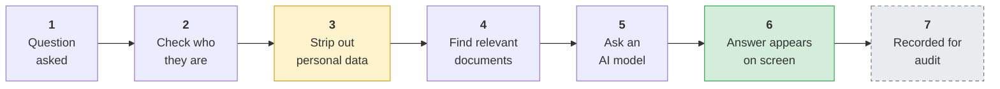

Two of those steps are worth pausing on:

- **Step 3 happens before step 5.** Personal data is removed *before* anything is
  sent to an AI model — so if the question does go out to a cloud provider, it has
  already been cleaned.
- **Step 7 happens after step 6.** The user has their answer before the platform
  writes anything down. Recording is deliberately off the critical path, which is
  why it is fast — and why the recorder going down is invisible until someone
  asks for the audit trail.

### The detailed version

The same request traced across every server and port:

<details>
<summary>Click to expand the full sequence diagram</summary>

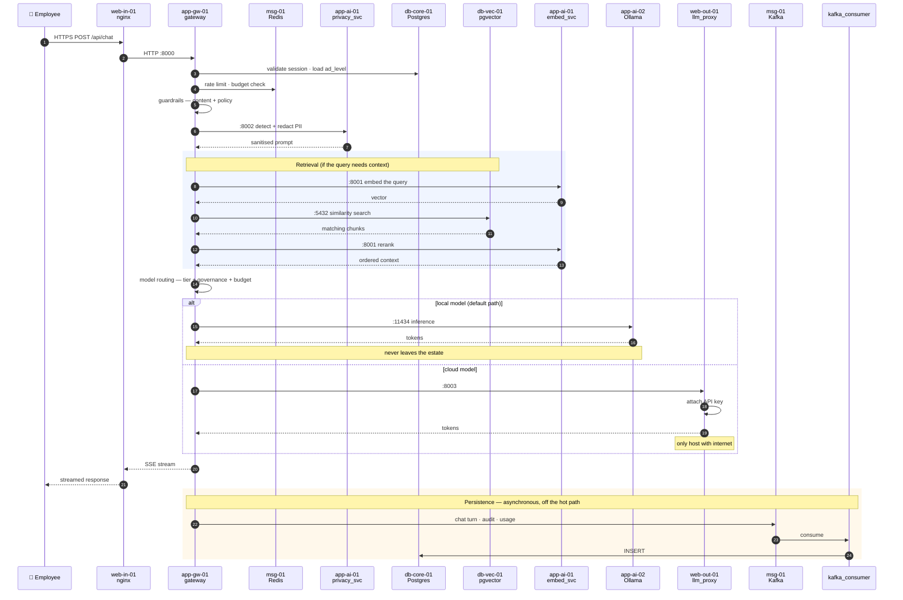

</details>

Two properties are worth naming:

- **The user is served before anything is persisted.** Latency is not paid for
  audit writes.
- **The cloud branch is the only one that crosses a zone boundary,** and it does
  so on a prompt that `privacy_svc` has already sanitised.

---

## 12. Disaster recovery

### 12.1 Active–passive across two sites

Two identical sites. One serves everyone; the other sits ready and receives a
continuous copy of the data.

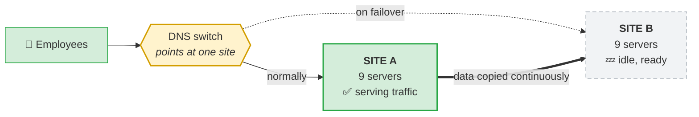

Site B is a **full nine-server mirror of Site A** — same hardware, same layout,
same configuration. Its services are installed but not serving traffic, and its
databases continuously receive a copy of Site A's data.

Switching sites means changing where one DNS name points. Nothing is automatic:
somebody decides, and that is deliberate — see [§12.3](#123-failover) for why.

### 12.2 What replicates

| Layer | Mechanism | Notes |
|---|---|---|
| `db-core-01` | PostgreSQL streaming replication | Users, chats, audit, budgets, workflow state |
| `db-vec-01` | PostgreSQL streaming replication | Embeddings — large, so watch replication lag during index runs |
| Redis on `msg-01` | Redis replication | Keys replicated to the DR site |
| Kafka on `msg-01` | *Not replicated* | See below |
| Uploaded documents | Filesystem sync | `AINXT_UPLOAD_DOCUMENT_PATH` — must be included; see [Appendix B](#appendix-b--assumptions-and-deployment-specific-gaps) |

**On Kafka:** it is a transport, not a system of record. Events already consumed
are durable in Postgres and replicate with it. Events in flight at the moment of a
site failure are lost — meaning a small window of chat history and audit rows may
be missing. If your retention obligation cannot tolerate that window, mirror the
topics (MirrorMaker 2) as well.

### 12.3 Failover

Failover is **DNS/VIP-driven**: repoint the platform hostname at Site B's
`web-in-01`.

The sequence, in order:

1. **Confirm Site A is genuinely down.** A split brain with two active sites
   writing to two databases is far worse than an outage.
2. **Promote the standby databases** — `pg_ctl promote` on both `db-core-01` and
   `db-vec-01` at Site B.
3. **Verify the promotion** — check replication lag was zero or acceptable at the
   point of promotion, and that both instances accept writes.
4. **Start the application tier** — `pm2 start` each service's JSON on Site B's
   gateway, inference and egress hosts.
5. **Confirm the singletons.** `kafka_consumer` and `cowork_scheduler` must be
   running at Site B and **must not** come back up at Site A when it recovers.
6. **Repoint DNS / the VIP** to Site B's `web-in-01`.
7. **Verify egress.** Site B's `web-out-01` needs the same internet routing and
   firewall exception as Site A's, and the cloud API keys must be present there.
   *This is the step most commonly discovered missing during a real failover —
   test it during a drill, not during an incident.*

### 12.4 What to rehearse

- Promotion of both databases, timed.
- That Site B's egress host can actually reach the internet.
- That the singleton processes start at B and stay stopped at A.
- Failback: A recovers as the standby, not as a second active site.

Record your measured RTO and RPO from a drill. Do not assert them from the design.

---

## 13. Build and release into an air-gapped estate

Only `web-out-01` has internet access, and it runs one service. So `pip install`,
`npm install` and `ollama pull` cannot work from the application hosts. Everything
arrives via internal mirrors.

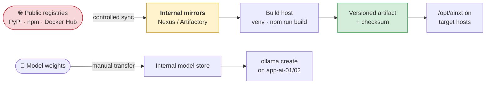

The platform exposes mirror configuration for the sandbox toolchains — see the
air-gapped mirror block in [`../.env.example`](../.env.example):

```bash
SANDBOX_PIP_INDEX_URL=https://nexus.corp.internal/repository/pypi/simple
SANDBOX_NPM_REGISTRY_URL=https://nexus.corp.internal/repository/npm/
SANDBOX_MAVEN_REPO_URL=https://nexus.corp.internal/repository/maven/
SANDBOX_DOCKER_REGISTRY=registry.corp.internal
```

Equivalents exist for Go, Ruby, NuGet, Cargo and Composer — set whichever
languages your sandbox users actually need; the full list is in
[`../.env.example`](../.env.example).

For the platform's own dependencies, set the mirror in `.npmrc` and
`pip.conf`/`PIP_INDEX_URL` on the build host.

**Frontend model settings are baked in at build time.** The `VITE_*` variables are
compiled into the SPA by `npm run build` — changing them later requires a rebuild
and redeploy, not a restart:

```bash
VITE_MODEL_DEFAULT=<your-default-model>
```

**Model weights** move by whatever transfer process your estate permits, then are
registered into Ollama on each inference host with `ollama create`.

---

## 14. Bring-up sequence

Order matters. Each step has a verification — do not proceed past a failed check.

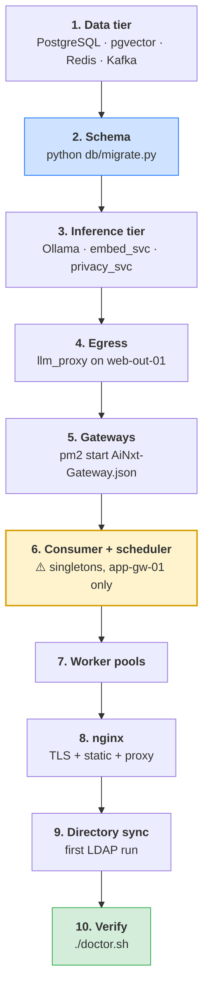

### Step 1 — Data tier

Start PostgreSQL on both DB hosts, create the `pgvector` extension on `db-vec-01`,
start Redis and Kafka on `msg-01`.

```bash
psql -h db-vec-01 -U ainxt_app -d ainxt_memory -c "CREATE EXTENSION IF NOT EXISTS vector;"
psql -h db-core-01 -U ainxt_app -d ainxt_memory -c "SELECT 1;"
redis-cli -h msg-01 -a "$REDIS_PASSWORD" PING          # → PONG
kafka-topics.sh --bootstrap-server msg-01:9092 --list
```

### Step 2 — Schema

From one gateway host only:

```bash
cd /opt/ainxt/ainxt-enterprise
./.venv/bin/python db/migrate.py
```

This creates every table including `org_tree`, `user_level_overrides` and the
`ad_level` column. Run it once per release, from one host — never concurrently
from both gateways.

### Step 3 — Inference tier

```bash
# start the embedding, privacy and Ollama services on each inference host
pm2 start AiNxt-Embed-Svc.json && pm2 start AiNxt-Privacy-Svc.json && pm2 save

# verify from a gateway host, not locally — this also tests reachability
curl -s http://app-ai-01:11434/api/tags
curl -s http://app-ai-01:8001/health
curl -s http://app-ai-01:8002/health
```

### Step 4 — Egress

```bash
pm2 start AiNxt-LLM-Proxy.json && pm2 save
curl -s http://web-out-01:8003/health
```

### Step 5 — Gateways

```bash
# on both gateway hosts
pm2 start AiNxt-Gateway.json && pm2 save
curl -s http://app-gw-01:8000/health
curl -s http://app-gw-02:8000/health
```

Start the worker pools, and — on `app-gw-01` only — the Kafka consumer and
scheduler. See [§5.4](#54-the-pm2-configuration-files) for which files belong on
which host.

The first boot creates the default administrator and prints its password **once**
to the gateway log. Capture it, log in, and change it immediately via
**Profile → Security**.

### Step 6 — Singletons

Confirm the consumer and scheduler are running on `app-gw-01` and absent from
`app-gw-02`:

```bash
# on app-gw-01 — both should return a running process
pgrep -af kafka_consumer.py
pgrep -af cowork_scheduler.py

# on app-gw-02 — both must return nothing
pgrep -af kafka_consumer.py
pgrep -af cowork_scheduler.py
```

### Step 7 — Worker pools

Start each worker pool by its own JSON. Verify queue depths are draining rather
than growing in the **Monitoring** screen.

### Step 8 — nginx

nginx on `web-in-01` has three jobs: terminate TLS, serve the built `ai-ui`
static assets, and reverse-proxy `/api` to both gateway hosts as an upstream
group.

Two settings are not optional:

- **`proxy_buffering off`** on the `/api/` location. Without it nginx buffers the
  SSE stream and the whole reply arrives in one block at the end — chat appears
  frozen. Raise `proxy_read_timeout` for the same reason.
- **`CORS_ALLOWED_ORIGINS`** on the gateways must match the public URL exactly.

### Step 9 — Directory sync

Trigger the first LDAP sync rather than waiting for 02:00, then spot-check that
`org_tree` is populated and a handful of users carry sensible `ad_level` values.

### Step 10 — Verify

```bash
./doctor.sh
```

---

## 15. Observability

The stack ships Prometheus, Grafana and Loki — see
[`../prometheus.yml`](../prometheus.yml),
[`../alert_rules.yml`](../alert_rules.yml) and
[`../loki-config.yml`](../loki-config.yml).

### 15.1 Alerts that matter in this topology

| Alert | Why it is specific to this deployment |
|---|---|
| **`kafka_consumer` not running** | Tier-1. Its absence is silent — see [§8.1](#81-why-it-is-not-optional). Alert on process liveness *and* on consumer lag growing monotonically. |
| **Two schedulers running** | Would double-fire every recurring job. Alert if the process count across the site exceeds 1. |
| **Postgres replication lag** | Both `db-core-01` and `db-vec-01`. Lag on the vector instance spikes during index runs; know your normal before setting a threshold. |
| **`web-out-01` unreachable** | Cloud model tier fails entirely. Local models keep working, so users see partial degradation, not an outage — which makes it easy to miss. |
| **Ollama not responding** | The *default* path fails. Higher user impact than a proxy outage. |
| **RQ queue depth growing** | Per pool. A growing `index` queue is normal during a re-index; a growing `chat` queue never is. |
| **Redis replication broken** | Silent until failover, when DR comes up with stale session and queue state. |

### 15.2 Health endpoints

| Service | Endpoint |
|---|---|
| Gateway | `http://app-gw-0N:8000/health` |
| embed_svc | `http://app-ai-0N:8001/health` |
| privacy_svc | `http://app-ai-0N:8002/health` |
| llm_proxy | `http://web-out-01:8003/health` |
| Ollama | `http://app-ai-0N:11434/api/tags` |

The in-platform **Monitoring** screen surfaces service checks, queue depth,
circuit-breaker state and error rates without leaving the UI.

### 15.3 The metrics, logs and traces stack

The three signals — metrics, logs and traces — are collected by three separate
tools that share a single set of dashboards in Grafana. Prometheus scrapes
metrics, Loki aggregates logs, and an OpenTelemetry (OTEL) Collector receives
distributed traces from the gateway and the microservices. Grafana is the one
place an operator looks at all three.

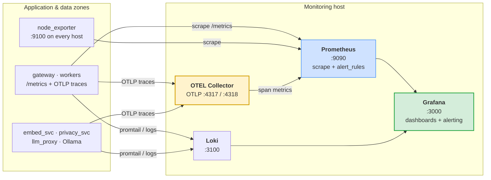

**What each tool is responsible for:**

| Signal | Tool | What it answers |
|---|---|---|
| Metrics | Prometheus | "How many requests, how fast, how many errors, how deep are the queues?" — the numbers behind every alert in [§15.1](#151-alerts-that-matter-in-this-topology). |
| Logs | Loki | "What did this specific request or worker actually log?" — searchable, correlated to a trace by `trace_id`. |
| Traces | OTEL Collector | "Where did the time in this chat request go — retrieval, privacy, inference, or persistence?" — one span per hop across the [request lifecycle](#11-request-lifecycle-end-to-end). |

The OTEL Collector is the piece that ties them together. It receives traces over
OTLP, derives span-based metrics that Prometheus scrapes, and stamps every span
with a `trace_id` that also appears in the application logs — so a slow request in
a Grafana dashboard links straight to its logs in Loki and its trace waterfall.

### 15.4 Placement and the zone boundary

The monitoring components run on a dedicated **monitoring host**, not on the
gateways they observe — for the same reason inference is split out: a heavy
dashboard query or a log-ingestion spike must never contend with request serving.

The monitoring host lives in the **application zone** and needs only *inbound*
reach from the hosts it observes; it requires **no internet route**, exactly like
the rest of the estate. Prometheus reaches out to scrape (see the `9100` and
`8000` rules in [the port matrix](#42-port-matrix)); traces and logs are pushed
*to* the monitoring host by the services. Two ports are added to the matrix for
this integration:

| Source | Destination | Port | Protocol | Purpose |
|---|---|---|---|---|
| `app-gw-01/02`, `app-ai-01/02`, `web-out-01` | Monitoring host | 4317 | gRPC | OTLP trace export to the OTEL Collector (`OTEL_EXPORTER_OTLP_ENDPOINT`) |
| `app-gw-01/02`, `app-ai-01/02`, `web-out-01` | Monitoring host | 3100 | HTTP | Log push to Loki (promtail) |
| Corporate network | Monitoring host | 3000 | HTTPS | Grafana UI (behind the same TLS/auth posture as `web-in-01`) |

> **Traces can carry prompt content.** A span attribute that records a prompt or a
> retrieved chunk moves user data into the trace store. Configure the OTEL
> Collector — or the SDK — to drop or hash message-body attributes so that
> `privacy_svc`'s redaction (see [§10](#10-privacy-guardrails-and-pii-redaction))
> is not undone by telemetry. Traces are for latency and shape, not payloads.

### 15.5 Configuration

Enable OTEL on **every** application and inference host, pointing at the
monitoring host's collector:

```bash
# ── Traces → OTEL Collector on the monitoring host ──
OTEL_ENABLED=true
OTEL_EXPORTER_OTLP_ENDPOINT=http://mon-01.ainxt.corp.internal:4317
OTEL_EXPORTER_OTLP_PROTOCOL=grpc
OTEL_SERVICE_NAME=ainxt-gateway        # unique per service: ainxt-embed-svc, ainxt-privacy-svc, ainxt-llm-proxy …
OTEL_TRACES_SAMPLER=parentbased_traceidratio
OTEL_TRACES_SAMPLER_ARG=0.1            # sample 10% of traces; raise while debugging, lower in steady state
```

Prometheus scrape targets and alert rules are defined in
[`../prometheus.yml`](../prometheus.yml) and
[`../alert_rules.yml`](../alert_rules.yml); Loki ingestion in
[`../loki-config.yml`](../loki-config.yml). Add the gateway `/metrics` endpoint
and each host's `node_exporter` to the scrape config, and add the OTEL Collector
as an additional scrape target so its span-derived metrics land alongside the
rest.

> **Set `OTEL_SERVICE_NAME` distinctly per service.** If every process reports the
> same name, traces from the gateway, the privacy service and the LLM proxy
> collapse into one and the per-hop breakdown that makes tracing worthwhile is
> lost. Match it to the pm2 service name.

Keep `OTEL_TRACES_SAMPLER_ARG` low in steady state. Tracing every request at
2,000-user scale generates a large volume of spans and adds per-request overhead;
10% is enough to characterise latency, and you can raise it temporarily while
investigating a specific regression.

---

## 16. Secrets and key management

### 16.1 Placement

| Secret | Lives on | Never on |
|---|---|---|
| Cloud LLM API keys | `web-out-01` only | Gateway or inference hosts |
| `POSTGRES_PASSWORD` | Gateway hosts | — |
| `REDIS_PASSWORD` | Gateway hosts | — |
| `JWT_SECRET` | **All gateway hosts, identical** | — |
| `LDAP_BIND_PASSWORD` | Gateway hosts | — |
| TLS private key | `web-in-01` only | — |

> **`JWT_SECRET` must be byte-identical across every gateway host.** If
> `app-gw-01` and `app-gw-02` have different values, users are randomly logged out
> as nginx round-robins them between two hosts that cannot validate each other's
> tokens. It is the classic multi-gateway misconfiguration. Generate once with
> `openssl rand -hex 32` and distribute.

### 16.2 File hygiene

`.env` and every `.env.backup.*` are gitignored (see [`../.gitignore`](../.gitignore)),
along with `.env.internal` and `.env.*.internal`. Keep it that way. On the servers:

```bash
chown ainxt:ainxt /opt/ainxt/ainxt-enterprise/.env
chmod 600         /opt/ainxt/ainxt-enterprise/.env
```

### 16.3 CKMS

Where a central key management service exists, prefer
[`PROXY_KEY_FETCH_URL`](#64-fetching-keys-from-ckms-instead-of-env) over keys on
disk. Keys then live in process memory only, and rotation needs no file edit.

### 16.4 HSM

The platform supports an HSM for key material — see
[`../hsm-config.yml.example`](../hsm-config.yml.example) for the configuration
shape. **It is not used in the reference deployment described here.** If your
compliance posture requires hardware-backed keys, that file is the integration
point; treat this section as a stub to fill in for your own estate rather than as
a description of a deployed control.

---

## 17. Sizing guidance

The reference deployment serves **2,000+ employees** on nine servers per site.
Extrapolate from there rather than from first principles.

| Users | Gateway hosts | Inference hosts | Data tier | Notes |
|---|---|---|---|---|
| < 200 | 1 | 1 | Single Postgres (core + vector), Redis + Kafka co-located | Three servers total. Still split inference from the gateway. |
| 200 – 1,000 | 2 | 1 – 2 | Split core / vector, Redis + Kafka on their own host | — |
| **2,000+** | **2** | **2** | **Split core / vector, Redis + Kafka on one host** | **The reference deployment** |
| 5,000+ | 3 – 4 | 3+, add GPU | Postgres HA per instance; multi-broker Kafka | Front the inference tier with a load balancer |

### What to scale on which signal

| Symptom | Scale |
|---|---|
| Chat time-to-first-token rising | Inference hosts — models are queueing |
| HTTP request latency rising, inference fine | Gateway hosts or `WORKERS` per host |
| RQ `chat` queue depth growing | Chat worker count (`--chat --n`) |
| KB search slow, everything else fine | `db-vec-01` memory |
| Login and history slow | `db-core-01` |
| Cloud responses slow, local fine | `llm_proxy` workers, or upstream provider |

The `WORKERS` default is `cpu_count * 2 + 1` (see
[`../gunicorn.conf.py`](../gunicorn.conf.py)). Worker-pool counts in
[`../workers/start_workers.py`](../workers/start_workers.py) carry per-queue
rationale in comments — read those before changing them. In particular, doc
workers are capped deliberately: exceeding the cap saturates the LLM proxy and
causes cascading timeouts across *every* queue, not just the doc queue.

---

## 18. Troubleshooting

| Symptom | Likely cause | Check |
|---|---|---|
| Chats work, **no history or audit rows appear** | `kafka_consumer` is down | `pgrep -af kafka_consumer.py` on `app-gw-01`; then consumer lag |
| Users randomly logged out | `JWT_SECRET` differs between gateway hosts | Compare the value on `app-gw-01` and `app-gw-02` |
| Streaming appears frozen, replies arrive all at once | nginx buffering SSE | `proxy_buffering off` in the `/api/` block |
| Cloud models fail, local models fine | `web-out-01` unreachable, or keys missing there | `curl web-out-01:8003/health`; check egress firewall |
| Local models fail, cloud fine | Ollama down, or bound to `127.0.0.1` instead of the VLAN | `curl app-ai-01:11434/api/tags` **from a gateway host** |
| Everything slow during an index run | Vector and core DB co-located, or replication lag | Confirm `PGVECTOR_HOST` ≠ `POSTGRES_HOST` |
| New users cannot see anything | `ad_level` stuck at the default 6, sync has not run | Query `users.ad_level`; check `org_tree` is populated |
| Recurring jobs fire twice | Two schedulers running | `pgrep -af cowork_scheduler.py` on both gateway hosts |
| Approvals available to everyone | `APPROVAL_AD_LEVEL` left at the OSS default of 6 | Set to `3` |
| Gateway will not boot | Migration not run, or a required var unset in prod | Gateway log; then `./doctor.sh` |

`./doctor.sh` runs the full post-install check suite and is the right first move
for anything not in this table.

---

## Appendix A — collecting your own port matrix

Run these on each host to produce the real, as-deployed matrix rather than the
documented one. Read-only; nothing here changes state.

### A.1 Listening ports and owning process

```bash
# Every listening socket with the process behind it
sudo ss -tulpn | grep LISTEN

# Narrower: just the AiNxt service ports
sudo ss -tulpn | grep -E ':(8000|8001|8002|8003|11434|5432|6379|9092|443|80)\b'
```

### A.2 Host identity and interfaces

```bash
hostname -f
ip -brief address show
ip route show
```

### A.3 Established connections — shows real inter-tier traffic

```bash
# What this host is actually talking to right now, and how often.
# More honest than the firewall rules, which show what is *permitted*.
sudo ss -tnp state established | awk '{print $4, $5}' | sort | uniq -c | sort -rn | head -40
```

### A.4 Confirm the egress boundary

Run on **every** host. Exactly one — `web-out-01` — should succeed.

```bash
timeout 5 curl -sS -o /dev/null -w '%{http_code}\n' https://api.openai.com/v1/models \
  || echo "no internet (expected on all hosts except web-out-01)"
```

If a second host reaches the internet, that is a finding, not a convenience.

### A.5 Reachability between tiers

From a gateway host — this validates the firewall, not just the service:

```bash
for hp in app-ai-01:11434 app-ai-01:8001 app-ai-01:8002 \
          web-out-01:8003 db-core-01:5432 db-vec-01:5432 \
          msg-01:6379 msg-01:9092; do
  h=${hp%%:*}; p=${hp##*:}
  timeout 3 bash -c "</dev/tcp/$h/$p" 2>/dev/null \
    && echo "OK    $hp" || echo "FAIL  $hp"
done
```

### A.6 Process inventory

```bash
# every AiNxt process on this host, with its full command line
pgrep -af 'gunicorn|uvicorn|start_workers|kafka_consumer|cowork_scheduler|ollama'

# gunicorn worker count for the gateway — confirms WORKERS is what you expect
pgrep -c -f 'gunicorn.*gateway:app'
```

---

## Appendix B — assumptions and deployment-specific gaps

Written explicitly so you know which parts of this document are verified against
the codebase and which are reasonable inference. Confirm each against your own
estate.

| # | Assumption | Basis | Confirm by |
|---|---|---|---|
| 1 | RQ worker pools and `kafka_consumer` run on the gateway hosts | They must run somewhere, and the gateway hosts are the only general-purpose application servers | `pgrep -af start_workers` on both gateway hosts |
| 2 | `web-in-01` is nginx doing TLS + static + reverse proxy; `web-out-01` is the LLM proxy | The two web servers were described as "one for incoming, one for outgoing", and the LLM proxy is the only outbound service | Confirm what is installed on each |
| 3 | Kafka runs in KRaft mode, single broker per site | Single-server placement; KRaft is the modern default | `kafka-metadata-quorum --describe` |
| 4 | Kafka topics are not mirrored to the DR site | Replication was described for Postgres and Redis only | Check for MirrorMaker |
| 5 | Uploaded documents under `AINXT_UPLOAD_DOCUMENT_PATH` are replicated to DR | Not stated. **If they are not, DR comes up with a database referencing files that do not exist** — the most likely gap in the DR design | Verify the file-sync job covers this path |
| 6 | `ad_level` derives from AD management-chain depth via `org_tree` | Confirmed in `db/migrate.py` Part M and `workers/ad_sync.py`; the specific grade-to-level boundaries are illustrative | Query `org_tree` and `users.ad_level` |
| 7 | No HSM is deployed | Stated as unknown; the platform supports one via `hsm-config.yml` | Ask your security team whether one is mandated |
| 8 | One pm2 process per gateway host, with gunicorn forking the workers inside it | Confirmed: `gunicorn.conf.py` forks `WORKERS` (default `cpu_count * 2 + 1`) | `pgrep -c -f 'gunicorn.*gateway:app'` |
| 9 | Failover is manual, DNS/VIP-driven | Consistent with active–passive; no automatic failover mechanism was described | Confirm the runbook and who is authorised to trigger it |
| 10 | Single Kafka and single Redis per site are accepted single points of failure | One server hosts both. A `msg-01` failure stops job processing and event persistence at that site | Confirm this is a conscious risk acceptance, not an oversight |

### Recommended follow-ups

1. **Verify document-store replication to DR (#5).** This is the highest-risk gap
   in the current design: the database will fail over cleanly and reference files
   that are not there.
2. **Run a full DR drill** and record measured RTO/RPO, paying particular
   attention to whether Site B's `web-out-01` has working egress.
3. **Decide on Kafka topic mirroring (#4)** against your audit-retention
   obligation.
4. **Document the `msg-01` single-point-of-failure decision (#10)** so it is a
   recorded risk acceptance rather than an implicit one.

---

## See also

| Document | Covers |
|---|---|
| [`GETTING_STARTED.md`](GETTING_STARTED.md) | What each configuration value means |
| [`../README.md`](../README.md) | Platform overview, features, one-command setup |
| [`README.md`](README.md) | The 587-page per-module reference index |
| [`infrastructure/`](infrastructure/) | Observability, monitoring, gunicorn configuration |
| [`security/`](security/) | Authentication, RBAC, compliance modules |
| [`../SECURITY.md`](../SECURITY.md) | Vulnerability reporting |
| [`../.env.example`](../.env.example) | Full environment template, incl. air-gapped mirrors |
| [`../docker-compose.yml`](../docker-compose.yml) | The containerised alternative to pm2 |
