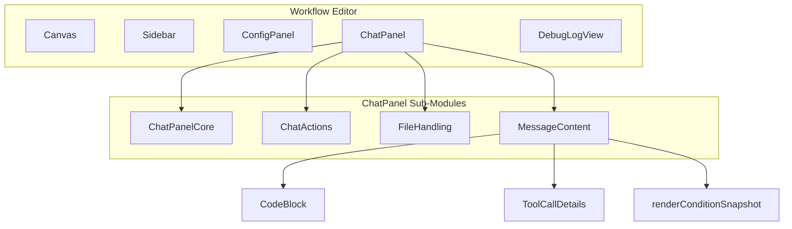
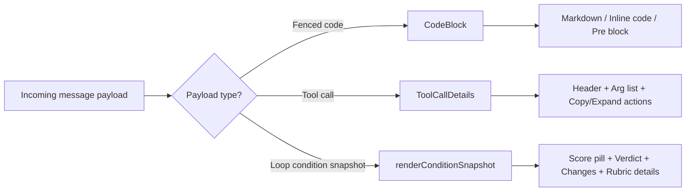
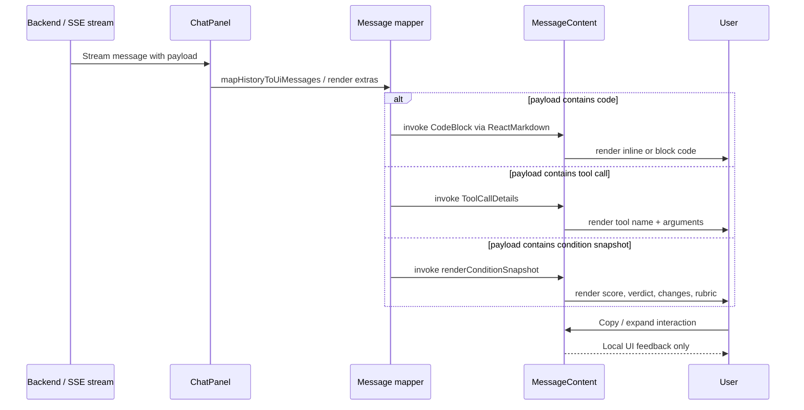
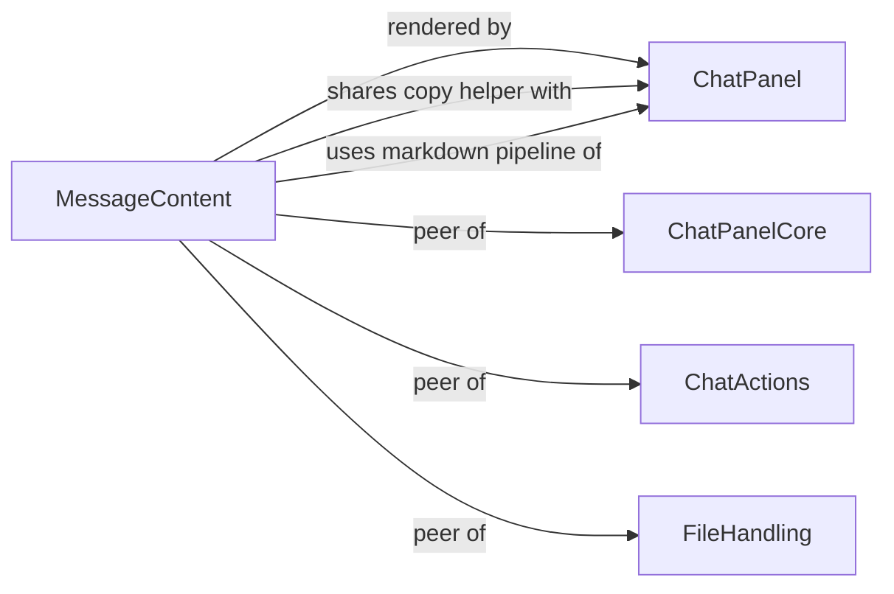

# MessageContent Module

The **MessageContent** module is a focused rendering sub-system inside the ABStudio workflow editor's chat panel. It is responsible for turning raw backend messages—code snippets, tool-call arguments, and loop-condition evaluation snapshots—into readable, interactive UI surfaces. The module lives inside [`ChatPanel`](ChatPanel.md) and is consumed whenever a chat message contains structured payload that goes beyond plain markdown.

---

## 1. Purpose and Core Functionality

Workflow runs in ABStudio frequently produce messages that are not simple text:

- Generated or quoted source code.
- Tool/function-call argument payloads.
- Loop-controller condition snapshots (confidence scores, stop/continue verdicts, judge rubrics).

`MessageContent` provides three specialised renderers that [`ChatPanel`](ChatPanel.md) invokes while mapping server messages to UI bubbles:

| Component | Responsibility |
|-----------|----------------|
| `CodeBlock` | Renders fenced code blocks from markdown. Single-line code is shown as inline code; multi-line code is shown in a scrollable block with a copy button. |
| `ToolCallDetails` | Renders a tool/function name together with its argument key/value pairs. Supports expand/collapse and one-click copy of the full argument block. |
| `renderConditionSnapshot` | Renders the evaluation state of a loop condition node: confidence score, stop/continue verdict, "what changed" summary, and—when an LLM evaluator was used—an expandable rubric breakdown. |

These components are intentionally stateless or lightly stateful (copy feedback, expand/collapse) so that [`ChatPanel`](ChatPanel.md) can render long chat histories without unnecessary re-renders of the surrounding message shell.

---

## 2. Architecture and Component Relationships

### 2.1 Position in the Frontend

`MessageContent` is a peer of [`ChatPanelCore`](ChatPanel.md), [`ChatActions`](ChatPanel.md), and [`FileHandling`](FileHandling.md). It does not own message state; it receives props from the message-mapping logic in [`ChatPanel`](ChatPanel.md) and renders the appropriate visual representation.

### 2.2 Internal Component Structure

---

## 3. Component Deep Dive

### 3.1 `CodeBlock`

`CodeBlock` is registered as the custom `code` component for `ReactMarkdown` inside [`ChatPanel`](ChatPanel.md). It decides, based on the content, whether to render:

- **Inline code** (`<code className="inline-code">`) when the content has no newline.
- **Block code** (`
` + `<pre>`) when the content spans multiple lines, with a copy button in the top-right corner.

Copy feedback is local state (`copied`) and resets after two seconds. The copy helper used here is shared with `ToolCallDetails` (see [Utilities](#4-utilities-and-shared-helpers)).

### 3.2 `ToolCallDetails`

`ToolCallDetails` displays a tool invocation card used in HITL (human-in-the-loop) and tool-result messages. It receives:

- `toolName`: the name of the invoked tool.
- `argEntries`: an array of `[key, value]` pairs.

Behaviour:

- Arguments are pre-formatted with `safeString` once per render via `useMemo`.
- The card auto-expands if the total formatted lines are six or fewer; otherwise it starts collapsed.
- Users can copy all arguments as `key:\nvalue` blocks.
- A cleanup effect clears the copy-feedback timeout on unmount to avoid state updates on unmounted components.

### 3.3 `renderConditionSnapshot`

`renderConditionSnapshot` is a function component (not a class) that visualises the result of a loop condition evaluation. It is called by [`ChatPanel`](ChatPanel.md) when a message carries `condition` metadata.

Displayed signals:

- **Confidence Score**: derived from `condition.evalState.score`. Values in `[0, 1]` are shown as percentages; other decimals are shown raw. A `(judged)` suffix is appended when the score comes from an independent LLM evaluator.
- **Verdict**: `stop` or `continue`, with the reason when the loop controller produced a `stopDecision`.
- **What changed**: a human-readable summary from `condition.evalState.changes`, soft-capped to 140 characters.
- **Rubric breakdown**: an expandable `
` block showing per-criterion scores, weights, and reasoning when `condition.evaluation.criteria` is present.

The component deliberately avoids dumping the raw `evalState` object (which can contain `current_input`, `text`, `title`, etc.) to keep the chat thread readable.

---

## 4. Data Flow

All three renderers are **presentational**: they do not call the backend or mutate global stores. Their only side effects are clipboard writes and local expand/copy state.

---

## 5. Dependencies

### 5.1 Runtime Dependencies

| Dependency | Usage | Referenced Module |
|------------|-------|-------------------|
| `react` (`useState`, `useRef`, `useEffect`, `useCallback`, `useMemo`, `memo`) | Local state and memoisation for copy/expand behaviour. | Core React |
| `react-markdown` | `CodeBlock` is supplied as the custom `code` renderer. | [ChatPanel](ChatPanel.md) |
| `remark-gfm` | GitHub-flavoured markdown support in the parent markdown pipeline. | [ChatPanel](ChatPanel.md) |

### 5.2 Shared Helpers

The module relies on helpers defined in the same file (and shared with sibling components):

- `copyTextToClipboard(text)` — fallback clipboard implementation for Electron renderers that do not expose `navigator.clipboard`.
- `safeString(value)` — normalises strings, objects, and `null`/`undefined` values into a display-safe string.
- `errText(detail, message, fallback)` — not used directly by the three components, but lives in the same helper set and is used by the surrounding [`ChatPanel`](ChatPanel.md) error rendering.

### 5.3 Parent and Sibling Modules

For details on the surrounding chat panel, see [ChatPanel](ChatPanel.md). For file download and attachment rendering, see [FileHandling](FileHandling.md). For the workflow editor canvas and node configuration, see [workflow_editor](workflow_editor.md).

---

## 6. How It Fits Into the Overall System

`MessageContent` is one of the final presentation layers in the ABStudio workflow execution path:

1. A user builds or runs a workflow in the [Workflow Editor](workflow_editor.md).
2. Execution events stream from the backend through [`api_execution`](api_execution.md) and into the frontend via [`ChatPanel`](ChatPanel.md).
3. [`ChatPanel`](ChatPanel.md) maps raw server events into UI messages.
4. When a message contains code, tool calls, or loop-condition metadata, `MessageContent` renders the structured portion.
5. The user reads the rendered output, copies code or arguments, and decides whether to continue, approve, or modify the workflow.

Because the module is purely presentational, it can be reused or extended without affecting execution logic, state management, or backend contracts. New payload types (for example, new node evaluation snapshots) can be added as additional renderers inside `MessageContent` while leaving [`ChatPanel`](ChatPanel.md) unchanged.

---

## 7. References

- [ChatPanel](ChatPanel.md) — parent module that hosts `MessageContent` and orchestrates message rendering.
- [FileHandling](FileHandling.md) — sibling module for file download cards and attachment chips.
- [workflow_editor](workflow_editor.md) — the workflow editor feature that contains `ChatPanel`.
- [workflowStore](workflowStore.md) — Zustand store used by `ChatPanel` for run state and thread history.
- [api_execution](api_execution.md) — backend API that streams workflow execution events consumed by the chat panel.
