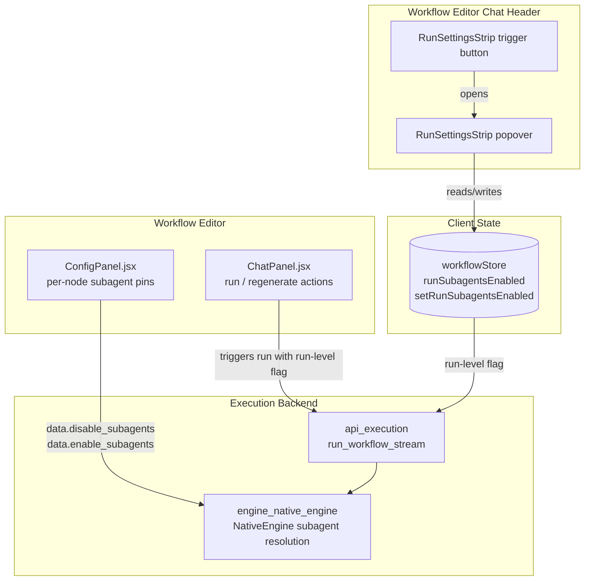
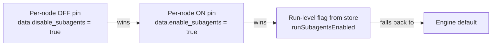
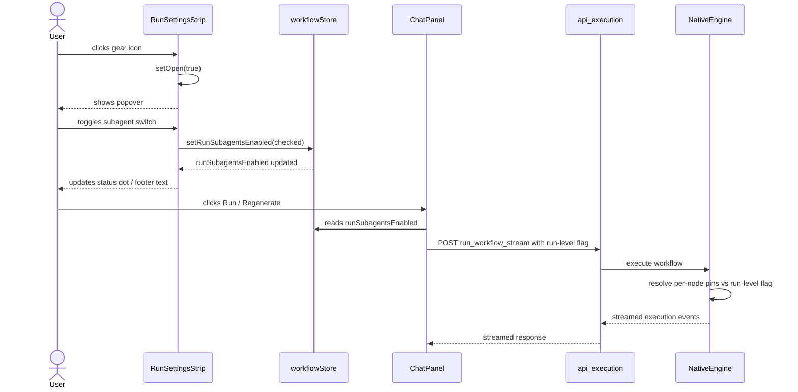

# RunSettingsStrip

`RunSettingsStrip` is a small, focused React component in the ABStudio workflow editor that exposes workflow-wide execution options for the **next run** launched from the chat panel. It renders as a third icon button alongside the chat-history and new-chat controls, and opens an anchored popover where users can toggle high-level run policies. Today the only policy is **subagent (swarm) delegation**; the component is intentionally designed so that additional knobs—such as max iterations, temperature presets, or model overrides—can be added as new rows inside the same popover without changing the surrounding chrome.

The choices made in this strip are stored in the client-side workflow store and are sent to the execution backend on the next workflow run. They act as a **run-level default** that individual nodes can override: per-node pins in the node configuration panel take precedence over the run-level flag, and the engine applies its own default when nothing is pinned.

---

## Core Responsibilities

| Responsibility | Description |
| --- | --- |
| **Run-level policy UI** | Provides a single, discoverable surface for settings that apply to the next execution. |
| **Subagent delegation toggle** | Lets the user enable or disable LLM-driven sub-task delegation (swarm mode) for the upcoming run. |
| **Visual status at a glance** | Shows a status dot on the trigger icon and live status text inside the popover so users can see the active policy without opening it. |
| **Popover interaction semantics** | Implements open/close, outside-click dismiss, and Escape-key dismiss with capture-phase event handling. |
| **Extensibility scaffold** | Uses a card-row layout so future execution policies can be added by dropping in another `.run-settings-card`. |

---

## Architecture

### Component Placement

`RunSettingsStrip` lives in the **workflow editor's chat header**, next to the chat-history and new-chat icon buttons. It is a sibling to the chat controls rather than part of the canvas or config panel, because the settings it controls apply to the next run initiated from the chat area.

---

## Component Breakdown

### `RunSettingsStrip`

The default-exported React component. It owns local UI state for the popover (`open`) and reads/writes the run-level subagent flag from `workflowStore`.

**State sources**

- `open` — local `useState` controlling popover visibility.
- `enabled` — derived from `useWorkflowStore((s) => s.runSubagentsEnabled)`.
- `setEnabled` — `useWorkflowStore((s) => s.setRunSubagentsEnabled)`.

**Refs**

- `buttonRef` — the trigger button; excluded from outside-click dismissal.
- `popoverRef` — the popover container; excluded from outside-click dismissal.

**Effects**

- Document-level `mousedown` listener in **capture phase** to close the popover when clicking outside the button or popover.
- Document-level `keydown` listener to close the popover on `Escape`.

**Rendered structure**

1. **Trigger button** — `.chat-icon-btn.run-settings-trigger` with a gear icon and an optional status dot.
2. **Popover** — conditionally rendered when `open` is true, containing:
   - Header with icon badge, kicker, title, and subtitle.
   - Body with one or more `.run-settings-card` rows.
   - Footer with live status indicator and "Auto-saved" label.

### `onKey`

A closure defined inside the `useEffect` that listens for the `Escape` key and closes the popover. It is registered on `document` only while the popover is open and cleaned up on unmount or when `open` changes.

### `onDocClick`

A closure defined inside the `useEffect` that handles `mousedown` in the capture phase. It ignores clicks inside the popover or on the trigger button and closes the popover for any other click. Using capture phase ensures the dismiss handler runs before React's own `onClick` bubbling on the trigger button, preventing the same click from immediately reopening the popover.

---

## Subagent Resolution Order

The component itself does not enforce precedence; the backend engine resolves subagent usage using the following order, which is documented in the component's comments and mirrored in the UI hint:

1. **Per-node OFF pin** — if a node has `data.disable_subagents = true`, subagents are forced off for that node regardless of other settings.
2. **Per-node ON pin** — if a node has `data.enable_subagents = true`, subagents are forced on for that node, even when the run-level flag is off.
3. **Run-level flag** — `runSubagentsEnabled` from `workflowStore` applies to all otherwise-unpinned nodes.
4. **Engine default** — used when no pin or run-level flag is set.

This precedence is shared with the per-node toggle in [ConfigPanel](ConfigPanel.md); both surfaces display the same explanatory copy so users learn the behavior consistently.

---

## Data Flow

---

## Dependencies

### Internal Modules

| Module | Relationship |
| --- | --- |
| [workflowStore](workflowStore.md) | Provides `runSubagentsEnabled` and `setRunSubagentsEnabled`. The store persists the run-level policy across the session. |
| [ConfigPanel](ConfigPanel.md) | Hosts the per-node subagent pins (`data.enable_subagents` / `data.disable_subagents`) that take precedence over the run-level flag. |
| [ChatPanel](ChatPanel.md) | Initiates workflow runs and passes the run-level subagent flag to the execution API. |
| [api_execution](api_execution.md) | Backend route (`run_workflow_stream`) that receives the run-level flag and starts execution. |
| [engine_native_engine](engine_native_engine.md) | Resolves the final subagent policy per node using the precedence rules above. |

### External Libraries

- **React** — `useState`, `useRef`, `useEffect`, `useCallback` for component state, refs, side effects, and event handlers.

---

## Extending RunSettingsStrip

The popover is built around reusable CSS classes that make adding new execution policies straightforward:

1. Add the new policy value and setter to [workflowStore](workflowStore.md).
2. Inside `.run-settings-popover-body`, add another `.run-settings-card` row with:
   - `.run-settings-card-text` for label, subtext, hint, and meta.
   - A switch or other control bound to the new store value.
3. Update the footer status text if the new policy should be reflected there.
4. Document the new policy's server-side resolution order in both the component comments and the backend execution path.

---

## Accessibility Notes

- The trigger button has `aria-label="Run settings"`, `aria-haspopup="dialog"`, and `aria-expanded={open}`.
- The popover has `role="dialog"` and `aria-label="Run settings"`.
- Decorative icons use `aria-hidden="true"`.
- The switch is wrapped in a `<label>` with its own `aria-label`.
- The status dot and meta icons are purely visual and hidden from assistive technologies.

---

## Related Documentation

- [ConfigPanel](ConfigPanel.md) — per-node subagent pins and node configuration UI.
- [ChatPanel](ChatPanel.md) — chat header actions that trigger workflow runs.
- [workflowStore](workflowStore.md) — client state for the workflow editor, including run-level execution flags.
- [api_execution](api_execution.md) — backend endpoints for running and resuming workflows.
- [engine_native_engine](engine_native_engine.md) — execution engine that resolves subagent delegation per node.
