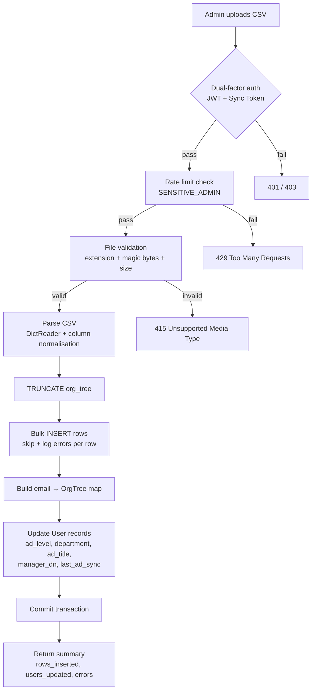
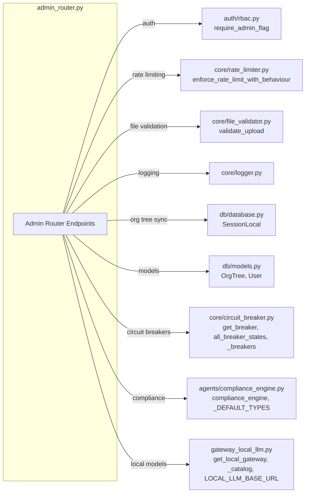
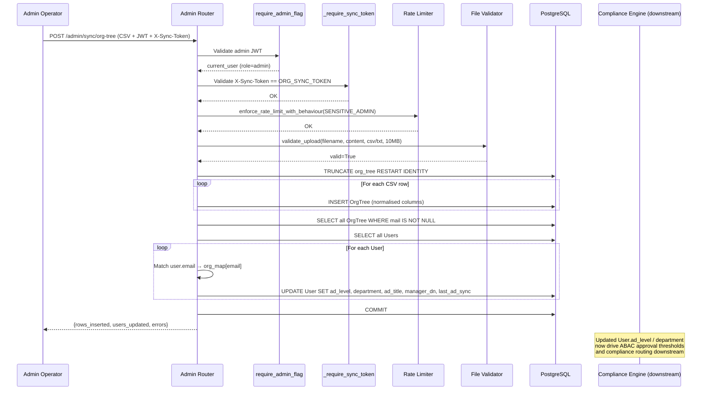

# Admin Router

## Overview

The **Admin Router** (`routers/admin_router.py`) is a FastAPI `APIRouter` that exposes privileged administrative endpoints under the `/admin` prefix. It provides platform operators with tools to manage four critical operational domains:

1. **Organisation Tree Sync** — Bulk-import Active Directory hierarchy via CSV, propagate attributes to user records.
2. **Local LLM Model Catalog** — Inspect the live in-house model registry, tier assignments, and selected models.
3. **Circuit Breaker Management** — View and force-reset circuit breakers protecting downstream LLM and service calls.
4. **Compliance Configuration** — View, patch, reload, and reset PII/compliance engine settings (redact / block / off per data type).

All endpoints require admin-level authentication. The org-tree sync endpoint adds a second authentication factor (a pre-shared sync token) as a defence-in-depth measure against DAST-identified IP-only access control weaknesses.

---

## Architecture

```mermaid
graph TB
    subgraph "Client / Operator"
        OP[Admin Operator<br/>curl / Postman]
    end

    subgraph "Admin Router (routers/admin_router.py)"
        AR[APIRouter<br/>prefix=/admin]
        
        subgraph "Org Tree Sync"
            SYNC_POST["POST /admin/sync/org-tree"]
            SYNC_GET["GET /admin/sync/org-tree/status"]
        end
        
        subgraph "Local Models"
            MODELS["GET /admin/models"]
        end
        
        subgraph "Circuit Breakers"
            CB_GET["GET /admin/circuit-breakers"]
            CB_RESET["POST /admin/circuit-breakers/{name}/reset"]
            CB_RESET_ALL["POST /admin/circuit-breakers/reset-all"]
        end
        
        subgraph "Compliance Config"
            CC_GET["GET /admin/compliance/config"]
            CC_PATCH["PATCH /admin/compliance/config"]
            CC_RELOAD["POST /admin/compliance/config/reload"]
            CC_RESET["POST /admin/compliance/config/reset"]
        end
    end

    subgraph "Authentication Layer"
        RBAC["auth/rbac.py<br/>require_admin_flag"]
        SYNC_TOKEN["_require_sync_token<br/>X-Sync-Token header"]
    end

    subgraph "Core Infrastructure"
        RATE["core/rate_limiter.py<br/>enforce_rate_limit_with_behaviour"]
        VALIDATOR["core/file_validator.py<br/>validate_upload"]
        LOGGER["core/logger.py"]
    end

    subgraph "Database (db/models.py)"
        ORGTREE["OrgTree model"]
        USER["User model"]
    end

    subgraph "Service Layer"
        CB_ENGINE["core/circuit_breaker.py<br/>get_breaker / all_breaker_states"]
        COMP_ENGINE["agents/compliance_engine.py<br/>ComplianceEngine"]
        LOCAL_GW["gateway_local_llm.py<br/>LocalLLMGateway / _ModelCatalog"]
    end

    OP --> AR
    AR --> RBAC
    SYNC_POST --> SYNC_TOKEN
    SYNC_POST --> RATE
    SYNC_POST --> VALIDATOR
    SYNC_POST --> ORGTREE
    SYNC_POST --> USER
    SYNC_GET --> ORGTREE
    MODELS --> LOCAL_GW
    CB_GET --> CB_ENGINE
    CB_RESET --> CB_ENGINE
    CB_RESET_ALL --> CB_ENGINE
    CC_GET --> COMP_ENGINE
    CC_PATCH --> COMP_ENGINE
    CC_RELOAD --> COMP_ENGINE
    CC_RESET --> COMP_ENGINE
```



---

## Authentication & Security Model

Every endpoint in the admin router is protected by the `require_admin_flag` dependency from the [authentication](authentication.md) module, which validates that the caller's JWT contains `role = "admin"`. This is the **first authentication factor** for all admin endpoints.

### Dual-Factor Protection for Org-Tree Sync

The `POST /admin/sync/org-tree` endpoint implements an additional second factor via `_require_sync_token`:

| Factor | Mechanism | Purpose |
|--------|-----------|---------|
| 1st | Admin JWT (`require_admin_flag`) | Cryptographic proof of admin identity |
| 2nd | Pre-shared secret (`X-Sync-Token` header → `ORG_SYNC_TOKEN` env var) | Network-independent shared secret |

This dual-factor design directly addresses a DAST finding where the endpoint previously relied solely on IP-based access controls. A compromised network or stolen sync token alone is now insufficient — both factors must pass.

### Rate Limiting

The org-tree sync endpoint enforces behaviour-aware rate limiting via `enforce_rate_limit_with_behaviour` with the `SENSITIVE_ADMIN` configuration, which applies a stricter sliding-window limit and includes anomaly/behaviour-block detection before the standard rate-limit check.

---

## Component Reference

### Request Models

#### `_TypePatch` (Pydantic BaseModel)

Represents a partial update to a single compliance data type.

| Field | Type | Description |
|-------|------|-------------|
| `enabled` | `Optional[bool]` | Whether detection is active for this type |
| `action` | `Optional[str]` | One of `"redact"`, `"block"`, `"off"` |

#### `_ConfigPatch` (Pydantic BaseModel)

Wraps a dictionary of type-level patches for the `PATCH /admin/compliance/config` endpoint.

| Field | Type | Description |
|-------|------|-------------|
| `types` | `dict[str, _TypePatch]` | Map of compliance type name → partial update |

---

### Endpoint Catalogue

#### Organisation Tree Sync

##### `sync_org_tree` — `POST /admin/sync/org-tree`

Uploads a CSV file containing the Active Directory organisation hierarchy, performs a flash-reload of the `org_tree` table (TRUNCATE → bulk INSERT), and propagates key attributes to matching `User` records.

**Authentication:** Admin JWT + `X-Sync-Token` header (dual-factor)

**Rate Limited:** Yes (`SENSITIVE_ADMIN` profile)

**File Validation:** CSV/TXT only, max 10 MB, magic-byte and extension checks via `validate_upload`

**CSV Columns (case-insensitive, order-independent):**

| Column | Aliases | Notes |
|--------|---------|-------|
| `level` | — | Integer hierarchy level (0=most senior, 6=junior) |
| `node_id` | `id`, `objectguid`, `objectid`, `cn` | Unique node identifier |
| `parent_id` | `parent`, `parentid` | Parent node reference |
| `path` | — | Full hierarchy path |
| `dn` | `distinguishedname` | LDAP distinguished name |
| `department` | — | Department name |
| `description` | — | Node description |
| `direct_reports` | `directreports` | Semicolon-separated DN/name list |
| `display_name` | `displayname`, `name` | Human-readable name (required) |
| `mail` | `email`, `userprincipalname` | Email (lowercased, used for user matching) |
| `manager` | — | Manager DN |
| `mobile` | `telephonenumber`, `phone` | Phone number |
| `title` | — | Job title |
| `company` | — | Company name |

**Process Flow:**



**User Propagation:** After inserting org-tree rows, the endpoint builds a case-insensitive `email → OrgTree` map and updates each `User` record's `ad_level`, `department`, `ad_title`, `manager_dn`, and `last_ad_sync` fields. These ABAC fields drive approval workflows and access-control decisions throughout the platform.

**Response:**
```json
{
  "rows_inserted": 1250,
  "users_updated": 980,
  "errors": ["row 42: invalid literal for int() ..."]
}
```

---

##### `org_tree_status` — `GET /admin/sync/org-tree/status`

Returns the current row count and last sync timestamp from the `org_tree` table.

**Authentication:** Admin JWT only

**Response:**
```json
{
  "row_count": 1250,
  "last_synced": "2025-01-15T10:30:00"
}
```

---

#### Local LLM Models

##### `list_local_models` — `GET /admin/models`

Returns the live model catalog from the in-house Local LLM proxy, including all discovered models, their tier assignments, and which model is currently selected for each tier.

**Authentication:** Admin JWT only

**Dependencies:** `gateway_local_llm.py` — `LocalLLMGateway`, `_ModelCatalog`

The endpoint queries the `LocalLLMGateway` instance, which delegates to the `_ModelCatalog` singleton. The catalog performs a TTL-cached discovery of `/v1/models` from the local LLM proxy, classifies each model into a tier (`simple`, `medium`, `complex`) based on env-var preferences and size heuristics, and exposes the current selection.

**Response:**
```json
{
  "local_llm_base_url": "http://localhost:8080",
  "available": true,
  "models": ["llama-3.1-8b", "qwen2.5-32b"],
  "by_tier": {
    "simple": ["llama-3.1-8b"],
    "medium": ["qwen2.5-32b"],
    "complex": ["qwen2.5-32b"]
  },
  "selected": {
    "simple": "llama-3.1-8b",
    "medium": "qwen2.5-32b",
    "complex": "qwen2.5-32b"
  }
}
```

> See [local_llm_gateway](local_llm_gateway.md) for full details on model discovery, tier classification, and the streaming generation interface.

---

#### Circuit Breaker Management

Circuit breakers protect downstream LLM and service calls from cascading failures. The admin router provides endpoints to inspect and force-reset them.

##### `get_circuit_breakers` — `GET /admin/circuit-breakers`

Returns the state of all registered circuit breakers.

**Authentication:** Admin JWT only

**Dependencies:** `core/circuit_breaker.py` — `all_breaker_states()`

**Response:**
```json
{
  "breakers": [
    {"name": "claude", "state": "CLOSED", "failures": 0, "threshold": 10},
    {"name": "openai", "state": "OPEN", "failures": 12, "threshold": 10}
  ]
}
```

> See [core_infrastructure](core_infrastructure.md) for the full `CircuitBreaker` implementation, state machine, and per-provider tuned defaults.

---

##### `reset_circuit_breaker` — `POST /admin/circuit-breakers/{name}/reset`

Force-resets a single named circuit breaker to `CLOSED` state, clearing its failure counter.

**Authentication:** Admin JWT only

**Path Parameter:** `name` — the circuit breaker identifier (e.g., `claude`, `openai`, `gemini`)

**Response:**
```json
{"name": "claude", "state": "CLOSED", "reset": true}
```

---

##### `reset_all_circuit_breakers` — `POST /admin/circuit-breakers/reset-all`

Force-resets **all** registered circuit breakers to `CLOSED` state.

**Authentication:** Admin JWT only

**Response:**
```json
{"reset": ["claude", "openai", "gemini", "local"]}
```

---

#### Compliance Configuration

These endpoints manage the `ComplianceEngine` configuration that controls PII detection, redaction, and blocking behaviour across the platform. The compliance engine uses a JSON config file (or `COMPLIANCE_CONFIG` env var) that maps data types (e.g., `PAN`, `EMAIL`, `AADHAAR`, `CVV`) to an `enabled` flag and an `action` policy.

| Action | Behaviour |
|--------|-----------|
| `redact` | Detect and mask the value before forwarding to the LLM |
| `block` | Reject the request entirely if the type is detected |
| `off` | No detection or redaction for this type |

##### `get_compliance_config` — `GET /admin/compliance/config`

Returns the current compliance configuration and a summary grouping types by action.

**Authentication:** Admin JWT only

**Response:**
```json
{
  "config": {
    "types": {
      "PAN": {"enabled": true, "action": "block"},
      "EMAIL": {"enabled": true, "action": "redact"},
      "CVV": {"enabled": true, "action": "block"}
    }
  },
  "summary": {
    "redact": ["EMAIL"],
    "block": ["PAN", "CVV"],
    "off": []
  }
}
```

---

##### `patch_compliance_config` — `PATCH /admin/compliance/config`

Applies a partial update to the compliance configuration. Only the fields specified in the patch are modified; all other types retain their existing settings. Changes are persisted to disk.

**Authentication:** Admin JWT only

**Request Body:** `_ConfigPatch`

**Example:**
```json
{
  "types": {
    "EMAIL": {"enabled": false},
    "PAN": {"action": "block"}
  }
}
```

**Response:** The full updated configuration object.

---

##### `reload_compliance_config` — `POST /admin/compliance/config/reload`

Forces the `ComplianceEngine` to re-read its configuration from disk (or the `COMPLIANCE_CONFIG` env var), discarding any in-memory changes.

**Authentication:** Admin JWT only

**Response:** The reloaded configuration object.

---

##### `reset_compliance_config` — `POST /admin/compliance/config/reset`

Resets all compliance types to their defaults: `enabled = true`, `action = "redact"`. This is a safe baseline that ensures all known PII types are at least redacted.

**Authentication:** Admin JWT only

**Response:** The reset configuration object.

> See [agent_system](agent_system.md) for the full `ComplianceEngine` implementation, including regex + ML-based PII detection, input/output validation, and audit logging.

---

## Dependency Map



---

## Data Flow: Org-Tree Sync Propagation

The org-tree sync is the most complex operation in this router. It not only reloads the hierarchy table but also propagates Active Directory attributes into the `User` table, which drives Attribute-Based Access Control (ABAC) across the platform:



---

## Integration with Platform Systems

The admin router serves as the operational control panel for several cross-cutting platform concerns:

| Admin Endpoint | Downstream Impact |
|----------------|-------------------|
| `sync_org_tree` | Populates `User.ad_level`, `User.department`, `User.manager_dn` — these fields drive approval workflows, RBAC level checks (`require_level`, `require_band`), and department-scoped queries across the platform |
| `list_local_models` | Read-only inspection of the `_ModelCatalog` singleton used by `LocalLLMGateway` for tier-based model selection in chat and agent pipelines |
| `reset_circuit_breaker` / `reset_all_circuit_breakers` | Clears `OPEN` circuit breakers that are blocking LLM gateway calls (Claude, OpenAI, Gemini, Local) — allows operators to manually recover from transient outage states |
| `patch_compliance_config` / `reload` / `reset` | Modifies the `ComplianceEngine` singleton's in-memory config and persists to disk — immediately affects all PII redaction and blocking decisions for incoming chat/agent requests |

---

## Error Handling

| Scenario | HTTP Status | Behaviour |
|----------|-------------|-----------|
| Non-admin JWT | 403 | `require_admin_flag` raises `HTTPException` |
| Missing/invalid sync token | 401 | `_require_sync_token` raises `HTTPException` |
| `ORG_SYNC_TOKEN` not configured | 503 | Server misconfiguration — sync endpoint unavailable |
| Rate limit exceeded | 429 | `enforce_rate_limit_with_behaviour` raises with `Retry-After` header |
| Invalid file type/size | 415 | `validate_upload` rejection surfaced as HTTP 415 |
| Empty CSV | 400 | Explicit check after parsing |
| Individual row parse error | — (skipped) | Row is logged and added to `errors` list; sync continues |
| Database transaction failure | 500 | Rollback + error message |
| Invalid compliance action value | 400 | `ValueError` from `ComplianceEngine.update_config` surfaced as HTTP 400 |
| Circuit breaker reset failure | 500 | Error message returned |

---

## Related Documentation

- [authentication](authentication.md) — RBAC, `require_admin_flag`, SSO, and session management
- [core_infrastructure](core_infrastructure.md) — `CircuitBreaker`, rate limiter, file validator, logger
- [agent_system](agent_system.md) — `ComplianceEngine`, PII detection, redaction, and blocking logic
- [local_llm_gateway](local_llm_gateway.md) — `LocalLLMGateway`, `_ModelCatalog`, tier-based model selection
- [database](database.md) — `OrgTree` and `User` models, `SessionLocal`, PostgreSQL connection pooling
