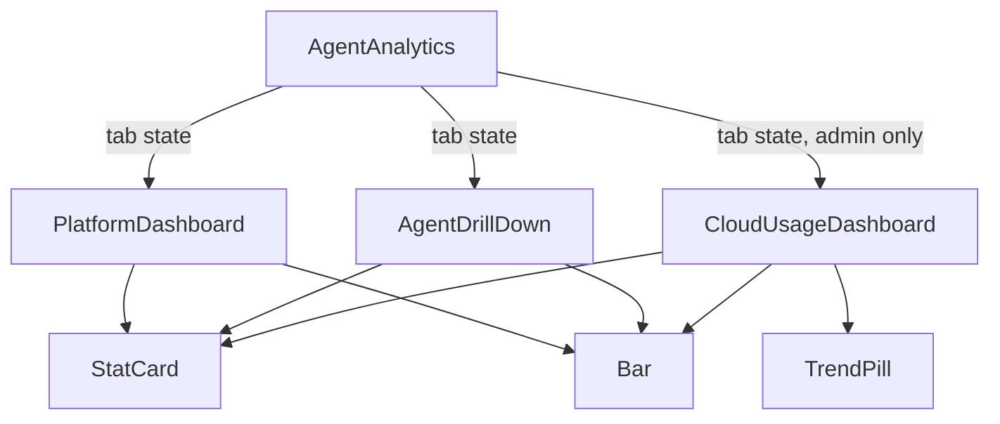
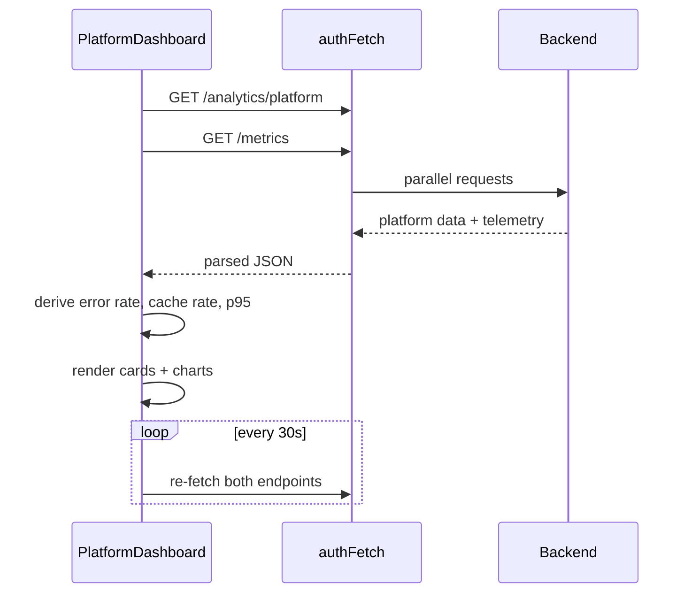
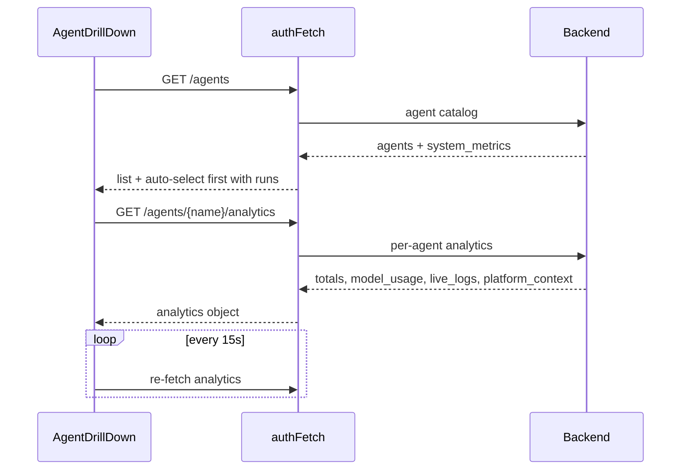
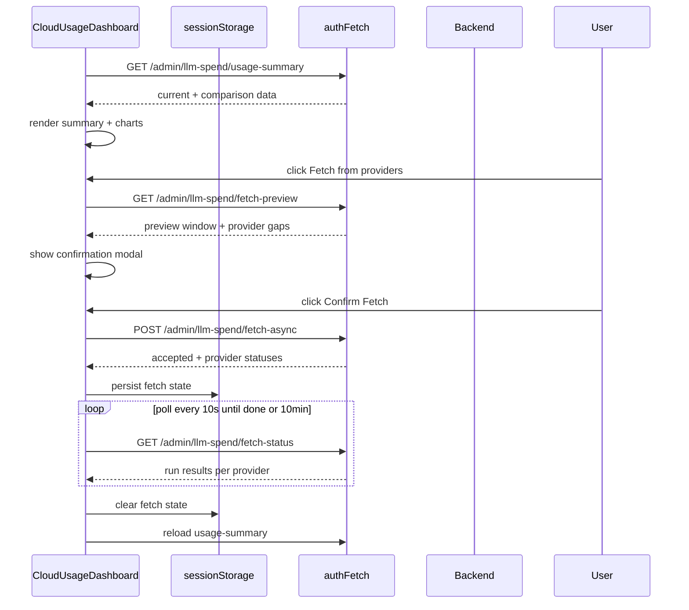

# Agent Analytics Module

## Brief Introduction

The **Agent Analytics** module is a React-based analytics dashboard in the `ai-ui` frontend. It provides operators and administrators with a consolidated view of platform-wide AI usage, per-agent performance, and cloud-provider LLM spend. The module is implemented as a single-page component with three tabbed views: **Platform Overview**, **Per-Agent Drill-Down**, and **Cloud Usage** (admin-only).

This module is read-only from the UI perspective. It fetches aggregated metrics from the backend and renders them as cards, bar charts, trend pills, and tabular summaries. It also supports an admin workflow to pull missing LLM spend data directly from cloud providers (OpenAI, Anthropic, Gemini) with preview, confirmation, and polling.

---

## Core Functionality

### 1. Platform Overview (`PlatformDashboard`)

Displays high-level platform health and usage metrics.

- Fetches `/analytics/platform` and `/metrics` every 30 seconds.
- Shows today / week / all-time aggregates for requests, tokens, cost, and agent count.
- Renders system-health telemetry: error rate, p95 latency, cache hit rate, compliance blocks.
- Visualizes daily requests (7-day), model distribution, top agents by usage, SDLC pipeline state summary, and an hourly volume sparkline.

### 2. Per-Agent Drill-Down (`AgentDrillDown`)

Allows users to inspect a single agent's runtime behavior.

- Loads the agent catalog from `/agents` on mount.
- Auto-selects the first agent with recorded runs.
- Fetches `/agents/{name}/analytics` every 15 seconds for the selected agent.
- Displays total calls, tokens, success rate, average latency, total cost, model usage distribution, and recent live logs.
- For agents with zero runs, falls back to platform-wide context so the panel is never empty.

### 3. Cloud Usage (`CloudUsageDashboard`)

Admin-only view for cloud-provider LLM spend tracking.

- Loads a usage summary from `/admin/llm-spend/usage-summary` with configurable granularity (day, week, month, quarter) and reference date.
- Compares current window against the previous period using percentage-change trend pills.
- Shows provider breakdown, daily spend chart, and model breakdown.
- Supports a **Fetch from providers** workflow:
  1. `openPreview` calls `/admin/llm-spend/fetch-preview` to identify missing data.
  2. `confirmFetch` calls `/admin/llm-spend/fetch-async` to start the backfill.
  3. Polling `/admin/llm-spend/fetch-status` updates per-provider progress.
  4. Fetch state is persisted in `sessionStorage` so it survives tab switches.

---

## Architecture

### Component Hierarchy

### Module Boundaries

- **Presentation only**: All data is fetched from backend REST endpoints; no local computation beyond formatting and aggregation.
- **Polling**: Platform and per-agent views use `setInterval` for live updates. Cloud usage refreshes only on user action or after a completed fetch.
- **Auth**: All requests use `authFetch` from [`config.md`](../core/config.md), which attaches correlation IDs and credentials.
- **Time formatting**: Live logs use `toIST` from `time.md`.

---

## Dependencies

### Internal Modules

| Dependency | Purpose |
|------------|---------|
| [`config.md`](../core/config.md) | `authFetch`, `API_BASE` |
| `time.md` | `toIST` for IST timestamp formatting |

### External Libraries

- `react` (hooks: `useState`, `useEffect`, `useCallback`)
- `lucide-react` (iconography)

### Backend Endpoints

| View | Endpoint | Method |
|------|----------|--------|
| Platform | `/analytics/platform` | GET |
| Platform | `/metrics` | GET |
| Per-Agent | `/agents` | GET |
| Per-Agent | `/agents/{name}/analytics` | GET |
| Cloud Usage | `/admin/llm-spend/usage-summary` | GET |
| Cloud Usage | `/admin/llm-spend/fetch-preview` | GET |
| Cloud Usage | `/admin/llm-spend/fetch-async` | POST |
| Cloud Usage | `/admin/llm-spend/fetch-status` | GET |

---

## Data Flow

### Platform Overview

### Per-Agent Drill-Down

### Cloud Usage Fetch Workflow

---

## Component Reference

### `AgentAnalytics`

Root component. Manages the active tab (`platform`, `agent`, `cloud`) and conditionally renders the admin-only **Cloud Usage** tab based on `user.role === "admin"`.

### `PlatformDashboard`

Self-contained view for platform-wide analytics.

- **State**: `data`, `telemetry`, `loading`
- **Polling**: 30 seconds
- **Key derived values**: `errorRate`, `cacheRate`, `p95`, `avgLat`, `compBlocks`

### `AgentDrillDown`

Split-pane view with an agent list on the left and detailed metrics on the right.

- **State**: `agents`, `searchQ`, `selected`, `analytics`, `loading`, `systemMetrics`
- **Polling**: 15 seconds
- **Features**: search filter, status chips, system-path metrics sidebar, zero-run fallback

### `CloudUsageDashboard`

Admin interface for cloud-provider spend and backfill operations.

- **State**: `granularity`, `referenceDate`, `data`, `loading`, `preview`, `error`, `fetching`, `fetchStatus`, `dispatch`
- **Persistence**: `FETCH_STATE_KEY` in `sessionStorage`
- **Helpers**: `_yesterdayStr`, `_fmtUsd`, `_fmtNum`, `_humanFetchError`, `_saveFetchState`, `_loadFetchState`

### `StatCard`

Reusable metric card. Props:

- `icon`: Lucide icon component
- `label`: card title
- `value`: main number/string
- `sub`: optional subtitle
- `color`: `blue | green | purple | orange | gray`

### `Bar`

Horizontal progress bar. Props:

- `value`: current value
- `max`: maximum value
- `color`: Tailwind background class

### `TrendPill`

Renders a green up-arrow for positive values and a red down-arrow for negative values. Used for period-over-period comparisons.

---

## Key Design Decisions

1. **Graceful degradation**: If `/metrics` fails, the platform view still renders platform data. If an agent has zero runs, platform context is shown instead of an empty panel.
2. **Polling with cleanup**: All intervals are cleared on unmount to prevent memory leaks.
3. **Fetch state persistence**: Cloud provider backfill can take minutes; `sessionStorage` keeps the banner visible across tab switches and page reloads.
4. **Auto-expiry**: Fetch polling stops automatically after 10 minutes, and persisted state expires after 10 minutes.
5. **No local routing**: The module relies on the parent `ai-ui` shell for navigation. Internal navigation is tab-based only.

---

## How It Fits Into the System

The Agent Analytics module is part of the `ai_ui_frontend` analytics surface. It consumes data produced by:

- The gateway's analytics and metrics endpoints (see [`gateway.md`](../core/gateway.md)).
- The agent management surface (see [`agents_catalog.md`](agents_catalog.md)).
- The LLM spend reporting subsystem (see [`llm_spend_report_router.md`](../analytics/llm_spend_report_router.md)).

It is typically accessed from the main sidebar of the `ai-ui` application and is intended for platform operators, team leads, and administrators who need visibility into cost, usage, and health.

---

## Related Documentation

- `ai_ui_frontend.md` — parent frontend module
- [`config.md`](../core/config.md) — `authFetch` and API base configuration
- `time.md` — IST timestamp formatting
- [`gateway.md`](../core/gateway.md) — backend gateway providing `/metrics` and analytics
- [`agents_catalog.md`](agents_catalog.md) — agent catalog and related UI
- [`llm_spend_report_router.md`](../analytics/llm_spend_report_router.md) — cloud spend backfill API
