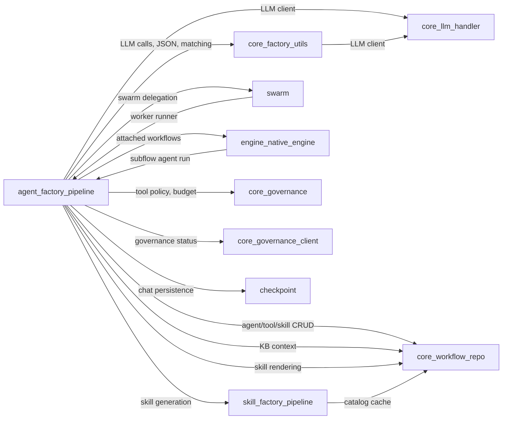
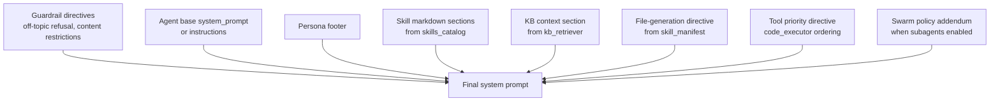
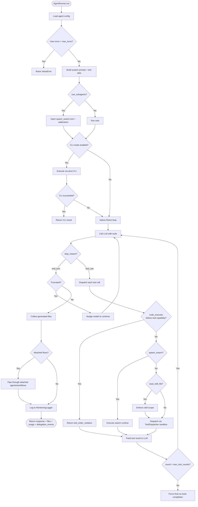
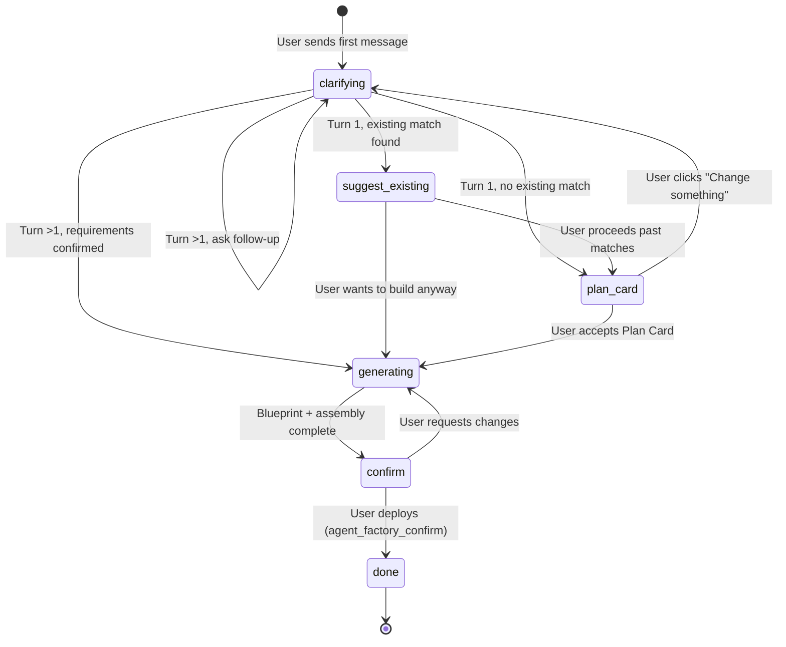
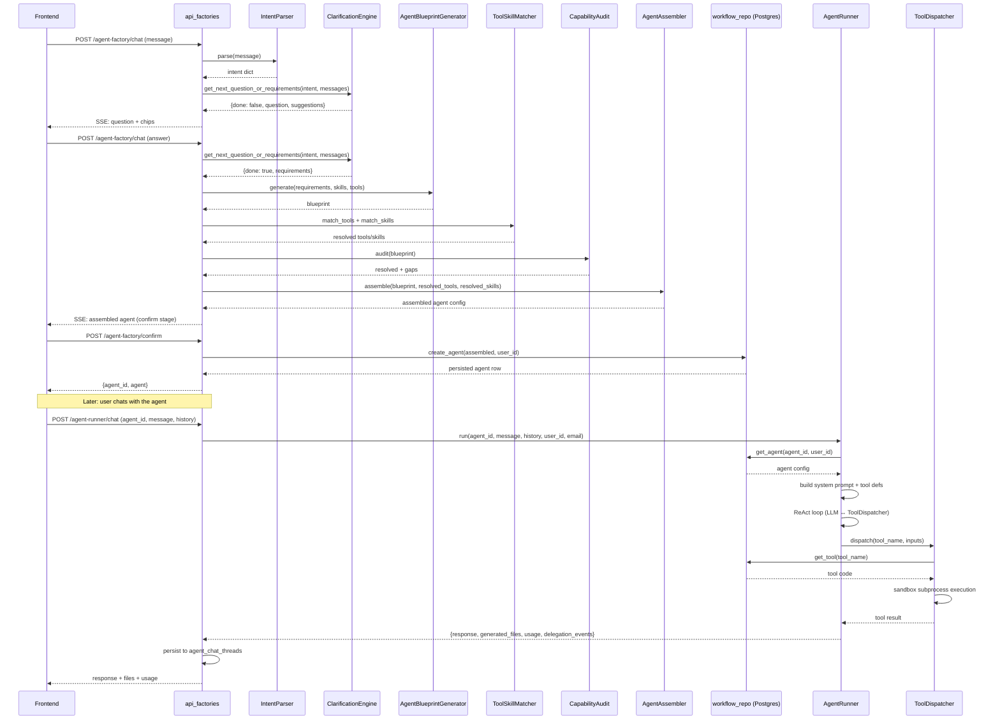

# Agent Factory Pipeline

## Introduction

The **Agent Factory Pipeline** (`ABStudio/backend/agent_factory/pipeline.py`) is the core engine behind ABStudio's conversational agent-creation and agent-execution system. It provides a set of plain-Python classes — no agentic frameworks — that together implement the full lifecycle: from parsing a user's natural-language intent, through multi-turn clarification, blueprint generation, catalog-based tool/skill matching, assembly, persistence, and finally runtime execution with LLM function-calling, sandboxed tool dispatch, and adaptive swarm delegation.

All LLM calls route through the project's existing `llm_handler` (OpenAI-compatible) via the shared `factory_utils` module, ensuring consistent model routing, gateway security, and budget enforcement across every factory component.

The pipeline is exposed to the frontend through the [api_factories](../api/api_factories.md) module (endpoints like `/agent-factory/chat`, `/agent-factory/confirm`, `/agent-runner/chat`, `/agent-runner/chat-stream`), and persisted agents are managed via the [api_agents](../api/api_agents.md) and [api_agent_chat](../api/api_agent_chat.md) modules.

---

## Architecture Overview

```mermaid
graph TB
    subgraph "Agent Factory Pipeline"
        IP[IntentParser]
        CE[ClarificationEngine]
        ABG[AgentBlueprintGenerator]
        TSM[ToolSkillMatcher]
        CA[CapabilityAudit]
        DTG[DynamicToolGenerator]
        DSG[DynamicSkillGenerator]
        AA[AgentAssembler]
        AR[AgentRegistry]
        ARu[AgentRunner]
        TD[ToolDispatcher]
        ML[MonitoringLogger]
    end

    subgraph "External Dependencies"
        FU[factory_utils<br/>LLM calls, JSON parsing,<br/>catalog matching]
        WR[workflow_repo<br/>Postgres persistence]
        SF[skill_factory<br/>Skill generation pipeline]
        LH[llm_handler<br/>LLM client abstraction]
        SW[swarm<br/>Adaptive sub-agent delegation]
        NE[native_engine<br/>Workflow execution]
        KB[kb_retriever<br/>Knowledge Base context]
        SM[skill_manifest<br/>Skill rendering]
        CG[governance<br/>Tool policy & budget]
        CS[checkpoint/agent_store<br/>Chat thread persistence]
    end

    IP -->|parse intent| FU
    CE -->|clarify requirements| FU
    ABG -->|generate blueprint + assign tools| FU
    TSM -->|match catalog| FU
    TSM -->|load catalog| SF
    CA -->|audit gaps| TSM
    DTG -->|generate tool code| FU
    DTG -->|persist tool| WR
    DSG -->|generate skill| SF
    DSG -->|persist skill| WR
    AA -->|assemble config| AR
    AR -->|save/load/list/delete| WR
    ARu -->|load agent| AR
    ARu -->|load agent| WR
    ARu -->|build prompt| SM
    ARu -->|retrieve context| KB
    ARu -->|call LLM with tools| LH
    ARu -->|dispatch tools| TD
    ARu -->|delegate sub-agents| SW
    ARu -->|run attached flows| NE
    ARu -->|audit & budget| CG
    ARu -->|log runs| ML
    TD -->|fetch & execute tool| WR
    TD -->|sandbox subprocess| TD
```

### Module Dependency Map

---

## Core Components

### 1. IntentParser

**Purpose:** Detects whether a user's first message expresses agent-creation intent and extracts structured intent fields.

| Field | Description |
|-------|-------------|
| `is_creation_intent` | Boolean — whether the message is about creating an agent |
| `raw_intent` | The user's goal in their own words |
| `inferred_domain` | Domain classification (product, technical, coding, research, etc.) |
| `inferred_persona` | Likely tone (professional, friendly, technical, casual) |
| `missing` | Key information absent (audience, output format, scope, tone) |

Uses a single LLM call with a structured JSON prompt. Falls back to treating the message as creation intent on any parse failure, so the conversation never dead-ends. `SecurityGatewayRejection` exceptions are re-raised so the user sees why their input was blocked.

### 2. ClarificationEngine

**Purpose:** Conducts multi-turn Q&A to gather enough requirements to build an agent, then commits to a blueprint.

**Key behaviors:**
- **MAX_TURNS = 3** — after 3 user turns, the engine force-commits to whatever it has inferred.
- Asks **one plain-English question at a time** — never uses technical jargon (banned words: integration, trigger, input, output, API, persona, workflow, pipeline, schema, tool, skill, configure, parameters, deployment).
- Provides **4 clickable suggestion chips** (emoji + short label) that are direct answers to the question.
- When `done=true`, infers all requirement fields silently from the conversation context: `purpose`, `inputs`, `outputs`, `integrations`, `trigger_type`, `persona`, `additional_notes`.
- Has a `_fallback_requirements()` method that constructs sensible defaults from the conversation if the LLM call fails.

### 3. AgentBlueprintGenerator

**Purpose:** Produces a structured agent blueprint (JSON) from confirmed requirements using a **2-step LLM approach**:

| Step | LLM Call | Purpose |
|------|----------|---------|
| Step 1 | `_generate_blueprint()` | Design the agent (name, description, system_prompt, persona, guardrails, trigger) — **no tool catalog in the prompt** for fast generation |
| Step 2 | `_assign_tools_skills()` | Assign tools and skills from the full catalog, grouped by service — focused, reliable matching |

**Blueprint fields:** `name`, `description`, `system_prompt` (4-paragraph structure: Role → Capabilities → Scope → Output style), `tool_list`, `skill_list`, `trigger`, `persona`, `guardrails`, `suggested_edits`.

The system prompt is coerced to a plain string (never an object/list). Guardrails are merged with `DEFAULT_GUARDRAILS` and type-validated. Plan Card structured decisions (`tone`, `escalation_policy`, `additional_notes`) are threaded through to the blueprint when present.

### 4. ToolSkillMatcher

**Purpose:** Scores and ranks tool/skill catalog candidates against requested names.

**Matching strategy:**
1. **String matching** via `score_catalog_match()` from `factory_utils` — fast, deterministic.
2. **Semantic fallback** via `semantic_catalog_match()` — an LLM call that checks if any catalog skill semantically covers an unmatched request (score 0.75 threshold).
3. Results are filtered by `MATCH_THRESHOLD` and sorted by score descending.

The catalog is loaded from the `skill_factory.pipeline.catalog_cache` (a 60-second TTL cache backed by Postgres `tools_catalog` and `skills_catalog` tables).

### 5. CapabilityAudit

**Purpose:** Checks whether the blueprint's requested tools/skills exist in the catalog and flags gaps.

Returns:
- `resolved_tools` / `resolved_skills` — matched catalog entries
- `tool_gaps` / `skill_gaps` — requested names with no catalog match

Runs tool and skill matching concurrently via `asyncio.gather`. In the **catalog-only conversational flow**, gaps are simply dropped (logged) — the user can add missing tools/skills from the CatalogPicker. Dynamic generation is only triggered by explicit admin action.

### 6. DynamicToolGenerator *(admin path only)*

**Purpose:** Generates a Python tool implementation for a capability gap and persists it to the Postgres `tools_catalog` table.

**Process:**
1. LLM generates a `def run(inputs: dict) -> dict` function + JSON Schema input schema.
2. Code is validated via AST to ensure the required `run()` signature exists.
3. Valid code is persisted via `workflow_repo.upsert_tool()` — no filesystem artifacts.
4. Returns a slim metadata dict (name, description, input_schema, generated flag).

> **Note:** Not called from the chat path. Retained for the `/tools-catalog/generate` admin endpoint invoked by the CatalogPicker's "Generate" button.

### 7. DynamicSkillGenerator *(admin path only)*

**Purpose:** Generates a structured SKILL.md for a capability gap using the full [skill_factory_pipeline](../skills/skill_factory_pipeline.md) and stores it in Postgres `skills_catalog`.

**Process:**
1. Acquires a per-skill async lock to prevent duplicate concurrent generation.
2. Checks for an existing catalog entry (dedup / reuse).
3. Delegates to `SkillBlueprintGenerator` → `SkillContentGenerator` → `SkillEvaluator` (the SkillFactory pipeline).
4. Validates and fixes code fences in the generated content.
5. Persists via `workflow_repo.upsert_skill()` and invalidates the catalog cache.

> **Note:** Not called from the chat path. Retained for the `/skills-catalog/generate` admin endpoint.

### 8. AgentAssembler

**Purpose:** Combines the blueprint + resolved tools/skills into a complete, ready-to-persist agent configuration.

**Key behaviors:**
- Concatenates resolved (catalog-matched) and generated tools/skills.
- **Unconditionally auto-injects `code_executor`** into every agent's toolset (unless explicitly already present) so any agent can generate files (PPTX, PDF, DOCX, CSV, charts), run calculations, or format output out of the box.
- Sets `memory_config` to a sliding-window default (informational — actual history slicing is the caller's responsibility).
- Merges guardrails from the blueprint with `DEFAULT_GUARDRAILS`.
- Generates a unique `agent_id` (UUID) and timestamps the config.
- Preserves up to 4 `suggested_edits` from the blueprint.

**Output shape:** `{agent_id, name, description, system_prompt, tools, skills, trigger, persona, model, created_at, memory_config, guardrails, suggested_edits, blueprint}`

### 9. AgentRegistry

**Purpose:** Persists agent configurations to a JSON file (legacy fallback). Supports `save()`, `load()`, `list_agents()`, and `delete()`.

> **Note:** The canonical persistence layer is now Postgres via `workflow_repo`. The JSON-based `AgentRegistry` serves as a fallback for deployments pre-dating the postgres-only architecture and for the swarm worker synthetic-id resolution path.

### 10. ToolDispatcher

**Purpose:** Fetches tool code from Postgres `tools_catalog` and executes it in a **fresh subprocess sandbox** per dispatch call.

**Sandbox model:**
- Each `dispatch()` spawns a separate Python interpreter via `subprocess.run` (wrapped in `asyncio.to_thread` for cross-platform event-loop compatibility).
- Tool code is passed as base64-encoded argv; inputs are passed as JSON on stdin; results are read as JSON on stdout.
- **Wall-clock timeout:** 300s (5 min) by default, configurable via `AGENT_TOOL_TIMEOUT` env var.
- **Output cap:** 1 MB on stdout.
- **Retry policy:** Up to 5 attempts (configurable) with exponential backoff (1s → 2s → 4s → 8s → 8s) for transient failures (timeouts, network errors, HTTP 5xx/429). Deterministic failures (HTTP 4xx, auth, validation) are NOT retried.

**Credential injection:**
- Per-user connection credentials are fetched from the platform's API Token Vault and merged into the sandbox environment.
- Platform-level integration secrets are **stripped** from the base env so they can never act as a fallback — every tool call must be authorized with the requesting user's own token.
- Caller identity (`AINXT_USER_ID`, `AINXT_USER_EMAIL`) is injected for per-user authorization (e.g., M365 Graph calls).

**Schema conversion:** `_input_schema_to_json_schema()` coerces shorthand schemas (e.g., `{"query": "string"}`) into proper JSON Schema objects for LLM function-calling.

### 11. AgentRunner

**Purpose:** The runtime execution engine. Loads a saved agent config, builds the system prompt, runs a tool-dispatch loop until the LLM stops requesting tools (or `max_tool_rounds` is reached), and returns the final text reply.

This is the most complex component — see [AgentRunner Deep Dive](#agentrunner-deep-dive) below.

### 12. MonitoringLogger

**Purpose:** Appends structured JSONL log entries for every agent run.

Each entry: `{ts, agent_id, input (500 chars), output (1000 chars), latency_s, error}`.

Writes are **fire-and-forget** — dispatched to the default executor when an event loop is available (non-blocking for async callers), with a direct write fallback for sync callers (tests, CLI).

### 13. `_append_to_registry` (helper)

**Purpose:** Appends or replaces (by name) an entry in a JSON-array registry file. Creates parent dirs and the file if missing. Used by the dynamic generators for legacy filesystem-based registries.

---

## AgentRunner Deep Dive

The `AgentRunner` is the heart of the agent execution system. It orchestrates LLM calls, tool dispatch, swarm delegation, attached-flow chaining, budget enforcement, and monitoring.

### Agent Loading (`_load_agent`)

Resolution order:
1. **Swarm worker registry** — synthetic IDs (`swarm::<run_id>::<role_id>`) resolved via `app.swarm.registry`. Always first so the swarm namespace can't be shadowed by a colliding DB row. Worker tools are hydrated with descriptions + input_schemas from `tools_catalog`.
2. **Postgres `agents` table** — canonical source for user-created agents (via `workflow_repo.get_agent()`).
3. **Legacy AgentRegistry JSON store** — fallback.

### System Prompt Construction (`_build_system_prompt`)

The runtime system prompt is composed in layers:

- **Skills** are fetched lazily by name from `skills_catalog`. Missing skills are silently skipped. The `read_skill_file` tool is auto-attached so the LLM can pull bundled skill files on demand. `code_executor` is defensively backstopped for document-generation skills.
- **Knowledge Base** retrieval uses the **invoker's** identity (PUBLIC docs + own-dept PRIVATE docs; admin bypasses dept filter).
- **Tool Priority directive** establishes a domain-agnostic priority order: purpose-built tools → `spawn_swarm` → `code_executor` (absolute last resort). Includes failure-reporting rules that forbid the LLM from instructing users to run code themselves or using placeholder credentials.

### Tool-Dispatch Loop (`run`)

**Key loop behaviors:**

- **`code_executor` ordering gate:** Blocks `code_executor` calls until the agent has exercised at least one real capability (purpose-built tool, `read_skill_file`, or `spawn_swarm`). Returns a structured `tool_order_violation` error so the LLM can course-correct. The gate opens once any real capability fires.
- **`code_executor` no-files auto-retry:** If code ran cleanly but saved nothing to `OUTPUT_DIR`, gives the model exactly ONE automatic second attempt with a concrete imperative instruction.
- **Truncation recovery:** When the LLM's output is cut off at the token cap (`finish_reason: length/max_tokens`), the model is nudged to continue rather than returning dangling preamble.
- **Max rounds forced completion:** When `max_tool_rounds` is reached while the model is still calling tools, a final no-tools LLM call is forced so the user gets a real answer instead of interim reasoning.
- **Attached flows:** The response is piped through any linked agents/workflows in order. Each step receives the previous step's output. Failures are logged but never abort the chain.

### Swarm Delegation

When `use_subagents=True` on the agent, a `SpawnSwarmTool` is injected into the tool definitions and the `SWARM_POLICY_ADDENDUM` is prepended to the system prompt. The swarm runtime:

1. Builds a **capability manifest** from the live catalog (tools, skills, KBs).
2. The **orchestrator LLM** plans worker decomposition (strategy: sequential, parallel, or map_reduce).
3. **Workers** are short-lived synthetic agents (`swarm::<run_id>::<role_id>`) that run via `AgentRunner.run` with scoped toolsets.
4. The **aggregator** reduces worker outputs into a final envelope.
5. SSE events (`subagent_start`, `subagent_complete`) are streamed live to the frontend via the `sse_sink`.

The parent agent's configured model is propagated to the orchestrator, aggregator, and workers for consistency. See [swarm](swarm.md) for full runtime details.

### CLI Execution Branch

When `ABSTUDIO_CLI_MODE` is enabled, agent turns are executed by a spawned headless `ainxt` CLI process instead of the in-process LLM + tool loop. The system prompt, skills, tool definitions, and swarm gate are all reused unchanged. An emergency fallback to the native engine is available via `ABSTUDIO_CLI_EMERGENCY_FALLBACK`.

### Budget & Audit

- **Budget preflight:** Enforced by the API layer ([api_factories](../api/api_factories.md)) before `AgentRunner.run` is called. Local models are exempt.
- **Per-response usage tracking:** `_record_model_usage()` fires on every LLM response (tool rounds + final turn), writing to `model_usages` and incrementing per-user budget via `governance.increment_budget_usage()`. Fire-and-forget on a daemon thread.
- **Tool dispatch audit:** Every tool call is audited via `governance.audit_event()`.

---

## Conversational Factory Flow

The multi-turn agent-creation conversation is orchestrated by the `agent_factory_chat` endpoint in [api_factories](../api/api_factories.md), which drives the pipeline components through a state machine:

**Stage: generating** (`_build_and_stream_agent` in api_factories):
1. `AgentBlueprintGenerator.generate()` — 2-step LLM (design + tool assignment)
2. `ToolSkillMatcher` + `CapabilityAudit` — match catalog, flag gaps
3. Keyword fallback matching when LLM assignment returns empty
4. `AgentAssembler.assemble()` — combine into final config
5. Present assembled agent for confirmation

**Stage: confirm** (`agent_factory_confirm`):
- Persists the agent to Postgres via `workflow_repo.create_agent()`
- Cleans up the factory session
- Returns the `agent_id` and assembled config

---

## Data Flow: Agent Creation → Execution

---

## Configuration Constants

| Constant | Default | Description |
|----------|---------|-------------|
| `DEFAULT_GUARDRAILS.max_turns` | 50 | Hard cap on accumulated user turns per conversation |
| `DEFAULT_GUARDRAILS.max_tool_rounds` | 15 | Hard cap on tool-call iterations within a single `run()` |
| `DEFAULT_GUARDRAILS.off_topic_refusal` | `False` | Whether to prompt-inject off-topic refusal |
| `DEFAULT_GUARDRAILS.content_restrictions` | `[]` | Content restriction strings |
| `DEFAULT_MEMORY_CONFIG.type` | `sliding_window` | Memory strategy (informational) |
| `DEFAULT_MEMORY_CONFIG.window_size` | 20 | Sliding window size (informational) |
| `ToolDispatcher.DEFAULT_TIMEOUT_S` | 300 (env: `AGENT_TOOL_TIMEOUT`) | Sandbox wall-clock timeout |
| `ToolDispatcher.MAX_OUTPUT_BYTES` | 1,000,000 | Max stdout from sandbox |
| `ToolDispatcher.TOOL_MAX_ATTEMPTS` | 5 (env: `TOOL_MAX_ATTEMPTS`) | Max retry attempts for transient failures |
| `ToolDispatcher.TOOL_RETRY_BASE_DELAY` | 1.0 (env) | Exponential backoff base |
| `ToolDispatcher.TOOL_RETRY_MAX_DELAY` | 8.0 (env) | Exponential backoff cap |
| `ClarificationEngine.MAX_TURNS` | 3 | Max clarification turns before force-commit |

---

## Relationship to Other Modules

| Module | Relationship |
|--------|-------------|
| [api_factories](../api/api_factories.md) | **Primary consumer** — exposes the pipeline via HTTP endpoints (`/agent-factory/chat`, `/agent-factory/confirm`, `/agent-runner/chat`, `/agent-runner/chat-stream`, `/agent-runner/chat-direct`) |
| [api_agents](../api/api_agents.md) | Agent CRUD operations (list, create, duplicate, get, delete, update) — operates on the same Postgres `agents` table |
| [api_agent_chat](../api/api_agent_chat.md) | Agent chat thread management (list, history, delete) — reads from `agent_chat_threads` |
| [api_catalog](../api/api_catalog.md) | Catalog operations including `generate_catalog_tool` and `generate_catalog_skill` — invokes `DynamicToolGenerator` and `DynamicSkillGenerator` on explicit admin action |
| [core_factory_utils](core_factory_utils.md) | **Shared LLM utilities** — `call_factory_llm`, `parse_json_response`, `score_catalog_match`, `semantic_catalog_match`, `MATCH_THRESHOLD`, `FACTORY_MODEL`, `SecurityGatewayRejection` |
| [core_workflow_repo](../workflows/core_workflow_repo.md) | **Postgres persistence** — `create_agent`, `get_agent`, `update_agent`, `get_tool`, `upsert_tool`, `get_skill`, `upsert_skill`, `list_skills`, `list_tools` |
| [core_llm_handler](../llm/core_llm_handler.md) | LLM client abstraction (`get_llm_client`, `Message`, `ToolCall`) used by `AgentRunner._call_llm_with_tools` |
| [skill_factory_pipeline](../skills/skill_factory_pipeline.md) | Skill generation pipeline — `DynamicSkillGenerator` delegates to `SkillBlueprintGenerator`, `SkillContentGenerator`, `SkillEvaluator`; shares `catalog_cache` |
| [swarm](swarm.md) | Adaptive sub-agent delegation — `SwarmRuntime`, `SwarmContext`, `SpawnSwarmTool` injected by `AgentRunner` when `use_subagents=True` |
| [engine_native_engine](engine_native_engine.md) | Workflow execution engine — `NativeEngine._run_agent` and `_run_subflow` instantiate `AgentRunner` for workflow agent nodes and subflow-agent references |
| [checkpoint](checkpoint.md) | Chat thread persistence — `PostgresAgentChatStore` / `FileAgentChatStore` used by the API layer to persist agent chat history |
| [core_governance](../sdlc/core_governance.md) | Tool policy enforcement (`check_tool_access`, `audit_event`, `increment_budget_usage`, `estimate_model_cost`) |
| [core_governance_client](../sdlc/core_governance_client.md) | Governance status checks (`is_usable`) for governed entities |
| [api_documents](../api/api_documents.md) | Document extraction and agent-runner capabilities/attachments — feeds into agent execution context |

---

## Key Design Decisions

### Catalog-Only Conversational Flow
The chat path never auto-synthesizes tool/skill gaps. Missing capabilities are dropped with a log line, and the user can add them from the CatalogPicker. `DynamicToolGenerator` and `DynamicSkillGenerator` are retained only for explicit admin-initiated generation via the catalog endpoints.

### Subprocess Sandbox Isolation
Tool code runs in a fresh Python subprocess per dispatch call. This prevents memory leaks, infinite loops, and state mutation from affecting the parent process. The sandbox is not a security boundary (no network/filesystem isolation) — for stronger isolation, the `_run_in_sandbox` method can be swapped for a Docker-based runner.

### Per-User Credential Resolution
Every tool dispatch resolves the requesting user's own credentials from the API Token Vault. Platform-level secrets are stripped from the sandbox environment so they can never act as a fallback. This ensures every git/Jira/API operation is authorized with the user's own token.

### code_executor as Last Resort
The `code_executor` tool is auto-injected into every agent but is gated as the absolute last resort. An ordering gate blocks `code_executor` calls until the agent has tried at least one purpose-built tool, skill, or `spawn_swarm`. This prevents the LLM from defaulting to ad-hoc Python when purpose-built tools (which handle auth, SSL, retries correctly) are available.

### Swarm Opt-In (Enterprise-Safe Default)
Subagent delegation via `spawn_swarm` is **off by default** (`use_subagents=False`). When enabled, the parent agent's configured model propagates to the orchestrator, aggregator, and all workers for consistency. The swarm is the sole delegation surface — no static `delegate_to_*` tools.

### Fire-and-Forget Monitoring
`MonitoringLogger` writes are dispatched to the executor thread pool (non-blocking) when an event loop is available. This ensures logging never stalls the agent run, even under 200+ concurrent users.
