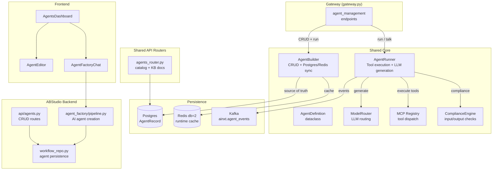
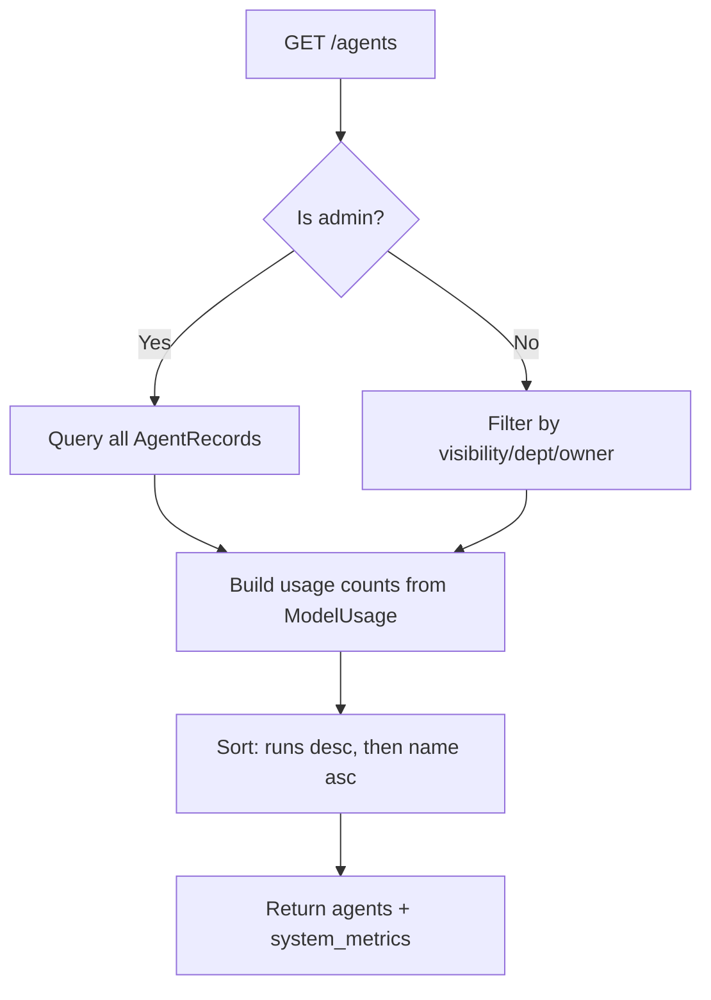
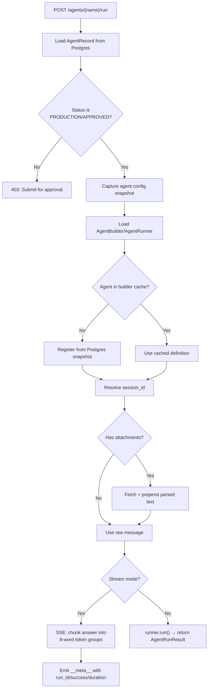
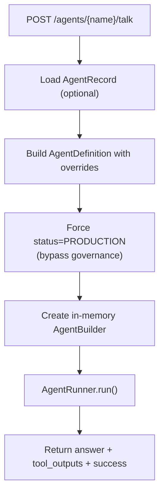
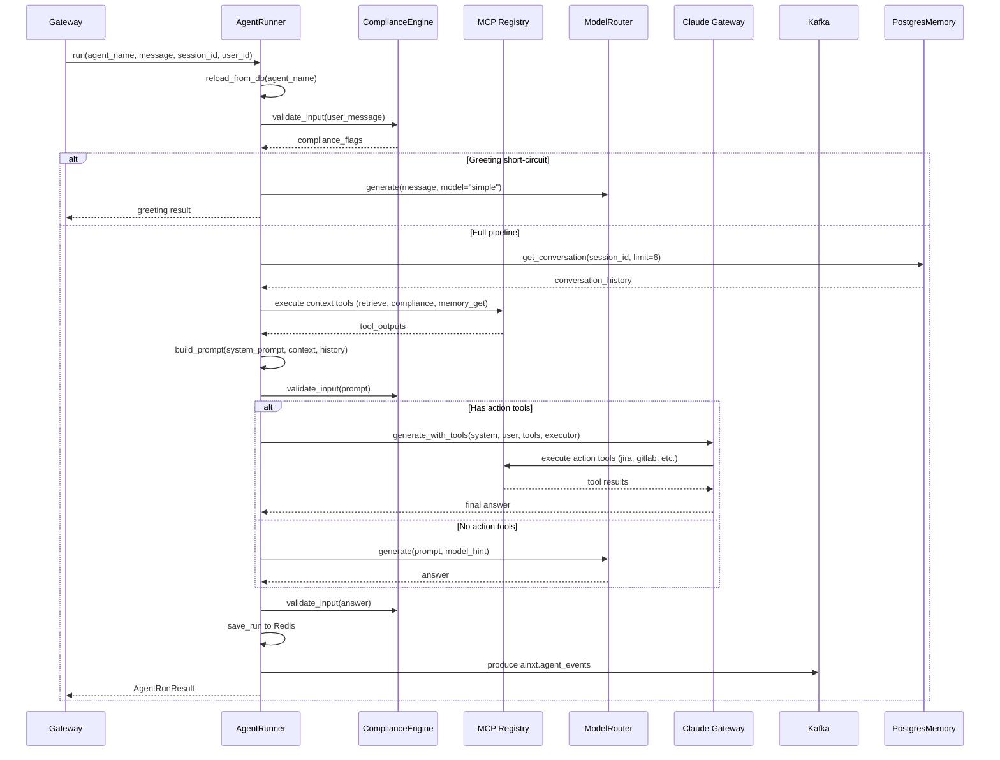
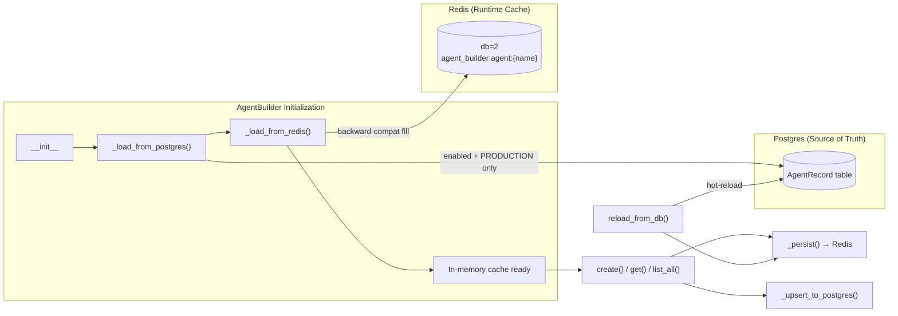
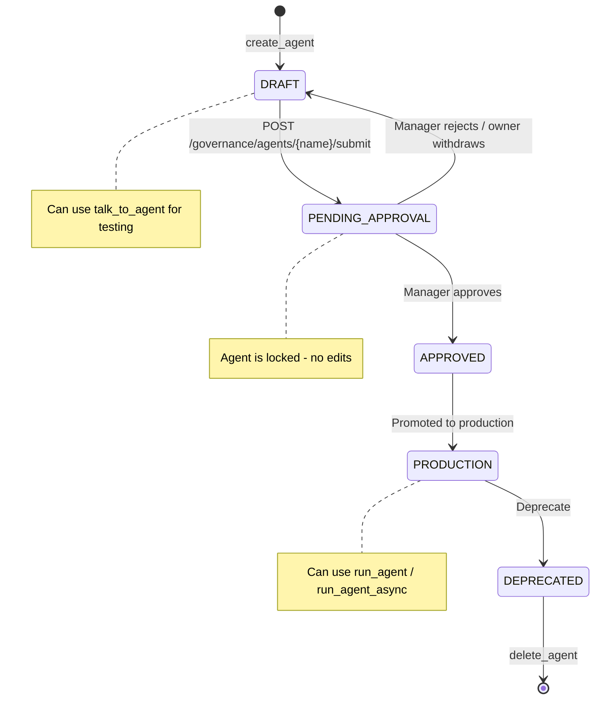
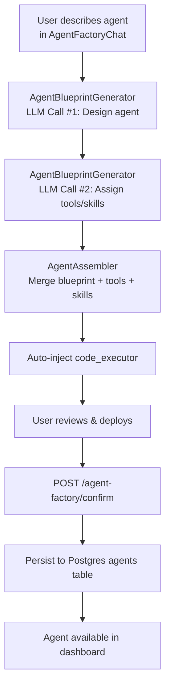
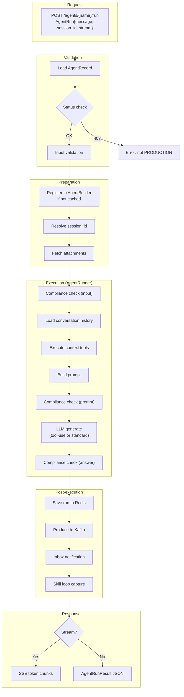

# Agent Management

## Overview

The **agent_management** module is a subsystem of the [gateway](../core/gateway.md) that provides the HTTP API surface for the full lifecycle of AI agents — creation, retrieval, listing, updating, deletion, enable/disable toggling, and both synchronous and asynchronous execution. It also exposes a "talk-to-agent" endpoint for mid-build testing without requiring governance approval.

Agents are configurable AI entities backed by a system prompt, a set of MCP tools, optional skills, a preferred LLM model, and a knowledge-base namespace. The module bridges two persistence layers (Postgres as source of truth, Redis as runtime cache) and delegates actual execution to the shared-core `AgentBuilder` / `AgentRunner` framework.

---

## Architecture

### Module Boundaries

The agent_management module in the gateway is the **primary API** for the platform's agent system. It coexists with two other agent-related surfaces:

| Surface | Location | Purpose |
|---|---|---|
| **Gateway agent_management** (this module) | `gateway.py` | Platform-wide agent CRUD + execution for all clients (web, CLI, API) |
| **ABStudio agent CRUD** | `ABStudio/backend/app/api/agents.py` | Build-studio-specific agent management with audit events, trigger cleanup, and chat-thread management |
| **Shared API agents_router** | `routers/agents_router.py` | Agent catalog browsing, favorites, and KB document attachment |

---

## Core Components

### Data Models

#### `AgentCreate`

Pydantic model for creating and updating agents.

| Field | Type | Default | Description |
|---|---|---|---|
| `name` | `str` | — | Unique agent name |
| `description` | `str` | — | Human-readable summary |
| `system_prompt` | `str` | — | System-level instruction injected before every run |
| `tools` | `List[str]` | `[]` | Ordered list of MCP tool names |
| `skills` | `List[str]` | `[]` | Ordered list of skill names |
| `workflows` | `List[str]` | `[]` | Workflow names to chain (future) |
| `tags` | `List[str]` | `[]` | Discovery tags |
| `version` | `str` | `"1.0.0"` | Semver string |
| `author` | `str` | `"platform"` | Creator identifier |
| `visibility` | `str` | `"private"` | `"private"` or `"public"` |
| `department` | `str` | `""` | Department scoping for private agents |
| `kb_namespace` | `Optional[str]` | `None` | KB scope (e.g. `"docs_kb:hr"`) |
| `preferred_model` | `Optional[str]` | `None` | `"auto"`, `"claude"`, `"gpt"`, `"ollama"` |

#### `AgentRun`

Model for executing an agent.

| Field | Type | Default | Description |
|---|---|---|---|
| `message` | `str` | — | User message to send to the agent |
| `session_id` | `Optional[str]` | `None` | Stable session for conversation history |
| `stream` | `bool` | `False` | If `True`, returns SSE token stream |
| `attachment_ids` | `Optional[List[str]]` | `None` | Chat attachment IDs to prepend as context |

#### `AgentTalk`

Model for mid-build testing without governance approval.

| Field | Type | Default | Description |
|---|---|---|---|
| `message` | `str` | — | User message |
| `system_prompt` | `Optional[str]` | `None` | Override system prompt for testing |
| `tools` | `Optional[List[str]]` | `None` | Override tool list |
| `skills` | `Optional[List[str]]` | `None` | Override skill list |
| `kb_namespace` | `Optional[str]` | `None` | Override KB namespace |
| `preferred_model` | `Optional[str]` | `None` | Override model preference |

---

### CRUD Endpoints

#### `list_agents`

Returns all agents visible to the requesting user with per-agent usage statistics (total runs, total cost). Non-admin users see only:
- Agents they created
- Legacy agents (no creator/visibility)
- Public agents with `APPROVED` or `PRODUCTION` status
- Private agents in their department

Also returns `system_metrics` for virtual aggregators (`orchestrator`, `ide_direct`) that are call-path aggregators, not named agents.

#### `create_agent`

Validates and sanitizes input via `validate_agent_request`, checks for name uniqueness, creates an `AgentRecord` with status `DRAFT` and `enabled=True`, and returns the new agent dict.

#### `get_agent`

Retrieves a single agent by name. Returns 404 if not found.

#### `update_agent`

Validates input, updates all mutable fields on the existing `AgentRecord`, and returns the updated agent. Supports partial updates to `kb_namespace` and `preferred_model`.

#### `delete_agent`

Hard-deletes the agent record by name. Returns 404 if not found.

#### `enable_agent` / `disable_agent`

Toggles the `enabled` flag on the agent record. Disabled agents refuse to run at execution time.

#### `_pg_agents`

Internal helper that returns all `AgentRecord` rows ordered by name from Postgres.

---

### Execution Endpoints

#### `run_agent`

**Key behaviors:**
- **Governance gate**: Only `PRODUCTION` or `APPROVED` agents can run. Others get a 403 with guidance to submit via governance.
- **Builder registration**: If the `AgentBuilder` (Redis-backed) doesn't know about the agent, it's registered from the Postgres snapshot so the runner can execute it.
- **Stable sessions**: Session ID is resolved as `body.session_id` → `agent_{name}_{caller_uid}` → ephemeral. This ensures conversation history accumulates across turns.
- **Attachment handling**: Parsed text from `ChatAttachment` records is prepended to the message (up to 10,000 chars per file).
- **SSE streaming**: When `stream=True`, the answer is chunked into 8-word groups and emitted as SSE events, followed by a `__meta__` frame with run metadata.

#### `run_agent_async`

Enqueues an agent run as a non-blocking job via `enqueue_agent_job`. Returns immediately with a `job_id` and poll URL. Useful for long-running agents (research, multi-tool) that would otherwise hold the HTTP connection open.

**Prerequisites:** Same governance gate as `run_agent` — only `PRODUCTION`/`APPROVED` agents can run async.

#### `talk_to_agent`

Allows testing an agent mid-build without requiring `PRODUCTION` status. Accepts optional overrides for `system_prompt`, `tools`, `skills`, `kb_namespace`, and `preferred_model` so the builder can preview changes before saving. If no Postgres record exists, it runs with the provided overrides against a draft definition.

---

## Agent Execution Pipeline

The `AgentRunner` (in [shared_core](../core/shared_core.md)) drives the full execution pipeline when `run_agent` or `talk_to_agent` is called:

### Execution Steps

1. **DB Refresh**: Reloads the agent definition from Postgres so prompt/model changes take effect immediately without a server restart.
2. **Input Compliance**: Checks user message for PAN, CVV, secrets, and other PCI-sensitive data.
3. **Greeting Short-Circuit**: Bare greetings ("hi", "hello") return a lightweight response without running tools or loading history.
4. **Conversation History**: Loads last 3 turns (6 messages) from `PostgresMemory` for context continuity.
5. **Context Tool Execution**: Pre-LLM execution of context-gathering tools (`retrieve`, `compliance`, `memory_get`, `memory_recall`). Action tools (jira, gitlab, etc.) are deferred to the LLM tool-use loop.
6. **Skill Execution**: Loads and executes skills from the `SkillRecord` DB table. Behavioral skills inject SOP text into the system prompt; execution skills run Python `run(input)` functions.
7. **Prompt Assembly**: Combines system prompt, behavioral instructions, conversation history, context, and user request.
8. **Prompt Compliance**: Compliance check on the assembled prompt.
9. **LLM Generation**: Routes to either Claude's tool-use API (when action tools are present) or the standard `ModelRouter` (for text-only agents). Supports up to 10 tool-use iterations.
10. **Answer Compliance**: Final compliance check on the LLM answer. Blocked answers are replaced with a compliance violation message.
11. **Persistence**: Run record saved to Redis; conversation turn + usage metrics produced to Kafka for Postgres persistence.
12. **Inbox Notification**: Publishes agent completion/failure to the inbox via Redis pub/sub.

### Timeout Protection

Agent runs are executed inside a `ThreadPoolExecutor` with a **120-second wall-clock timeout**. If exceeded, a `TimeoutError` result is returned with the error message.

---

## Agent Builder Architecture

The `AgentBuilder` (in [shared_core](../core/shared_core.md)) manages the agent definition lifecycle:

**Key design decisions:**
- **Postgres is the source of truth**: All agent definitions are loaded from Postgres first. Redis is a fast runtime cache populated *from* Postgres, never the other way around.
- **Hot-reload**: `reload_from_db()` can be called to refresh a single agent or all agents from Postgres without a server restart. This is called automatically before each agent run.
- **Bootstrap seeding**: Five platform agents (`question_answerer`, `bug_fixer`, `code_generator`, `code_reviewer`, `incident_responder`) are seeded on first boot with `_pg_on_conflict='ignore'` to preserve admin customizations.
- **Governance lifecycle**: Agents transition through `DRAFT → PENDING_APPROVAL → APPROVED → PRODUCTION → DEPRECATED`. Only `PRODUCTION` agents are loaded into the builder cache and can run.

---

## Governance Lifecycle

- **DRAFT**: Newly created agents. Can be tested via `talk_to_agent` but cannot run via `run_agent`.
- **PENDING_APPROVAL**: Submitted for governance review. The agent is locked — no edits allowed. The owner can withdraw back to DRAFT.
- **APPROVED**: Approved by a manager. Can be promoted to PRODUCTION.
- **PRODUCTION**: Live and runnable. Loaded into the `AgentBuilder` cache at startup.
- **DEPRECATED**: Retired but not deleted. Not loaded into the builder cache.

See [governance](../sdlc/governance.md) for the full governance workflow documentation.

---

## Dependencies

```mermaid
graph TD
    AM["agent_management"]

    AM -->|"CRUD + execution"| SC_AB["shared_core: AgentBuilder, AgentRunner, AgentDefinition"]
    AM -->|"DB access"| SC_DB["shared_core: db/models.py AgentRecord"]
    AM -->|"DB access"| SC_DB2["shared_core: db/models.py ModelUsage"]
    AM -->|"DB access"| SC_DB3["shared_core: db/models.py ChatAttachment"]
    AM -->|"compliance"| SC_CE["shared_core: ComplianceEngine"]
    AM -->|"LLM routing"| SC_MR["shared_core: ModelRouter"]
    AM -->|"tool dispatch"| SC_MCP["shared_core: MCP Registry"]
    AM -->|"memory"| SC_MEM["shared_core: PostgresMemory, RedisMemory"]
    AM -->|"job queue"| SC_JQ["shared_core: core/job_queue.py"]
    AM -->|"auth"| SC_AUTH["shared_core: auth/rbac.py"]
    AM -->|"validation"| SC_VAL["shared_core: validate_agent_request"]

    AM -.->|"parallel surface"| ABS["ABStudio: api/agents.py"]
    AM -.->|"parallel surface"| SAR["shared_api_routers: agents_router.py"]
    AM -.->|"AI creation"| AF["ABStudio: agent_factory/pipeline.py"]
    AM -.->|"UI"| FE["ABStudio frontend: agents_feature"]
```

### Internal Dependencies

| Dependency | Purpose |
|---|---|
| `db.database.SessionLocal` | Postgres session factory |
| `db.models.AgentRecord` | Agent persistence model |
| `db.models.ModelUsage` | Usage statistics aggregation |
| `db.models.ChatAttachment` | File attachment text extraction |
| `agents.agent_builder.AgentBuilder` | Agent definition CRUD + cache |
| `agents.agent_builder.AgentRunner` | Agent execution engine |
| `agents.agent_builder.AgentDefinition` | Agent definition dataclass |
| `auth.rbac.is_admin` | Admin visibility check |
| `core.job_queue.enqueue_agent_job` | Async job enqueuing |
| `validate_agent_request` | Input validation/sanitization |

### Related Modules

| Module | Relationship |
|---|---|
| [shared_core](../core/shared_core.md) | Provides `AgentBuilder`, `AgentRunner`, `AgentDefinition`, compliance, model routing, and MCP tool registry |
| ABStudio backend | Provides a parallel agent CRUD surface (`api/agents.py`) with audit events, trigger cleanup, and the AI-powered `agent_factory/pipeline.py` |
| [shared_api_routers](../core/shared_api_routers.md) | Provides `agents_router.py` for agent catalog browsing, favorites, and KB document attachment |
| [governance](../sdlc/governance.md) | Manages the agent approval lifecycle (DRAFT → PRODUCTION) |
| [chat_and_messaging](../chat/chat_and_messaging.md) | Shares the `_save_chat_messages` persistence pattern and Kafka event production |

---

## ABStudio Agent Factory

The ABStudio backend provides an AI-powered agent creation pipeline that complements the gateway's manual CRUD endpoints. See [agent_factory_pipeline](agent_factory_pipeline.md) for full details.

The factory uses a two-step LLM approach:
1. **Blueprint generation**: Designs the agent (name, description, system_prompt, guardrails) without the tool catalog in the prompt for fast generation.
2. **Tool/skill assignment**: A separate LLM call assigns tools and skills from the full catalog, grouped by service, for focused and reliable matching.

---

## Frontend Integration

The ABStudio frontend provides three key components for agent management:

| Component | File | Purpose |
|---|---|---|
| `AgentsDashboard` | `features/agents/AgentsDashboard.jsx` | Agent listing, template browsing, create/duplicate/delete actions, governance status tracking |
| `AgentEditor` | `features/agents/AgentEditor.jsx` | Full agent configuration editor with autosave, preview chat, attachment handling, and thread management |
| `AgentFactoryChat` | `features/agents/AgentFactoryChat.jsx` | Conversational AI agent builder with plan cards, tool/skill picker, and deploy flow |

### AgentEditor Features

- **Dual-mode**: Edit mode (configuration form) and Preview mode (live chat with the agent)
- **Autosave**: Debounced 0ms autosave on every field change with `beforeunload` flush
- **Draft durability**: Eager-creates the agent row on editor open so reloads don't lose data
- **Name uniqueness**: Validates against both agents and workflows (global uniqueness)
- **Model picker**: Dynamic model catalog with per-model max-token caps
- **Tool/skill pickers**: `CatalogPicker` for attaching tools and skills from the catalog
- **Knowledge section**: KB scope configuration (none, existing KB, or add KB)
- **Guardrails**: Max turns, max tool rounds, off-topic refusal, content restrictions
- **Subagent delegation**: Toggle for `spawn_swarm` tool injection
- **Preview chat**: SSE streaming with subagent delegation pills, file attachments, thread history
- **Governance integration**: `StatusBadge` and `SubmitApprovalButton` for approval workflow

---

## Data Flow: Agent Run

---

## API Reference Summary

| Method | Endpoint | Handler | Description |
|---|---|---|---|
| `GET` | `/agents` | `list_agents` | List all visible agents with usage stats |
| `POST` | `/agents` | `create_agent` | Create a new agent (DRAFT status) |
| `GET` | `/agents/{name}` | `get_agent` | Get a single agent by name |
| `PUT` | `/agents/{name}` | `update_agent` | Update an existing agent |
| `DELETE` | `/agents/{name}` | `delete_agent` | Delete an agent |
| `POST` | `/agents/{name}/enable` | `enable_agent` | Enable an agent |
| `POST` | `/agents/{name}/disable` | `disable_agent` | Disable an agent |
| `POST` | `/agents/{name}/run` | `run_agent` | Run an agent (sync or SSE stream) |
| `POST` | `/agents/{name}/run-async` | `run_agent_async` | Enqueue an async agent run |
| `POST` | `/agents/{name}/talk` | `talk_to_agent` | Test an agent mid-build (no governance) |

All endpoints require authentication via `_require_auth` dependency.
