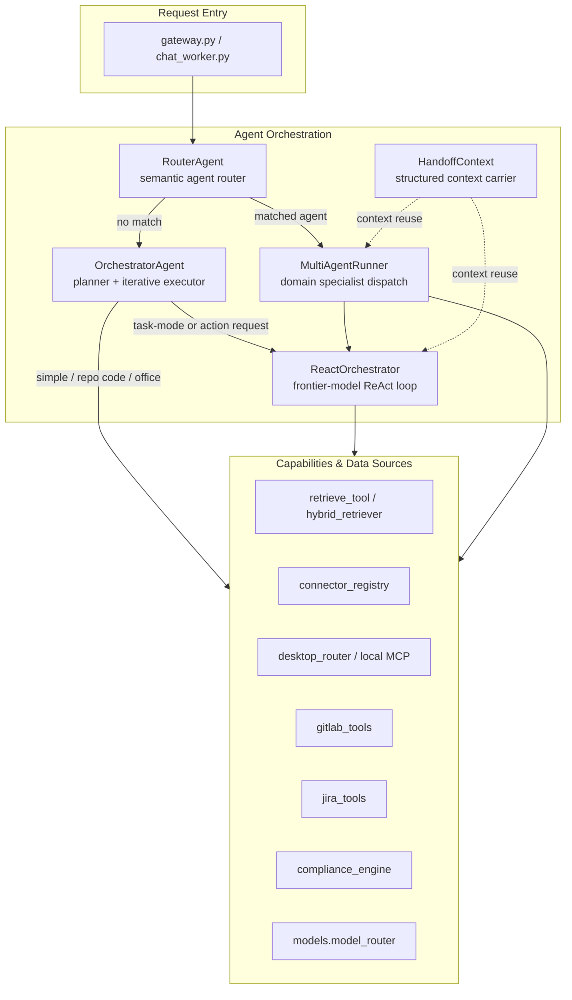
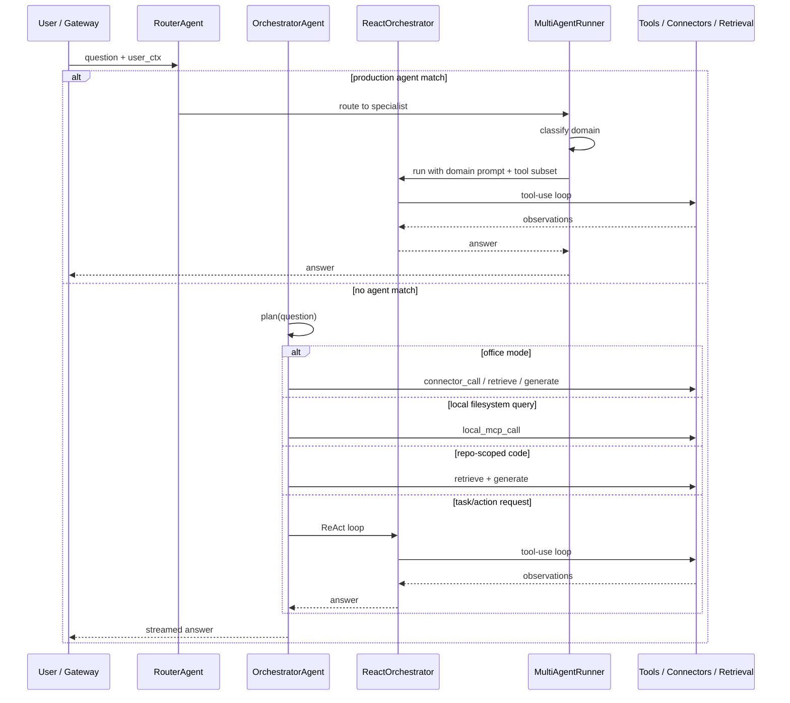
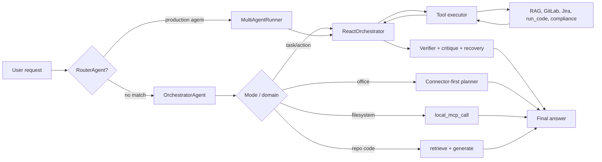

# Agent Orchestration Module

## Overview

The `agent_orchestration` module is the central coordination layer of the NPCI AiNxt agentic engineering platform. It is responsible for receiving a user request, deciding how to fulfill it, invoking the right retrieval and tool-execution paths, and producing a streamed or batched response. The module sits between the gateway/frontend entry points and the lower-level tool, retrieval, compliance, and model-routing subsystems.

At a high level, the module provides four complementary execution styles:

1. **Planner-based orchestration** (`OrchestratorAgent`) — decomposes a request into a short plan (retrieve, connector call, local MCP call, generate) and executes it iteratively.
2. **ReAct tool-use loop** (`ReactOrchestrator`) — lets a frontier model decide which tools to call, observes the results, and iterates until the goal is achieved or a round limit is reached.
3. **Domain-specialist multi-agent routing** (`MultiAgentRunner` + `RouterAgent`) — classifies the request by domain and dispatches it to a specialist agent with a tailored system prompt and tool subset.
4. **Structured handoff** (`HandoffContext`) — carries state between agents so delegated work does not have to re-retrieve context.

The module is intentionally layered: simple or general questions take a fast `generate` path, repo-scoped code questions use deterministic retrieval, office/Cowork questions prefer connector-backed tools, and action-oriented tasks fall through to the ReAct loop.

## Architecture

### Component Interaction

## Sub-modules

| Sub-module | File(s) | Responsibility | Documentation |
|------------|---------|----------------|---------------|
| Core Orchestration | `agents/orchestrator.py` | Planner, iterative executor, routing guard, compliance gating, streaming generation | agent_orchestration_core |
| ReAct Orchestration | `agents/react_orchestrator.py` | Frontier-model ReAct loop, tool schemas, verifier/critique/recovery, confidence scoring | agent_orchestration_react |
| Multi-Agent Routing | `agents/multi_agent_runner.py`, `agents/router_agent.py` | Domain classification, specialist dispatch, semantic agent routing | agent_orchestration_multi_agent |
| Agent Handoff | `agents/handoff.py` | Structured context carrier for agent-to-agent delegation | agent_orchestration_handoff |

## High-Level Data Flow

## Key Design Decisions

- **Connectors-first for office mode**: Work-system vocabulary ("my open MRs", "tickets assigned to me") is routed to connector-backed tools before any local filesystem or generic retrieval path. This prevents common verbs like `show` or `find` from being misclassified as file operations.
- **Deterministic fast paths**: Repo-scoped code questions and local filesystem questions skip LLM planning when the intent is unambiguous, reducing latency and cost.
- **Risk-aware depth**: The ReAct loop and verifier use a query-risk classifier (`HIGH`, `MEDIUM`, `LOW`) to decide how many verification/recovery iterations to run and what confidence threshold is required before answering.
- **Provider fallback**: The ReAct loop tries Claude, then OpenAI, then Gemini so that a single provider outage does not break action-mode requests.
- **Compliance at boundaries**: User input is scanned before planning, and generated output is monitored during streaming. Retrieved code chunks are not re-scanned to avoid false positives from legitimate source patterns.
- **Memory extraction**: Successful runs extract tool sequences and design patterns into semantic memory so that similar future queries can benefit from prior experience.

## Integration Points

| External module | How it is used |
|-----------------|----------------|
| [model_routing](../llm/model_routing.md) | `models.model_router` and `models.classifier` select the model tier and classify query complexity/domain. |
| [core_infrastructure](../core/core_infrastructure.md) | `core.logger`, `core.telemetry`, `core.config`, `core.evals`, and `core.context_compressor` provide logging, tracing, evaluation, and context compression. |
| [shared_integrations](../skills/shared_integrations.md) | `connectors.registry`, `connectors.engine`, and `tools.gitlab_tools` / `tools.jira_tools` execute connector and GitLab/Jira calls. |
| [memory_system](../storage/memory_system.md) | `memory.postgres_memory` stores tool sequences and retrieves hints for future runs. |
| [advanced_reasoning](../llm/advanced_reasoning.md) | `TreeOfThoughts`, `SelfConsistency`, and `ChainOfVerification` are invoked for high-risk or low-confidence runs. |
| recovery_engine | `agents.recovery_engine` records reversible write actions and loads ReAct checkpoints. |
| compliance_engine | `agents.compliance_engine` scans user input and tool results for PCI/PII violations. |

## Operational Notes

- The module is stateless across requests; per-run state is held in `AgentState` and `HandoffContext`.
- Streaming responses are produced by `OrchestratorAgent.run()` as a Python generator; the gateway consumes the generator and forwards SSE chunks to clients.
- ReAct runs are internally non-streaming because frontier-model tool-use APIs return complete tool-call blocks; the orchestrator yields the final answer in chunks for SSE compatibility.
- Environment flags that affect behavior:
  - `ADAPTIVE_LOOP_DEPTH` (default `true`) — derives the iteration ceiling from task complexity.
  - `ADVANCED_REASONING_ENABLED` (default `false`) — enables Tree-of-Thoughts / Self-Consistency / Chain-of-Verification paths.
