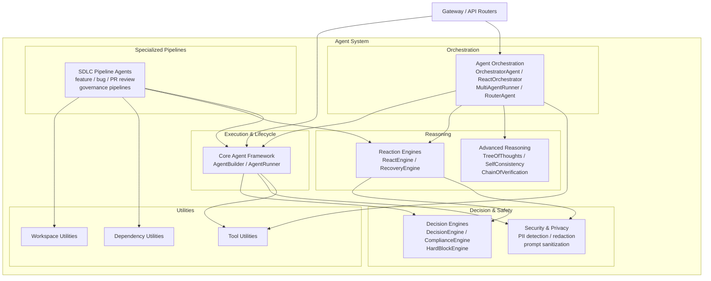
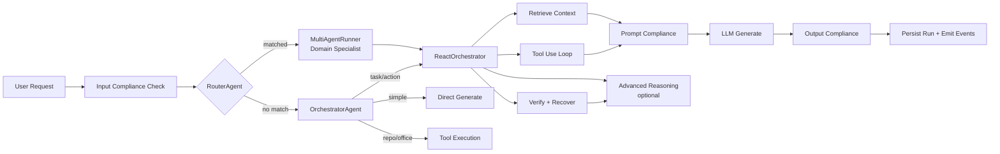

# Agent System Module Overview

## Purpose

The `agent_system` module is the shared core agentic framework of the AiNxt platform. It provides the foundational runtime, orchestration, reasoning, and safety primitives needed to build, deploy, and execute autonomous AI agents across the platform. The module abstracts agent lifecycle management (definition, persistence, execution), multi-step reasoning loops, multi-agent coordination, compliance enforcement, and specialized SDLC automation into a cohesive, reusable layer consumed by gateways, routers, workers, and frontend features.

At its heart, `agent_system` enables:

- **Agent definition and execution** — create reusable agents with system prompts, tools, skills, and governance status, then run them with compliance-checked inputs/outputs.
- **Autonomous reasoning** — ReAct-style iterative loops, recovery, and advanced strategies (Tree-of-Thoughts, Self-Consistency, Chain-of-Verification).
- **Multi-agent orchestration** — planner-based execution, frontier-model tool-use loops, domain routing, and structured handoffs.
- **Safety and governance** — PCI/PII detection and redaction, hard-block guardrails, prompt sanitization, and prompt-injection scanning.
- **SDLC automation** — end-to-end software delivery pipelines from Jira intake through code generation, review, governance, and merge-request creation.

## Architecture

The module is organized as a layered stack where higher-level orchestrators compose lower-level engines and utilities.

### Request Flow

A typical request enters through the gateway, is classified, optionally routed to a specialist agent, and then executed through a compliance-guarded reasoning loop.

## Core Components

| Component | Responsibility | Documentation |
|-----------|---------------|---------------|
| **Core Agent Framework** | Agent CRUD, persistence, and execution pipeline with compliance checkpoints and tool-use loops. | [core_agent_framework](core_agent_framework.md) |
| **Agent Orchestration** | Planner-based execution, ReAct loops, domain-specialist routing, and agent-to-agent handoffs. | [agent_orchestration](agent_orchestration.md) |
| **Reaction Engines** | Iterative retrieval-augmented ReAct reasoning and session recovery with undo stacks. | [reaction_engines](../llm/reaction_engines.md) |
| **Advanced Reasoning** | Tree-of-Thoughts, Self-Consistency, and Chain-of-Verification strategies. | [advanced_reasoning](../llm/advanced_reasoning.md) |
| **Decision Engines** | LLM-based routing, compliance validation, and deterministic hard-block guardrails. | [decision_engines](../security/decision_engines.md) |
| **Security & Privacy** | PCI/PII detection, redaction, prompt sanitization, and injection scanning. | [security_privacy](../security/security_privacy.md) |
| **SDLC Pipeline Agents** | Autonomous software delivery pipelines for features, bugs, PR reviews, and governance. | [sdlc_pipeline_agents](../sdlc/sdlc_pipeline_agents.md) |
| **Tool Utilities** | Low-level stateful tools for retrieval, compliance, local-LLM toggle, and answer generation. | [tool_utilities](../skills/tool_utilities.md) |
| **Dependency Utilities** | Multi-repo dependency resolution from manifests and build files. | [dependency_utilities](../core/dependency_utilities.md) |
| **Workspace Utilities** | Multi-repo workspace assembly and sandboxed dependency installation. | [workspace_utilities](../ui/workspace_utilities.md) |

## Integration

The `agent_system` module sits between the platform's API/gateway layer and its underlying infrastructure (model routing, memory, MCP registry, connectors, sandbox). It is consumed by:

- `gateway.py` and shared API routers for agent run endpoints.
- `workers/agent_worker.py` and `workers/chat_worker.py` for asynchronous job execution.
- The SDLC worker layer for autonomous coding pipelines.
- The MCP registry, which exposes agent invocation as a callable tool.

All components share the platform's logging, telemetry, model routing, and compliance infrastructure to ensure consistent behavior, observability, and safety across every agent execution.