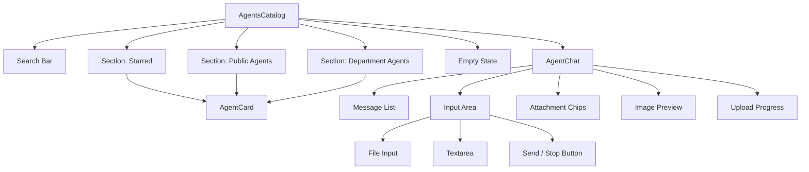
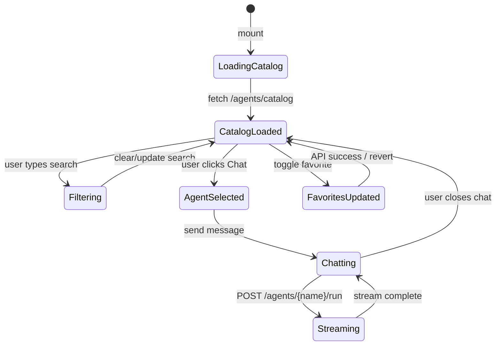
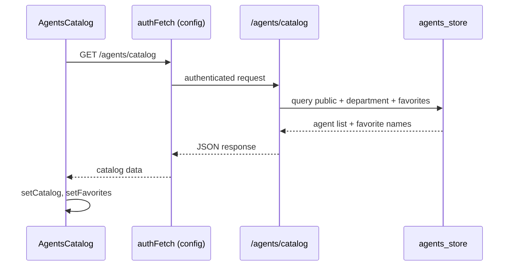
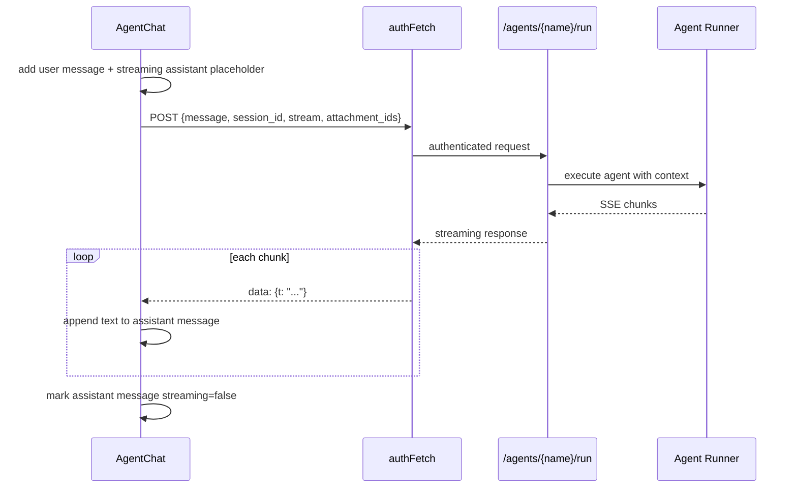
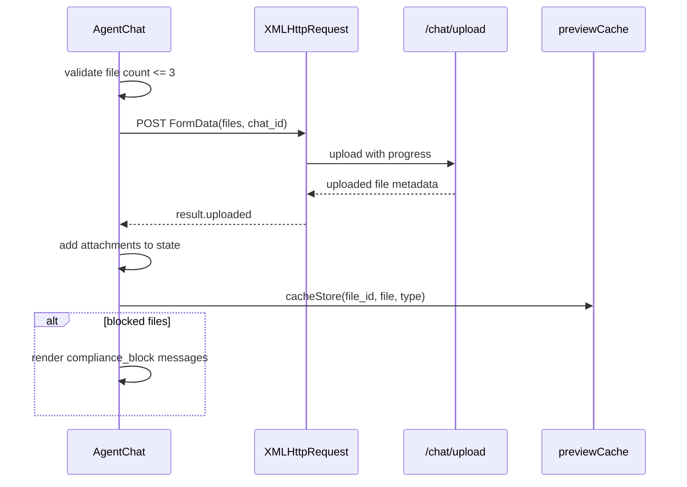

# Agents Catalog Module

The **Agents Catalog** module is the consumer-facing React component that lets end users browse, favorite, and chat with published agents. It is part of the `ai_ui_frontend` application and lives at `ai-ui/src/components/AgentsCatalog.jsx`.

## Purpose and Core Functionality

`AgentsCatalog` provides a self-service storefront for agents that are available to the current user. It surfaces:

- **Public agents** (`visibility=public`) that any authenticated user can access.
- **Department-restricted agents** scoped to the user's department.
- **Favorited agents**, rendered in a dedicated horizontal "Starred" section for quick access.
- **Inline agent chat**: clicking an agent opens a focused chat panel scoped to that agent, with support for text messages, file attachments, image paste/drop, and streaming responses.

The module is intentionally lightweight on business logic. It delegates agent execution, file uploads, and favorite persistence to backend API endpoints exposed by the shared API layer and the ABStudio backend.

## Core Components

| Component | Responsibility |
|-----------|----------------|
| `AgentsCatalog` | Main container. Loads the catalog, manages search/filter state, favorites, and the selected-agent view. |
| `AgentCard` | Renders a single agent tile with name, status badge, visibility icon, description, and a "Chat" action. |
| `Section` | Renders a titled group of agents (Starred, Public, Department). Supports horizontal scrolling for starred items. |
| `AgentChat` | Inline chat UI for the selected agent. Handles message history, streaming responses, attachments, image paste/drop, and upload cancellation. |
| `toggleFavorite` | Optimistically updates the local favorites set and persists the change via the backend favorite API. |
| `stopGeneration` | Aborts an in-flight streaming agent run. |
| `cancelUpload` | Aborts an in-progress file upload and resets progress state. |

## Architecture

### Component Hierarchy

### State Flow

## Data Flow

### Catalog Loading

### Running an Agent

### File Upload Flow

## Dependencies

### UI Components and Hooks

| Dependency | Module | Purpose |
|------------|--------|---------|
| `mdComponents` | [message](../chat/message.md) | Markdown rendering components for assistant messages. |
| `authFetch`, `API_BASE` | [config](../core/config.md) | Authenticated HTTP client and backend base URL. |
| `useFileDrop` | [hooks](../ui/hooks.md) | Drag-and-drop file handling. |
| `useToast` | [ui_dialog](../ui/ui_dialog.md) | Toast notifications. |
| `AiNxtSpinner` | [spinner](../ui/spinner.md) | Loading indicator during streaming. |
| `cacheStore` | [ai_ui_frontend_utils](../ui/ai_ui_frontend_utils.md) | Caches uploaded files for preview/download. |

### Backend API Endpoints

| Endpoint | Backend Module | Purpose |
|----------|----------------|---------|
| `GET /agents/catalog` | [agents_router](agents_router.md) | Returns public, department, and favorite agents. |
| `POST/DELETE /agents/{name}/favorite` | [agents_router](agents_router.md) | Adds or removes an agent from favorites. |
| `POST /agents/{name}/run` | [gateway](../core/gateway.md) / [agent_management](../core/gateway.md#agent-management) | Executes the selected agent with streaming output. |
| `POST /chat/upload` | [chat_router](../chat/chat_router.md) | Uploads chat attachments with compliance scanning. |

## How It Fits into the System

`AgentsCatalog` sits at the boundary between end users and the agent runtime. It is one of the primary entry points for agent consumption in the `ai_ui_frontend` application, alongside modules such as [chat](../chat/chat.md) and [kb_chat](../knowledge/kb_chat.md).

The module relies on the backend's agent governance and visibility model:

- Only agents with appropriate status (`APPROVED`, `PRODUCTION`, etc.) and visibility rules are returned by `/agents/catalog`.
- Department-restricted agents are filtered server-side based on the authenticated user's department.
- Favorites are persisted per user and returned as part of the catalog payload.

When a user starts a chat, `AgentChat` reuses the same streaming infrastructure as the general chat interface but scopes the session to a specific agent via `/agents/{name}/run`. File uploads are handled by the shared chat upload endpoint, which performs compliance scanning and may block sensitive files.

## Key Behaviors

- **Optimistic favorites**: The star icon updates immediately; the API call is made afterward, and the change is reverted on failure.
- **File limits**: A maximum of three attachments can be added at once. Exceeding this shows a dismissible error banner.
- **Upload cancellation**: In-progress uploads use `XMLHttpRequest` so they can be aborted without cancelling the chat session.
- **Image handling**: Users can paste or drop images; images are shown as a preview and sent alongside the message.
- **Streaming responses**: Assistant messages stream token-by-token using Server-Sent Events over `fetch` with `resp.body.getReader()`.
- **Compliance blocks**: Files blocked by policy are rendered as red compliance cards listing detected sensitive data categories.

## References

- [message](../chat/message.md) — message rendering primitives.
- [config](../core/config.md) — API base URL and authenticated fetch helper.
- [hooks](../ui/hooks.md) — drag-and-drop hook used by the chat input.
- [ui_dialog](../ui/ui_dialog.md) — toast provider.
- [spinner](../ui/spinner.md) — loading spinner component.
- [ai_ui_frontend_utils](../ui/ai_ui_frontend_utils.md) — preview cache utilities.
- [agents_router](agents_router.md) — backend router for catalog and favorites.
- [chat_router](../chat/chat_router.md) — backend router for chat file uploads.
- [gateway](../core/gateway.md) — gateway service that handles `/agents/{name}/run`.
