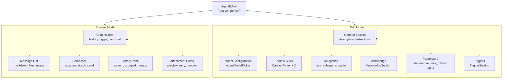
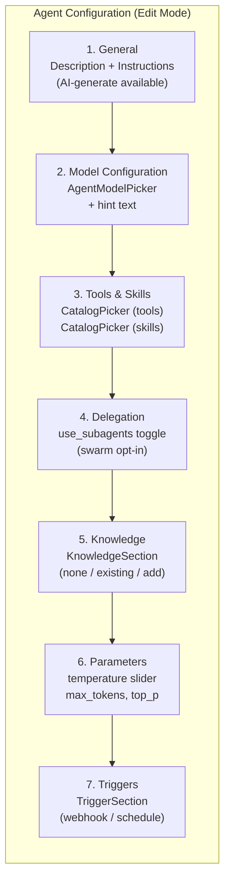
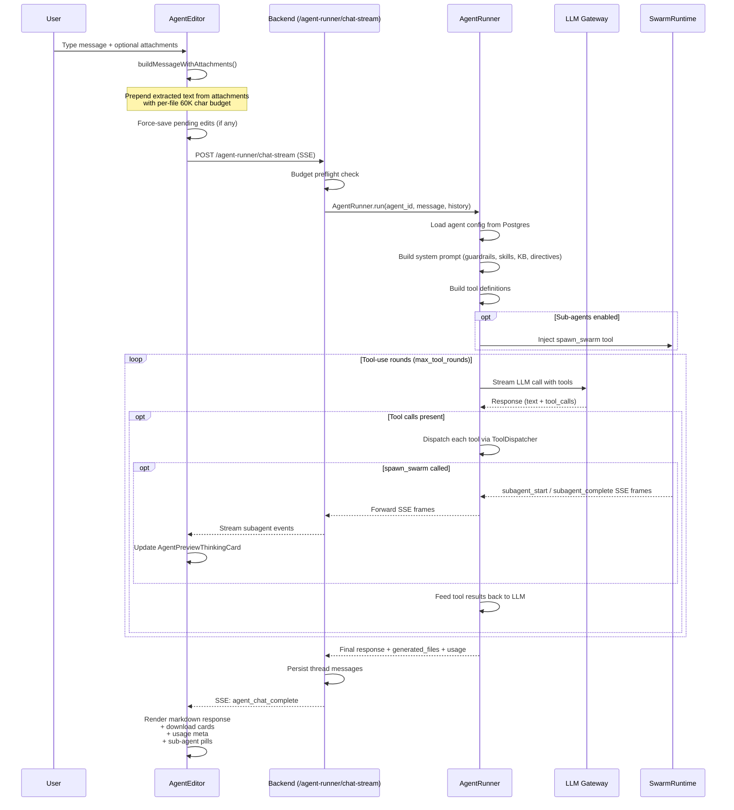
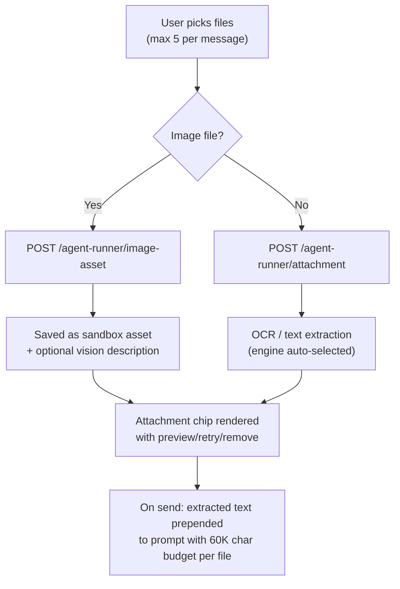
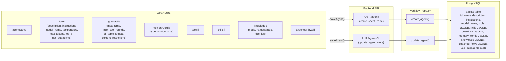
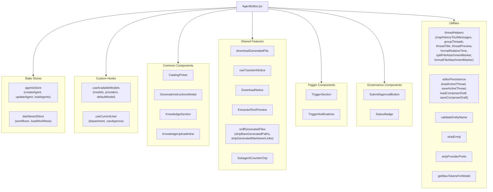

# Agent Editor (`agents_feature_editor`)

## 1. Introduction

The **Agent Editor** is the primary configuration and testing surface for AI agents in the ABStudio frontend. It is a single-file React component (`AgentEditor.jsx`) that provides a dual-mode interface:

- **Edit Mode** — a form-driven configuration panel where users define an agent's identity, model, tools, skills, knowledge base, guardrails, memory, delegation settings, and triggers.
- **Preview Mode** — a full chat interface that streams responses from the configured agent in real time, including live sub-agent (swarm) delegation indicators, file attachments, generated-file downloads, and conversation history management.

The editor auto-saves every field change to the backend with a zero-delay debounce, eagerly creates a database row for new agents so drafts survive reloads, and integrates with the governance approval workflow so agents can be submitted for departmental review without leaving the editor.

---

## 2. Architecture Overview

```mermaid
graph TB
    subgraph Frontend["ABStudio Frontend"]
        AE["AgentEditor.jsx"]
        AMP["AgentModelPicker"]
        APTC["AgentPreviewThinkingCard"]
        CP["CatalogPicker"]
        KS["KnowledgeSection"]
        TS["TriggerSection"]
        TN["TriggerNotifications"]
        SAB["SubmitApprovalButton"]
        SB["StatusBadge"]
        AS["agentsStore (Zustand)"]
        DS["dashboardStore"]
        UAM["useAvailableModels"]
        UCU["useCurrentUser"]
    end

    subgraph Backend["ABStudio Backend"]
        AA["api/agents.py<br/>CRUD routes"]
        AF["api/factories.py<br/>agent_runner_chat_stream"]
        AC["api/agent_chat.py<br/>thread management"]
        AD["api/documents.py<br/>attachment / image-asset"]
        WR["core/workflow_repo.py<br/>create_agent / update_agent"]
        AR["agent_factory/pipeline.py<br/>AgentRunner"]
        TD["ToolDispatcher"]
        SR["SwarmRuntime"]
    end

    subgraph DB["PostgreSQL"]
        AGT["agents table"]
        THR["agent chat threads"]
    end

    AE --> AMP
    AE --> APTC
    AE --> CP
    AE --> KS
    AE --> TS
    AE --> TN
    AE --> SAB
    AE --> SB
    AE --> AS
    AE --> DS
    AE --> UAM
    AE --> UCU

    AS -->|"POST /agents"| AA
    AS -->|"PUT /agents/:id"| AA
    AA --> WR
    WR --> AGT

    AE -->|"POST /agent-runner/chat-stream"| AF
    AF --> AR
    AR --> TD
    AR --> SR

    AE -->|"GET /agent-chat-threads/:id"| AC
    AE -->|"GET /agent-chat-history/:tid"| AC
    AE -->|"DELETE /agent-chat-threads/:tid"| AC
    AC --> THR

    AE -->|"POST /agent-runner/attachment"| AD
    AE -->|"POST /agent-runner/image-asset"| AD
```



### Module Position in the System

The Agent Editor sits within the `agents_feature` group of the ABStudio frontend, alongside the [Agents Dashboard](agents_feature_dashboard.md), [Agent Card](agents_feature_card.md), and [Agent Factory Chat](agents_feature_factory_chat.md). It is the deepest editing surface — the dashboard lists agents, the card provides quick actions, the factory chat builds agents from natural language, and the editor is where all fine-grained configuration and live testing happens.

---

## 3. Core Components

### 3.1 Component Hierarchy



### 3.2 `AgentEditor` — Root Component

The main exported component. It receives an `agent` prop (the agent being edited, or a blank template for new agents), an `onBack` callback, and optional `initialMode` / `onModeChange` for mode synchronization with the parent shell.

**Key state managed:**

| State | Purpose |
|---|---|
| `savedId` | The agent's database ID. `null` for brand-new agents until the first save completes. |
| `agentName` / `isEditingName` / `nameError` | Inline-editable agent name with real-time uniqueness validation against all agents AND workflows. |
| `form` | Core agent fields: `description`, `instructions`, `provider`, `model_name`, `temperature`, `max_tokens`, `top_p`, `use_subagents`. |
| `guardrails` | JSONB guardrail config: `max_turns`, `max_tool_rounds`, `off_topic_refusal`, `content_restrictions[]`. |
| `memoryConfig` | Memory strategy: `type` (sliding_window), `window_size`. |
| `tools` / `skills` | Arrays of attached catalog entries (each `{ name, description }`). |
| `knowledge` | KB attachment config: `{ mode, namespaces?, selected_doc_ids?, uploaded_doc_ids?, full_file_doc_ids? }`. |
| `attachedFlows` | Linked agents/workflows for chained execution (hidden from UI but persisted). |
| `messages` / `chatInput` / `chatLoading` | Preview-mode chat state. |
| `chatThreadId` / `chatThreads` | Conversation thread management. |
| `attachments` | Pending file attachments with extracted text. |
| `saveStatus` | `'saved'` / `'saving'` / `'unsaved'` — drives the status indicator. |

### 3.3 `AgentModelPicker` — In-Flow Model Selector

A custom dropdown that expands **downward in normal document flow** (no `position: absolute`, no React portal). This design choice ensures:

1. The Model Configuration card grows in height, pushing subsequent cards down — no overlap.
2. Ancestor `overflow: hidden` never clips the menu.
3. Width auto-tracks the trigger element.

**Model grouping logic:**
- If `providers` array is available (from `useAvailableModels`), models are grouped by provider label.
- Otherwise, falls back to a flat list from `models` or the current/default value.

The picker locks in the user's selection via `userPickedModelRef` so that subsequent re-renders of the models hook (which may momentarily return an empty list during catalog sync) never revert the choice.

### 3.4 `AgentPreviewThinkingCard` — Live Swarm Delegation Display

Rendered as the loading placeholder while the agent is processing. When sub-agent delegation is active, it shows:

- A live counter of active sub-agents (via `SubagentCounterChip`)
- A per-sub-agent timeline with status (`running` / `complete` / `failed`), duration, task preview, and error messages
- A skeleton animation for the pending response text

### 3.5 Supporting UI Components

| Component | Role |
|---|---|
| `UsageMeta` | Compact chips (model, in/out tokens, cost) shown under assistant replies. |
| `CodeBlock` | Multi-line code rendering with copy-to-clipboard. |
| `FileDownloadCard` | Download card for generated files (PPTX, DOCX, XLSX, PDF, etc.) with file-type icon and label. |
| `buildMarkdownComponents` | Factory that returns ReactMarkdown component overrides — inline code matching a generated filename becomes a `FileDownloadCard`; `/generated-files/` links are rewritten to download cards. |

---

## 4. Edit Mode — Configuration Surface

### 4.1 Configuration Sections



### 4.2 Auto-Save Architecture

Every field change triggers `scheduleAutoSave`, which:

1. Sets `saveStatus` to `'unsaved'`.
2. Clears any pending save timer.
3. Schedules `saveAgent` on the next microtask (`setTimeout(..., 0)`).

The zero-delay debounce ensures the React state batch commits before the save fires, preventing stale-form races (e.g., the "pick model → click Run" race that previously sent wrong-model swarm runs).

**Draft durability for new agents:**
- On mount, if no `agent.id` exists, the editor eagerly creates a database row via `POST /agents` using a non-colliding name.
- A module-level guard (`draftCreateInFlightRef`) ensures React StrictMode's double-mount fires only one POST.
- The `beforeunload` handler and unmount cleanup both flush any pending save.

### 4.3 Name Validation

Agent names are validated globally — they must not collide with any existing agent **or** workflow name. The validator is built from both the `agentsStore` and `dashboardStore` catalogs:

```javascript
const buildAgentNameValidatorOpts = () => ({
    existingItems: [
        ...(existingAgents || []).map(a => ({ id: a.id, name: a.name })),
        ...(existingWorkflows || []).map(w => ({ id: `wf:${w.id}`, name: w.name })),
    ],
    currentId: savedId || '',
});
```

Validation runs on every keystroke; invalid names are not autosaved (to avoid backend 400s).

### 4.4 Catalog Integration (Tools & Skills)

The `CatalogPicker` component (see [common_components](../ui/common_components.md)) fetches the tools or skills catalog from `/{kind}-catalog` and provides:

- **Chip strip** showing currently attached items with remove buttons.
- **Searchable dropdown** for adding catalog entries (multi-select with "Add selected" bulk action).
- **Inline generate form** for creating new tools/skills on the fly via `/{kind}-catalog/generate`.

### 4.5 Knowledge Base Attachment

The `KnowledgeSection` component (see [common_components](../ui/common_components.md)) supports three modes:

| Mode | Behavior |
|---|---|
| `KB_MODE_NONE` | No KB retrieval at runtime. |
| `KB_MODE_EXISTING` | Select one or more existing knowledge bases (namespaces). Per-KB document narrowing is available. Single-doc KBs auto-enable full-document retrieval. |
| `KB_MODE_ADD` | Upload new documents inline via `KnowledgeUploadInline`. Uploaded docs are immediately available. |

The editor also fetches KB document names to suppress duplicate download chips when the agent's response references a KB document by name.

---

## 5. Preview Mode — Chat Interface

### 5.1 Chat Send Flow



### 5.2 SSE Event Handling

The editor reads the SSE stream frame-by-frame, handling these event types:

| SSE Event | Action |
|---|---|
| `start` | Capture `thread_id` for persistence. |
| `subagent_start` | Add worker to live sub-agent map; update thinking card. |
| `subagent_complete` | Mark worker complete/failed with duration + preview; update thinking card. |
| `agent_chat_complete` | Set final response, generated files, delegation events, usage metadata. |
| `error` | Surface error message; restore attachments for retry. |

### 5.3 File Attachments



**Supported file types:** PDF, DOCX, PPTX, XLSX, CSV, HTML, RTF, TXT, JSON, MD, and images (PNG, JPG, JPEG, TIFF, BMP, WebP).

**Image vs. document routing:**
- Images are saved as sandbox assets the agent can reference by path (`/agent-runner/image-asset`).
- Documents go through text extraction (`/agent-runner/attachment`) with automatic engine selection (native text layer for born-digital, RapidOCR for scanned/image-only).

### 5.4 Conversation History

The editor manages chat threads with:

- **Thread list** loaded from `GET /agent-chat-threads/:agentId`, grouped by time period (Today, Yesterday, etc.) via `groupThreads`.
- **Thread messages** loaded from `GET /agent-chat-history/:threadId`, mapped to UI messages via `mapHistoryToUiMessages`.
- **Thread deletion** via `DELETE /agent-chat-threads/:threadId`.
- **Active thread persistence** via `editorPersistence` utilities (`saveActiveThread` / `loadActiveThread`).
- **Composer draft persistence** so unsent text survives reloads.
- **New thread creation** with client-generated IDs (`{agentId}:{timestamp}_{random}`) accepted by the backend on first send.

### 5.5 Response Rendering

Assistant messages are rendered with `ReactMarkdown` + `remarkGfm` (tables, strikethrough, task lists, autolinks). The `buildMarkdownComponents` factory:

- Rewrites inline code matching a generated filename to a `FileDownloadCard`.
- Rewrites `/generated-files/...` links to `FileDownloadCard` components.
- Strips generated-file markdown links from prose when a separate download chip strip is rendered below (preventing duplicate downloads).
- Strips emoji from the text before rendering.

Post-response actions include copy-to-clipboard, read-aloud (via `speechSynthesis`), and regenerate (re-sends the last user prompt after trimming the old turn).

---

## 6. Data Flow & Persistence

### 6.1 Agent Save Payload



### 6.2 Runtime Execution Path

When a chat message is sent in Preview Mode, the full execution chain is:

1. **Frontend** → `POST /agent-runner/chat-stream` with `{ agent_id, message, history, thread_id }`.
2. **Backend** (`agent_runner_chat_stream`) → Budget preflight → Load prior thread messages → Create `AgentRunner`.
3. **AgentRunner.run()** → Load agent config → Build system prompt (guardrails + skills + KB context + tool-priority directives) → Build tool definitions → Optionally inject `spawn_swarm`.
4. **Tool-use loop** (up to `max_tool_rounds`) → LLM call → Dispatch tools via `ToolDispatcher` → Feed results back.
5. **Completion** → Collect generated files → Run attached flows chain → Return `{ response, generated_files, delegation_events, usage }`.
6. **Backend** → Persist thread messages → Emit `agent_chat_complete` SSE frame.

For full details on the AgentRunner's system prompt construction, tool dispatch, swarm delegation, and CLI execution path, see the [agent_factory_pipeline](agent_factory_pipeline.md) documentation.

---

## 7. Dependencies

### 7.1 Frontend Dependencies



### 7.2 Backend API Endpoints Used

| Endpoint | Method | Purpose |
|---|---|---|
| `/agents` | POST | Create a new agent (eager draft creation + first save). |
| `/agents/:id` | PUT | Update an existing agent (autosave). |
| `/agent-runner/chat-stream` | POST (SSE) | Stream agent chat responses with sub-agent events. |
| `/agent-chat-threads/:agentId` | GET | List conversation threads for an agent. |
| `/agent-chat-history/:threadId` | GET | Load messages for a specific thread. |
| `/agent-chat-threads/:threadId` | DELETE | Delete a conversation thread. |
| `/agent-runner/attachment` | POST | Upload a document for text extraction. |
| `/agent-runner/image-asset` | POST | Upload an image as a sandbox asset. |
| `/{kind}-catalog` | GET | List tools or skills catalog (via CatalogPicker). |
| `/{kind}-catalog/generate` | POST | Generate a new tool or skill (via CatalogPicker). |
| `/kb` | GET | Fetch KB documents for scope resolution (via KnowledgeSection). |

### 7.3 Backend Module Dependencies

| Backend Module | Role |
|---|---|
| [api_agents](../api/api_agents.md) | Agent CRUD routes (`create_agent_route`, `update_agent_route`). |
| [api_factories](../api/api_factories.md) | Agent runner chat streaming (`agent_runner_chat_stream`). |
| [api_agent_chat](../api/api_agent_chat.md) | Thread listing, history loading, deletion. |
| [api_documents](../api/api_documents.md) | File attachment upload and image asset handling. |
| [api_catalog](../api/api_catalog.md) | Tools/skills catalog listing and generation. |
| [core_workflow_repo](../reference/core_workflow_repo.md) | `create_agent` / `update_agent` database operations. |
| [agent_factory_pipeline](agent_factory_pipeline.md) | `AgentRunner` — runtime execution, system prompt construction, tool dispatch, swarm delegation. |
| [api_governance](../api/api_governance.md) | Governance submission/status (via `SubmitApprovalButton` / `StatusBadge`). |
| [api_triggers](../api/api_triggers.md) | Trigger configuration (via `TriggerSection`). |

---

## 8. Governance Integration

The editor integrates with the governance approval workflow through two components rendered in the top bar:

- **`StatusBadge`** — Displays the agent's current governance status (e.g., "Draft", "Awaiting Approval", "Approved", "Live"). Queries the governance API by entity type (`agents`) and name.
- **`SubmitApprovalButton`** — Allows the user to submit the saved agent for departmental approval. Hides itself once the agent is pending, approved, or live.

Agent creation does **not** auto-submit for approval — submission is an explicit user action. When an agent is updated, the backend's `update_agent` triggers a governance reconciliation to keep the approval status in sync with content changes.

For governance workflow details, see the [api_governance](../api/api_governance.md) and [governance_feature](../sdlc/governance_feature.md) documentation.

---

## 9. Trigger Integration

The `TriggerSection` component (see [triggers_feature](../reference/triggers_feature.md)) is embedded in Edit Mode, allowing users to configure webhook and scheduled triggers for the agent. It is disabled until the agent has been saved (`savedId` is set).

The `TriggerNotifications` component (bell icon in the top bar) provides real-time visibility into trigger executions, including unseen execution counts and execution detail modals.

---

## 10. Key Design Decisions

### 10.1 Zero-Delay Autosave

The `setTimeout(..., 0)` debounce (matching the Workflow editor's pattern) ensures:
- React state batches commit before the save fires.
- The "pick model → click Run" race is eliminated — the save completes before the chat request reads the agent config.

### 10.2 Eager Draft Creation

New agents get a database row immediately on mount, so a page reload during configuration doesn't lose work. A module-level guard (`draftCreateInFlightRef`) prevents React StrictMode's double-mount from creating duplicate rows.

### 10.3 In-Flow Model Picker

The `AgentModelPicker` avoids `position: absolute` and React portals entirely. The menu is part of normal flex flow, so it pushes sibling cards down instead of overlapping them. This sidesteps ancestor `overflow: hidden` clipping and portal anchoring issues.

### 10.4 User-Choice Lock

Once the user explicitly selects a model, `userPickedModelRef.current = true` prevents the catalog-sync effect from overwriting their choice — even if a later re-render of `useAvailableModels` momentarily returns an empty list.

### 10.5 Attachment Text Budget

Each attachment's extracted text is capped at `AGENT_CHAT_ATTACH_PROMPT_BUDGET_CHARS` (60,000 characters) before being prepended to the prompt. This prevents a single large document (e.g., a multi-sheet Excel parsed report) from overflowing the model's context window and producing an empty response.

### 10.6 Mirrored Chat Panel Patterns

The preview chat intentionally mirrors the Workflow editor's `ChatPanel` (see [ChatPanel](../chat/ChatPanel.md)) for:
- Attachment upload and rendering semantics
- Generated file download cards
- Markdown component overrides
- SSE event handling
- Thread management

This ensures a consistent user experience across the Agents and Workflows tabs while keeping the Workflow flow/connections/implementation setup untouched.

---

## 11. Related Documentation

| Document | Description |
|---|---|
| [agents_feature_dashboard](agents_feature_dashboard.md) | Agents dashboard — listing, creation, and navigation to the editor. |
| [agents_feature_card](agents_feature_card.md) | Agent card — quick actions (duplicate, talk, delete) from the dashboard. |
| [agents_feature_factory_chat](agents_feature_factory_chat.md) | Agent Factory Chat — natural-language agent building. |
| [common_components](../ui/common_components.md) | Shared UI components (CatalogPicker, KnowledgeSection, PlanCard, etc.). |
| [shared_features](../reference/shared_features.md) | Shared feature utilities (downloadGeneratedFile, ExtractedTextPreview, etc.). |
| [agent_factory_pipeline](agent_factory_pipeline.md) | Backend AgentRunner — runtime execution, system prompt, tool dispatch, swarm. |
| [api_agents](../api/api_agents.md) | Backend agent CRUD API routes. |
| [api_factories](../api/api_factories.md) | Backend agent runner chat streaming endpoint. |
| [api_agent_chat](../api/api_agent_chat.md) | Backend agent chat thread management. |
| [api_documents](../api/api_documents.md) | Backend file attachment and image asset endpoints. |
| [api_governance](../api/api_governance.md) | Backend governance submission and status. |
| [triggers_feature](../reference/triggers_feature.md) | Trigger configuration and notification components. |
| [governance_feature](../sdlc/governance_feature.md) | Governance status badge and approval submission. |
| [ChatPanel](../chat/ChatPanel.md) | Workflow editor chat panel (mirrored patterns). |
| [core_workflow_repo](../reference/core_workflow_repo.md) | Backend agent persistence layer. |
