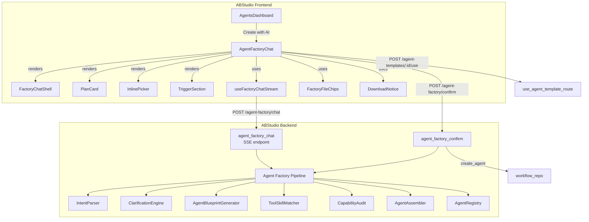
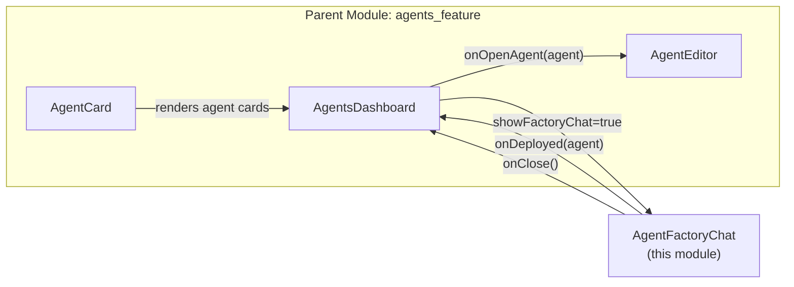
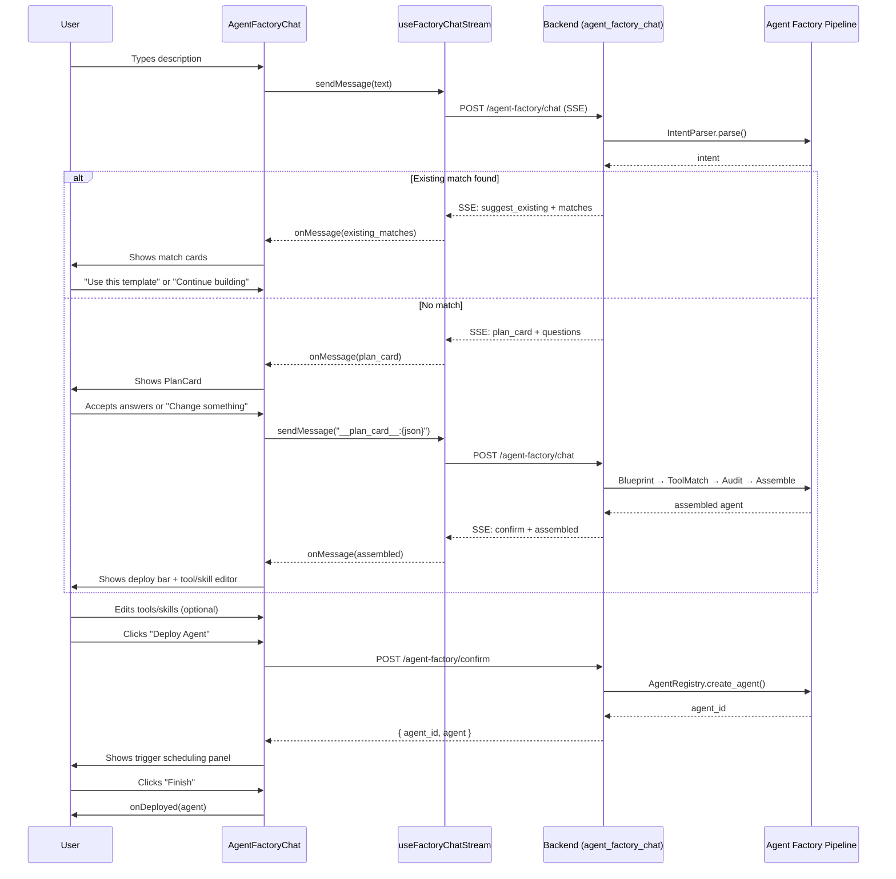
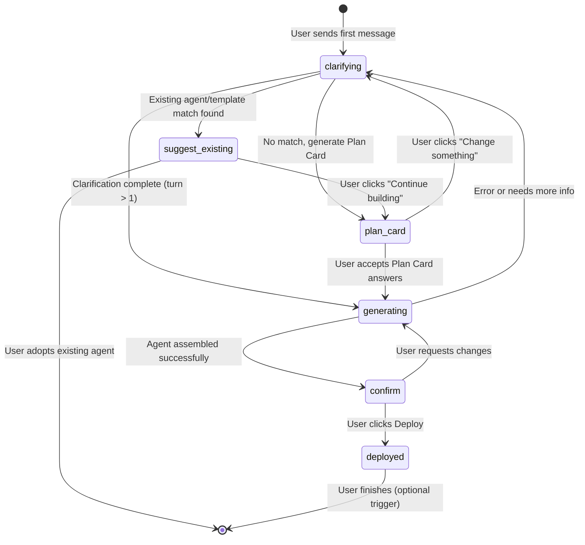
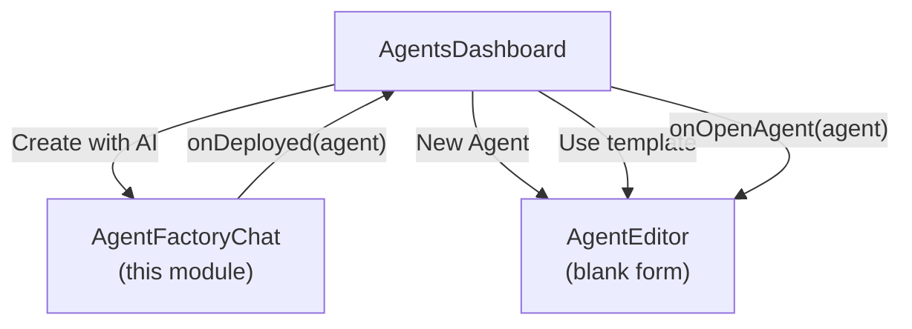

# Agent Factory Chat (`agents_feature_factory_chat`)

## Overview

The **Agent Factory Chat** is a conversational AI-driven interface that lets users describe an agent in plain language and have the platform automatically design, configure, and deploy it. It is the primary "Create with AI" entry point in the Agent Builder dashboard, guiding users through a multi-stage pipeline: intent parsing → clarification → blueprint generation → tool/skill matching → assembly → confirmation → deployment → optional trigger scheduling.

The component lives in the ABStudio frontend (`AgentFactoryChat.jsx`) and communicates with the backend `agent_factory` pipeline via two SSE-based REST endpoints exposed by the `api_factories` module.

---

## Architecture



### Component Relationships



The `AgentFactoryChat` is rendered as a modal overlay by `AgentsDashboard` when the user clicks **"Create with AI"**. Upon successful deployment, it calls `onDeployed` which closes the chat and refreshes the agent list. The deployed agent then appears in the dashboard sidebar and can be opened in the `AgentEditor` for further refinement.

---

## Core Components

### `AgentFactoryChat`

The main React component that orchestrates the entire conversational agent-creation flow. It manages local state for the assembled agent blueprint, pending tool/skill selections, deployment status, and the post-deploy trigger scheduling panel.

**Props:**

| Prop | Type | Description |
|------|------|-------------|
| `onClose` | `function` | Called when the user closes the chat without deploying |
| `onDeployed` | `function(agent)` | Called with the deployed agent object after the user finishes (deploy + optional trigger) |

**Key State:**

| State | Purpose |
|-------|---------|
| `assembledAgent` | The fully assembled agent blueprint received from the backend during the `confirm` stage |
| `pendingTools` / `pendingSkills` | User-editable tool/skill lists that can override the assembled defaults before deploy |
| `sessionId` | Server-assigned session ID for multi-turn continuity (from `useFactoryChatStream`) |
| `stage` | Current pipeline stage: `clarifying`, `plan_card`, `suggest_existing`, `generating`, `confirm` |
| `scheduled` | Whether the post-deploy trigger scheduling panel is active |
| `planCard` | Structured clarification questions presented to the user before generation |
| `existingMatches` | Pre-existing agents/templates that match the user's intent |

### `handleDeploy`

Sends a POST to `/agent-factory/confirm` with the session ID and any user-applied tool/skill overrides. On success, transitions to the trigger-scheduling phase. On failure, displays the error inline.

### `handleBuildAnyway`

Triggered when the user chooses to continue building a new agent despite existing matches being suggested. Sends a control message to the backend to proceed past the `suggest_existing` stage.

### `handleChipClick`

Forwards suggestion chip selections to the streaming chat endpoint. Disabled while loading.

### `handleFinishScheduled`

Called when the user clicks "Finish" after the optional trigger-scheduling step. Invokes `onDeployed` with the raw deployed agent data, which causes the dashboard to close the chat and refresh.

### `handleOpenExisting`

When the backend suggests existing agents/templates (`suggest_existing` stage), this handler lets the user adopt one by calling `POST /agent-templates/:id/use`. If successful, the adopted agent is passed to `onDeployed` directly.

---

## Data Flow



---

## Pipeline Stages

The backend `agent_factory_chat` endpoint drives a state machine across multiple turns. Each stage is reflected in the frontend via the `stage` value returned in SSE events.



### Stage Details

| Stage | Frontend Behavior | Backend Action |
|-------|-------------------|----------------|
| `clarifying` | Shows thinking steps, AI questions, suggestion chips | `IntentParser` parses intent; `ClarificationEngine` asks follow-up questions |
| `plan_card` | Renders `PlanCard` with structured questions below messages | `AgentPlanCardGenerator` creates clarification questions from intent |
| `suggest_existing` | Renders match cards with confidence scores and "Use" / "Continue building" buttons | `_find_existing_matches` searches agents and templates for similarity |
| `generating` | Shows thinking steps (blueprint, tool matching, audit, assembly) | `AgentBlueprintGenerator` → `ToolSkillMatcher` → `CapabilityAudit` → `AgentAssembler` |
| `confirm` | Shows deploy bar with tool/skill count, "Edit tools & skills" button, and "Deploy Agent" button | Returns assembled agent with tools, skills, system prompt, guardrails |
| `done` (post-deploy) | Shows trigger scheduling panel with `TriggerSection` | `agent_factory_confirm` persists agent via `workflow_repo.create_agent` |

---

## Dependencies

### Frontend Dependencies

```mermaid
graph TD
    FactoryChat["AgentFactoryChat"] --> Shell["FactoryChatShell<br/>(shared_features)"]
    FactoryChat --> Stream["useFactoryChatStream<br/>(shared_features)"]
    FactoryChat --> PlanCard["PlanCard<br/>(common_components)"]
    FactoryChat --> InlinePicker["InlinePicker<br/>(common_components)"]
    FactoryChat --> TriggerSection["TriggerSection<br/>(triggers_feature)"]
    FactoryChat --> FileChips["FactoryFileChips<br/>(shared_features)"]
    FactoryChat --> DownloadNotice["DownloadNotice<br/>(shared_features)"]
    FactoryChat --> SniffFiles["sniffGeneratedFiles<br/>(shared_features)"]
    FactoryChat --> DownloadFile["downloadGeneratedFile<br/>(shared_features)"]
    FactoryChat --> TransientNotice["useTransientNotice<br/>(shared_features)"]
    FactoryChat --> Config["config/api<br/>(API_BASE, buildAuthHeaders)"]
```



| Dependency | Module | Purpose |
|------------|--------|---------|
| `FactoryChatShell` | [shared_features](../core/shared_features.md) | Reusable modal chat shell with message list, input, suggestions, and overlay slots |
| `useFactoryChatStream` | [shared_features](../core/shared_features.md) | SSE streaming hook managing messages, stage, session, and thinking steps |
| `PlanCard` | [common_components](../ui/common_components.md) | Structured multi-question confirmation card with chip selection and free-text |
| `InlinePicker` | [common_components](../ui/common_components.md) | Tool/skill picker with catalog loading, search, and on-the-fly generation |
| `TriggerSection` | [triggers_feature](../ui/triggers_feature.md) | Post-deploy trigger configuration UI |
| `FactoryFileChips` | [shared_features](../core/shared_features.md) | Download chips for generated files in messages |
| `DownloadNotice` | [shared_features](../core/shared_features.md) | Transient error/success banner for file downloads |

### Backend Dependencies

| Dependency | Module | Purpose |
|------------|--------|---------|
| `agent_factory_chat` | [api_factories](../api/api_factories.md) | SSE endpoint orchestrating the multi-turn agent creation pipeline |
| `agent_factory_confirm` | [api_factories](../api/api_factories.md) | Persists the assembled agent to the database |
| `use_agent_template_route` | [api_agent_templates](../api/api_agent_templates.md) | Adopts an existing agent template when user selects a match |
| `IntentParser`, `ClarificationEngine`, `AgentBlueprintGenerator`, `ToolSkillMatcher`, `CapabilityAudit`, `AgentAssembler` | [agent_factory_pipeline](agent_factory_pipeline.md) | Core pipeline classes for intent parsing, clarification, blueprint generation, tool matching, and assembly |
| `workflow_repo.create_agent` | [core_workflow_repo](../workflows/core_workflow_repo.md) | Database persistence for the deployed agent |

---

## Key Interactions

### Plan Card Flow

When the user's first message doesn't match an existing agent, the backend generates a structured `PlanCard` with multiple-choice questions (e.g., model preference, trigger type, persona). The frontend renders this below the message list. The user can:

1. **Accept defaults** — Clicks "Generate with these settings", which sends `__plan_card__:{json}` back to the backend. The `useFactoryChatStream` hook intercepts this protocol string and renders a friendly summary bubble instead of the raw JSON.
2. **Change something** — Clicks "Change something", which falls through to conversational clarification via the `ClarificationEngine`.

### Tool & Skill Editing

During the `confirm` stage, the user can click "Edit tools & skills" to open a full-body overlay containing two `InlinePicker` components (one for tools, one for skills). The `InlinePicker` loads the catalog from `/{kind}-catalog`, supports search, and can generate new tools/skills on the fly via `/{kind}-catalog/generate`. Edits are stored in `pendingTools`/`pendingSkills` and sent as overrides in the deploy request.

### Post-Deploy Trigger Scheduling

After a successful deploy, the chat transitions to a scheduling view. The `FactoryChatShell`'s input is hidden and a footer panel replaces it, containing:

- A success banner with the deployed agent name
- A `TriggerSection` component (scoped CSS injected via `TRIGGER_SCOPED_CSS`) bound to `targetKind="agent"` and `targetId={deployedAgent.agent_id}`
- A "Finish" button that calls `handleFinishScheduled`

The user can configure webhooks, schedules, or manual triggers, or skip directly to finish.

### Session Persistence

The backend persists session state to Postgres on every turn (write-through, non-blocking). If the backend restarts mid-conversation, `get_or_restore_session` rehydrates the session from the database, allowing the build to resume seamlessly. Sessions are scoped to the authenticated user and cleaned up after a successful confirm.

---

## Integration with Parent Module

The `AgentFactoryChat` is one of three creation paths in the [agents_feature](agents_feature.md) module:



- **Create with AI** → Opens `AgentFactoryChat` (conversational, AI-driven)
- **New Agent** → Opens `AgentEditor` with a blank form (manual configuration)
- **Use template** → Calls `useAgentTemplate`, then opens `AgentEditor` with the template's values

After the factory chat deploys an agent, `handleAgentDeployed` in `AgentsDashboard` closes the chat and reloads the agent list. The new agent appears in the sidebar and can be opened in `AgentEditor` for further editing, preview chat, or governance submission.

---

## API Endpoints

| Endpoint | Method | Purpose |
|----------|--------|---------|
| `/agent-factory/chat` | POST (SSE) | Multi-turn streaming chat for agent creation |
| `/agent-factory/confirm` | POST | Persists the assembled agent to the database |
| `/agent-templates/:id/use` | POST | Adopts an existing agent template |
| `/tools-catalog` | GET | Lists available tools for `InlinePicker` |
| `/skills-catalog` | GET | Lists available skills for `InlinePicker` |
| `/tools-catalog/generate` | POST | Generates a new tool on the fly |
| `/skills-catalog/generate` | POST | Generates a new skill on the fly |

### Request/Response Shapes

**`_AgentFactoryChatReq`** (chat):
```json
{ "session_id": "string|null", "message": "string" }
```

**`_AgentFactoryConfirmReq`** (confirm):
```json
{ "session_id": "string", "tools_override": "list|null", "skills_override": "list|null" }
```

**Confirm Response:**
```json
{ "agent_id": "uuid", "agent": { "name": "...", "tools": [...], "skills": [...], ... } }
```

---

## SSE Event Protocol

The `useFactoryChatStream` hook parses Server-Sent Events from `/agent-factory/chat`. Each event is a JSON object with a `type` field:

| Event Type | Fields | Frontend Handling |
|------------|--------|-------------------|
| `thinking` | `text` | Appended to the current steps block as a progress indicator |
| `message` | `text`, `stage`, `suggestions?`, `data?` | Added as an assistant message; `onMessage` callback processes `data.assembled`, `data.plan_card`, `data.existing_matches` |
| `error` | `message` | Displayed as an error message; loading state cleared |
| `done` | `session_id`, `stage` | Session ID stored; loading state cleared |

The `onMessage` callback in `AgentFactoryChat` inspects `ev.stage` and `ev.data` to update component state:
- `stage === 'plan_card'` → sets `planCard` from `ev.data.plan_card`
- `stage === 'suggest_existing'` → sets `existingMatches` from `ev.data.existing_matches`
- `ev.data.assembled` present → sets `assembledAgent`, which triggers the `useEffect` that populates `pendingTools`/`pendingSkills`
