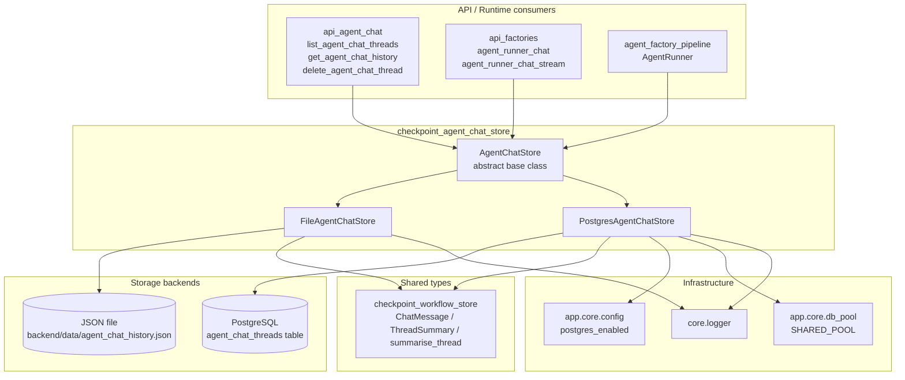
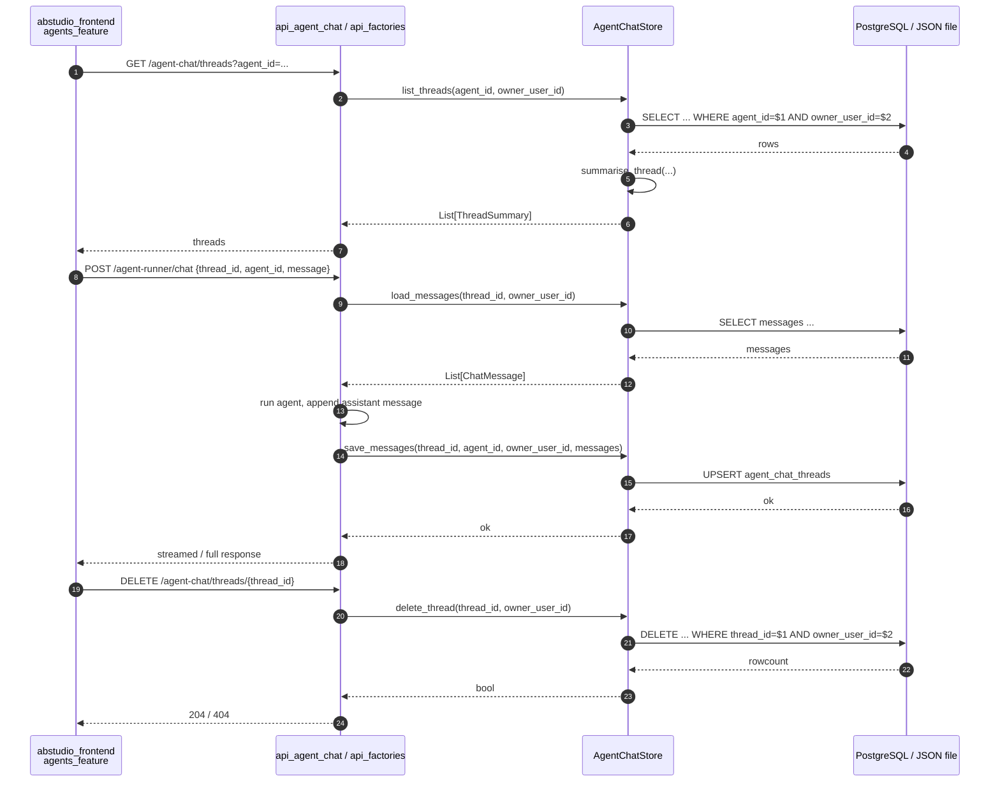
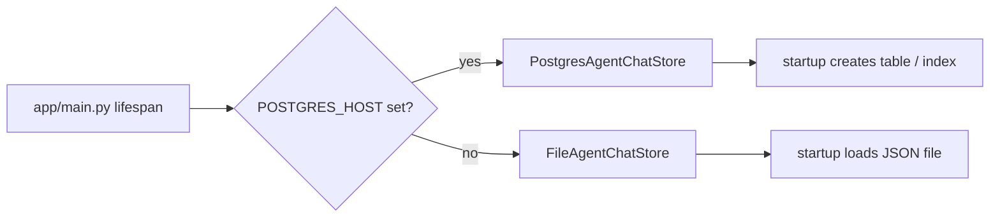
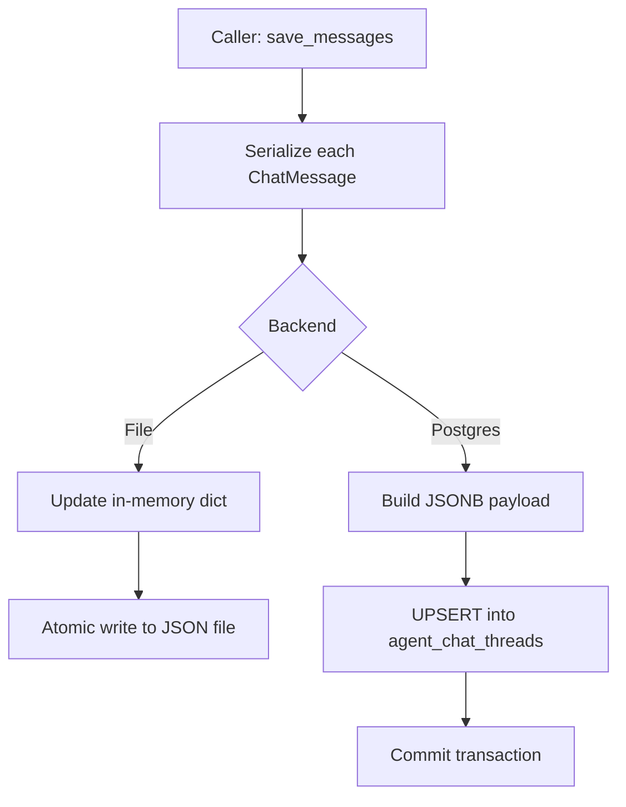

# checkpoint_agent_chat_store

The `checkpoint_agent_chat_store` module provides durable persistence for **agent-runner chat conversations**. While the sibling [checkpoint_workflow_store](../storage/checkpoint_workflow_store.md) persists workflow execution threads keyed by `workflow_id`, this module is scoped to `(agent_id, owner_user_id)` so that every deployed agent can maintain a private, per-user chat history.

It is consumed by the Agent Builder runner chat endpoints (e.g. `POST /agent-runner/chat`) and by the agent chat management API (`/agent-chat/*`). The module exposes a single abstract interface with two pluggable backends: a JSON file store for local / development deployments and a PostgreSQL store for production.

---

## Core responsibilities

| Responsibility | Description |
| -------------- | ----------- |
| **Per-user, per-agent thread isolation** | Every thread is owned by an `owner_user_id` and belongs to a specific `agent_id`. Queries never leak across users or agents. |
| **Message persistence** | Stores the ordered list of `ChatMessage` objects, including optional `generated_files` and `usage` metadata. |
| **Thread lifecycle** | Supports create-or-update on save, load, list (with summaries), single-thread delete, and bulk delete for an agent. |
| **Backend abstraction** | The same `AgentChatStore` interface is implemented by `FileAgentChatStore` and `PostgresAgentChatStore`; `app/main.py` selects the implementation at startup based on `POSTGRES_HOST`. |

---

## Architecture



### Component roles

- **`AgentChatStore`** — Abstract base class that defines the contract every backend must implement: `startup`, `shutdown`, `save_messages`, `load_messages`, `list_threads`, `delete_thread`, and `delete_threads_for_agent`.
- **`FileAgentChatStore`** — Development-friendly backend that keeps the entire dataset in a single JSON file. It uses an in-memory cache plus a write-through `_flush` with atomic `os.replace`.
- **`PostgresAgentChatStore`** — Production backend that stores rows in the `agent_chat_threads` table. It reuses the platform-wide `SHARED_POOL` from [app.core.db_pool](../storage/core_db_pool.md) and creates its schema on startup.

---

## Data model

### In-memory / JSON schema (`FileAgentChatStore`)

```json
{
  "<thread_id>": {
    "agent_id": "<agent_id>",
    "owner_user_id": "<owner_user_id>",
    "messages": [
      {"role": "user", "content": "..."},
      {"role": "assistant", "content": "...", "generated_files": [...], "usage": {...}}
    ],
    "last_updated": "2025-01-01T00:00:00+00:00"
  }
}
```

### PostgreSQL schema (`PostgresAgentChatStore`)

```sql
CREATE TABLE agent_chat_threads (
    thread_id     TEXT PRIMARY KEY,
    agent_id      TEXT NOT NULL,
    owner_user_id TEXT NOT NULL,
    messages      JSONB NOT NULL DEFAULT '[]',
    last_updated  TIMESTAMPTZ NOT NULL DEFAULT NOW()
);

CREATE INDEX idx_agent_chat_threads_agent_owner
ON agent_chat_threads (agent_id, owner_user_id, last_updated DESC);
```

The JSONB `messages` column stores the same serialized shape used by the file backend, so the two backends are interchangeable from the caller's perspective.

---

## Component interactions



---

## Process flows

### Startup backend selection



### Save messages flow



### Load / authorization flow

```mermaid
flowchart TD
    A[Caller: load_messages] --> B[Lookup by thread_id]
    B --> C{Owner matches?}
    C -->|no| D[Return None]
    C -->|yes| E[Deserialize messages]
    E --> F[Return List[ChatMessage]]
```

---

## Dependencies

| Dependency | Module doc | Purpose |
| ---------- | ---------- | ------- |
| `ChatMessage`, `ThreadSummary`, `summarise_thread` | [checkpoint_workflow_store](../storage/checkpoint_workflow_store.md) | Shared data types and summary heuristics so the agent chat sidebar stays consistent with the workflow chat sidebar. |
| `core.logger` | [shared_core](../reference/shared_core.md) | Structured logging for load / flush diagnostics. |
| `app.core.config.postgres_enabled` | [core_config](../infrastructure/core_config.md) | Determines whether PostgreSQL is available. |
| `app.core.db_pool.SHARED_POOL` | [core_db_pool](../storage/core_db_pool.md) | Shared connection pool used by the PostgreSQL backend. |

### Upstream consumers

| Consumer | Module doc | Usage |
| -------- | ---------- | ----- |
| `api_agent_chat` | [api_agent_chat](../api/api_agent_chat.md) | REST endpoints for listing, reading, and deleting agent chat threads. |
| `api_factories` | [api_factories](../api/api_factories.md) | `agent_runner_chat` and `agent_runner_chat_stream` load and persist conversation history. |
| `agent_factory_pipeline` | [agent_factory_pipeline](agent_factory_pipeline.md) | `AgentRunner` may read/write threads during agent execution. |

---

## Design notes

- **No pending-interrupt or node-output support** — Unlike [checkpoint_workflow_store](../storage/checkpoint_workflow_store.md), the agent chat store only persists messages. Agent-runner conversations do not currently require HITL snapshots, per-node outputs, loop lessons, or durable run-step replay.
- **Owner-scoped deletes** — Both `delete_thread` and `delete_threads_for_agent` include `owner_user_id` in the predicate so a user can only delete their own history.
- **Shared pool, not a private pool** — `PostgresAgentChatStore` borrows `SHARED_POOL` rather than opening its own connections. This keeps connection limits centralized and avoids the legacy per-store pool environment variables.
- **Serializer parity** — `_serialise_message` mirrors the serialization logic in [checkpoint_workflow_store](../storage/checkpoint_workflow_store.md) so that `generated_files` and `usage` survive reloads and remain bit-identical when absent.
- **Thread summaries** — Listing threads reuses `summarise_thread` from the workflow store, producing a `ThreadSummary` with title, preview, message count, and last-updated timestamp.

---

## When to modify this module

- Add a new storage backend (e.g. Redis, S3) → implement `AgentChatStore`.
- Change the message schema → update `_serialise_message` / `_deserialise_message` and keep them in sync with [checkpoint_workflow_store](../storage/checkpoint_workflow_store.md).
- Add metadata to threads (e.g. pinned status, tags) → extend the table schema and the JSON record shape.
- Change authorization scope → review every method that accepts `owner_user_id` to ensure predicates remain correct.
