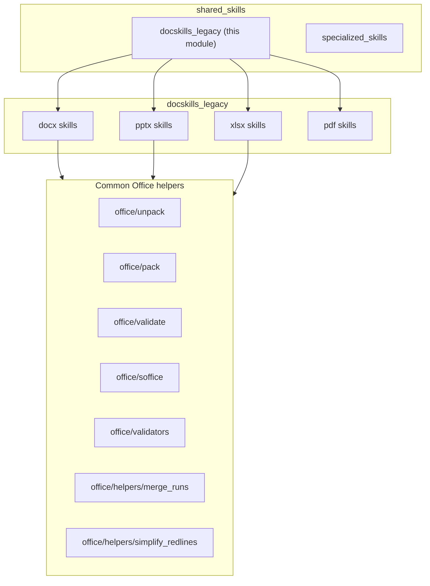
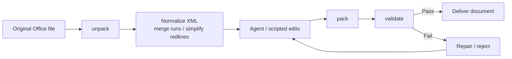
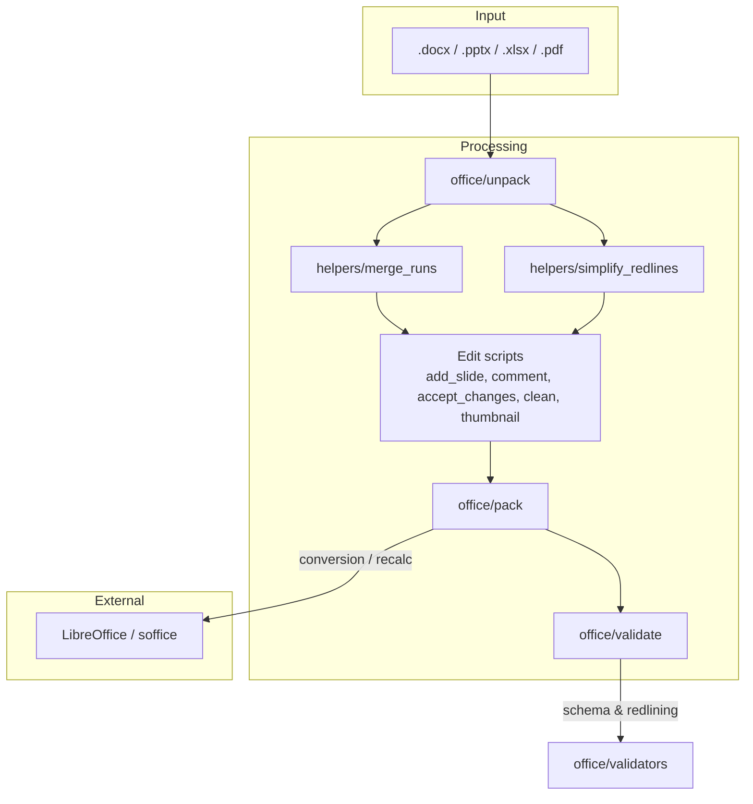
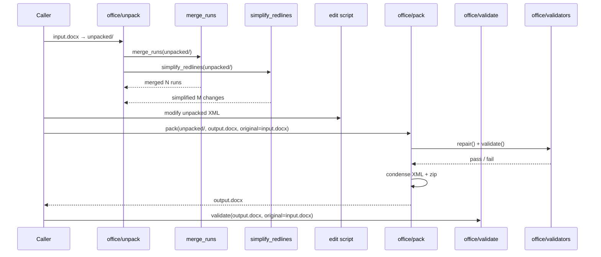

# `docskills_legacy` Module Overview

## Purpose

`docskills_legacy` is the legacy AiNxt document-skills toolkit. It provides low-level, file-system-based utilities for manipulating Microsoft Office Open XML (OOXML) documents (`DOCX`, `PPTX`, `XLSX`) and PDF forms. The module is designed to support agentic document-editing workflows through a safe **unpack → edit → pack → validate** round-trip, ensuring that generated or modified documents remain well-formed, schema-compliant, and openable by end-user applications.

Key responsibilities include:

- Extracting and repacking Office Open XML archives.
- Pretty-printing, normalizing, and condensing OOXML XML parts.
- Merging redundant text runs and simplifying tracked changes.
- Validating OOXML structure, relationships, schemas, and redlining semantics.
- Running LibreOffice (`soffice`) headlessly for conversions, macro execution, and formula recalculation.
- Providing surgical helpers for adding slides, cleaning orphaned files, generating thumbnails, and filling PDF forms.

## Architecture

`docskills_legacy` sits under `shared_skills` and is organized by document format (`docx`, `pptx`, `xlsx`, `pdf`). Each format shares a common pattern of **unpack / pack / validate / soffice** helpers, while format-specific scripts handle unique document semantics.

### Document Round-Trip Pipeline

Every Office format follows the same high-level lifecycle:

### Component Interaction

## Core Components

| Component | Responsibility | Format |
|-----------|----------------|--------|
| `docx_accept_changes` | Accepts all tracked changes in a DOCX via a LibreOffice macro. | DOCX |
| `docx_comment` | Adds comments to a DOCX file. | DOCX |
| `docx_office_merge_runs` | Merges adjacent `<w:r>` runs with identical formatting. | DOCX |
| `docx_office_simplify_redlines` | Merges adjacent tracked-change wrappers from the same author. | DOCX |
| `docx_office_pack` | Repacks an unpacked OOXML directory into a `.docx`/`.pptx`/`.xlsx`. | All Office |
| `docx_office_unpack` | Extracts and pretty-prints an Office archive. | All Office |
| `docx_office_validate` | CLI entry point for schema and redlining validation. | DOCX/PPTX |
| `docx_office_validators` | Validator classes: `BaseSchemaValidator`, `DOCXSchemaValidator`, `PPTXSchemaValidator`, `RedliningValidator`. | All Office |
| `docx_office_soffice` | LibreOffice execution helper with an optional `LD_PRELOAD` socket shim for sandboxed environments. | All Office |
| `pdf_scripts` | PDF form extraction, filling, and validation utilities. | PDF |
| `pptx_add_slide` | Adds or duplicates slides in an unpacked PPTX. | PPTX |
| `pptx_clean` | Removes orphaned/unreferenced files from an unpacked PPTX. | PPTX |
| `pptx_office_merge_runs` | PPTX variant of run merging. | PPTX |
| `pptx_office_simplify_redlines` | PPTX variant of redline simplification. | PPTX |
| `pptx_office_pack` / `pptx_office_unpack` / `pptx_office_validate` / `pptx_office_validators` | PPTX packaging, unpacking, validation, and schema checks. | PPTX |
| `pptx_office_soffice` | PPTX LibreOffice wrapper. | PPTX |
| `pptx_thumbnail` | Generates labeled thumbnail grids from PPTX files. | PPTX |
| `xlsx_office_merge_runs` | XLSX variant of run merging. | XLSX |
| `xlsx_office_simplify_redlines` | XLSX variant of redline simplification. | XLSX |
| `xlsx_office_pack` / `xlsx_office_unpack` / `xlsx_office_validate` / `xlsx_office_validators` | XLSX packaging, unpacking, validation, and schema checks. | XLSX |
| `xlsx_office_soffice` | XLSX LibreOffice wrapper. | XLSX |
| `xlsx_recalc` | Forces formula recalculation in `.xlsx` files via LibreOffice and reports Excel error literals. | XLSX |

## Data Flow

A typical DOCX editing flow looks like this:

## References to Core Component Documentation

- **DOCX editing & redlining**
  - `docx_accept_changes` — accepts tracked changes via LibreOffice.
  - `docx_comment` — adds DOCX comments.
  - `docx_office_merge_runs` — merges adjacent runs.
  - `docx_office_simplify_redlines` — simplifies tracked changes.

- **Office packaging & validation**
  - `docx_office_unpack` — unpacks Office archives.
  - `docx_office_pack` — repacks archives with validation and XML condensation.
  - `docx_office_validate` — validation CLI.
  - `docx_office_validators` — validator implementations.
  - `docx_office_soffice` — LibreOffice execution environment.

- **PPTX utilities**
  - `pptx_add_slide`, `pptx_clean`, `pptx_thumbnail`
  - `pptx_office_merge_runs`, `pptx_office_simplify_redlines`
  - `pptx_office_pack`, `pptx_office_unpack`, `pptx_office_validate`, `pptx_office_validators`, `pptx_office_soffice`

- **XLSX utilities**
  - `xlsx_recalc` — formula recalculation.
  - `xlsx_office_merge_runs`, `xlsx_office_simplify_redlines`
  - `xlsx_office_pack`, `xlsx_office_unpack`, `xlsx_office_validate`, `xlsx_office_validators`, `xlsx_office_soffice`

- **PDF utilities**
  - `pdf_scripts` — form extraction, filling, and bounding-box validation.