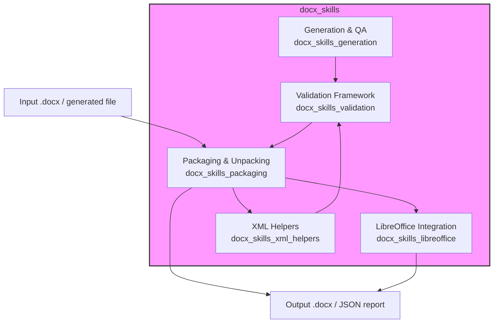
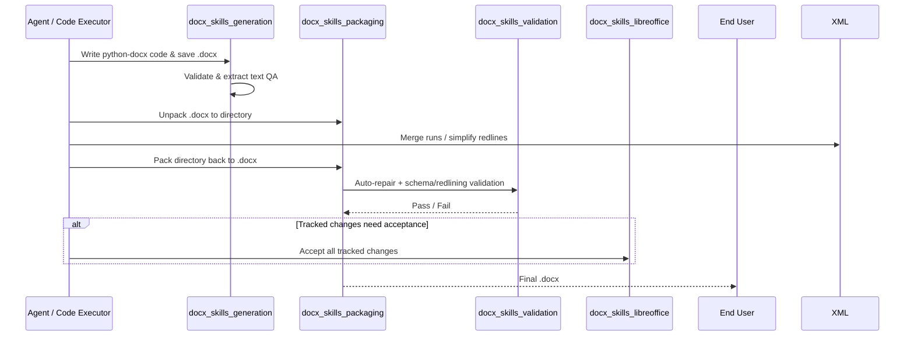
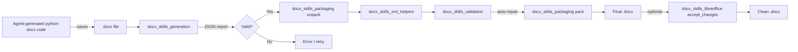

# docx_skills Module

## Introduction

`docx_skills` is a Python-based skill module for creating, manipulating, validating, and repairing Microsoft Word `.docx` documents. It lives under `ABStudio/skills/ainxt-skills/docx/` and is part of the larger `shared_skills` family alongside [pptx_skills](pptx_skills.md), [xlsx_skills](xlsx_skills.md), and [pdf_skills](pdf_skills.md). The module is designed to be invoked both as standalone command-line utilities and as callable functions from agent-generated code running in sandboxed execution environments.

The primary purpose of `docx_skills` is to provide a robust, programmatic Office-document workflow:

1. **Generate** new `.docx` files using standard libraries such as `python-docx`.
2. **Validate** generated files for structural integrity, schema compliance, and content correctness.
3. **Unpack** existing `.docx` files into editable XML directory trees.
4. **Modify** unpacked XML (comments, tracked changes, run merging, redline simplification).
5. **Pack** the directory tree back into a valid `.docx`, with optional auto-repair and redlining validation.
6. **Integrate** with LibreOffice (`soffice`) for operations such as accepting tracked changes.

These capabilities are especially important in agentic document-generation pipelines where an LLM writes `python-docx` code, executes it in a sandbox, and then needs a reliable final QA step before returning the file to the user.

## Architecture Overview

The module is organized into a small set of focused sub-modules that cooperate around the lifecycle of an Office document.

### Data Flow

A typical agent-driven document workflow looks like this:

## Sub-modules

### [docx_skills_generation](docx_skills_generation.md)

Handles the creation of new `.docx` content and post-generation quality assurance.

- **`generate.py`** — Validates and inspects a generated `.docx` file, producing a JSON report with paragraph/table counts and text preview. This is the final QA step after an agent writes `python-docx` code.
- **`comment.py`** — Adds Word comments (and replies) to an unpacked `.docx` directory, managing the full OOXML comment part infrastructure (`comments.xml`, `commentsExtended.xml`, `commentsIds.xml`, `commentsExtensible.xml`).

### [docx_skills_packaging](docx_skills_packaging.md)

Converts between packed Office files and editable directory trees.

- **`unpack.py`** — Extracts a `.docx`, `.pptx`, or `.xlsx` archive, pretty-prints XML, escapes smart quotes, and optionally merges runs and simplifies tracked changes for DOCX.
- **`pack.py`** — Rebuilds a `.docx`, `.pptx`, or `.xlsx` from an unpacked directory, condenses XML, runs validators with auto-repair, and supports author inference for redlining checks.

### [docx_skills_libreoffice](docx_skills_libreoffice.md)

Provides a bridge to LibreOffice for operations that are difficult or impossible to perform with pure XML manipulation.

- **`soffice.py`** — Runs `soffice` commands with an optional LD_PRELOAD shim for environments where `AF_UNIX` sockets are blocked (e.g., sandboxed VMs).
- **`accept_changes.py`** — Accepts all tracked changes in a DOCX by invoking a LibreOffice Basic macro.

### [docx_skills_xml_helpers](docx_skills_xml_helpers.md)

Low-level XML normalization helpers used during unpack/modify/pack cycles.

- **`merge_runs.py`** — Merges adjacent `<w:r>` runs with identical formatting, removes `rsid` attributes, and strips `proofErr` elements.
- **`simplify_redlines.py`** — Merges adjacent `<w:ins>` or `<w:del>` tracked-change elements from the same author, and infers the author of new changes by comparing against an original document.

### [docx_skills_validation](docx_skills_validation.md)

A comprehensive validation framework for Office Open XML documents.

- **`validate.py`** — CLI entry point that selects validators based on file extension and supports auto-repair.
- **`validators/base.py`** — `BaseSchemaValidator` with shared checks for XML well-formedness, namespaces, unique IDs, file references, content types, and XSD validation against original-file baselines.
- **`validators/docx.py`** — `DOCXSchemaValidator` with Word-specific checks for whitespace preservation, deletions, insertions, ID constraints, and comment markers.
- **`validators/pptx.py`** — `PPTXSchemaValidator` with PowerPoint-specific checks for UUIDs, slide layout IDs, notes slide references, and duplicate layouts.
- **`validators/redlining.py`** — `RedliningValidator` ensures that after removing a given author's tracked changes, the document text matches the original document text.

## Relationship to the Rest of the System

`docx_skills` is consumed by higher-level document-generation and agent-orchestration components. It does not depend on the ABStudio backend runtime, the frontend, or the gateway; instead, it is a self-contained utility package that can be bundled into sandboxed code-execution environments.

Key integration points:

- **Agent code executor / sandbox** — The `generate.py` script is referenced in system prompts as `GENERATE_SCRIPT` so that agent-generated `python-docx` code can self-validate.
- **ABStudio catalog & skill factory** — Document-oriented skills can call `pack.py` / `unpack.py` / `validate.py` to ensure produced `.docx` artifacts are valid before registration in the skill catalog.
- **Shared skills family** — The Office packaging and validation utilities in `docx_skills` are reused conceptually (and sometimes shared via copy) by [pptx_skills](pptx_skills.md) and [xlsx_skills](xlsx_skills.md). See the `shared_skills` documentation for the broader context.
- **LibreOffice / soffice** — The `soffice.py` shim is reusable by any skill that needs headless Office conversion in restricted environments.

## Mermaid: Component Interaction

## Notes

- All XML manipulation uses `defusedxml.minidom` or `lxml.etree` for safe parsing.
- Validation is **baseline-aware**: when an `original_file` is supplied, only *new* XSD errors (not pre-existing ones) are reported.
- The module supports `.docx`, `.pptx`, and `.xlsx` for pack/unpack/validate, but DOCX-specific features (comments, redlining, run merging) are only applied to `.docx` files.
