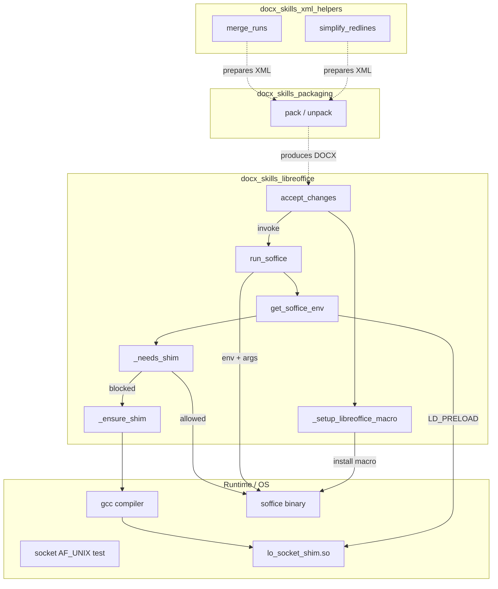
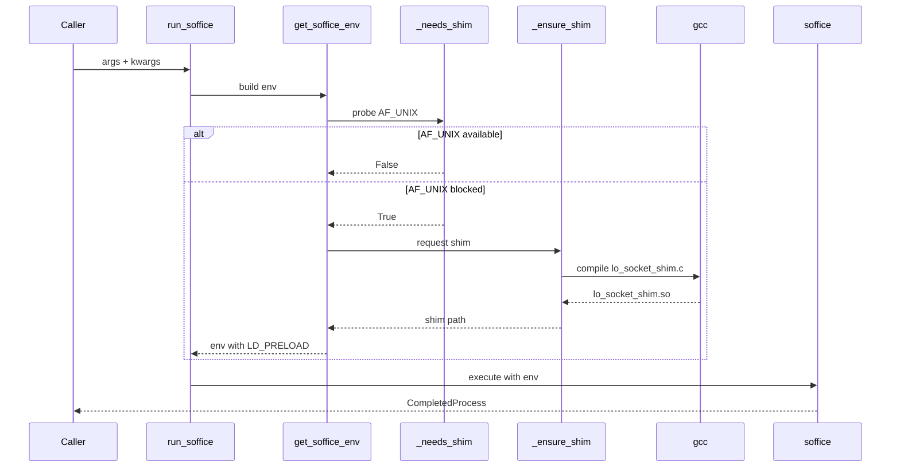
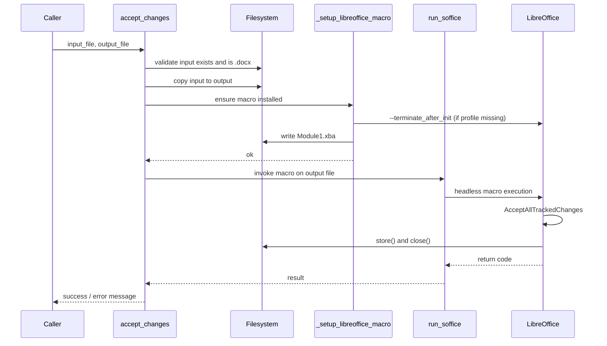
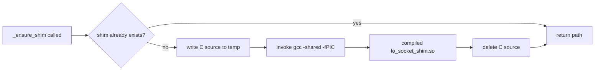

# docx_skills_libreoffice

The `docx_skills_libreoffice` module provides a sandbox-aware bridge to LibreOffice (`soffice`) for DOCX processing. It enables headless execution of LibreOffice in restricted environments where Unix domain sockets are blocked, and exposes a high-level operation to accept all tracked changes in a DOCX file.

This module is part of the broader [docx_skills](docx_skills.md) skill set, which supports document generation, packaging, XML manipulation, validation, and redlining workflows in the ABStudio platform.

---

## Overview

LibreOffice is used by the platform to perform operations that are difficult or unreliable to implement through direct XML manipulation alone, such as accepting tracked changes. However, in sandboxed or containerized deployments, LibreOffice may fail to start because it relies on `AF_UNIX` sockets for internal inter-process communication.

This module solves that problem by:

1. Detecting at runtime whether `AF_UNIX` sockets can be created.
2. Compiling and injecting a small C-based `LD_PRELOAD` shim that intercepts socket-related system calls and redirects blocked `AF_UNIX` socket creation to `socketpair()`.
3. Providing a clean helper, `run_soffice()`, that applies the shim transparently.
4. Implementing `accept_changes()`, which uses a LibreOffice Basic macro to accept all tracked changes in a DOCX file.

---

## Core Components

| Component | File | Purpose |
|-----------|------|---------|
| `run_soffice` | `soffice.py` | Runs `soffice` with the correct environment, including the optional socket shim. |
| `get_soffice_env` | `soffice.py` | Builds the environment dictionary used by LibreOffice subprocesses. |
| `_needs_shim` / `_ensure_shim` | `soffice.py` | Detects socket restrictions and compiles the `LD_PRELOAD` shim on demand. |
| `accept_changes` | `accept_changes.py` | Accepts all tracked changes in a DOCX using a LibreOffice macro. |
| `_setup_libreoffice_macro` | `accept_changes.py` | Installs the `AcceptAllTrackedChanges` macro into a dedicated LibreOffice profile. |

---

## Architecture



---

## Component Relationships

- `run_soffice` is the low-level entry point. It calls `get_soffice_env` to obtain an environment dictionary and then executes `soffice` with the provided arguments.
- `get_soffice_env` sets `SAL_USE_VCLPLUGIN=svp` to force headless rendering and, if needed, prepends the compiled socket shim via `LD_PRELOAD`.
- `_needs_shim` performs a lightweight runtime probe by attempting to create an `AF_UNIX` socket. If the call raises `OSError`, the shim is required.
- `_ensure_shim` writes the C source for the shim to a temporary file, compiles it with `gcc`, and returns the path to the shared object. The compiled artifact is cached in the system temp directory.
- `accept_changes` is a business-level operation. It validates the input, copies it to the output location, installs a LibreOffice macro, and invokes `soffice` through `run_soffice` to execute the macro.
- `_setup_libreoffice_macro` creates a dedicated LibreOffice profile under `/tmp/libreoffice_docx_profile` and writes the `AcceptAllTrackedChanges` Basic macro into the profile if it is not already present.

---

## Data Flow: Running LibreOffice with the Socket Shim



---

## Data Flow: Accepting Tracked Changes



---

## The Socket Shim

The shim is a small shared object written in C. It is injected with `LD_PRELOAD` and intercepts the following libc functions:

- `socket`
- `socketpair`
- `listen`
- `accept`
- `close`

When LibreOffice calls `socket(AF_UNIX, ...)`, the shim first tries the real `socket`. If that fails, it creates a `socketpair()` instead and returns one end. The other end is tracked as the peer. When LibreOffice calls `listen` on the shimmed file descriptor, the shim records it as the listener. When `accept` is called, the shim blocks on an internal pipe until `close` is invoked on the listener, at which point it unblocks `accept` and exits the process.

This behavior is sufficient for LibreOffice's short-lived, single-conversion processes because the internal socket is only used for bootstrap coordination between the main process and a helper process.

### Shim Compilation Flow



---

## How It Fits into the System

The `docx_skills_libreoffice` module is one of several specialized modules inside the `docx_skills` skill set. Its role is to provide **runtime execution support** for LibreOffice-dependent operations, while other modules handle the surrounding document lifecycle:

- [docx_skills_generation](docx_skills_generation.md) creates DOCX files and adds comments.
- [docx_skills_packaging](docx_skills_packaging.md) unpacks and repacks Office Open XML archives.
- [docx_skills_xml_helpers](docx_skills_xml_helpers.md) manipulates the unpacked XML, merging runs and simplifying redlines.
- [docx_skills_validation](docx_skills_validation.md) validates the final package against schemas and redlining rules.

`docx_skills_libreoffice` is typically invoked after a DOCX has been generated or modified and needs an operation that only LibreOffice can perform reliably, such as accepting tracked changes. It is also used as a general-purpose helper anywhere in the platform that needs to run `soffice` in a sandbox.

---

## Usage Examples

### Running soffice directly

```python
from office.soffice import run_soffice

result = run_soffice(
    ["--headless", "--convert-to", "pdf", "input.docx"],
    capture_output=True,
    text=True,
)
```

### Getting the environment for a custom subprocess call

```python
import subprocess
from office.soffice import get_soffice_env

env = get_soffice_env()
subprocess.run(
    ["soffice", "--headless", "--convert-to", "pdf", "input.docx"],
    env=env,
    check=True,
)
```

### Accepting tracked changes

```python
from office.accept_changes import accept_changes

_, message = accept_changes("draft.docx", "final.docx")
print(message)
```

---

## Error Handling

- `accept_changes` returns a tuple `(None, message)`. If the message contains `"Error"`, the operation failed.
- Input validation checks that the file exists and has a `.docx` extension before any processing.
- LibreOffice subprocess calls use a 30-second timeout. A timeout is treated as success because LibreOffice sometimes does not exit cleanly after accepting changes.
- If the shim compilation fails, `gcc` raises a `CalledProcessError` that propagates to the caller.

---

## Dependencies

- LibreOffice (`soffice`) must be installed and available on `PATH`.
- `gcc` must be available if the socket shim is needed.
- The module uses only the Python standard library (`os`, `socket`, `subprocess`, `tempfile`, `pathlib`, `argparse`, `logging`, `shutil`).

---

## Related Modules

- [docx_skills](docx_skills.md) — parent skill set overview
- [docx_skills_generation](docx_skills_generation.md) — DOCX generation and commenting
- [docx_skills_packaging](docx_skills_packaging.md) — unpacking and repacking Office archives
- [docx_skills_xml_helpers](docx_skills_xml_helpers.md) — XML run merging and redline simplification
- [docx_skills_validation](docx_skills_validation.md) — schema and redlining validation
- [docskills_legacy](docskills_legacy.md) — legacy equivalent of these document skills
