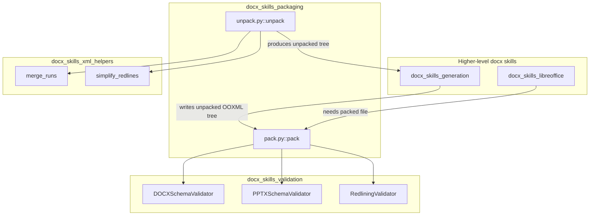
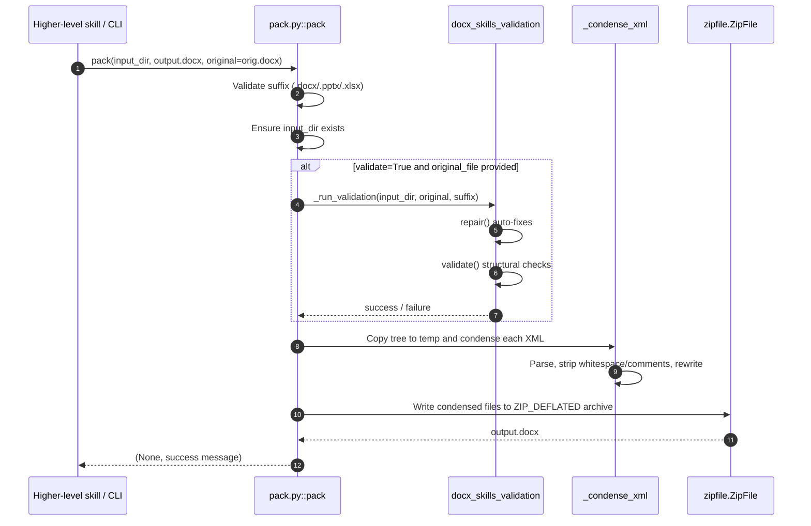
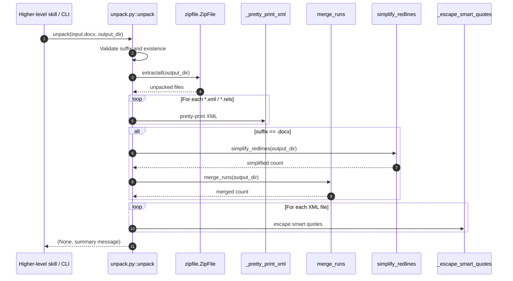
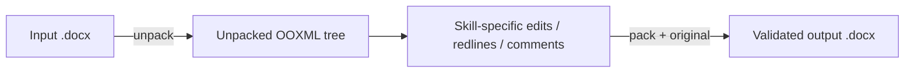
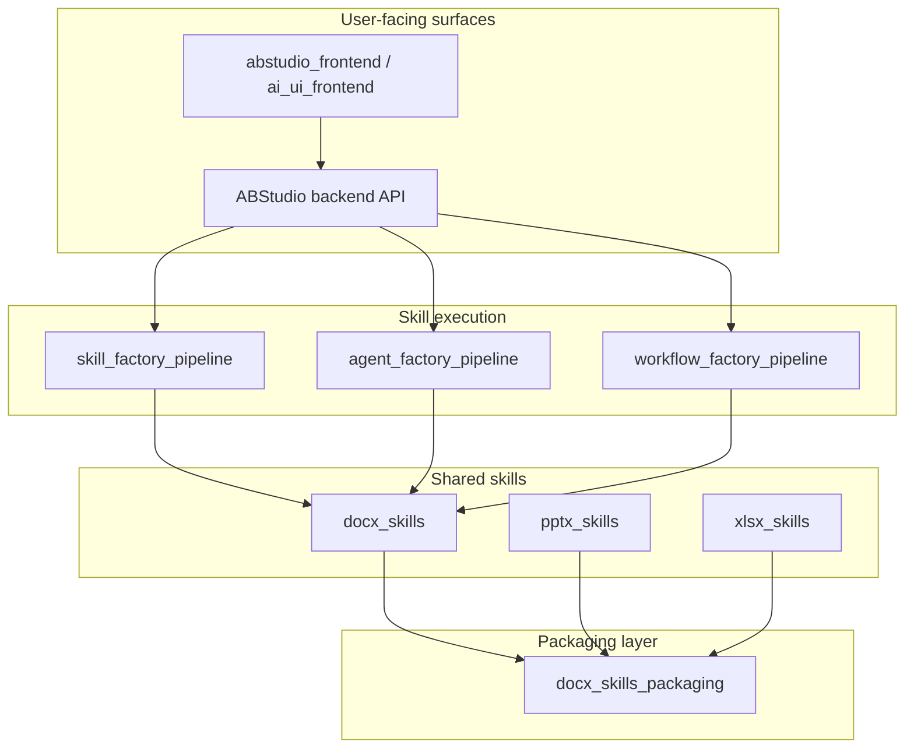

# docx_skills_packaging

## Brief Introduction

`docx_skills_packaging` provides the low-level Office Open XML (OOXML) packaging primitives used by the ABStudio docx skill set. It exposes two complementary operations — `pack` and `unpack` — that convert between editable unpacked directory trees and the final `.docx`, `.pptx`, or `.xlsx` ZIP archives required by Microsoft Office and LibreOffice.

The module is intentionally narrow: it does not generate document content, apply redlines, or execute LibreOffice. Instead, it is the serialization/deserialization boundary that ensures XML is well-formed, relationships are consistent, and the resulting Office file is structurally valid before it is returned to callers or persisted by the platform.

---

## Core Functionality

### `pack(input_directory, output_file, original_file=None, validate=True, infer_author_func=None)`

Packs an unpacked OOXML directory tree into a `.docx`, `.pptx`, or `.xlsx` file.

Key responsibilities:

- **Suffix validation** — only `.docx`, `.pptx`, and `.xlsx` outputs are accepted.
- **Optional validation with auto-repair** — when `validate=True` and an `original_file` is supplied, the unpacked tree is checked by format-specific validators before packaging.
- **XML condensation** — all `*.xml` and `*.rels` files are parsed and rewritten to remove insignificant whitespace and comments, producing compact, deterministic output.
- **ZIP creation** — the condensed tree is written as a standard ZIP archive with `ZIP_DEFLATED` compression.

Returns a tuple `(None, message)` so it can be consumed uniformly by skill callers.

### `unpack(input_file, output_directory, merge_runs=True, simplify_redlines=True)`

Unpacks an Office file into an editable directory tree.

Key responsibilities:

- **Archive extraction** — validates the file suffix and extracts the OOXML ZIP contents.
- **XML pretty-printing** — all `*.xml` and `*.rels` files are reformatted for human readability.
- **DOCX normalization** — for Word documents, adjacent runs with identical formatting are merged and adjacent tracked changes from the same author are simplified.
- **Smart-quote escaping** — Unicode smart quotes are escaped to numeric XML entities to avoid round-trip encoding issues.

Returns a tuple `(None, message)` summarizing the number of XML files processed and any normalization actions taken.

---

## Architecture

The packaging layer sits at the bottom of the `docx_skills` hierarchy. It is consumed by higher-level docx scripts and, indirectly, by the ABStudio backend through the skill execution pipeline.



### Component Relationships

| Component | Role | Collaborators |
|-----------|------|---------------|
| `pack` | Serializes unpacked OOXML into a ZIP Office file | `DOCXSchemaValidator`, `PPTXSchemaValidator`, `RedliningValidator`, `defusedxml.minidom` |
| `unpack` | Deserializes an Office file into an editable directory | `merge_runs`, `simplify_redlines`, `zipfile`, `defusedxml.minidom` |
| `_condense_xml` | Removes whitespace/comments from XML before ZIP creation | `pack` |
| `_pretty_print_xml` | Reformats XML for human editing | `unpack` |
| `_escape_smart_quotes` | Escapes Unicode smart quotes to numeric entities | `unpack` |
| `_run_validation` | Orchestrates validators and auto-repair before packing | `pack` |

---

## Data Flow

### Packing Flow



### Unpacking Flow



---

## Process Flows

### CLI Usage

Both functions are exposed as command-line scripts for local development and debugging.

**Pack:**

```bash
python pack.py unpacked/ output.docx --original input.docx
python pack.py unpacked/ output.pptx --validate false
```

**Unpack:**

```bash
python unpack.py document.docx unpacked/
python unpack.py document.docx unpacked/ --merge-runs false
```

### Skill Runtime Usage

Within the ABStudio skill framework, `pack` and `unpack` are imported as library functions. A typical document-editing skill will:

1. Call `unpack` to materialize the Office file as an editable XML tree.
2. Modify the XML (or invoke LibreOffice via [docx_skills_libreoffice](docx_skills_libreoffice.md)).
3. Call `pack` with the original file to validate and re-serialize the result.



---

## Dependencies

### Internal Modules

- [docx_skills_validation](docx_skills_validation.md) — `DOCXSchemaValidator`, `PPTXSchemaValidator`, and `RedliningValidator` perform structural, relationship, XSD, and tracked-change validation during packing.
- [docx_skills_xml_helpers](docx_skills_xml_helpers.md) — `merge_runs` and `simplify_redlines` normalize Word XML during unpacking.
- [docx_skills_generation](docx_skills_generation.md) — higher-level generation logic that produces unpacked OOXML trees consumed by `pack`.
- [docx_skills_libreoffice](docx_skills_libreoffice.md) — LibreOffice automation that may operate on files produced or consumed by this module.

### External Libraries

- `defusedxml.minidom` — safe XML parsing and serialization.
- `zipfile` — OOXML archive creation and extraction.
- `shutil`, `tempfile`, `pathlib` — filesystem and temporary directory management.
- `lxml` (via validators) — XSD validation and XPath checks.

---

## How It Fits into the Overall System

`docx_skills_packaging` is part of the `shared_skills` layer and is embedded in the ABStudio backend skill runtime. It enables agentic and programmatic document editing by providing a safe round-trip between:

- **Binary Office files** (the format users and Office applications understand).
- **Unpacked XML trees** (the format that LLM-driven skills and XML manipulation scripts can edit deterministically).

The module is reused across the broader document skill ecosystem, including [pptx_skills](pptx_skills.md) and [xlsx_skills](xlsx_skills.md), which share the same validator and helper infrastructure. It ultimately supports end-user features such as document generation, redlining, comment insertion, and template rendering exposed through the ABStudio and ai-ui frontends.



---

## Error Handling and Validation

Both `pack` and `unpack` return `(None, message)` tuples. Error messages contain the substring `"Error"` and, when invoked from the CLI, cause a non-zero exit code.

| Scenario | Behavior |
|----------|----------|
| Input directory does not exist (`pack`) | Returns error message |
| Output suffix is not `.docx`/`.pptx`/`.xlsx` | Returns error message |
| Validation fails (`pack`) | Returns error message; no output file is produced |
| Input file does not exist (`unpack`) | Returns error message |
| Invalid ZIP file (`unpack`) | Returns error message |
| XML parse failure during condensation (`pack`) | Prints to stderr and raises exception |

Validation during `pack` is **defensive**: validators first attempt `repair()` to auto-fix common issues (e.g., whitespace preservation, out-of-range `durableId` values) before running `validate()`. Only if validation still fails is the pack operation aborted.

---

## Notes for Maintainers

- The module deliberately avoids business logic. Keep it focused on serialization, deserialization, and structural integrity.
- When adding new Office formats, update the suffix checks in both `pack` and `unpack` and provide a corresponding validator in [docx_skills_validation](docx_skills_validation.md).
- XML condensation in `pack` intentionally preserves whitespace inside `<w:t>` elements by skipping tags ending in `:t`; this prevents corrupting significant spaces in Word documents.
- Smart-quote escaping in `unpack` is a workaround for round-trip encoding issues and should be kept in sync with any changes to the XML writer in `pack`.
