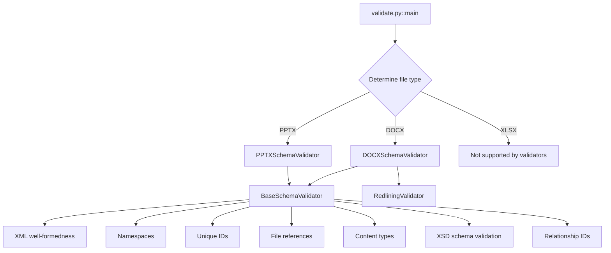
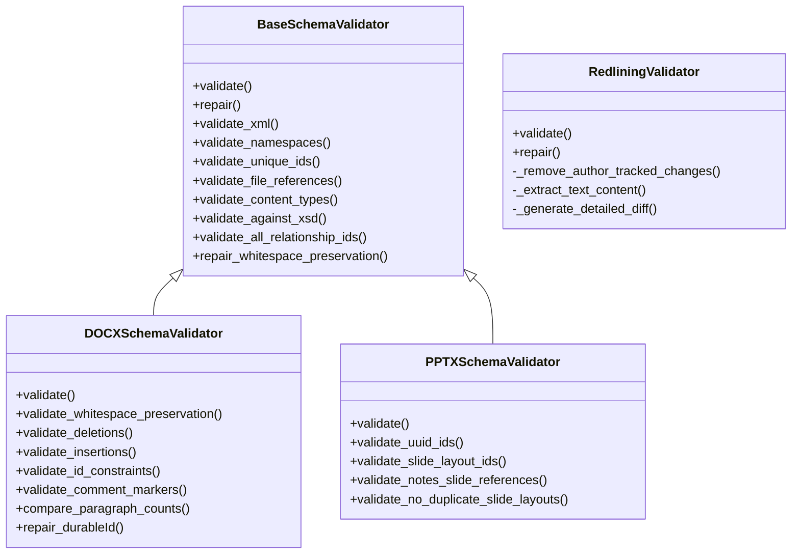
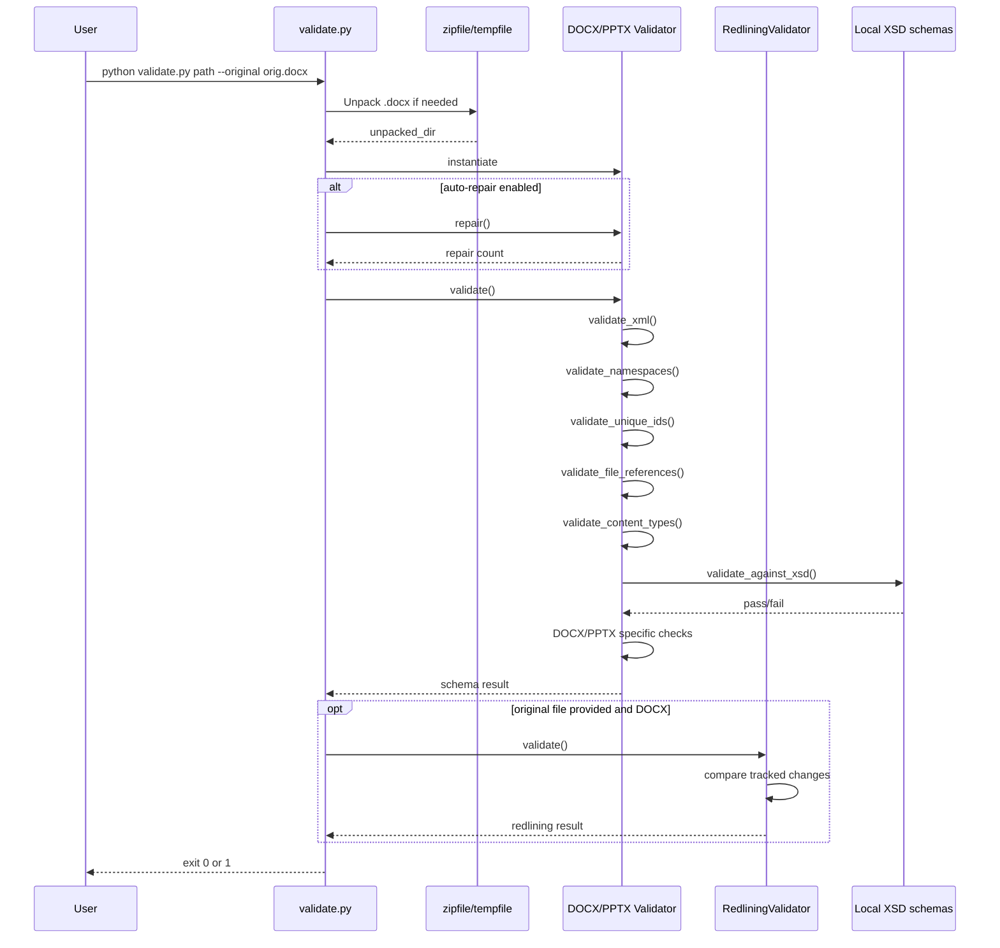
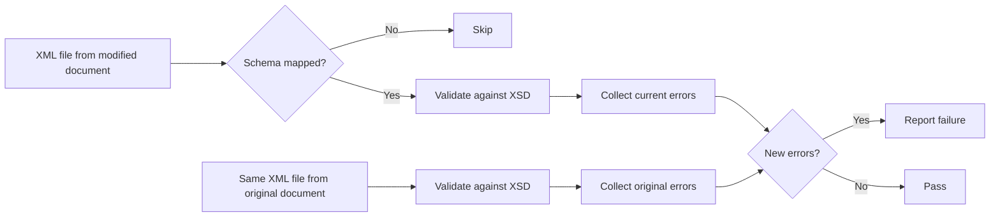
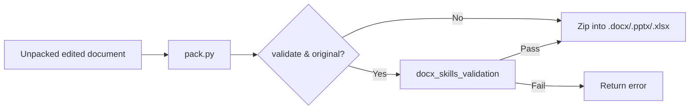
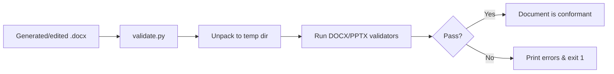

# docx_skills_validation

## Brief Introduction

`docx_skills_validation` is a Python-based validation toolkit for Office Open XML (OOXML) documents. It validates the XML structure, relationships, content types, and schema conformance of `.docx`, `.pptx`, and `.xlsx` files. For Word documents, it also validates tracked changes (redlining) against an original file to ensure that all modifications are properly recorded as revisions.

This module is part of the larger `docx_skills` family under `shared_skills` and is typically invoked after document generation, unpacking, or editing operations to guarantee that the resulting Office file is well-formed and will open correctly in Microsoft Office and LibreOffice.

---

## Core Functionality

The validation module provides:

1. **CLI-driven validation** via `validate.py`.
2. **Schema validation** against official OOXML XSDs (ISO/IEC 29500 and ECMA-376).
3. **Document-specific validators** for DOCX and PPTX formats.
4. **Redlining validation** for DOCX tracked changes.
5. **Auto-repair** for common issues such as oversized IDs and missing whitespace preservation.

---

## Architecture

### Component Overview



### Class Hierarchy



---

## Component Details

### `validate.py::main`

The command-line entry point. It accepts:

- `path`: An unpacked Office document directory or a packed `.docx`/`.pptx`/`.xlsx` file.
- `--original`: Path to the original file. Required for redlining validation and for filtering out pre-existing XSD errors.
- `--auto-repair`: Enables automatic repair of common issues.
- `--author`: Author name for redlining validation (default: `Claude`).
- `-v/--verbose`: Enables detailed output.

**Behavior:**

1. Resolves the file extension from the input path or the `--original` file.
2. If the input is a packed Office file, it unpacks it to a temporary directory.
3. Instantiates the appropriate validator(s):
   - **DOCX**: `DOCXSchemaValidator` + `RedliningValidator` (if `--original` is provided).
   - **PPTX**: `PPTXSchemaValidator`.
   - **XLSX**: Not supported for validation; exits with an error.
4. Runs `--auto-repair` if requested.
5. Runs validation and exits with code `0` on success or `1` on failure.

### `validators/base.py::BaseSchemaValidator`

Provides shared validation logic used by both `DOCXSchemaValidator` and `PPTXSchemaValidator`.

| Method | Purpose |
|--------|---------|
| `validate_xml()` | Checks that all XML files are well-formed. |
| `validate_namespaces()` | Ensures namespace prefixes declared in `mc:Ignorable` are actually declared. |
| `validate_unique_ids()` | Detects duplicate IDs for elements such as comments, bookmarks, slides, shapes, and sheets. |
| `validate_file_references()` | Verifies that all `.rels` references point to existing files and that all files are referenced. |
| `validate_content_types()` | Ensures `[Content_Types].xml` declares all main document parts and media extensions. |
| `validate_against_xsd()` | Validates XML files against mapped XSD schemas, ignoring errors already present in the original file. |
| `validate_all_relationship_ids()` | Confirms that `r:id` attributes reference existing relationship IDs of the correct type. |
| `repair_whitespace_preservation()` | Adds `xml:space="preserve"` to `w:t` elements that contain leading or trailing whitespace. |

Key class attributes:

- `SCHEMA_MAPPINGS`: Maps file names and namespaces to XSD files in the local `schemas` directory.
- `UNIQUE_ID_REQUIREMENTS`: Defines which elements require unique IDs and whether uniqueness is scoped per-file or globally.
- `OOXML_NAMESPACES`: Set of recognized OOXML namespaces used to strip ignorable vendor extensions before XSD validation.

### `validators/docx.py::DOCXSchemaValidator`

Word-specific validator extending `BaseSchemaValidator`.

Additional checks:

| Method | Purpose |
|--------|---------|
| `validate_whitespace_preservation()` | Ensures `w:t` elements with whitespace have `xml:space="preserve"`. |
| `validate_deletions()` | Prohibits `w:t` and `w:instrText` inside `w:del` elements. |
| `validate_insertions()` | Prohibits `w:delText` inside `w:ins` elements. |
| `validate_id_constraints()` | Ensures `w14:paraId` and `w16cid:durableId` values stay within OOXML limits. |
| `validate_comment_markers()` | Validates pairing of `commentRangeStart`, `commentRangeEnd`, and `commentReference` elements. |
| `compare_paragraph_counts()` | Reports paragraph count difference between original and modified documents. |
| `repair_durableId()` | Auto-repairs oversized `w16cid:durableId` values. |

### `validators/pptx.py::PPTXSchemaValidator`

PowerPoint-specific validator extending `BaseSchemaValidator`.

Additional checks:

| Method | Purpose |
|--------|---------|
| `validate_uuid_ids()` | Validates that UUID-like IDs contain only valid hex characters. |
| `validate_slide_layout_ids()` | Ensures slide master `sldLayoutId` references point to valid layout relationships. |
| `validate_notes_slide_references()` | Ensures each notes slide is referenced by at most one slide. |
| `validate_no_duplicate_slide_layouts()` | Ensures each slide has exactly one slide layout relationship. |

### `validators/redlining.py::RedliningValidator`

Validates tracked changes in Word documents by comparing the modified document against the original.

**Algorithm:**

1. If no tracked changes by the specified author exist, validation passes.
2. Unpacks the original `.docx` file to a temporary directory.
3. Removes all tracked changes made by the specified author from both the modified and original documents.
4. Extracts paragraph text from both documents.
5. If the extracted texts differ, the validation fails and a word-level diff is printed.

This ensures that any text change introduced by the author is captured inside a tracked change and does not leak into the base document.

---

## Data Flow

### Validation Flow



### XSD Validation with Original Error Baseline



---

## Dependencies

### Internal Modules

| Module | Relationship | Description |
|--------|--------------|-------------|
| [docx_skills_packaging](docx_skills_packaging.md) | Consumer / sibling | `pack.py` invokes validation before zipping; `validate.py` can unpack packed files. |
| [docx_skills_xml_helpers](docx_skills_xml_helpers.md) | Sibling | `merge_runs` and `simplify_redlines` normalize documents before or after validation. |
| [docx_skills_libreoffice](docx_skills_libreoffice.md) | Sibling | LibreOffice-based workflows (e.g., `accept_changes`) produce documents that are later validated. |
| [docx_skills_generation](docx_skills_generation.md) | Sibling | `generate.py` performs high-level DOCX inspection; validation ensures generated files are OOXML-conformant. |

### External Libraries

| Library | Purpose |
|---------|---------|
| `lxml` | XML parsing, XPath, and XSD schema validation. |
| `defusedxml` | Secure XML parsing for DOM-based repairs. |
| `zipfile` | Unpacking packed Office documents. |
| `tempfile` | Temporary directories for unpacking originals and inputs. |
| `subprocess` | Invoking `git diff --word-diff` for redlining diagnostics. |

---

## How It Fits into the System

`docx_skills_validation` sits at the end of the document manipulation pipeline within `docx_skills`. After a document is generated, unpacked, edited, or repacked, this module ensures that:

- The XML is well-formed.
- All internal relationships resolve correctly.
- The document conforms to OOXML XSD schemas.
- Tracked changes are correctly applied and do not corrupt the document text.

It is invoked by:

- The `pack.py` packaging step when `validate=True` and an `original_file` is supplied.
- Direct command-line usage by developers and automated tests.
- Downstream document-generation skills that need a final conformance gate before returning a file to users.

---

## Process Flows

### Packing with Validation



### Manual Validation Workflow



---

## Configuration and Usage

### Command-Line Examples

```bash
# Validate a packed DOCX against an original file (includes redlining checks)
python validate.py document.docx --original original.docx --author Claude -v

# Validate an unpacked directory
python validate.py ./unpacked_document --original original.docx

# Auto-repair common issues
python validate.py document.docx --original original.docx --auto-repair

# Validate a PPTX file
python validate.py presentation.pptx --original original.pptx -v
```

### Programmatic Usage

```python
from validators import DOCXSchemaValidator, RedliningValidator

validator = DOCXSchemaValidator("./unpacked_docx", "original.docx", verbose=True)
schema_ok = validator.validate()

redliner = RedliningValidator("./unpacked_docx", "original.docx", author="Claude")
redline_ok = redliner.validate()
```

---

## Error Handling

- **XML syntax errors** are reported with file path and line number.
- **Broken references** and **unreferenced files** are flagged as critical because they typically cause Office applications to report the document as corrupt.
- **XSD validation** reports only *new* errors introduced since the original file, avoiding noise from pre-existing schema deviations.
- **Redlining failures** include a word-level diff and guidance on correct tracked-change patterns.

---

## Notes

- XLSX validation is not currently implemented; `validate.py` exits with an error for `.xlsx` inputs.
- The `schemas` directory is expected to be located next to the `validators` package (i.e., `../schemas` from `base.py`).
- The redlining validator depends on `git` being available in the environment to produce readable word diffs.
