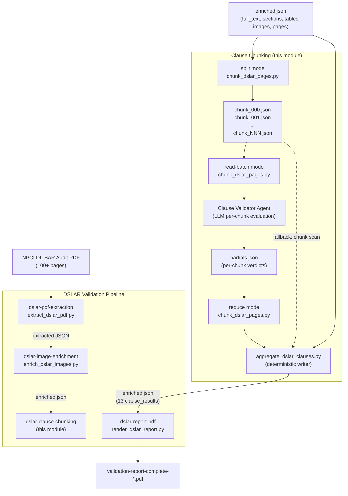
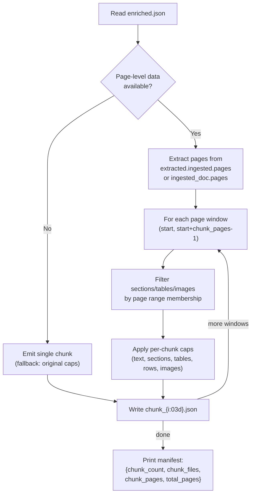
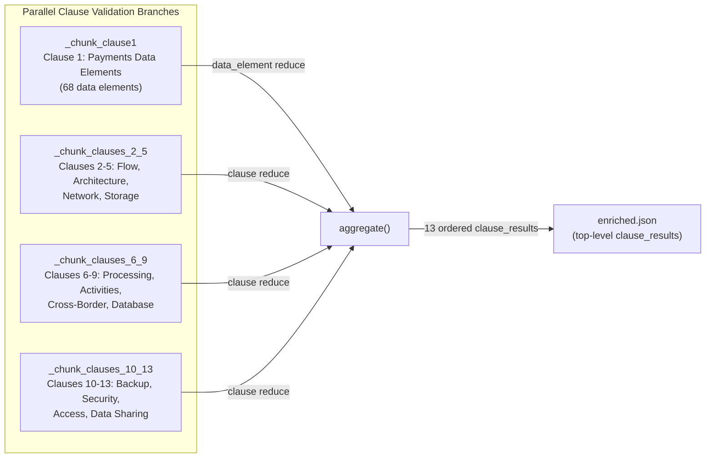
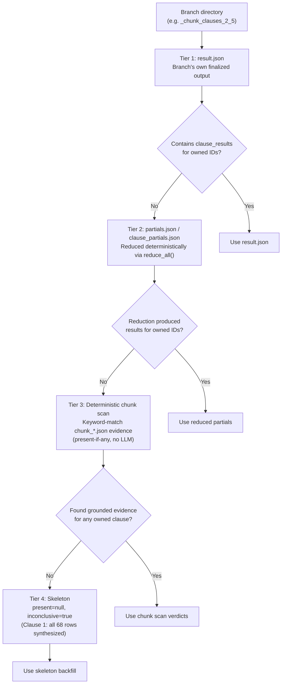
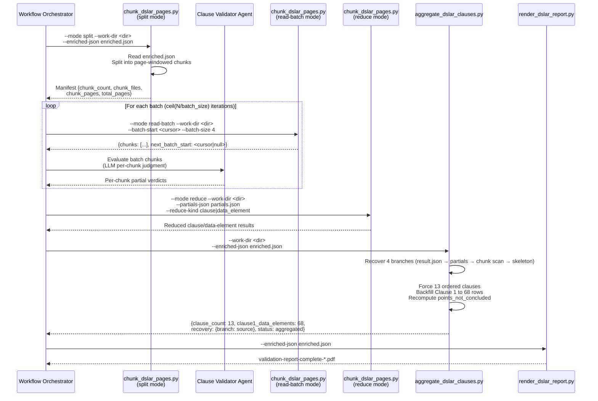
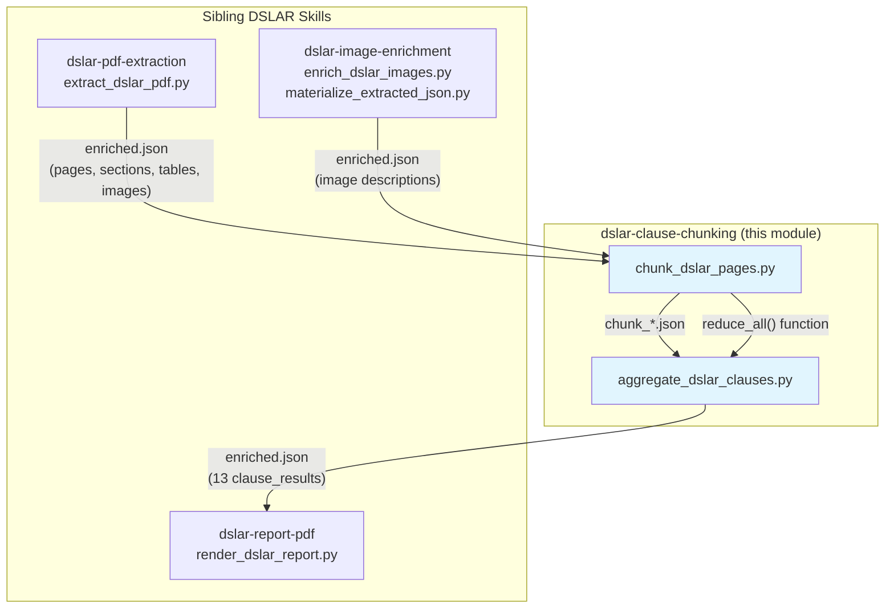

# DSLAR Clause Chunking Module

## Introduction

The **dslar-clause-chunking** module is a critical component of the NPCI DL-SAR (Digital Lending – System Audit Report) validation pipeline. Its primary purpose is to solve a fundamental scalability problem: large audit PDFs (100+ pages) overflow the single-read evidence caps used by clause validators (`full_text[:50000]`, `sections[:50]`, `tables[:20]`), causing evidence on later pages to be silently dropped and clauses to be wrongly reported as not-present or inconclusive.

This module implements a **map-reduce** strategy: it splits the already-extracted `enriched.json` into page-windowed chunks that each fit comfortably under per-read caps, allows the clause validator agent to evaluate each chunk independently, and then deterministically reduces the per-chunk partial verdicts using a **present-if-any** rule. Additionally, it provides a deterministic aggregator that guarantees the final `enriched.json` always contains exactly 13 ordered clause results — even when parallel validation branches run out of iteration budget.

The module consists of two scripts:
- **`chunk_dslar_pages.py`** — Page-chunking, batch reading, and map-reduce helpers
- **`aggregate_dslar_clauses.py`** — Deterministic aggregation of four parallel clause validation branches

---

## Architecture Overview



---

## Component Documentation

### 1. `chunk_dslar_pages.py` — Page-Chunking & Map-Reduce Helper

#### Purpose

This script is the deterministic engine for splitting large audit documents into manageable chunks and reducing per-chunk verdicts. It operates in four CLI modes, each serving a distinct role in the map-reduce workflow.

#### Operating Modes

| Mode | CLI Flag | Description |
|------|----------|-------------|
| **split** | `--mode split` | Reads `enriched.json`, writes `chunk_000.json` … `chunk_NNN.json`, and prints a manifest with chunk count, file paths, and page metadata. |
| **read** | `--mode read` | Prints one chunk's capped evidence (`--chunk-index`). Used for single-chunk inspection. |
| **read-batch** | `--mode read-batch` | Prints several chunks' evidence in one call (`--batch-start` + `--batch-size`, default 4) plus a `next_batch_start` cursor. **Preferred read mode** — collapses an N-chunk evidence sweep from N agent tool-iterations into `ceil(N / batch_size)` calls. |
| **reduce** | `--mode reduce` | Reads per-chunk partial verdicts (`--partials-json`) and prints reduced clause or data-element results (`--reduce-kind`). |

#### Evidence Caps (Per Chunk)

These caps mirror the original single-read caps from the clause validator SKILL.md files but are applied **per chunk** so each LLM turn stays within context:

| Cap | Value | Description |
|-----|-------|-------------|
| `FULL_TEXT_CAP` | 50,000 chars | Maximum text per chunk |
| `SECTIONS_CAP` | 50 | Maximum sections per chunk |
| `TABLES_CAP` | 20 | Maximum tables per chunk |
| `ROWS_PER_TABLE_CAP` | 50 | Maximum rows per table |
| `IMAGES_CAP` | 100 | Maximum images per chunk |
| `DEFAULT_CHUNK_PAGES` | 15 | Pages per chunk |
| `DEFAULT_BATCH_SIZE` | 4 | Chunks per batch read |

#### Split Logic

The `split_pages()` function extracts the page-level list from the enriched payload (looking in `extracted.ingested.pages` first, then falling back to `ingested_doc.pages`). Each chunk mirrors the evidence shape the clause validators expect (`full_text`, `sections`, `tables`, `images`) but restricted to a contiguous window of pages. Sections, tables, and images already carry a `page` field (set by the PDF extraction step), so windowing is a simple range membership test.

**Fallback behavior**: If no page-level ingestion is available (older payloads), a single chunk is emitted from the flattened evidence, degrading to the original single-read path.



#### Reduce Logic (Present-If-Any)

The reduce step implements a **present-if-any** rule across per-chunk partial verdicts:

| Field | Reduction Rule |
|-------|----------------|
| `present` | `True` if any partial is present; `False` only if every partial is clearly not-present; `None` (inconclusive) otherwise |
| `satisfactory` | `False` if any contributing partial is False; `True` if all contributing are True; `None` otherwise |
| `evidence_refs` | Union of all partials' evidence references (deduplicated, order-preserving) |
| `raw_agent_output` | Lists chunk indices where evidence was found |

Two reduce granularities are supported:
- **`clause`** — Groups partials by `clause_id`, returns `{"clause_results": [...]}` (for Clauses 2–13)
- **`data_element`** — Groups partials by `serial`, returns `{"data_element_results": [...]}` (for Clause 1's 68 data elements)

#### Backward Compatibility

A document with `total_pages <= chunk_pages` yields a single chunk whose caps equal the original full-document caps. Present-if-any over one partial is the identity — behavior is unchanged for small PDFs.

#### UTF-8 Safety

The `_force_utf8_stdout()` function reconfigures stdout/stderr to UTF-8 encoding regardless of the host code page. This is essential because real DL-SAR PDFs contain non-cp1252 glyphs (bullets `\u25aa`, smart quotes, dashes) that would crash `print(json.dumps(..., ensure_ascii=False))` on Windows (which defaults to cp1252).

---

### 2. `aggregate_dslar_clauses.py` — Deterministic Clause Branch Aggregator

#### Purpose

This script is the **single, deterministic writer** that the `clause-results-aggregator` workflow node runs. It guarantees that `enriched.json` ends with exactly **13 ordered clause results** (Clause 1 carrying all 68 data-element rows), regardless of whether the four parallel clause validators finished. This guarantee prevents the rendered `validation-report-complete-*.pdf` from collapsing to a metadata-only page when a clause branch runs out of iteration budget.

#### Parallel Branch Layout

The four parallel clause validation branches are organized as follows:



#### Recovery Precedence (Per Branch)

Each branch is recovered using a four-tier precedence system, from most trustworthy to least:



**Tier 3 — Deterministic Chunk Scan** is a key innovation. When a clause branch split and read its chunks but ran out of iteration budget before writing partials or results, the `chunk_*.json` files still hold the capped evidence. Rather than collapsing those clauses to a blank skeleton, the aggregator scans the chunks deterministically (no LLM) using per-clause keyword sets and emits a present-if-any verdict grounded in matched phrases. This is coarser than an agent-reasoned verdict (it cannot judge "satisfactory"), so `satisfactory` is left `null` and the clause is marked present-but-inconclusive.

#### Canonical Clause Definitions

The module embeds the 13 canonical NPCI DL-SAR clauses and their names:

| Clause ID | Clause Name |
|-----------|-------------|
| 1 | Payments Data Elements (68 data-element rows) |
| 2 | Transaction/Data Flow |
| 3 | Application Architecture |
| 4 | Network Diagram/Architecture |
| 5 | Data Storage |
| 6 | Transaction Processing |
| 7 | Activities Related to Payment Processing |
| 8 | Cross Border Transactions |
| 9 | Database Storage and Maintenance |
| 10 | Data Backup & Restoration |
| 11 | Data Security |
| 12 | Access Management |
| 13 | Data Sharing |

**Clause 1 Data Elements**: Serials 1–34 are payments data (Customer Data, Transaction Data, Payment Sensitive Data, Payment Credentials Data). Serials 35–68 are non-payments data. Named payment elements (e.g., Customer Name, Mobile Number, VPA, Aadhar, UPI PIN) have explicit labels and keyword phrases for chunk scanning; unlabeled serials use generic labels.

#### Clause 1 Rollup Rule

The parent Clause-1 verdict is rolled up from its 68 data-element rows:

| Condition | Parent `present` | Parent `inconclusive` |
|-----------|------------------|-----------------------|
| Any row inconclusive | `None` | `True` |
| All rows present | `True` | `False` |
| Any row not-present (no inconclusive) | `False` | `False` |

Satisfactory: `False` if any row is `False`; `True` if all are `True`; `None` otherwise.

#### Aggregation Guarantees

The `aggregate()` function enforces these invariants:

1. **Exactly 13 ordered clauses** — Missing clauses are backfilled with skeletons (or normalized Clause-1 entries with all 68 rows).
2. **Clause 1 always has 68 data-element rows** — Missing serials are backfilled with not-concluded skeleton rows; canonical scope/category/label is filled in for any row that left them blank.
3. **`points_not_concluded` is recomputed** — Preserves existing entries from the metadata validator, adds branch-level points, and adds one string per inconclusive clause.
4. **`validation_type` is normalized** — Set to `"dlsar"` (or `"report"` if originally `"report"`), never `"DL-SAR"` or other variants.
5. **Never raises on empty branches** — Only hard-fails if `enriched.json` itself cannot be read.

#### Cross-Module Dependency: `reduce_all` Import

The aggregator imports `reduce_all` from the sibling `chunk_dslar_pages.py` via `importlib.util.spec_from_file_location` (resolved from the script's own directory, not CWD). If the import fails for any reason, it falls back to a subprocess invocation of `--mode reduce`. This ensures the pure reducer logic is shared, not duplicated.

---

## Data Flow



---

## Module Dependencies



### Upstream Dependencies

- **[dslar_skills_dslar_pdf_extraction](dslar_skills_dslar_pdf_extraction.md)** — Produces the initial `enriched.json` with page-level data (`extracted.ingested.pages`), sections, tables, and images. Each section/table/image carries a `page` field that the chunking logic uses for windowing.
- **[dslar_skills_dslar_image_enrichment](dslar_skills_dslar_image_enrichment.md)** — Enriches image records with vision model descriptions. The enriched `enriched.json` is the input to the split mode.

### Downstream Dependencies

- **[dslar_skills_dslar_report_rendering](dslar_skills_dslar_report_rendering.md)** — Consumes the aggregated `enriched.json` (with 13 ordered `clause_results` at the top level) to render the final `validation-report-complete-*.pdf`. The aggregator's guarantee of exactly 13 clauses prevents the report from collapsing to a metadata-only page.

### Internal Dependency

- `aggregate_dslar_clauses.py` imports `reduce_all` from `chunk_dslar_pages.py` (via `importlib` with subprocess fallback). This is the only cross-file dependency within the module.

---

## Key Design Decisions

### 1. Deterministic Split + Reduce, LLM-Orchestrated Evaluation

The split and reduce logic is fully deterministic (pure Python, no LLM calls). The per-chunk LLM judgment is orchestrated by the agent prompt — a `code_executor` block cannot issue the agent's own model calls. This separation ensures that the chunking infrastructure is testable and predictable, while the LLM handles the semantic evaluation.

### 2. Batch Reading to Bound Tool Iterations

The `read-batch` mode is the preferred read mode because it collapses an N-chunk evidence sweep from N agent tool-iterations into `ceil(N / batch_size)` calls. Without this, large reports would exhaust the per-node iteration budget mid-loop, truncating the branch and emitting no `clause_results`.

### 3. Four-Tier Recovery with Deterministic Chunk Scan

The deterministic chunk scan (Tier 3) is a pragmatic fallback that recovers grounded evidence from chunk files when a branch ran out of budget. It uses per-clause keyword sets specific enough to avoid matching table-of-contents noise. The scan cannot judge "satisfactory," so it marks clauses as present-but-inconclusive — accurate, since the evidence exists but no auditor conclusion was reduced.

### 4. Guaranteed 13 Clauses with Skeleton Backfill

The aggregator never raises on an empty branch. Missing clauses are backfilled with skeletons (`present=null`, `inconclusive=true`), and Clause 1 is always normalized to 68 data-element rows. This guarantee is what keeps the rendered PDF from collapsing.

### 5. Present-If-Any Reduction Semantics

The present-if-any rule is intentionally permissive: a clause is considered present if **any** chunk contains evidence of it. This is correct for audit validation because the same clause may be discussed on different pages of a large report, and dropping evidence from later pages was the original bug this module was designed to fix.

---

## CLI Reference

### `chunk_dslar_pages.py`

```bash
# Split enriched.json into page-windowed chunks
python chunk_dslar_pages.py \
    --mode split \
    --work-dir <WORKFLOW_ARTIFACT_DIR> \
    --enriched-json <path/to/enriched.json> \
    --chunk-pages 15

# Read a single chunk's evidence
python chunk_dslar_pages.py \
    --mode read \
    --work-dir <WORKFLOW_ARTIFACT_DIR> \
    --chunk-index 0

# Read a batch of chunks (preferred)
python chunk_dslar_pages.py \
    --mode read-batch \
    --work-dir <WORKFLOW_ARTIFACT_DIR> \
    --batch-start 0 \
    --batch-size 4

# Reduce per-chunk partials
python chunk_dslar_pages.py \
    --mode reduce \
    --work-dir <WORKFLOW_ARTIFACT_DIR> \
    --partials-json <path/to/partials.json> \
    --reduce-kind clause  # or: data_element
```

### `aggregate_dslar_clauses.py`

```bash
python aggregate_dslar_clauses.py \
    --work-dir <WORKFLOW_ARTIFACT_DIR> \
    --enriched-json <path/to/enriched.json> \
    --output-json <path/to/output.json>  # optional; defaults to in-place
```

**Output** (stdout JSON):
```json
{
    "artifact_dir": "/path/to/work/dir",
    "enriched_json": "/path/to/enriched.json",
    "clause_count": 13,
    "clause1_data_elements": 68,
    "recovery": {
        "_chunk_clause1": "result.json",
        "_chunk_clauses_2_5": "partials.json",
        "_chunk_clauses_6_9": "chunk_scan",
        "_chunk_clauses_10_13": "skeleton"
    },
    "validation_type": "dlsar",
    "status": "clause_results_aggregated"
}
```

---

## Error Handling

| Scenario | Behavior |
|----------|----------|
| `enriched.json` not found | Aggregator exits with code 2, prints `{"error": "..."}` |
| `enriched.json` unreadable | Aggregator exits with code 2 (only hard failure) |
| `enriched.json` not a JSON object | Aggregator exits with code 2 |
| Empty branch directory | Aggregator falls through to skeleton backfill |
| No page-level data in payload | Split emits single chunk from flattened evidence (fallback) |
| Non-cp1252 glyphs on Windows | `_force_utf8_stdout()` reconfigures streams to UTF-8 |
| `reduce_all` import failure | Aggregator falls back to subprocess invocation of `--mode reduce` |
| `--chunk-index` missing in read mode | Raises `SystemExit` with error message |
| `--partials-json` missing in reduce mode | Raises `SystemExit` with error message |
