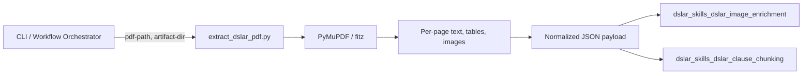
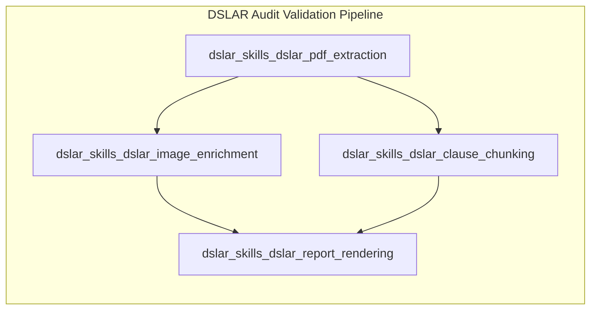
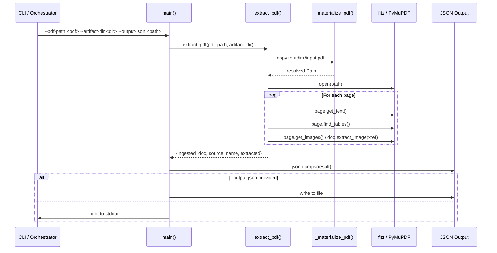
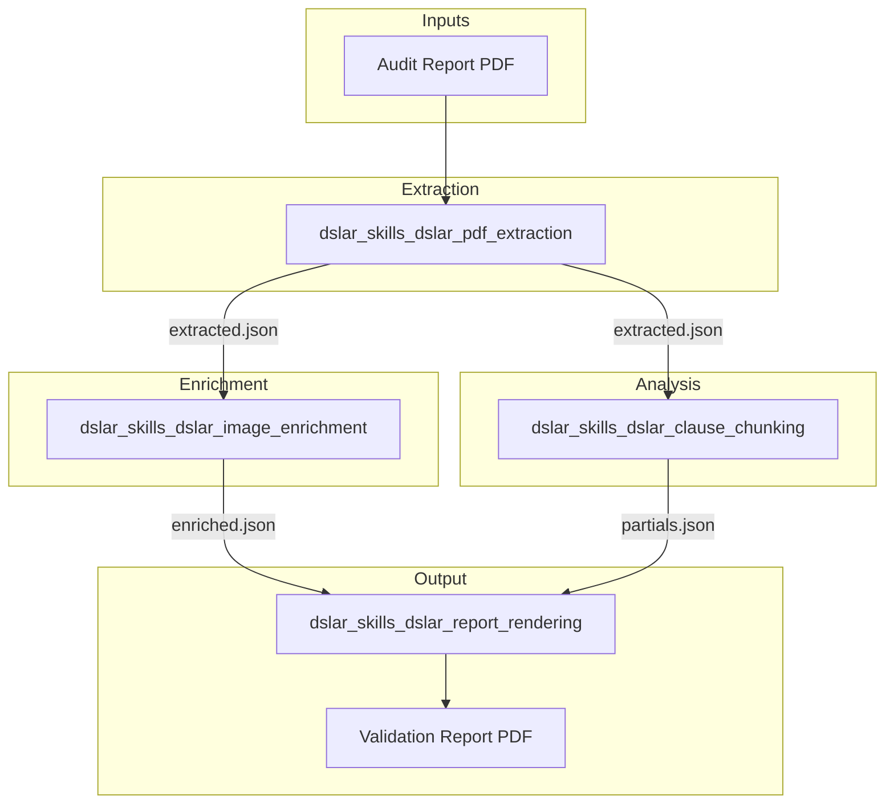

# DSLAR PDF Extraction Skill

## Brief Introduction

The `dslar_skills_dslar_pdf_extraction` module is a deterministic, CLI-driven PDF extraction skill used in the NPCI DL-SAR (Digital Lending – Statement of Account / audit report) validation pipeline. It converts an input PDF audit report into a structured JSON payload containing per-page text, tables, image references, and metadata. The output is designed to be consumed downstream by the [dslar_skills_dslar_image_enrichment](dslar_skills_dslar_image_enrichment.md) and [dslar_skills_dslar_clause_chunking](dslar_skills_dslar_clause_chunking.md) modules, and ultimately rendered by [dslar_skills_dslar_report_rendering](dslar_skills_dslar_report_rendering.md).

This module intentionally performs **no LLM calls** and is fully deterministic: it relies on [PyMuPDF](https://pymupdf.readthedocs.io/) (`fitz`) for text, table, and image extraction. Its single responsibility is to transform a binary PDF into a normalized, machine-readable representation that the rest of the DSLAR workflow can process.

---

## Core Functionality

### 1. PDF Materialization

Before extraction, the input file is optionally copied into a workflow artifact directory as `input.pdf`. This guarantees that downstream steps have a stable, well-known path to the source document while preserving the original filename in the output payload.

### 2. Per-Page Extraction

For every page in the PDF, the skill extracts:

- **Plain text** – the full text content of the page.
- **Tables** – structured grid data using PyMuPDF’s table finder.
- **Image references** – lightweight identifiers for each embedded image.
- **Image metadata** – extension, MIME type, byte size, SHA-256 hash, and page/xref cross-reference.

### 3. Normalized Output

The extracted data is assembled into a single JSON object with three top-level sections:

- `ingested_doc` – raw per-page extraction results.
- `source_name` – the original filename (preserved for traceability).
- `extracted` – normalized aggregates:
  - `full_text` – concatenated text across all pages.
  - `sections` – per-page heading + text.
  - `tables` – flattened table records with page context.
  - `images` – normalized image records (descriptions are left empty; enrichment is handled by the image-enrichment skill).

### 4. Native Output Suppression

MuPDF’s C-extension can emit noisy stdout/stderr messages. The module wraps extraction in a context manager that redirects file descriptors to a temporary sink, keeping CLI output clean and JSON-safe.

---

## Architecture

### Component Overview



### Module Placement in DSLAR Pipeline



The PDF extraction skill is the **entry point** of the DSLAR pipeline. It produces the canonical JSON representation that all downstream skills consume.

---

## Component Relationships

### `extract_dslar_pdf.py`

| Function | Responsibility |
|----------|----------------|
| `main` | CLI entry point. Parses arguments, calls `extract_pdf`, and writes/prints JSON. |
| `extract_pdf` | Core orchestrator: materializes PDF, opens with `fitz`, iterates pages, builds normalized output. |
| `_materialize_pdf` | Copies the source PDF into the artifact directory as `input.pdf` when `artifact_dir` is provided. |
| `_extract_tables` | Uses PyMuPDF `page.find_tables()` to extract grid data per page. |
| `_extract_images` | Extracts image xrefs, builds stable refs, and computes metadata (ext, MIME, size, SHA-256). |
| `_suppress_native_output` | Context manager that silences C-extension stdout/stderr during extraction. |
| `_str_cell` | Normalizes `None` table cells to empty strings. |
| `_mime_type_for_ext` | Maps image extensions to MIME types. |

### Data Flow



---

## CLI Usage

```bash
python extract_dslar_pdf.py \
  --pdf-path /path/to/audit-report.pdf \
  --artifact-dir /workflow/artifacts \
  --output-json /workflow/artifacts/extracted.json
```

### Arguments

| Argument | Required | Default | Description |
|----------|----------|---------|-------------|
| `--pdf-path` | Yes | – | Path to the PDF audit report. |
| `--artifact-dir` | No | `WORKFLOW_ARTIFACT_DIR` env var | Workflow artifact directory; input PDF is copied here as `input.pdf`. |
| `--output-json` | No | – | Optional path to write the JSON payload. If omitted, JSON is printed to stdout. |
| `--describe-images` | No | `"false"` | Deprecated compatibility flag. Image metadata is always extracted; descriptions are added later by the image-enrichment skill. |

---

## Output Schema

The emitted JSON has the following shape:

```json
{
  "ingested_doc": {
    "source_path": "/workflow/artifacts/input.pdf",
    "source_name": "original-audit-report.pdf",
    "pages": [
      {
        "page_index": 0,
        "text": "...",
        "tables": [[["cell1", "cell2"], ["cell3", "cell4"]]],
        "image_refs": ["page_0_img_12"],
        "image_metadata": [
          {
            "page": 0,
            "ref": "page_0_img_12",
            "xref": 12,
            "ext": "png",
            "mime_type": "image/png",
            "byte_size": 12345,
            "sha256": "..."
          }
        ]
      }
    ]
  },
  "source_name": "original-audit-report.pdf",
  "extracted": {
    "source_name": "original-audit-report.pdf",
    "full_text": "...",
    "sections": [
      {"page": 0, "heading": "Section heading...", "text": "..."}
    ],
    "tables": [
      {"page": 0, "table_index": 0, "rows": [[...]], "context": "..."}
    ],
    "images": [
      {"page": 0, "ref": "page_0_img_12", "description": ""}
    ],
    "ingested": { /* same as ingested_doc */ }
  }
}
```

---

## Dependencies

### Runtime Dependencies

- **PyMuPDF (`fitz`)** – PDF parsing, text/table/image extraction.
- **Python standard library** – `argparse`, `contextlib`, `hashlib`, `io`, `json`, `os`, `shutil`, `sys`, `tempfile`, `pathlib`, `typing`.

### Module Dependencies

This module has **no direct code dependencies** on other DSLAR skills. It is a pure extraction step. However, it is designed to feed:

- [dslar_skills_dslar_image_enrichment](dslar_skills_dslar_image_enrichment.md) – consumes the `images` array and populates `description` fields using a vision model.
- [dslar_skills_dslar_clause_chunking](dslar_skills_dslar_clause_chunking.md) – consumes `extracted.full_text` / `extracted.sections` and splits pages into chunks for clause-level validation.
- [dslar_skills_dslar_report_rendering](dslar_skills_dslar_report_rendering.md) – consumes the enriched payload to render the final validation report PDF.

---

## How It Fits into the Overall System

The DSLAR skills live under the `shared_skills` area of the repository, specifically within the `ABStudio/skills/ainxt-skills/dslar-*` packages. They are typically invoked by the ABStudio workflow engine or by standalone scripts as part of an NPCI DL-SAR audit validation workflow.

At a higher level, the data flow is:

1. A user or trigger uploads a PDF audit report.
2. The workflow orchestrator calls `extract_dslar_pdf.py` to produce `extracted.json`.
3. `extracted.json` is passed in parallel to:
   - Image enrichment (for vision-based image understanding).
   - Clause chunking (for regulatory clause extraction and validation).
4. Partial results are reduced into a final enriched payload.
5. The report-rendering skill produces a human-readable validation report PDF.



---

## Design Decisions & Notes

- **Deterministic only** – No LLM calls, no stochastic behavior. This makes the extraction step fast, cheap, and reproducible.
- **Image metadata without base64** – The skill extracts image metadata and references but does not embed base64 payloads. This keeps the JSON small and avoids duplicating binary data. Downstream enrichment can re-open the PDF via `source_path` if needed.
- `--describe-images` is deprecated – It exists for backward compatibility with older workflow definitions but does not change behavior.
- **Original filename preservation** – `source_name` is captured before materialization so that reports can reference the user-facing filename even after the file is copied to `input.pdf`.
- **Fault-tolerant extraction** – Each extraction sub-step (text, tables, images) is wrapped in broad exception handling so that a malformed page or image does not fail the entire document.

---

## Related Documentation

- [dslar_skills_dslar_image_enrichment](dslar_skills_dslar_image_enrichment.md)
- [dslar_skills_dslar_clause_chunking](dslar_skills_dslar_clause_chunking.md)
- [dslar_skills_dslar_report_rendering](dslar_skills_dslar_report_rendering.md)
- [shared_skills](shared_skills.md)
