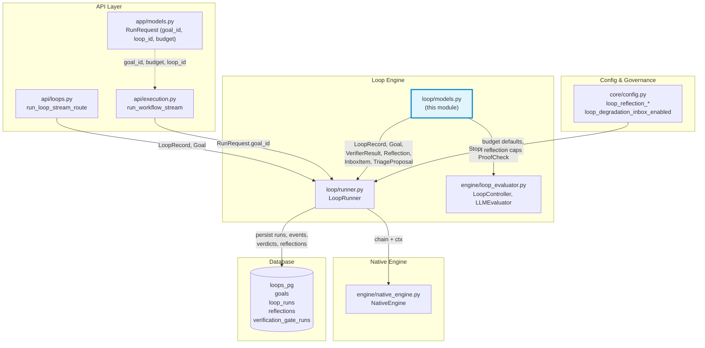
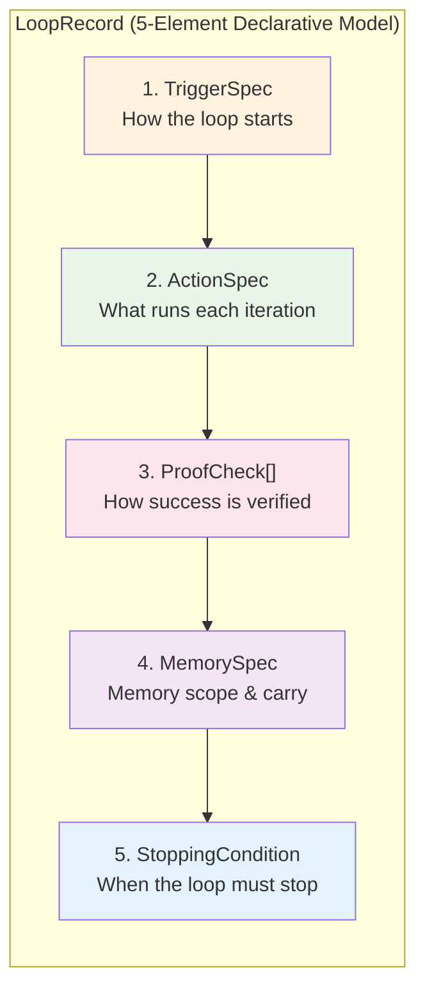
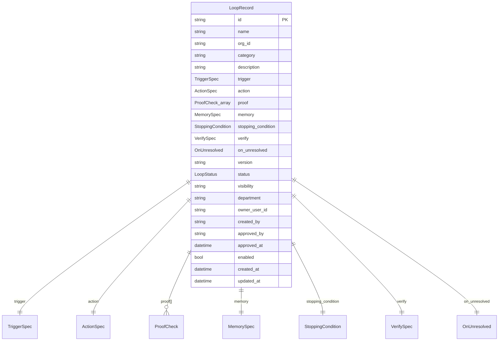
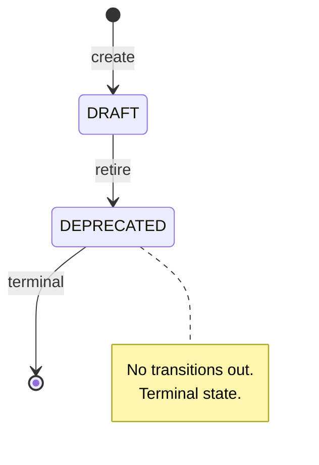
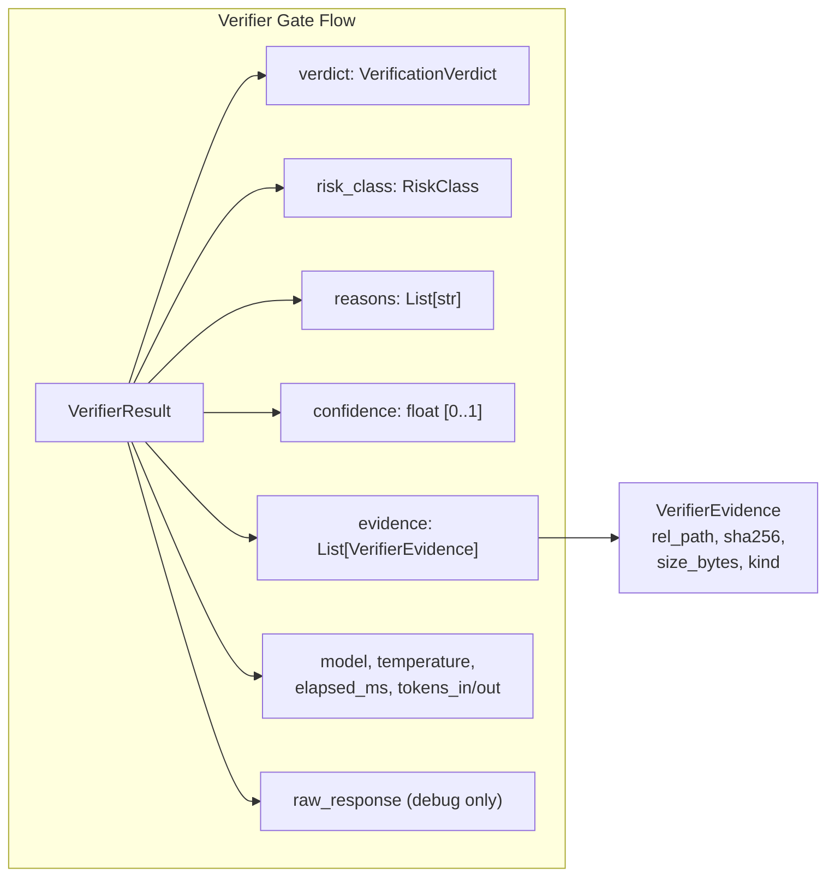
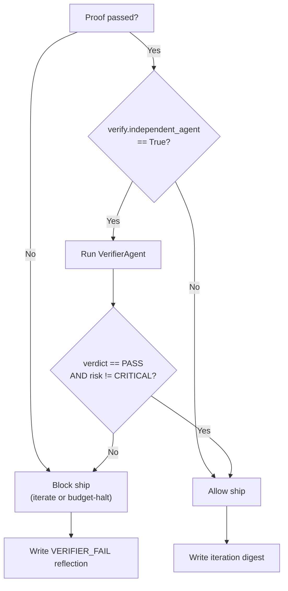
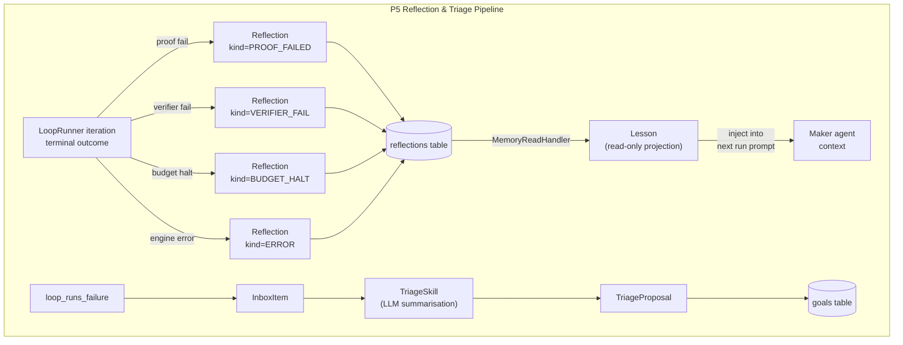
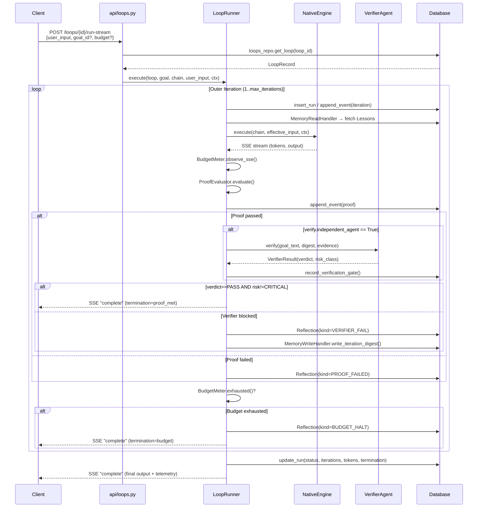
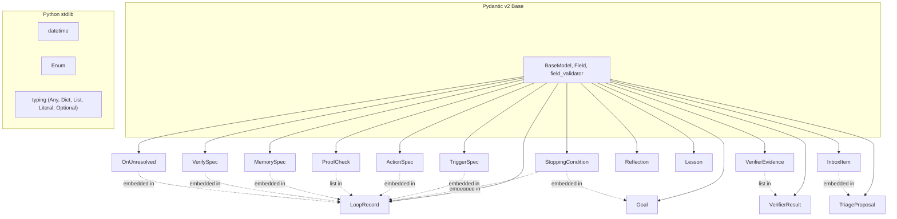

# Loop Models (`loop_models`)

> **Source file:** `ABStudio/backend/app/loop/models.py`

## Introduction

The `loop_models` module is the **canonical type contract** for ABStudio's Loop Engineering subsystem. It defines the Pydantic v2 data models that mirror the JSONB layout of the `loops_pg`, `goals`, and `loop_runs` database tables, and that flow through every layer of the loop lifecycle — from the REST API (`/loops/{id}/run-stream`) through the `LoopRunner` outer-loop dispatcher, the `VerifierAgent` independent gate, and the P5 reflection / triage / memory subsystems.

The module is intentionally **declarative and side-effect free**: it contains no I/O, no DB calls, and no business logic beyond field validation and the `is_legal_transition` state-graph helper. This makes it the single source of truth that the [loop_runner](loop_runner.md), [api_loops](../api/api_loops.md), [engine_loop_evaluator](engine_loop_evaluator.md), and [core_config](../core/core_config.md) modules all import and agree upon.

Field names follow the **SRS v2 Appendix-A reference loop** specification, so an operator who knows the spec can author a Loop record by hand without consulting this file.

---

## Architecture Overview

### Module Position in the System

### The 5-Element Declarative Loop Model

At the heart of the module is a five-element declarative model that fully specifies what a loop does, how it's triggered, how success is proven, how memory is scoped, and when it must stop:

---

## Core Components

### 1. TriggerSpec — How the Loop Starts

Defines the invocation mechanism for a loop. In v1 (D11), only `manual` and `cron` trigger types are honoured by the scheduler; the remaining types (`jira_webhook`, `log_alert`, `queue_event`) are accepted by the schema for forward compatibility so a LoopRecord can be persisted today and exercised once the scheduler gains support.

| Field | Type | Description |
|-------|------|-------------|
| `type` | `Literal["manual", "cron", "jira_webhook", "log_alert", "queue_event"]` | Trigger mechanism (default: `"manual"`) |
| `cron` | `Optional[str]` | 5-field cron expression in IST; required when `type == "cron"` |
| `at_time` | `Optional[str]` | Convenience helper for "daily/weekly at HH:MM" — scheduler converts to cron at registration |
| `filter` | `Optional[Dict[str, Any]]` | Free-form filter blob (e.g. `{"project": "ABC", "status": "Open"}` for jira_webhook) |

### 2. ActionSpec — What the Loop Runs

Specifies the engine and target executed each iteration. When `engine='workflow'`, `target_id` references a `workflows.id`; when `engine='agent'`, it points at a single agent — the `LoopRunner` synthesises a 1-node chain around it before handing off to `NativeEngine.execute()`.

| Field | Type | Description |
|-------|------|-------------|
| `engine` | `Literal["workflow", "agent"]` | Execution engine (default: `"workflow"`) |
| `target_id` | `str` | ID of the workflow or agent to run |
| `instructions` | `Optional[str]` | Free-text augment of the agent system prompt — injected when set |

### 3. ProofCheck — Declarative Success Verification

Each `ProofCheck` represents one declarative proof gate. The set of check types is fixed (D6 — no Docker, no new sandbox); new check types require an engine-side dispatcher branch in `proof.py` (P2).

| Field | Type | Description |
|-------|------|-------------|
| `type` | `Literal["test_suite", "coverage", "repro_check", "latency", "scanner", "llm_judge"]` | Check type |
| `must_pass` | `bool` | Whether this check is mandatory (default: `True`) |
| `threshold` | `Optional[float]` | Coverage %, latency ms, or llm_judge score depending on `type` |
| `config` | `Dict[str, Any]` | Type-specific config (e.g. `{"cmd": ["pytest", "-q"]}`) |

### 4. MemorySpec — Memory Scope

Controls per-run vs persistent memory scope. Used by the P5 `ReflectionWriter` and `MemoryReadHandler` in the [loop_runner](loop_runner.md) module.

| Field | Type | Description |
|-------|------|-------------|
| `scope` | `Literal["run", "persistent"]` | Memory scope (default: `"run"`) |
| `carry` | `List[str]` | Keys to carry between iterations |

### 5. StoppingCondition — Finite Loop Guarantee (FR-1.7)

**Every Loop MUST carry a finite `StoppingCondition`.** This is a hard requirement (FR-1.7) enforced at validation time. The `max_iterations` and `budget_tokens` fields carry `ge=1` constraints that raise at Pydantic v2 field-validation time, blocking zero/negative values so no API path can persist a no-stop loop.

| Field | Type | Description |
|-------|------|-------------|
| `measure` | `str` | Human-readable predicate (LLM-judged) |
| `max_iterations` | `int` | Outer-loop cap (`ge=1, le=100`) |
| `budget_tokens` | `int` | Token cap (`ge=1`) |
| `wall_clock_s` | `Optional[int]` | Optional wall-clock cap (`ge=1`); falls through to env default when omitted |

### Supporting Specs

#### VerifySpec — Independent Pre-Ship Verifier

Honoured in P4 by the `VerifierAgent`. When `independent_agent=True`, the `LoopRunner` runs an independent verifier gate between proof-pass and ship.

| Field | Type | Description |
|-------|------|-------------|
| `independent_agent` | `bool` | Whether to run the independent verifier (default: `False`) |
| `criteria` | `Optional[str]` | Verification criteria text |
| `model` | `Optional[str]` | Overrides `VERIFIER_MODEL` when set |

#### OnUnresolved — Degradation Routing

Routes non-shipped outcomes (P5 degradation router). Controlled by the `loop_degradation_inbox_enabled` config flag in [core_config](../core/core_config.md).

| Field | Type | Description |
|-------|------|-------------|
| `route_to` | `Literal["triage_inbox", "drop"]` | Where to route unresolved outcomes (default: `"triage_inbox"`) |

---

## LoopRecord — The Main Entity

`LoopRecord` is the declarative `Loop` row stored in the `loops_pg` table. Every field maps 1:1 to a column or JSONB key in the Phase 1 Foundations specification. Optional fields are left `None` on create so DB defaults take over.

### FR-1.7 Belt-and-Braces Validation

The `LoopRecord._stop_cond_required` field validator provides a stable error message ("FR-1.7") regardless of which sub-field of `StoppingCondition` was the offender, so the frontend can route the message to a single inline error slot near the budget controls.

---

## Status Management

### LoopStatus & State Transitions

The approval/promotion governance ladder was removed — a loop is simply active (`DRAFT`) until it is retired (`DEPRECATED`). The legal transition graph is defined in `LEGAL_TRANSITIONS` and enforced by `is_legal_transition()`:

| Function | Signature | Description |
|----------|-----------|-------------|
| `is_legal_transition` | `(src: LoopStatus, dst: LoopStatus) -> bool` | True iff the FR-6.1 state graph permits `src → dst` |

Both `app/loop/repo.py` and `app/api/loops.py` import `is_legal_transition` so they agree on the same state graph.

---

## Goal — First-Class Predicate

`Goal` is a first-class predicate + stop condition + budget entity. Goals are referenced from:

- `RunRequest.goal_id` — ad-hoc `/run-stream` promotion to a `LoopRunner` (see [app_models](../core/app_models.md))
- `LoopRecord` runs that don't declare an inline `measure`

CRUD ships in P1; the predicate is consumed by `LoopRunner.execute()` in P2.

| Field | Type | Description |
|-------|------|-------------|
| `id` | `Optional[str]` | Goal ID |
| `name` | `str` | Goal name |
| `predicate_kind` | `Literal["llm_judge", "rule"]` | Predicate evaluation method (default: `"llm_judge"`) |
| `predicate` | `Dict[str, Any]` | Predicate configuration blob |
| `stop_condition` | `StoppingCondition` | Finite stop condition (FR-1.7) |
| `owner_user_id` | `Optional[str]` | Owner |
| `department` | `Optional[str]` | Department scope |

---

## P4 — Verifier Models

These models define the structured output of the independent `VerifierAgent` gate that runs between proof-pass and ship.

### VerificationVerdict

The top-level verdict the independent verifier returns. `INCONCLUSIVE` is treated as `FAIL` by the runner — anything other than an explicit `PASS` keeps the worktree staged for human review.

| Value | Description |
|-------|-------------|
| `PASS` | Verifier approved the change |
| `FAIL` | Verifier rejected the change |
| `INCONCLUSIVE` | Verifier was uncertain — treated as `FAIL` by the runner |

### RiskClass

Risk band the verifier assigns to the staged change. `CRITICAL` is the prompt-injection / safety override: regardless of the verdict field, a `CRITICAL` risk class forces the runner to treat the run as failed and refuse to ship.

| Value | Description |
|-------|-------------|
| `NONE` | No risk |
| `LOW` | Low risk |
| `MEDIUM` | Medium risk |
| `HIGH` | High risk |
| `CRITICAL` | Safety override — forces failure regardless of verdict |

### VerifierEvidence & VerifierResult

`VerifierEvidence` captures one piece of evidence the verifier inspected (with `sha256` for tamper detection). `VerifierResult` is the structured output persisted to `verification_gate_runs` and surfaced via `GET /loops/runs/{id}/verdict`. The `raw_response` field is captured only when `VERIFIER_DEBUG=1` is set — the API strips it otherwise to avoid leaking the verifier's chain of thought.

### Gate Decision Logic (FR-V6)

The `LoopRunner._run_verifier_gate` applies the following decision:

---

## P5 — Triage, Reflection & Memory Models

### ReflectionKind

Enumerates why a reflection was written. Each terminal outcome of an outer iteration produces at most one row keyed on this enum, enabling fleet-wide failure-mode analysis via `WHERE kind = 'verifier_fail'` without parsing free text.

| Value | Description |
|-------|-------------|
| `PROOF_FAILED` | Proof gate refused the iteration |
| `VERIFIER_FAIL` | Independent verifier blocked ship |
| `BUDGET_HALT` | Budget cap (tokens / wall_clock / max_iterations) was hit |
| `ERROR` | Inner engine raised an exception |

### Reflection & Lesson

`Reflection` is the write-side row mirroring the `reflections` table. The DB schema uses a generic `(scope_kind, scope_id, tag, content, source_run)` shape; this Pydantic model is the **projection** loop-engineering uses on top — `scope_kind='loop'`, `scope_id=loop_id`, `content=lesson`, `source_run=loop_run_id`, `tag=kind.value`. The repo layer is the single point of impedance match.

`Lesson` is the read-only projection fed into the maker's context by `MemoryReadHandler`. Kept separate from `Reflection` so the read API never accidentally leaks insertion-only fields (`id`, `loop_run_id`) into the prompt.

### InboxItem & TriageProposal

`InboxItem` represents one discovered work-item the triage skill is allowed to summarise. `TriageProposal` is a Goal-shaped object the triage skill emits — inserted into `goals` by the repo layer. The Pydantic model deliberately doesn't carry a `status` field so a buggy LLM response can't smuggle an unexpected status past the repo layer.

---

## Data Flow: End-to-End Loop Execution

The following diagram shows how the models flow through a complete loop run, from API request to terminal SSE event:

---

## Dependencies

### Modules That Import `loop_models`

| Consumer Module | Components Used | Purpose |
|----------------|-----------------|---------|
| [loop_runner](loop_runner.md) | `LoopRecord`, `Goal`, `VerifierResult`, `VerificationVerdict`, `RiskClass`, `Reflection`, `Lesson`, `InboxItem`, `TriageProposal` | Outer-loop dispatcher — consumes all models for execution, verification, reflection, and triage |
| [api_loops](../api/api_loops.md) | `LoopRecord`, `Goal` | REST endpoint resolves loop + goal from DB, passes to `LoopRunner` |
| [engine_loop_evaluator](engine_loop_evaluator.md) | `StoppingCondition`, `ProofCheck` | `LoopController` uses stopping conditions; `LLMEvaluator` evaluates proof checks |
| [app_models](../core/app_models.md) | `Goal` (via `goal_id` reference) | `RunRequest.goal_id` promotes ad-hoc `/run-stream` calls into `LoopRunner` |
| [core_config](../core/core_config.md) | (config consumed by runner, not models directly) | `loop_reflection_max_chars`, `loop_reflection_inject_top_k`, `loop_degradation_inbox_enabled` tune P5 behaviour |

### Internal Dependencies

---

## Pydantic v2 Conventions

This module targets **Pydantic v2** (`pydantic==2.13.x`). The following conventions are enforced:

- Uses `field_validator` (not the v1-only `validator`)
- Uses `model_dump()` (not the v1-only `.dict()`)
- `LoopStatus`, `VerificationVerdict`, `RiskClass`, and `ReflectionKind` inherit from `str, Enum` for JSON serialisation compatibility
- Field constraints use `Field(..., ge=1, le=100)` syntax for validation-time enforcement

---

## Public API

The module exports the following via `__all__`:

| Category | Exports |
|----------|---------|
| **5-Element Model** | `TriggerSpec`, `ActionSpec`, `ProofCheck`, `MemorySpec`, `StoppingCondition` |
| **Supporting Specs** | `VerifySpec`, `OnUnresolved` |
| **Loop Entity** | `LoopStatus`, `LoopRecord`, `LEGAL_TRANSITIONS`, `is_legal_transition` |
| **Goal** | `Goal` |
| **P4 Verifier** | `VerificationVerdict`, `RiskClass`, `VerifierEvidence`, `VerifierResult` |
| **P5 Reflection/Memory** | `ReflectionKind`, `Reflection`, `Lesson` |
| **P5 Triage** | `InboxItem`, `TriageProposal` |

---

## Related Documentation

- [loop_runner](loop_runner.md) — The `LoopRunner` outer-loop dispatcher that consumes these models
- [api_loops](../api/api_loops.md) — REST endpoint for executing stored loops via SSE streaming
- [engine_loop_evaluator](engine_loop_evaluator.md) — `LoopController` and `LLMEvaluator` for Build Studio while-mode loops
- [app_models](../core/app_models.md) — `RunRequest` with `goal_id` / `loop_id` / `budget` fields for ad-hoc loop promotion
- [core_config](../core/core_config.md) — Environment-tunable loop reflection and degradation settings
- [engine_native_engine](engine_native_engine.md) — `NativeEngine` that executes the inner chain per iteration
