# Loop Runner Module

## Introduction

The **Loop Runner** (`ABStudio/backend/app/loop/runner.py`) is the outer-loop dispatcher and the operational heart of ABStudio's **Loop Engineering** subsystem. It implements a closed-loop execution model where an inner agent/workflow engine runs one iteration, the runner evaluates the output through a multi-stage gate pipeline (proof → goal predicate → independent verifier), and—when the iteration is not yet ready to ship—feeds lessons and digests back into the next iteration's context so the maker agent can self-correct.

The module co-locates ten logically distinct sections that were split across a dozen files during development for review-time diffability. The shipped form presents only three public modules in the `app.loop` package: `models`, `repo`, and `runner` (this file).

### Core Responsibilities

| Responsibility | Component(s) |
|---|---|
| Outer-loop iteration orchestration | `LoopRunner` |
| Budget enforcement (tokens, wall-clock, iterations) | `BudgetMeter` |
| Proof-check execution & aggregation | `ProofEvaluator` |
| Independent pre-ship verification | `VerifierAgent` |
| Self-improving lesson authoring | `ReflectionWriter` |
| Cross-iteration memory (read/write) | `MemoryReadHandler`, `MemoryWriteHandler`, `AgentMemory` |
| Inbox triage & goal proposal | `TriageSkill` |
| Structured digest for the verifier | `ComprehensionDigest` |
| LLM-as-judge evaluation | `evaluate_llm_judge`, `evaluate_goal_predicate` |

---

## Architecture Overview

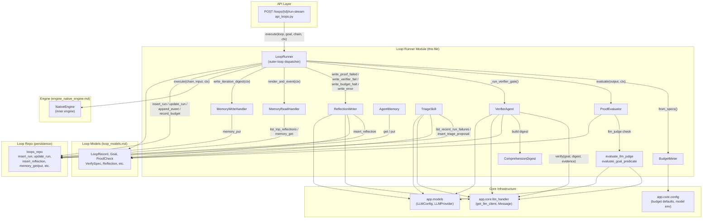

---

## Component Documentation

### 1. LoopRunner — Outer-Loop Dispatcher

The `LoopRunner` is the central orchestrator. It is **stateless**—safe to share across requests—and instantiates one set of P5 handlers (memory read, memory write, reflection) per instance.

#### Execution Lifecycle

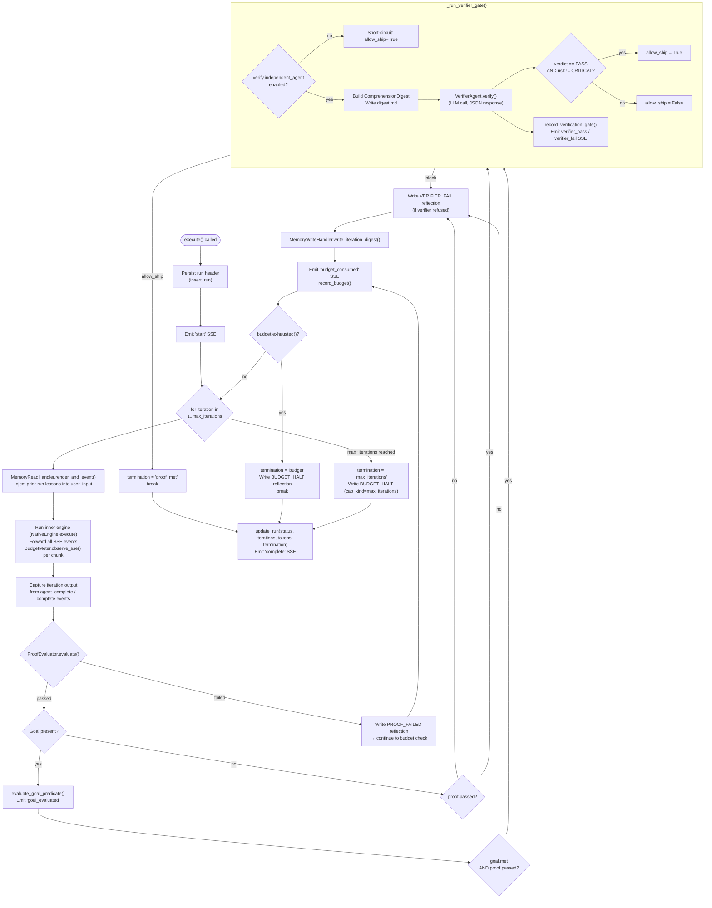

#### Key Design Decisions

- **SSE suppression**: The inner engine's terminal `complete` event is swallowed per-iteration so the chat panel doesn't think the run finished after iteration 1. The runner emits one authoritative `complete` at the very end.
- **Fail-soft persistence**: Every `loops_repo` call (insert_run, append_event, record_budget, etc.) is wrapped in try/except. Audit-table problems never block the run—the user still gets their answer.
- **Budget resolution precedence**: `ctx.budget` → `loop.stopping_condition` → `goal.stop_condition` → `budget_defaults()` (env). Each layer can only raise the cap, never lower it below the env minimum.

#### Termination States

| State | Trigger | Persisted Status |
|---|---|---|
| `proof_met` | Proof passed + (goal met or no goal) + verifier passed | `COMPLETED` |
| `budget` | Token cap, wall-clock cap, or max-iterations hit | `BUDGET_EXHAUSTED` or `MAX_ITERATIONS` |
| `max_iterations` | for-else exhaustion without break | `MAX_ITERATIONS` |
| `error` | Uncaught engine exception | `FAILED` |

---

### 2. BudgetMeter — Per-Run Budget Accountant

`BudgetMeter` tracks token consumption, wall-clock time, and iteration count against configurable caps. It is constructed via the `from_specs()` class method, which resolves caps from the execution context, loop record, goal, and environment defaults.

#### Token Counting Strategy

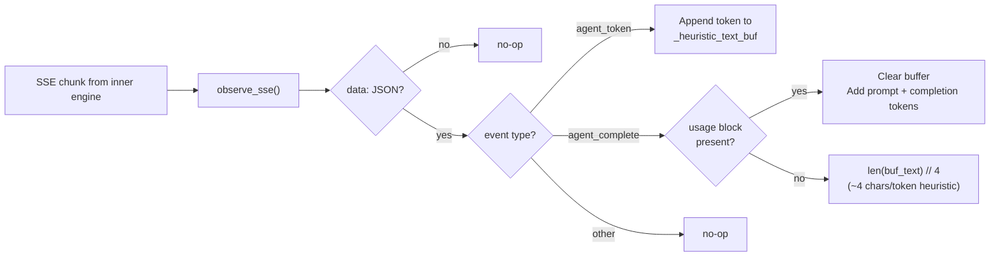

The meter uses a **dual-path** counting strategy:
1. **Authoritative**: When the LLM provider emits a `usage` block on `agent_complete`, the exact token counts are used. The heuristic buffer is cleared to prevent double-counting.
2. **Heuristic fallback**: When no usage block is present, the accumulated streamed text is divided by 4 (OpenAI's average chars/token for English). This is sufficient to flag runaway runs even if off by a few percent.

#### Exhaustion Check

`exhausted()` returns `True` when **any** cap is reached. It updates `wall_clock_s` as a side effect using `time.monotonic()` (immune to system clock jumps).

---

### 3. ProofEvaluator — Declarative Proof Checks

`ProofEvaluator` runs a list of `ProofCheck` specifications and aggregates the verdict. The aggregation rule is: **the overall verdict is the AND of every `must_pass=True` check's outcome**. Checks with `must_pass=False` are informational and never block ship.

#### Supported Check Types

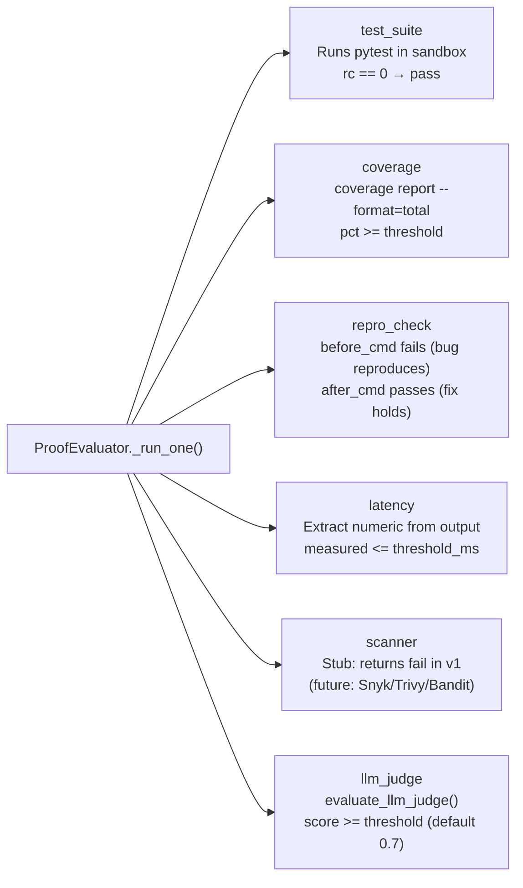

#### Sandbox Execution

All command-based checks (`test_suite`, `coverage`, `repro_check`) run via `_run_sandboxed()`, which:
- Pins the CWD to `ctx.run_workspace_dir` when inside a Loop run (so the verifier sees the same tree that was tested).
- Strips platform-level integration secrets from the subprocess environment via `sanitized_environ()`.
- Uses `asyncio.to_thread` + `subprocess.run` (not `asyncio.create_subprocess_exec`) due to Windows Proactor / psycopg Selector loop incompatibility.
- Caps output at 1 MB to prevent memory exhaustion from runaway tools.

---

### 4. VerifierAgent — Independent Pre-Ship Verifier

`VerifierAgent` is a **stateless** LLM-based verifier that runs one call per outer-loop iteration. It is instantiated fresh per call (no shared state between concurrent verifications).

#### Verification Contract

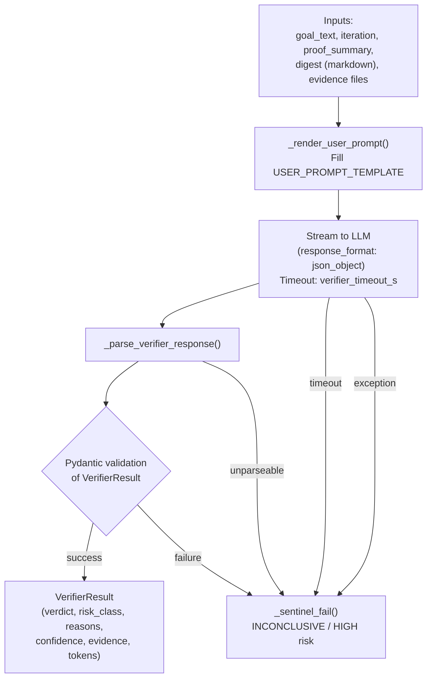

#### Gate Logic (FR-V6)

The runner's `_run_verifier_gate()` applies the following decision:

| Verifier Verdict | Risk Class | Allow Ship? |
|---|---|---|
| `PASS` | `none` / `low` / `medium` / `high` | ✅ Yes |
| `PASS` | `critical` | ❌ No (safety override) |
| `FAIL` | any | ❌ No |
| `INCONCLUSIVE` | any | ❌ No (treated as FAIL) |

A `CRITICAL` risk class forces refusal regardless of the verdict field. This is the prompt-injection / sandbox-escape / credential-leak safety override.

#### Debug Mode

`raw_response` is stripped from the result unless `VERIFIER_DEBUG=1` is set. The `_strip_debug()` helper centralizes this so every return path honors the same operator toggle.

---

### 5. ComprehensionDigest — Structured Digest for the Verifier

`ComprehensionDigest` is a plain dataclass (no Pydantic) that the runner authors—not the maker model—so what reaches the verifier is structured and bounded. It renders to a markdown file (`digest.md`) in the run workspace.

#### Digest Structure

```markdown
# Comprehension digest — run `{run_id}`
- Loop: `{loop_id}`
- Outer iteration: {iteration}
- Proof passed: **yes/no**

## Goal
{goal_text}

## Maker self-report
> {maker_summary (truncated to 1024 chars)}

## Proof outcome
| Step | Result | Summary |
|------|--------|---------|
| `test_suite` | pass | ... |

## Changed files
| Path | Status | Size (bytes) | Note |
|------|--------|--------------|------|
| `src/main.py` | modified | 1234 | ... |

_This digest contains no raw diff content._
```

#### Size Management

The digest is capped at 32 KB (`_DIGEST_MAX_BYTES`). When the cap is exceeded, the `_truncate_changed_files()` method performs a binary search to find the largest number of changed-file rows that fit, then appends an "_…N more files omitted_" marker.

---

### 6. ReflectionWriter — Self-Improving Lesson Authoring

`ReflectionWriter` authors one terse, imperative lesson per terminal outcome and persists it as a `Reflection` row. The lesson is shown verbatim to the maker on the **next run** via `MemoryReadHandler`.

#### Reflection Kinds

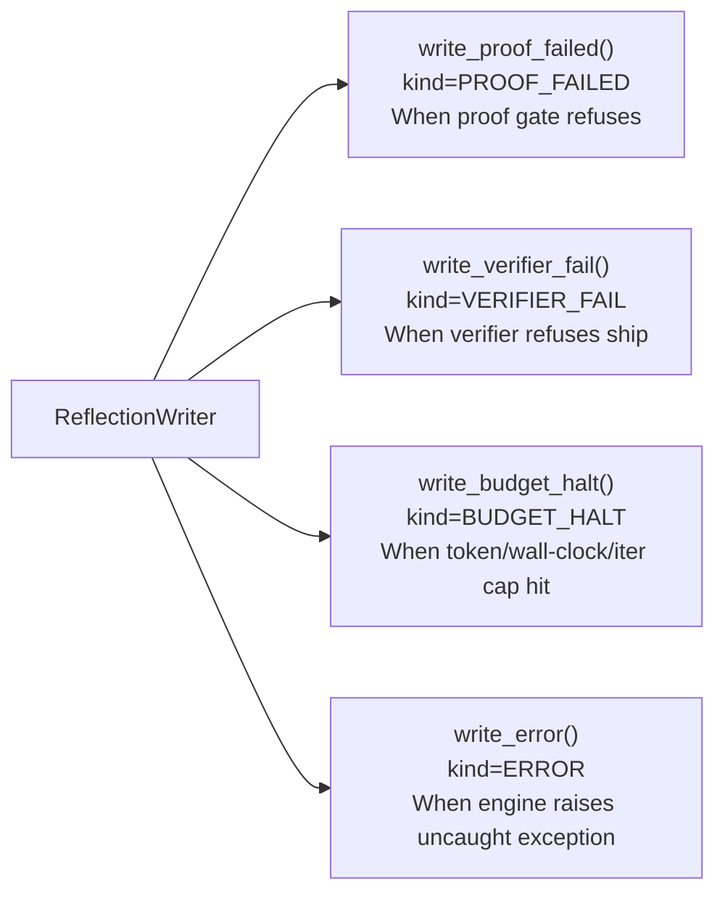

#### Lesson Derivation Pipeline

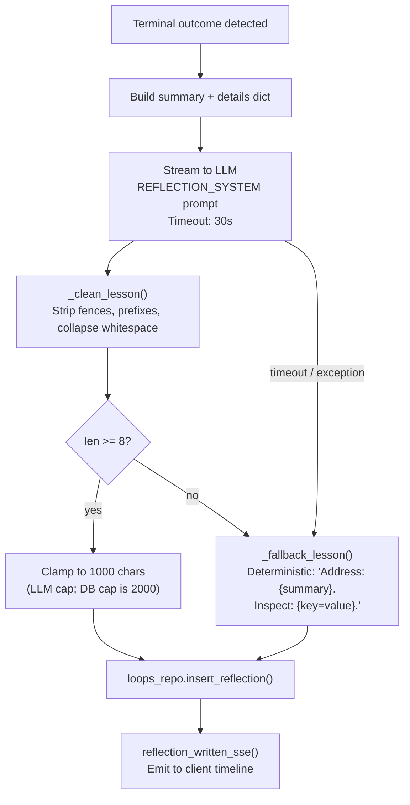

The system prompt enforces strict constraints: plain text only, ≤280 characters, imperative voice, mention the failure mode and corrective action, no secrets/paths/stack traces.

---

### 7. Memory Subsystem — Cross-Iteration Learning

The memory subsystem enables loops to learn from prior runs by injecting lessons and digests into the maker's context.

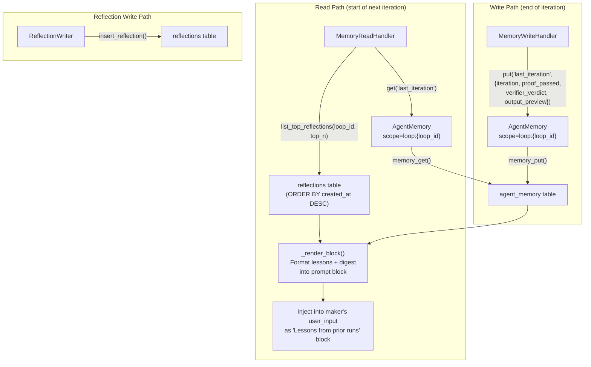

#### AgentMemory — Namespaced Wrapper

`AgentMemory` wraps the `agent_memory` table with a `loop:{loop_id}` scope prefix. Every key is scoped so two loops can use the same key (e.g. `last_iteration`) without stepping on each other. The repo layer enforces the `(scope, key)` primary key.

#### MemoryReadHandler — Prompt Block Builder

`MemoryReadHandler` builds the "Lessons from prior runs" prompt block. It is **fail-soft** on every external call: if the DB is unreachable, it returns an empty string and the maker runs without lessons.

**Truncation policy** (PHASE_5 §6.3):
1. Drop the digest first.
2. Then trim oldest lessons one at a time.
3. The **most recent** lesson always survives.
4. If a single lesson exceeds the budget, hard-truncate it.

The `max_chars` budget is derived from `memory_inject_max_tokens()` × 4 (chars/token).

---

### 8. TriageSkill — Inbox Triage & Goal Proposal

`TriageSkill` is a self-contained skill that collects inbox items (recent failures, log alerts), deduplicates them against open goals, asks an LLM to propose at most 3 new goals, and inserts them as `PENDING_APPROVAL` goals.

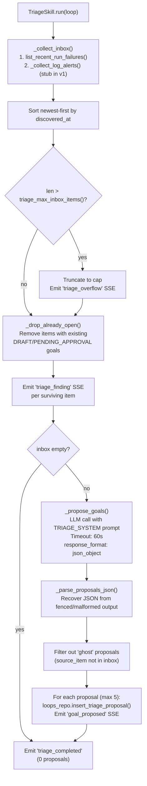

#### Grounding Guarantee

The skill refuses "ghost" proposals—LLM-invented inbox items that don't appear in the actual input. Every proposal must cite a real `(source, external_id)` pair from the inbox. This prevents hallucinated work items from entering the goal queue.

#### Event Sink Contract

Callers pass a `SseSink` (`Callable[[str], None]`) that receives one SSE-formatted string per lifecycle event. The API's manual-run streamer pushes them into an asyncio queue; the scheduler binds to a log-line writer.

---

### 9. LLM-Judge Helpers

#### evaluate_llm_judge

A general-purpose LLM-as-judge function used by both `ProofEvaluator` (for `llm_judge` proof checks) and `evaluate_goal_predicate`. It:

- Builds an `LLMConfig` with `LLMProvider.CUSTOM` and routes through `get_llm_client`.
- Caps the artifact at 8 KB (`_JUDGE_ARTIFACT_CAP`) to prevent context window overflow.
- Returns a `JudgeVerdict` with `score` (0..1), `met` (bool), and `critique` (one sentence).
- Never raises—transport failures return a documented `score=0.0, met=False` sentinel.

#### evaluate_goal_predicate

Evaluates a `Goal`'s predicate against an iteration output. `predicate_kind="rule"` is deferred to a later release; `predicate_kind="llm_judge"` delegates to `evaluate_llm_judge` with the goal's `predicate["criteria"]` (falling back to `goal.description` or `goal.name`).

#### JSON Parsing Tolerance

The `_parse_judge_json()` helper tolerates:
- Markdown fences (```` ```json ... ``` ````)
- Prose prefixes ("Here is the JSON:")
- Scores on a 0..100 scale (auto-divided by 100)
- Missing `met` field (fallback: `score >= 0.7`)

---

## Data Flow: Complete Iteration Cycle

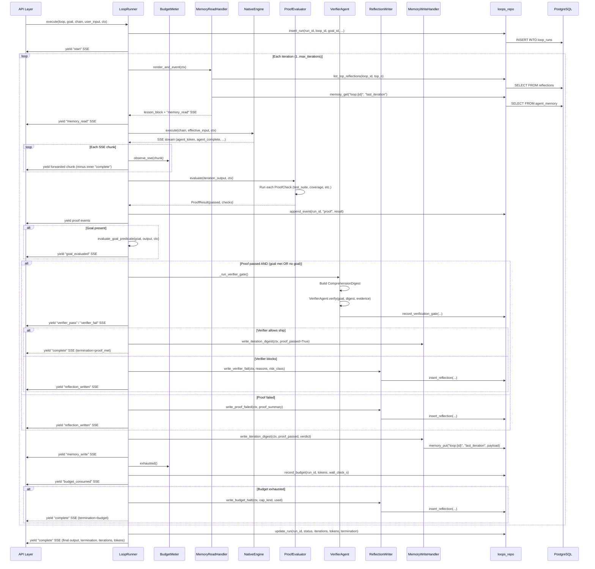

---

## Dependencies

### Internal Dependencies

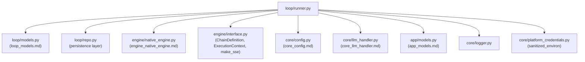

### Configuration Knobs (from `app.core.config`)

| Function | Default | Purpose |
|---|---|---|
| `budget_defaults()` | tokens=200K, wall_clock=3600s, max_iter=10 | Env-level budget floors |
| `verifier_model()` | env `VERIFIER_MODEL` | Model for VerifierAgent |
| `verifier_temperature()` | 0.2 | Verifier LLM temperature (clamped low) |
| `verifier_max_tokens()` | env `VERIFIER_MAX_TOKENS` | Max response tokens for verifier |
| `verifier_timeout_s()` | env `VERIFIER_TIMEOUT_S` | Wall-clock timeout for verifier LLM call |
| `verifier_debug()` | env `VERIFIER_DEBUG` | Whether to persist `raw_response` |
| `factory_model()` | env `FACTORY_MODEL` | Default model for ReflectionWriter, TriageSkill |
| `factory_api_key()` | env `FACTORY_API_KEY` | API key for LLM calls |
| `factory_base_url()` | env `FACTORY_BASE_URL` | Base URL for LLM proxy |
| `reflection_max_tokens()` | env `REFLECTION_MAX_TOKENS` | Max tokens for lesson generation |
| `reflection_top_n()` | env `REFLECTION_TOP_N` | Number of lessons to inject |
| `memory_inject_max_tokens()` | env `MEMORY_INJECT_MAX_TOKENS` | Token budget for injected lessons |
| `triage_model()` | env `TRIAGE_MODEL` | Model for TriageSkill LLM call |
| `triage_max_inbox_items()` | env `TRIAGE_MAX_INBOX_ITEMS` | Max inbox items per triage cycle |
| `triage_include_log_alerts()` | env `TRIAGE_INCLUDE_LOG_ALERTS` | Toggle for log-alert source (stub in v1) |

### Database Tables

| Table | Written by | Purpose |
|---|---|---|
| `loop_runs` | `insert_run`, `update_run` | Run header + final status |
| `reflections` | `insert_reflection` | Self-improving lessons (scope_kind='loop') |
| `agent_memory` | `memory_put` | Per-loop key/value store (last_iteration digest) |
| `verification_gate_runs` | `record_verification_gate` | Verifier verdict audit trail |
| `budget_ledger` | `record_budget` | Per-iteration token/wall-clock accounting |
| `goals` | `insert_triage_proposal` | Triage-proposed goals (status=PENDING_APPROVAL) |

---

## SSE Event Reference

The runner emits the following SSE event types during a loop execution:

| Event | When | Key Payload Fields |
|---|---|---|
| `start` | Run begins | `thread_id`, `loop_id`, `loop_run_id`, `goal_id` |
| `memory_read` | Before each iteration | `loop_id`, `lesson_count`, `block_chars`, `preview` |
| `agent_token` | Inner engine streams tokens | `agent`, `node_id`, `token` |
| `agent_complete` | Inner engine finishes an agent | `agent`, `node_id`, `output` |
| `goal_evaluated` | After goal predicate check | `score`, `met`, `critique` |
| `comprehension_digest` | Digest written to disk | `run_id`, `iteration`, `path`, `size_bytes` |
| `verifier_started` | Verifier LLM call begins | `run_id`, `iteration`, `model`, `temperature` |
| `verifier_pass` | Verifier allows ship | `verdict`, `risk_class`, `reasons`, `confidence` |
| `verifier_fail` | Verifier blocks ship | `verdict`, `risk_class`, `reasons`, `confidence` |
| `reflection_written` | Lesson persisted | `id`, `kind`, `lesson_preview`, `tags` |
| `memory_write` | Iteration digest persisted | `loop_id`, `loop_run_id`, `iteration`, `key` |
| `budget_consumed` | After each iteration | `tokens`, `wall_clock_s`, `cap` |
| `error` | Engine error | `message`, `iteration` |
| `complete` | Run terminates | `output`, `termination`, `iterations`, `tokens_used`, `final_score` |

---

## Integration Points

### Entry Points

1. **API**: `POST /loops/{id}/run-stream` (see [api_loops](../api/api_loops.md) / `app/api/loops.py::run_loop_stream_route`) — resolves the loop, goal, and chain, then streams `LoopRunner.execute()` as SSE.

2. **Trigger Scheduler**: `fire_from_queue` / `_fire_triage` in `app/services/trigger_scheduler.py` — cron-driven loop execution and triage cycles.

3. **NativeEngine P5 Nodes**: The `NativeEngine._run_p5_node()` method (see [engine_native_engine](engine_native_engine.md)) dispatches on-canvas `memory_read`, `memory_write`, `reflection_writer`, and `triage` node types to the corresponding runner primitives, so a Loop sub-graph can be edited and rerun through the same engine path a plain workflow uses.

### Relationship to Loop Evaluator

The `LoopController` and `LLMEvaluator` in `app/engine/loop_evaluator.py` (see [engine_loop_evaluator](engine_loop_evaluator.md)) serve a **different** loop concept: they power Build Studio's in-graph `while`-mode loop nodes with hybrid termination policies (confidence threshold, similarity convergence, regression detection). The `LoopRunner` in this module is the **outer-loop** dispatcher for the Loop Engineering subsystem (declarative `LoopRecord` with proof/verify/memory/triage). The two systems share the `evaluate_llm_judge` helper but are otherwise independent.

---

## Public API Summary

```python
__all__ = [
    # Prompt constants
    "SYSTEM_PROMPT", "USER_PROMPT_TEMPLATE", "JSON_SCHEMA_REMINDER",
    "REFLECTION_SYSTEM", "REFLECTION_USER_TEMPLATE",
    "TRIAGE_SYSTEM", "TRIAGE_USER_TEMPLATE", "TRIAGE_JSON_SCHEMA_REMINDER",
    # Budget
    "BudgetMeter",
    # LLM judge
    "JudgeVerdict", "evaluate_llm_judge", "evaluate_goal_predicate",
    # Proof
    "CheckOutcome", "ProofResult", "ProofEvaluator",
    # Digest
    "ProofStepOutcome", "ComprehensionDigest",
    # Verifier
    "VerifierAgent",
    # Memory
    "AgentMemory", "MemoryReadHandler", "MemoryWriteHandler",
    # Reflection
    "ReflectionWriter", "reflection_written_sse",
    # Triage
    "TriageSkill", "TriageRunResult", "SseSink",
    # Runner
    "LoopRunner",
]
```
