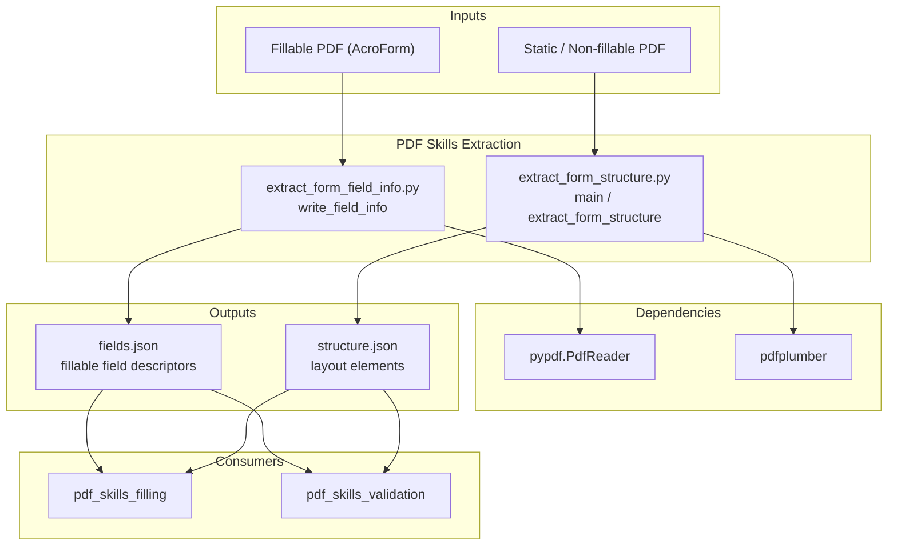
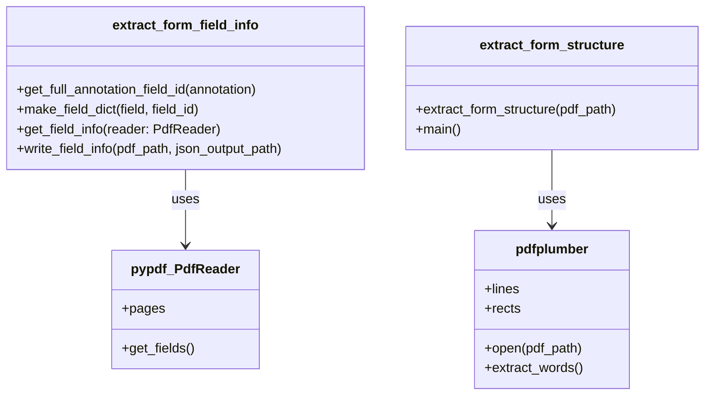
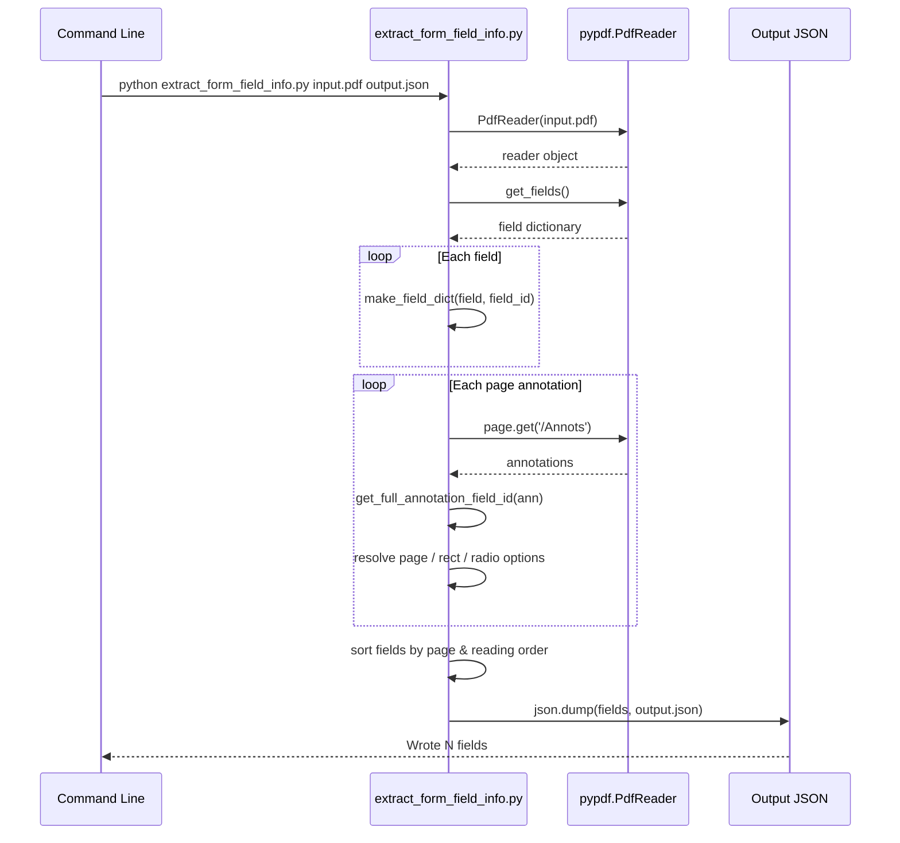
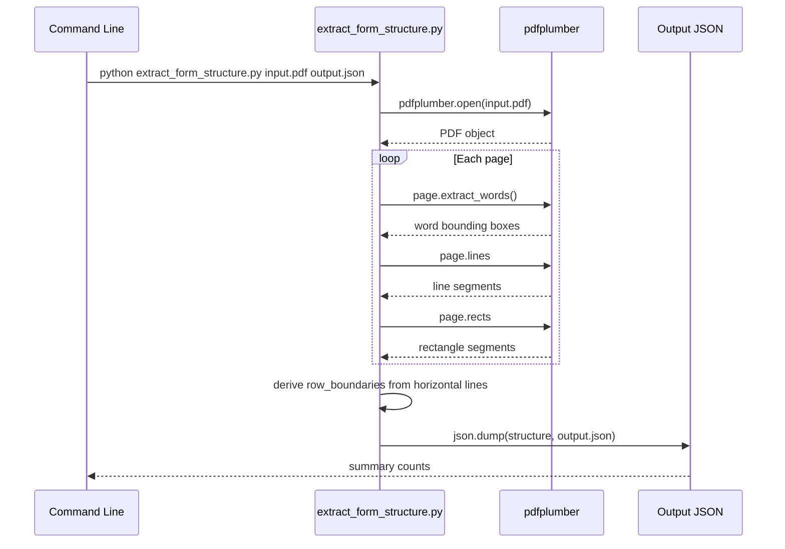
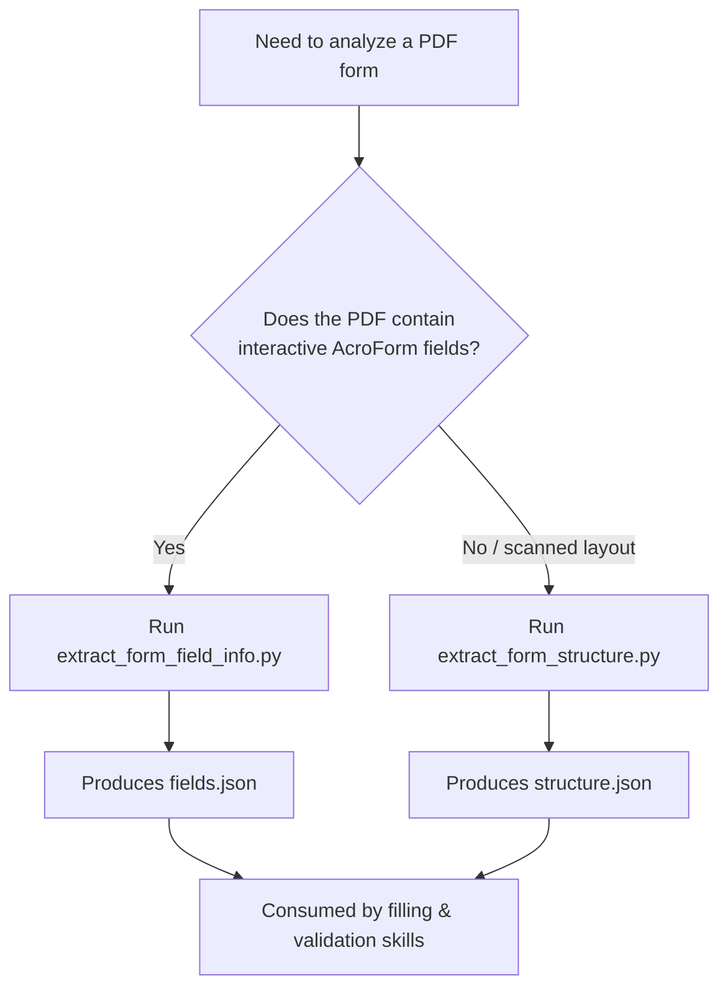

# PDF Skills Extraction Module

## Brief Introduction

The `pdf_skills_extraction` module provides command-line utilities for analyzing PDF documents and extracting structural information required by downstream PDF automation skills. It is part of the broader [pdf_skills](pdf_skills.md) family under [shared_skills](shared_skills.md), alongside [pdf_skills_filling](pdf_skills_filling.md) and [pdf_skills_validation](pdf_skills_validation.md).

This module focuses on two distinct extraction scenarios:

1. **Fillable PDF form field discovery** — `extract_form_field_info.py` reads PDFs that already contain interactive AcroForm fields and emits a JSON descriptor of every field, including type, possible values, and page coordinates.
2. **Non-fillable PDF structure analysis** — `extract_form_structure.py` uses page layout analysis to locate text labels, horizontal lines, checkboxes, and inferred row boundaries in static PDFs, producing a JSON structure map that can be used to synthesize fill coordinates.

The extracted JSON artifacts are consumed by PDF filling and validation skills, enabling agentic workflows to programmatically complete forms and verify placement.

---

## Core Components

### `extract_form_field_info.py`

Responsible for introspecting fillable PDF forms.

| Function | Purpose |
|----------|---------|
| `get_full_annotation_field_id(annotation)` | Reconstructs the fully-qualified field ID by walking the `/Parent` chain of a PDF annotation. |
| `make_field_dict(field, field_id)` | Maps a PDF field object to a normalized dictionary describing its type (`text`, `checkbox`, `choice`, or `unknown`) and relevant options. |
| `get_field_info(reader: PdfReader)` | Orchestrates field extraction, resolves page locations and radio groups, and sorts fields by page and reading order. |
| `write_field_info(pdf_path, json_output_path)` | Entry point that opens the PDF, extracts field metadata, and writes the JSON result. |

#### Supported field types

- `/Tx` → `text`
- `/Btn` → `checkbox` or `radio_group`
- `/Ch` → `choice`
- Other → `unknown (...)`

Radio buttons are detected by inspecting annotation appearance streams (`/AP /N`) and grouped under a single `radio_group` entry with per-option rectangles.

### `extract_form_structure.py`

Responsible for layout analysis of non-fillable PDFs.

| Function | Purpose |
|----------|---------|
| `extract_form_structure(pdf_path)` | Opens the PDF with `pdfplumber`, extracts words, long horizontal lines, small square rectangles treated as checkboxes, and derives row boundaries from line positions. |
| `main()` | CLI entry point that validates arguments, runs extraction, and prints a summary. |

#### Output schema

```json
{
  "pages": [{ "page_number": 1, "width": 612.0, "height": 792.0 }],
  "labels": [{ "page": 1, "text": "Name", "x0": 72.0, "top": 100.0, "x1": 120.0, "bottom": 115.0 }],
  "lines": [{ "page": 1, "y": 200.0, "x0": 72.0, "x1": 540.0 }],
  "checkboxes": [{ "page": 1, "x0": 72.0, "top": 250.0, "x1": 82.0, "bottom": 260.0, "center_x": 77.0, "center_y": 255.0 }],
  "row_boundaries": [{ "page": 1, "row_top": 200.0, "row_bottom": 220.0, "row_height": 20.0 }]
}
```

---

## Architecture



---

## Component Relationships



---

## Data Flow

### Fillable form field extraction



### Non-fillable structure extraction



---

## Process Flow

### Choosing the right extractor



---

## How It Fits into the Overall System

The `pdf_skills_extraction` module sits at the analysis layer of the [pdf_skills](pdf_skills.md) capability within [shared_skills](shared_skills.md). Its outputs bridge raw PDF documents and the agentic automation layer:

- **Upstream**: PDFs are uploaded or referenced by [ABStudio backend](../ui/abstudio_backend.md) workflows, [agent_factory_pipeline](agent_factory_pipeline.md), or [skill_factory_pipeline](skill_factory_pipeline.md) generated skills.
- **Downstream**: [pdf_skills_filling](pdf_skills_filling.md) consumes the JSON descriptors to know which fields exist, what values are legal, and where to place annotations. [pdf_skills_validation](pdf_skills_validation.md) uses coordinates to verify that filled values are within expected bounding boxes.
- **Cross-cutting**: The module relies only on standard Python PDF libraries (`pypdf`, `pdfplumber`) and is invoked as a standalone script, making it reusable from local CLI tooling, sandboxed execution, or workflow nodes in [app/engine/native_engine](../reference/engine_native_engine.md).

---

## Usage Examples

### Extract fillable field metadata

```bash
python ABStudio/skills/ainxt-skills/pdf/scripts/extract_form_field_info.py \
  sample_form.pdf sample_form_fields.json
```

### Extract structure from a static PDF

```bash
python ABStudio/skills/ainxt-skills/pdf/scripts/extract_form_structure.py \
  scanned_form.pdf scanned_form_structure.json
```

---

## Dependencies

| Dependency | Purpose | Referenced Module |
|------------|---------|-------------------|
| `pypdf` | Reading AcroForm fields and annotation hierarchies | External library |
| `pdfplumber` | Page layout analysis for non-fillable PDFs | External library |

No runtime dependencies on other project modules are required for these scripts, although their outputs are designed for consumption by [pdf_skills_filling](pdf_skills_filling.md) and [pdf_skills_validation](pdf_skills_validation.md).

---

## Related Documentation

- [pdf_skills](pdf_skills.md) — parent module overview
- [pdf_skills_filling](pdf_skills_filling.md) — consumes extracted field descriptors
- [pdf_skills_validation](pdf_skills_validation.md) — validates filled PDFs using extracted coordinates
- [shared_skills](shared_skills.md) — broader skill library context
- [abstudio_backend](../ui/abstudio_backend.md) — backend that orchestrates skill execution
- [engine_native_engine](../reference/engine_native_engine.md) — native workflow engine that may invoke these scripts
