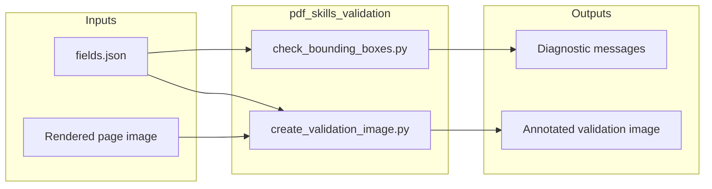
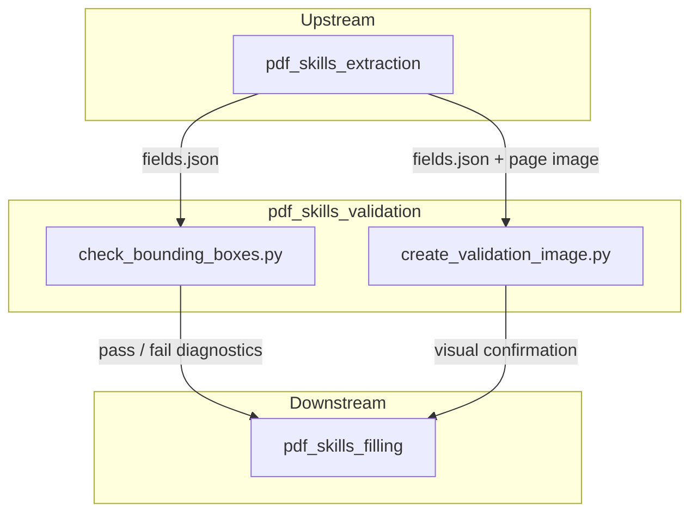
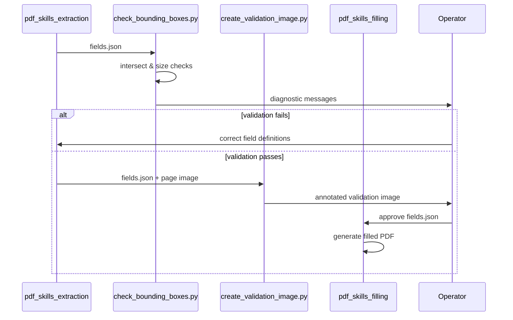
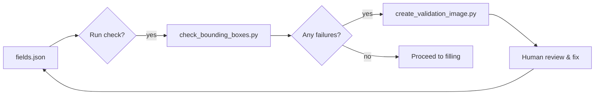
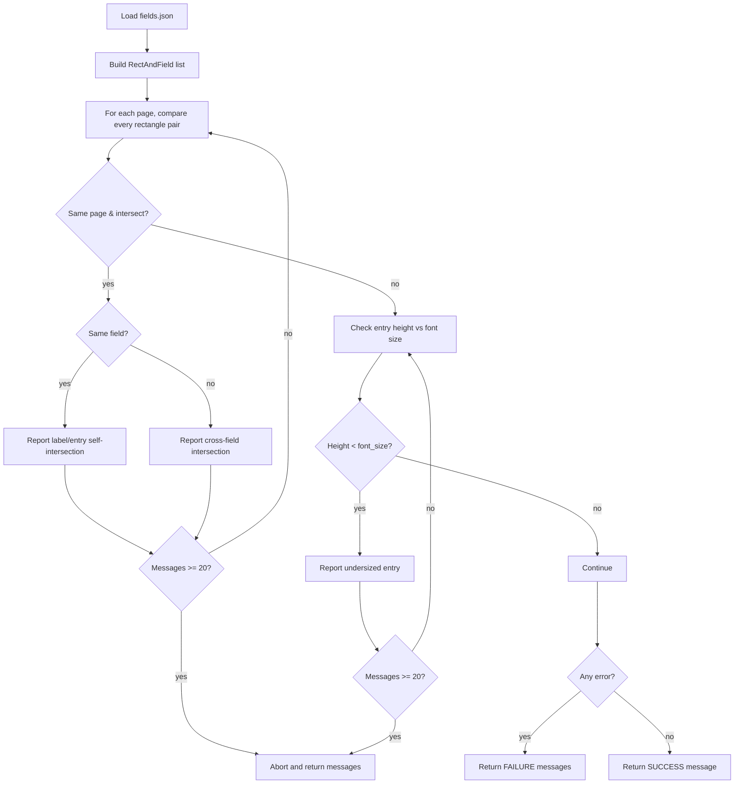

# PDF Skills Validation

The `pdf_skills_validation` module provides lightweight, standalone utilities for visually and programmatically validating PDF form-field definitions before they are used to fill or annotate documents. It is part of the broader [pdf_skills](pdf_skills.md) family under [shared_skills](shared_skills.md), which supports automated PDF extraction, filling, and rendering workflows in the ABStudio skill ecosystem.

## Purpose

When PDF forms are filled programmatically, the placement and sizing of text annotations or AcroForm entries must match the underlying document layout. Misplaced or undersized bounding boxes can cause text overflow, overlapping labels, or unreadable output. This module addresses that problem by:

1. **Detecting geometric conflicts** between label and entry bounding boxes across all form fields on a page.
2. **Checking text-fit constraints** to ensure that entry boxes are tall enough for their configured font size.
3. **Rendering validation overlays** that draw label and entry bounding boxes on top of a page image for human review.

These checks are typically run after form-field metadata has been extracted or authored, but before the final PDF is generated.

## Core Components

### `check_bounding_boxes.py`

Contains the `get_bounding_box_messages` function, which performs geometric validation on a JSON form-field descriptor.

**Key behavior**

- Reads a JSON stream containing a `form_fields` array. Each field is expected to have:
  - `label_bounding_box` and `entry_bounding_box`: axis-aligned rectangles as `[x0, y0, x1, y1]`.
  - `page_number`: the page on which the field appears.
  - `description`: a human-readable field name for diagnostics.
  - Optional `entry_text`: an object with `font_size` (defaults to `14`) used for height checks.
- Compares every pair of rectangles that belong to the same page and reports intersections.
- Distinguishes between self-intersections (a field's own label overlaps its entry) and cross-field intersections.
- Verifies that each entry box height is at least the configured font size.
- Caps output at 20 messages to avoid flooding the caller with repetitive errors.
- Returns a list of human-readable strings, ending with either a `SUCCESS` or `FAILURE` summary.

**Usage**

```bash
python check_bounding_boxes.py fields.json
```

### `create_validation_image.py`

Contains the `create_validation_image` function, which produces a visual debugging image for a single page.

**Key behavior**

- Loads a JSON form-field descriptor and a source image (typically a rendered PDF page).
- Draws entry bounding boxes in **red** and label bounding boxes in **blue**.
- Only draws boxes for the requested `page_number`.
- Saves the annotated image to the specified output path.

**Usage**

```bash
python create_validation_image.py <page_number> <fields.json> <input_image> <output_image>
```

## Architecture

The validation module is intentionally stateless and file-system oriented. It consumes JSON artifacts produced by upstream extraction tools and produces either diagnostic text or annotated images. No database, network, or LLM dependencies are required.



## Dependencies

### Internal

- **[pdf_skills_extraction](pdf_skills_extraction.md)** — produces the `fields.json` consumed by both validation utilities. Specifically, `extract_form_field_info.py::write_field_info` and `extract_form_structure.py::main` generate the field metadata and page structure used here.
- **[pdf_skills_filling](pdf_skills_filling.md)** — downstream consumer of validated field definitions. `fill_fillable_fields.py::fill_pdf_fields` and `fill_pdf_form_with_annotations.py::fill_pdf_form` rely on correct bounding boxes and font sizes to place text accurately.
- **[pdf_skills](pdf_skills.md)** — parent module that groups extraction, filling, and validation capabilities.
- **[shared_skills](shared_skills.md)** — top-level skill collection that packages reusable document-processing scripts.

### External

- `PIL` (Pillow) — used by `create_validation_image.py` to open images and draw rectangles.
- Standard library: `dataclasses`, `json`, `sys`.



## Data Flow

A typical validation workflow proceeds as follows:

1. **Extraction** — `pdf_skills_extraction` reads a source PDF and writes `fields.json` containing page numbers, bounding boxes, and text metadata.
2. **Geometric check** — `get_bounding_box_messages` loads `fields.json` and reports any overlapping rectangles or undersized entry boxes.
3. **Visual check** — For each page with fields, `create_validation_image` draws the bounding boxes on a rendered page image so a human can confirm alignment.
4. **Filling** — Once validation passes, `pdf_skills_filling` uses the same `fields.json` to generate the final filled PDF.



## Component Interaction

The two scripts are designed to be used together but can also run independently:

- `check_bounding_boxes.py` is the **programmatic gate**. It returns structured text that can be parsed by CI/CD pipelines or parent scripts to decide whether to proceed with filling.
- `create_validation_image.py` is the **human-in-the-loop aid**. It helps operators understand why a geometric check failed and whether the source PDF or the field definitions need adjustment.



## Process Flow: Bounding-Box Validation

The following diagram details the logic inside `get_bounding_box_messages`.



## Integration with the Larger System

The `pdf_skills_validation` module sits at the quality-assurance layer of the document-processing pipeline. It does not interact directly with the ABStudio backend, the LLM proxy, or the frontend; instead, it is invoked as a command-line helper by skill packaging, evaluation, or factory pipelines that prepare PDF-related skills.

In the module tree, this module is a leaf under:

```
shared_skills
  └── pdf_skills
        ├── pdf_skills_extraction
        ├── pdf_skills_filling
        └── pdf_skills_validation  <-- this module
```

For details on how these scripts are bundled and evaluated, see [shared_skills](shared_skills.md). For the backend services that orchestrate skill execution, see [abstudio_backend](../ui/abstudio_backend.md).

## Notes for Maintainers

- The 20-message cap is a safety guard; raising it should be weighed against log verbosity.
- `create_validation_image.py` assumes the input image coordinate system matches the bounding-box coordinates in `fields.json`. If the extraction pipeline changes coordinate transforms, the drawing logic here must be updated accordingly.
- Both scripts are intentionally dependency-light so they can run inside sandboxed skill execution environments without requiring PyPDF, LLM clients, or database access.
