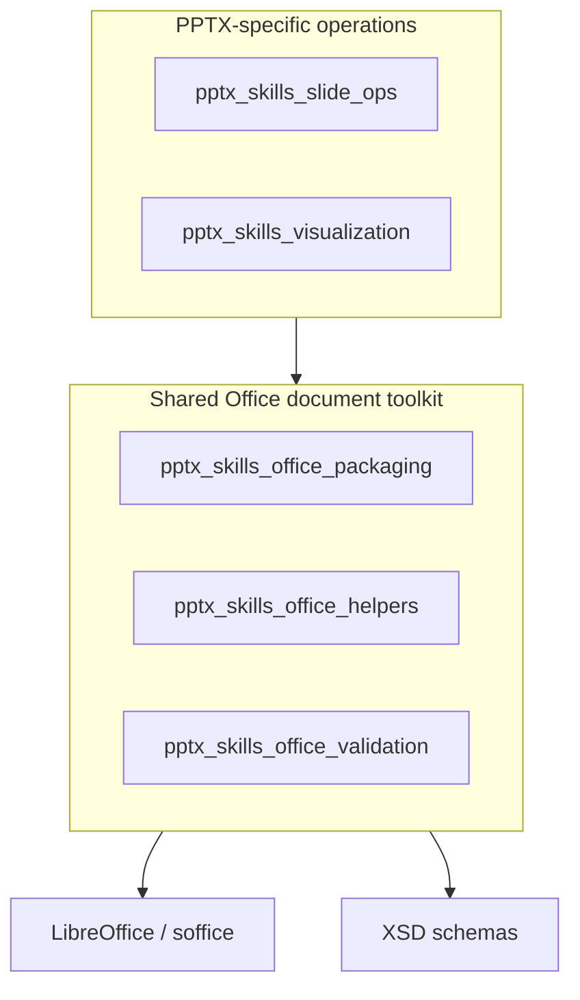
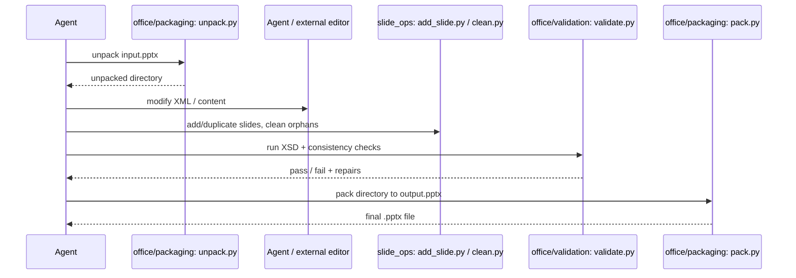

# pptx_skills Module

## Overview

The `pptx_skills` module is a collection of Python scripts for manipulating PowerPoint (PPTX) and other Office Open XML (OOXML) documents. Located under `ABStudio/skills/ainxt-skills/pptx/scripts`, it provides low-level, file-system-based operations on unpacked Office documents as well as command-line utilities for packing, validating, and visualizing presentations.

Although the module is named `pptx_skills`, it also hosts shared Office tooling that is reused conceptually by the sibling [`docx_skills`](docx_skills.md) and [`xlsx_skills`](xlsx_skills.md) modules. The scripts are designed to be invoked directly from the shell or imported as helper libraries by higher-level skills and agents.

## Purpose

- Enable agents and automation to modify PPTX files at the XML level.
- Provide a safe workflow: unpack → edit → validate → pack.
- Remove unreferenced/orphaned resources from edited PPTX packages.
- Validate OOXML packages against XSD schemas and internal consistency rules.
- Generate visual thumbnail grids of slide decks for quick inspection.

## Architecture

The module is organized into four functional layers:



### Data flow

A typical agent workflow that uses this module looks like:



## Sub-modules

| Sub-module | Files | Responsibility | Documentation |
|------------|-------|----------------|---------------|
| `pptx_skills_slide_ops` | `add_slide.py`, `clean.py` | Add, duplicate, and clean PPTX slides and their relationships. | [pptx_skills_slide_ops.md](pptx_skills_slide_ops.md) |
| `pptx_skills_office_packaging` | `office/unpack.py`, `office/pack.py`, `office/soffice.py` | Convert between packed Office files and unpacked directories; run LibreOffice in restricted environments. | [pptx_skills_office_packaging.md](pptx_skills_office_packaging.md) |
| `pptx_skills_office_helpers` | `office/helpers/merge_runs.py`, `office/helpers/simplify_redlines.py` | DOCX-specific XML normalization helpers used during unpack. | [pptx_skills_office_helpers.md](pptx_skills_office_helpers.md) |
| `pptx_skills_office_validation` | `office/validate.py`, `office/validators/*.py` | XSD validation, relationship checks, ID uniqueness, and redlining verification for DOCX/PPTX/XLSX. | [pptx_skills_office_validation.md](pptx_skills_office_validation.md) |
| `pptx_skills_visualization` | `thumbnail.py` | Render PPTX slide thumbnail grids via LibreOffice + pdftoppm. | [pptx_skills_visualization.md](pptx_skills_visualization.md) |

## Relationship to the rest of the system

- The module is a leaf skill under [`shared_skills`](shared_skills.md). It is not a runtime service; it is invoked by agents, workers, or higher-level skills that need to manipulate Office documents.
- It depends on external binaries: `soffice` (LibreOffice), `gcc` (for the socket shim), `pdftoppm`, and optionally `git` (for redlining diffs).
- Python dependencies include `defusedxml`, `lxml`, `Pillow`, and the standard library.
- Similar logic exists in [`docx_skills`](docx_skills.md) and [`xlsx_skills`](xlsx_skills.md); those modules may duplicate the `office/` helpers and validators. When documenting those modules, refer back to this module rather than repeating implementation details.

## Common usage patterns

### Add a slide to an unpacked PPTX

```bash
python add_slide.py unpacked/ slideLayout2.xml
```

### Clean orphaned files after editing

```bash
python clean.py unpacked/
```

### Unpack, validate, and pack a presentation

```bash
python office/unpack.py input.pptx unpacked/
python office/validate.py unpacked/ --original input.pptx --auto-repair
python office/pack.py unpacked/ output.pptx --original input.pptx
```

### Generate a thumbnail grid

```bash
python thumbnail.py presentation.pptx grid --cols 4
```
