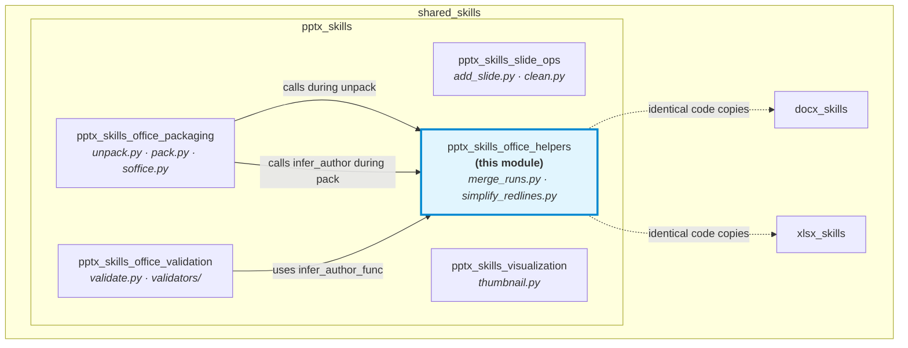
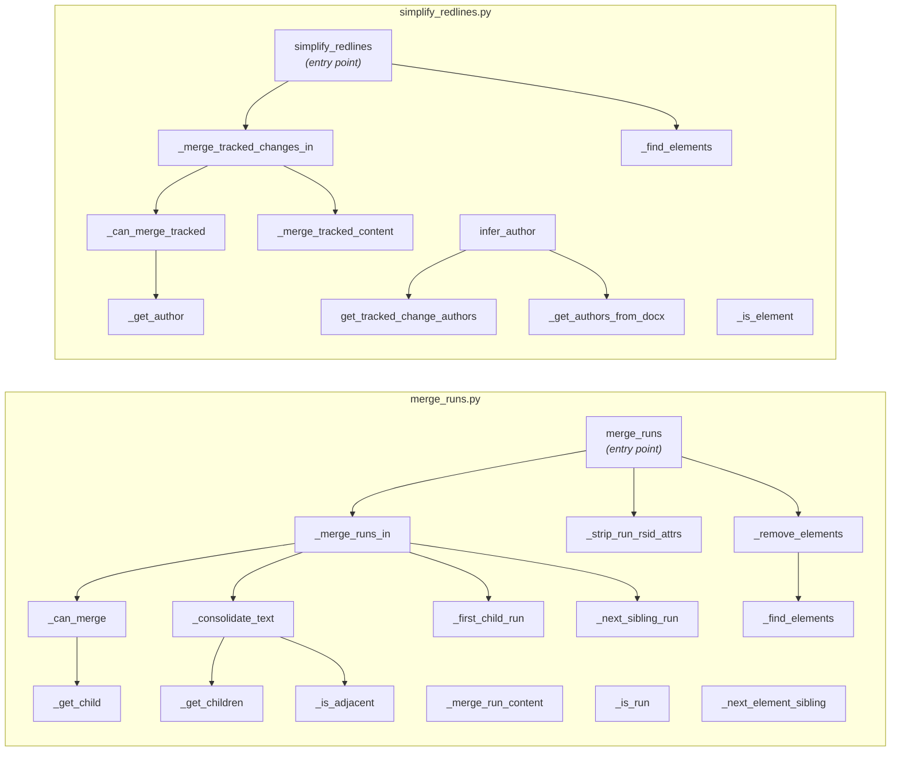
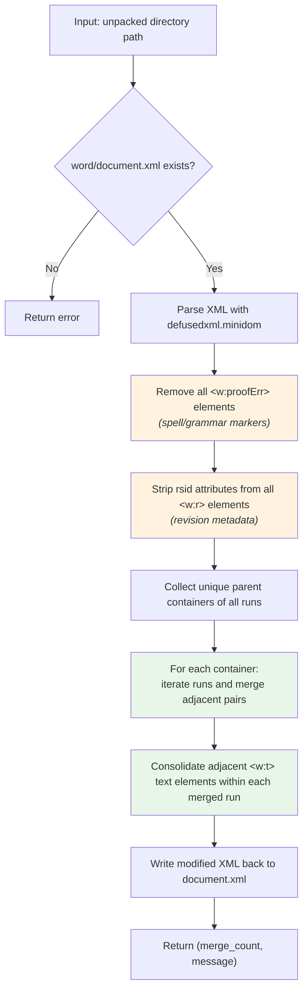
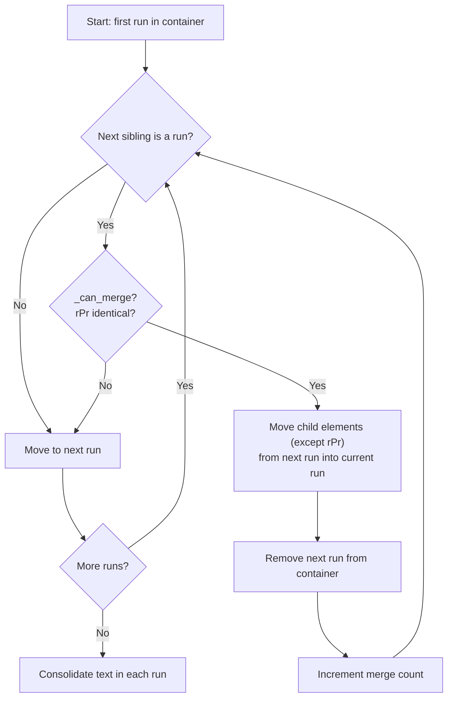
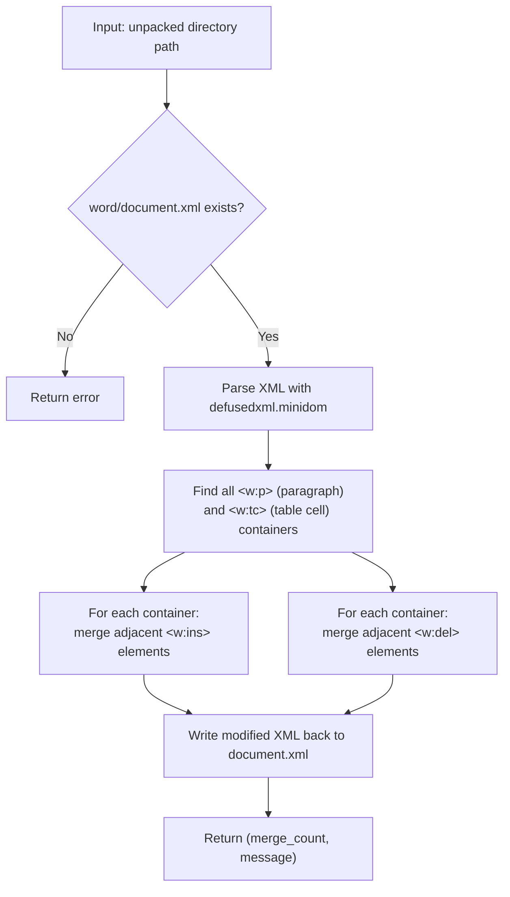
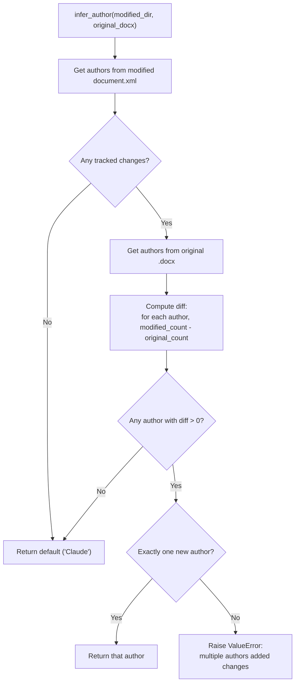
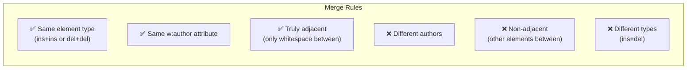
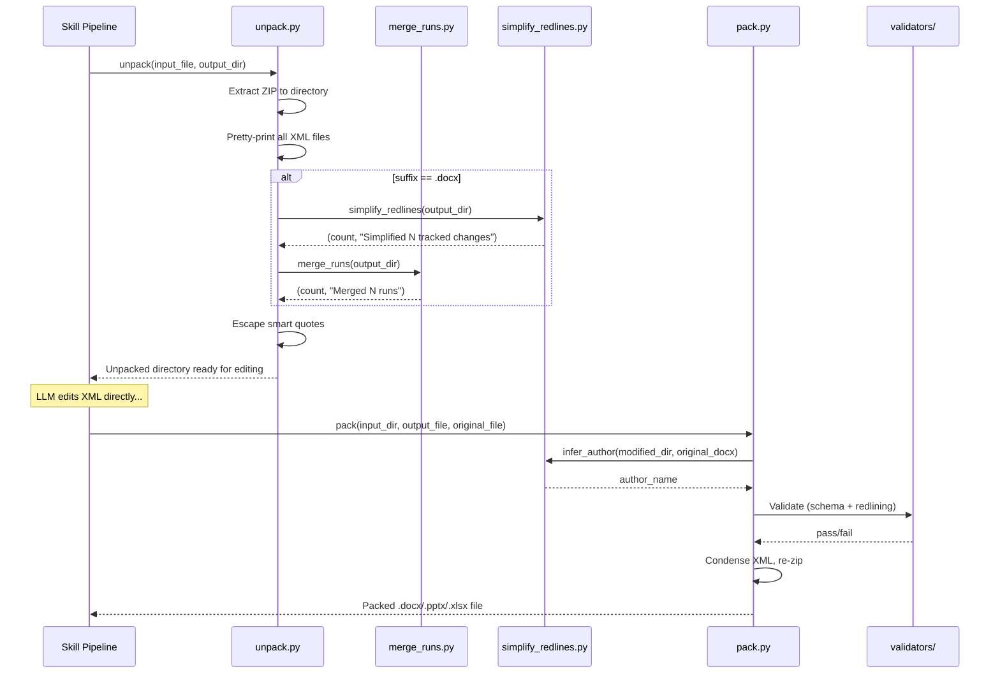
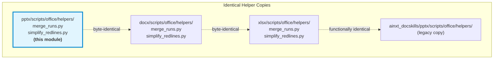
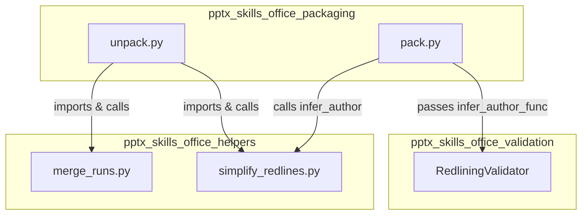

# pptx_skills_office_helpers

## Introduction

The `pptx_skills_office_helpers` module provides low-level XML manipulation utilities that clean and normalize Office Open XML (OOXML) markup inside unpacked document directories. It is a child module of [`pptx_skills`](pptx_skills.md) and sits alongside the packaging, validation, slide-operations, and visualization sub-modules.

The module contains two scripts:

| Script | Purpose |
|---|---|
| `merge_runs.py` | Merges adjacent `<w:r>` (run) elements that share identical formatting properties, strips revision-save IDs (rsid attributes), and removes spell/grammar proof-error markers that block merging. |
| `simplify_redlines.py` | Merges adjacent tracked-change wrappers (`<w:ins>` / `<w:del>`) from the same author into single elements, and provides an `infer_author` utility that determines which author introduced new tracked changes relative to an original document. |

Both scripts operate on the **unpacked** representation of an Office file — a directory tree extracted from a `.docx` / `.pptx` / `.xlsx` ZIP archive — and specifically target `word/document.xml`. They are invoked automatically during the unpack and pack lifecycle by the [`pptx_skills_office_packaging`](pptx_skills.md) module.

---

## Architecture

### Module Position



### Component Overview



---

## Core Components

### 1. `merge_runs.py` — Run Consolidation

#### Purpose

When an LLM edits OOXML directly, it often produces fragmented run elements — multiple consecutive `<w:r>` tags with identical `<w:rPr>` formatting properties. This fragmentation makes the XML harder to read, increases file size, and can confuse downstream validators. The `merge_runs` function consolidates these adjacent runs into single elements.

#### Processing Pipeline



#### Key Functions

| Function | Role |
|---|---|
| `merge_runs(input_dir)` | **Entry point.** Orchestrates the full pipeline: cleanup → strip rsids → merge → consolidate text → write. Returns `(count, message)`. |
| `_merge_runs_in(container)` | Iterates through runs in a single container (paragraph, table cell, tracked-change wrapper). For each run, greedily merges all immediately-following runs whose `rPr` matches. |
| `_can_merge(run1, run2)` | Compares the `<w:rPr>` children of two runs. Returns `True` if both lack `rPr` or if their serialized `rPr` XML is byte-identical. |
| `_consolidate_text(run)` | After merging, a run may contain multiple adjacent `<w:t>` elements. This function concatenates their text into the first `<w:t>`, handling `xml:space="preserve"` attributes for leading/trailing whitespace. |
| `_strip_run_rsid_attrs(root)` | Removes all attributes containing "rsid" from every `<w:r>` element. Rsids are revision-save identifiers used by Word for change-tracking coalescence — they don't affect rendering and their presence prevents run merging. |
| `_remove_elements(root, tag)` | Removes all elements matching a tag name (used to eliminate `<w:proofErr>` spell-check markers). |
| `_is_adjacent(elem1, elem2)` | Checks whether two elements are truly adjacent in the DOM — only whitespace text nodes may appear between them. |

#### Merge Decision Logic



---

### 2. `simplify_redlines.py` — Tracked Change Simplification

#### Purpose

When an LLM makes tracked changes to a document, it may produce many small, fragmented `<w:ins>` (insertion) or `<w:del>` (deletion) wrappers — even when the changes are contiguous and from the same author. This fragmentation makes the redlining harder to review and bloats the XML. The `simplify_redlines` function merges adjacent tracked-change wrappers of the same type and author into single elements.

#### Processing Pipeline



#### Key Functions

| Function | Role |
|---|---|
| `simplify_redlines(input_dir)` | **Entry point.** Finds all paragraph and table-cell containers, then merges adjacent `<w:ins>` and `<w:del>` elements within each. Returns `(count, message)`. |
| `_merge_tracked_changes_in(container, tag)` | Collects all tracked-change elements of a given type (`ins` or `del`) within a container. Iterates through them, merging adjacent pairs that satisfy `_can_merge_tracked`. |
| `_can_merge_tracked(elem1, elem2)` | Returns `True` if both elements have the same `w:author` attribute **and** are truly adjacent (only whitespace between them). Timestamp differences are intentionally ignored. |
| `_merge_tracked_content(target, source)` | Moves all child nodes from the `source` tracked-change element into the `target`, then the source is removed from the DOM. |
| `infer_author(modified_dir, original_docx, default)` | Compares tracked-change author counts between a modified unpacked directory and the original packed `.docx` file. Returns the single author who added new changes, or raises `ValueError` if multiple authors added changes. Falls back to `default` (typically `"Claude"`) if no new changes are found. |
| `get_tracked_change_authors(doc_xml_path)` | Extracts a `{author: count}` dictionary from a `document.xml` file using `xml.etree.ElementTree`. |
| `_get_authors_from_docx(docx_path)` | Extracts the same `{author: count}` dictionary but reads directly from a packed `.docx` ZIP archive without unpacking. |

#### Author Inference Logic

The `infer_author` function is critical for the validation flow — it determines which author's tracked changes should be validated by the [`RedliningValidator`](pptx_skills.md) during packing.



#### Merge Rules



---

## Integration & Data Flow

### Unpack → Helpers → Pack Lifecycle

The helpers are invoked at specific points in the document processing lifecycle managed by the [`pptx_skills_office_packaging`](pptx_skills.md) module:



### When Helpers Are Applied

| Phase | Function Called | Trigger Condition |
|---|---|---|
| **Unpack** | `simplify_redlines()` | File suffix is `.docx` and `simplify_redlines=True` (default) |
| **Unpack** | `merge_runs()` | File suffix is `.docx` and `merge_runs=True` (default) |
| **Pack** | `infer_author()` | `validate=True` and `original_file` is provided — used to determine which author's redlines to check |

> **Note:** Although these helpers live in the `pptx` skill directory, they operate on `word/document.xml` and are only invoked for `.docx` files during unpack. This is because the `pptx_skills` module shares a common `office/` tooling layer that supports all three Office formats (`.docx`, `.pptx`, `.xlsx`). The same helper code is duplicated verbatim in the [`docx_skills`](docx_skills.md) and [`xlsx_skills`](xlsx_skills.md) modules.

---

## Cross-Module Code Sharing

The helper scripts in this module are **identical copies** of the same files in the `docx` and `xlsx` skill directories. This is a deliberate design choice in the AiNxt skills architecture — each document-type skill is self-contained and carries its own copy of the shared office tooling.



Any changes to the merge logic or redline simplification rules must be applied to all copies to maintain consistency across document types.

---

## Dependencies

### External Libraries

| Library | Usage |
|---|---|
| `defusedxml.minidom` | Safe XML parsing (prevents XXE attacks) — used by both `merge_runs` and `simplify_redlines` entry points |
| `xml.etree.ElementTree` | Lightweight XML parsing — used by `get_tracked_change_authors` and `_get_authors_from_docx` for author extraction |
| `zipfile` | Reading packed `.docx` archives — used by `_get_authors_from_docx` |
| `pathlib.Path` | Filesystem path manipulation throughout |

### Internal Dependencies



---

## Design Decisions

### Why `defusedxml` instead of `lxml`?

The helper entry points (`merge_runs`, `simplify_redlines`) use `defusedxml.minidom` for DOM manipulation. This provides:
- **XXE protection** — prevents external entity injection attacks when parsing untrusted document XML
- **DOM API** — the minidom API's `childNodes`, `nextSibling`, and `parentNode` traversal is well-suited for the adjacent-element merging logic
- **No native dependencies** — unlike `lxml`, `defusedxml` is pure Python

The `infer_author` utility and author-extraction helpers use `xml.etree.ElementTree` instead, as they only need read-only XPath queries (`findall`) which ElementTree handles efficiently.

### Why ignore timestamps in tracked-change merging?

The `_can_merge_tracked` function checks only the `w:author` attribute, not `w:date` or `w:id`. This is intentional:
- LLM-generated edits often produce many tracked changes in rapid succession with slightly different timestamps
- Merging by author alone produces cleaner, more reviewable redlines
- Timestamps are metadata that don't affect the semantic content of the tracked change

### Why strip rsid attributes?

Rsid (revision-save ID) attributes (`w:rsidR`, `w:rsidRDefault`, etc.) are used by Microsoft Word internally to coalesce edits made in the same editing session. They:
- Don't affect document rendering
- Prevent run merging (two runs with different rsids won't merge even if formatting is identical)
- Add significant XML noise

Stripping them before merging enables maximum consolidation.

---

## Error Handling

Both entry points follow a consistent error-handling pattern:

```python
def merge_runs(input_dir: str) -> tuple[int, str]:
    doc_xml = Path(input_dir) / "word" / "document.xml"
    if not doc_xml.exists():
        return 0, f"Error: {doc_xml} not found"
    try:
        # ... processing ...
        return merge_count, f"Merged {merge_count} runs"
    except Exception as e:
        return 0, f"Error: {e}"
```

- Returns `(0, error_message)` on any failure — never raises exceptions to the caller
- The calling code in `unpack.py` ignores the return values (the merge is best-effort optimization)
- The `infer_author` function **does** raise `ValueError` when multiple authors are detected, as this is a validation-blocking condition

---

## Related Documentation

| Module | Relationship |
|---|---|
| [pptx_skills](pptx_skills.md) | Parent module — contains slide operations, packaging, validation, and visualization sub-modules |
| [docx_skills](docx_skills.md) | Sibling module with identical helper code for DOCX-specific processing |
| [xlsx_skills](xlsx_skills.md) | Sibling module with identical helper code for XLSX-specific processing |
| [pptx_skills_office_packaging](pptx_skills.md) | Direct consumer — `unpack.py` and `pack.py` invoke these helpers |
| [pptx_skills_office_validation](pptx_skills.md) | Uses `infer_author` to determine which author's redlines to validate |
