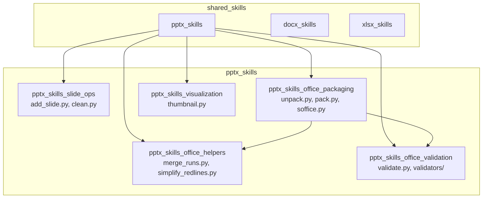
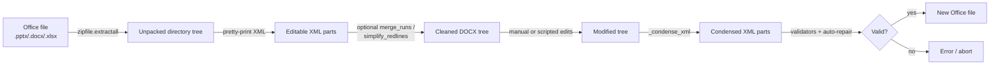
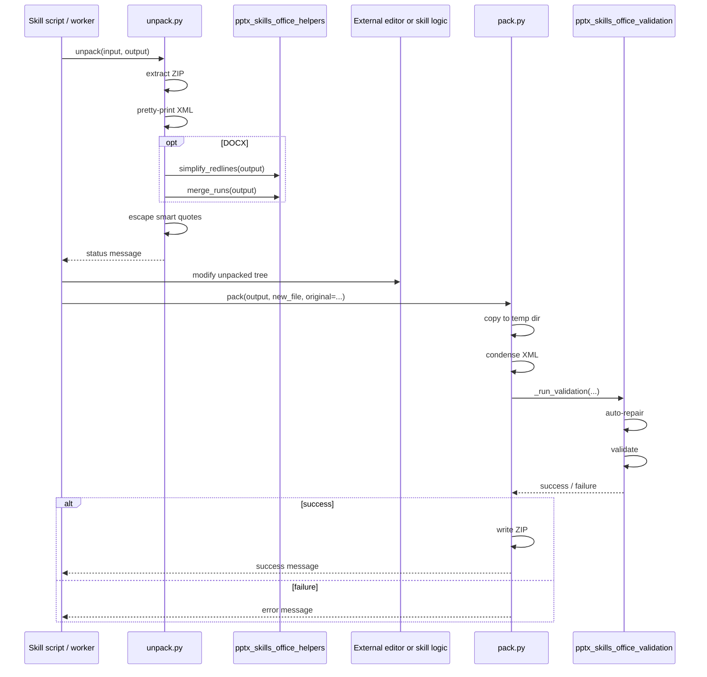
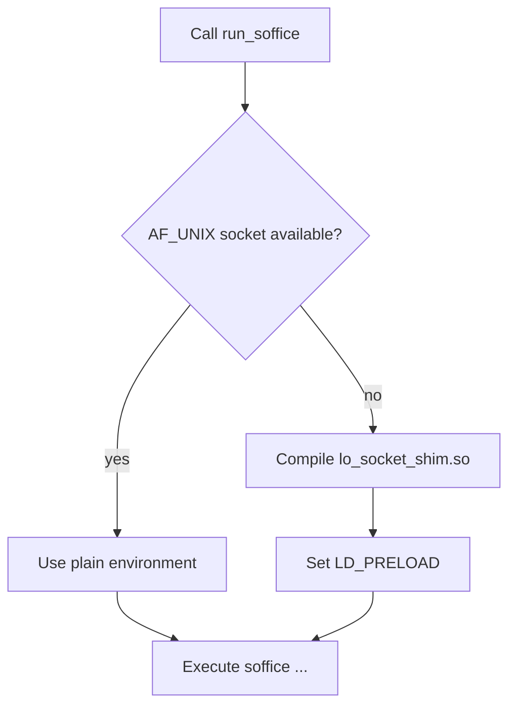

# pptx_skills_office_packaging

## Brief Introduction

The `pptx_skills_office_packaging` module provides low-level Office Open XML (OOXML) packaging utilities for PowerPoint (`.pptx`), Word (`.docx`), and Excel (`.xlsx`) files. It is part of the broader `pptx_skills` skill set under `shared_skills` and is responsible for the round-trip lifecycle of Office documents: unpacking a binary Office file into an editable directory tree, and packing that tree back into a valid Office file. The module also includes a sandbox-aware helper for invoking LibreOffice (`soffice`) in restricted environments where Unix-domain sockets are blocked.

These utilities are not end-user features; they are building blocks used by higher-level PPTX/DOCX/XLSX skills, the skill factory, and document-generation workers to manipulate Office documents safely and reproducibly.

---

## Core Functionality

The module exposes three primary capabilities, each implemented in a dedicated script:

| Script | Primary Role | Supported Formats |
|--------|--------------|-------------------|
| `unpack.py` | Extract an Office file into a human-editable directory tree | `.docx`, `.pptx`, `.xlsx` |
| `pack.py` | Rebuild an Office file from a directory tree, with optional validation and auto-repair | `.docx`, `.pptx`, `.xlsx` |
| `soffice.py` | Run LibreOffice commands in sandboxed environments | N/A (process helper) |

### 1. Unpacking Office Files (`unpack.py`)

The `unpack` function takes an Office file and an output directory, validates the file extension, extracts the ZIP archive, and post-processes the extracted XML:

- **Pretty-prints XML** using `defusedxml.minidom` so the parts are diff-friendly.
- **Escapes smart quotes** (`“`, `”`, `‘`, `’`) to numeric XML entities to avoid encoding issues during later editing.
- **DOCX-only optional cleanup**:
  - Merges adjacent runs with identical formatting via `merge_runs` from `pptx_skills_office_helpers`.
  - Simplifies adjacent tracked changes from the same author via `simplify_redlines` from `pptx_skills_office_helpers`.

Both cleanup steps are enabled by default and can be toggled with `--merge-runs` and `--simplify-redlines`.

Key components:

- `unpack(input_file, output_directory, merge_runs=True, simplify_redlines=True)` — main entry point.
- `_pretty_print_xml(xml_file)` — formats XML with two-space indentation.
- `_escape_smart_quotes(xml_file)` — replaces curly quotes with numeric character references.

### 2. Packing Office Files (`pack.py`)

The `pack` function reverses the unpack operation. It copies the unpacked directory into a temporary workspace, condenses the XML (removing pretty-print whitespace and comments), and writes the result as a ZIP archive with the correct Office extension.

When an `original_file` is supplied and validation is enabled, `pack` runs the same validators used by `pptx_skills_office_validation`:

- `DOCXSchemaValidator` for `.docx`
- `PPTXSchemaValidator` for `.pptx`
- `RedliningValidator` for `.docx` tracked-change integrity

Validators auto-repair common issues before validation, then report any remaining problems. If validation fails, packing aborts unless `--validate false` is used.

Key components:

- `pack(input_directory, output_file, original_file=None, validate=True, infer_author_func=None)` — main entry point.
- `_run_validation(unpacked_dir, original_file, suffix, infer_author_func)` — orchestrates validators and auto-repair.
- `_condense_xml(xml_file)` — strips non-significant whitespace and comments, preserving text-node content.

### 3. LibreOffice Sandbox Helper (`soffice.py`)

LibreOffice uses Unix-domain sockets internally. In hardened or sandboxed runtimes (e.g., some VM/container deployments), `AF_UNIX` socket creation may be blocked, causing `soffice` to fail. The `soffice.py` helper detects this restriction at runtime and, when necessary, compiles and `LD_PRELOAD`s a small C shim that intercepts `socket(AF_UNIX, ...)` calls and redirects them through `socketpair()` and pipe-based wake-up logic.

Key components:

- `run_soffice(args, **kwargs)` — runs `soffice` with the appropriate environment.
- `get_soffice_env()` — returns an environment dict with `SAL_USE_VCLPLUGIN=svp` and optional `LD_PRELOAD`.
- `_needs_shim()` — probes whether `AF_UNIX` sockets can be created.
- `_ensure_shim()` — compiles the shim shared object on first use and caches it in the system temp directory.

---

## Architecture and Component Relationships

### Module Context

The packaging module sits at the center of the PPTX skill set. Slide-operation scripts (`add_slide.py`, `clean.py`) produce or mutate an unpacked Office tree; the packaging scripts turn that tree into a deliverable file. The helper and validation modules are shared dependencies used during both unpack and pack phases.

### Data Flow: Unpack → Edit → Pack

### Component Interaction

### LibreOffice Shim Flow

---

## How It Fits into the Overall System

The `pptx_skills_office_packaging` module is a foundational layer in the document-generation and skill-execution stack. It is consumed by:

- **Higher-level PPTX skills** such as `pptx_skills_slide_ops` and `pptx_skills_visualization`, which operate on unpacked Office trees and rely on `pack.py` to produce final files.
- **Analogous DOCX and XLSX skill sets** (`docx_skills`, `xlsx_skills`) that share the same helper/validation patterns and sometimes the same underlying scripts.
- **Document-generation workers** (e.g., `workers/doc_worker.py`, `workers/presenton_worker.py`) that need to assemble Office documents as part of background jobs.
- **The skill factory** (`skill_factory_pipeline`), which packages and validates generated skills that include Office-manipulation scripts.
- **The ABStudio backend** (`abstudio_backend`), where catalog skills and workflow nodes may invoke these utilities to produce deliverables.

Because the module validates against OOXML XSD schemas and enforces relationship integrity, it acts as a safety gate: malformed edits are caught before a corrupt file is returned to users or downstream services.

---

## Key Design Decisions

1. **Round-trip safety** — Unpack pretty-prints XML for human/tool readability; pack condenses it back to the minimal form Office applications expect.
2. **Validation on pack, not on unpack** — Unpacking is permissive; packing is strict. This lets editors and skills make arbitrary changes while still guaranteeing output integrity.
3. **Original-file comparison** — When an original file is provided, validators compare the modified tree against the original to detect new XSD errors and to verify that redline changes are properly tracked.
4. **Sandbox portability** — The `soffice.py` shim is compiled lazily and cached, so LibreOffice-based conversions work in restricted environments without requiring pre-installed system patches.

---

## References

- [pptx_skills_office_helpers.md](pptx_skills_office_helpers.md) — run-merging and redline-simplification helpers used during unpack.
- [pptx_skills_office_validation.md](pptx_skills_office_validation.md) — OOXML schema validators and redlining validator used during pack.
- [pptx_skills_slide_ops.md](pptx_skills_slide_ops.md) — slide-level operations that produce or mutate unpacked PPTX trees.
- [pptx_skills_visualization.md](pptx_skills_visualization.md) — thumbnail and preview generation for PPTX files.
- [docx_skills.md](docx_skills.md) — parallel DOCX skill set that uses the same packaging patterns.
- [xlsx_skills.md](xlsx_skills.md) — parallel XLSX skill set that uses the same packaging patterns.
- [skill_factory_pipeline.md](skill_factory_pipeline.md) — skill packaging and quality loop that may include Office-manipulation skills.
- [workers.md](../workers/workers.md) — background workers that invoke document-generation and Office-conversion tasks.
