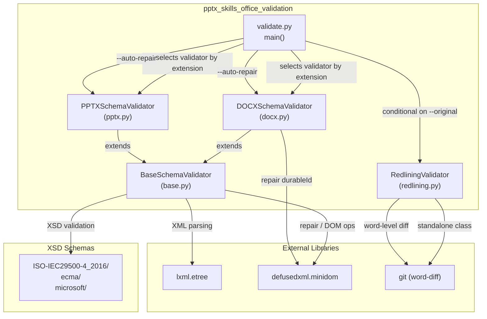
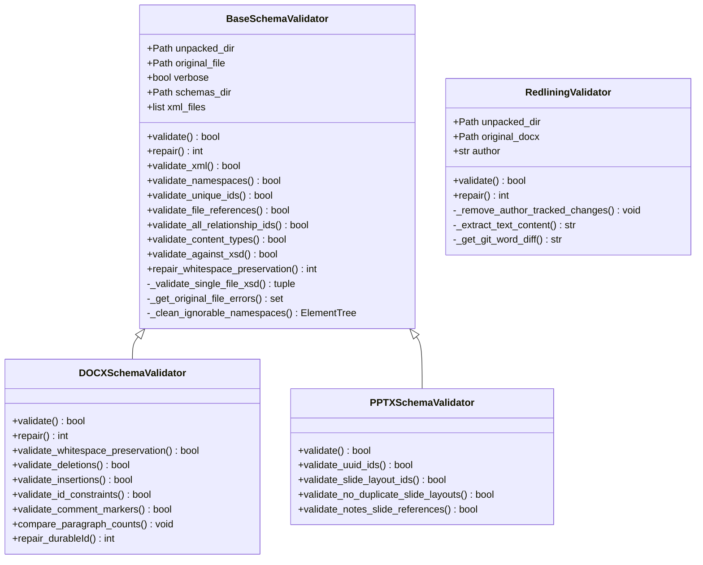
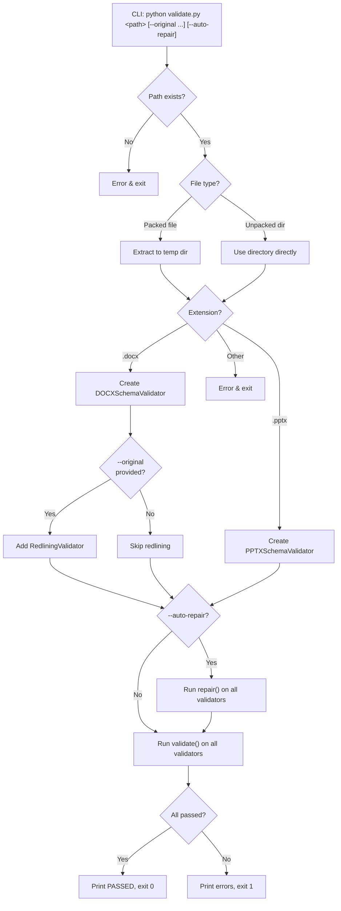
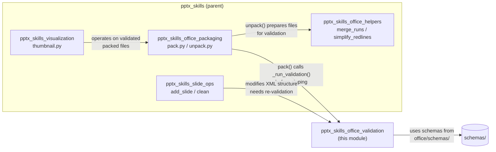
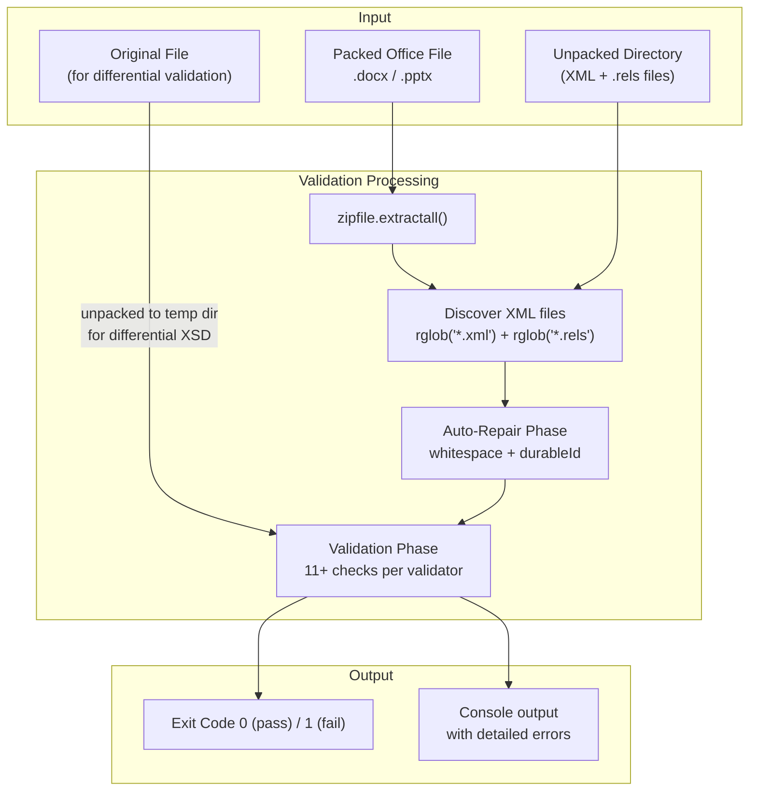
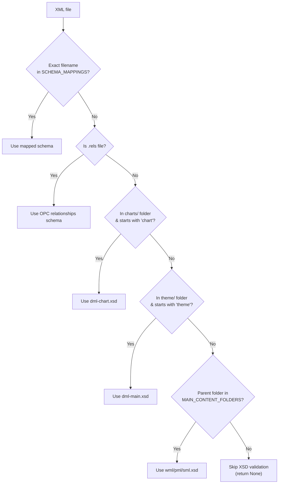

# PPTX Skills — Office Validation

## Introduction

The `pptx_skills_office_validation` module provides a comprehensive validation framework for Office Open XML (OOXML) documents — specifically `.docx`, `.pptx`, and `.xlsx` files. It is a sub-module of the broader [pptx_skills](pptx_skills.md) skill set and lives under the `shared_skills` layer of the platform.

The module ensures that documents produced or modified by AI-driven document-generation pipelines conform to the ISO/IEC 29500 (OOXML) XSD schemas, maintain correct internal relationships, preserve whitespace semantics, and — for Word documents — properly track changes (redlining). Validation is invoked both as a standalone CLI tool and programmatically from the packaging pipeline before a document is re-packed into its final `.zip`-based format.

---

## Architecture Overview

### Class Hierarchy

---

## Core Components

### 1. `validate.py` — CLI Entry Point

The `main()` function is the command-line interface that orchestrates the entire validation workflow. It accepts a path to either a packed Office file or an unpacked directory, determines the document type, instantiates the appropriate validator(s), optionally runs auto-repair, and executes validation.

**Key CLI arguments:**

| Argument | Required | Description |
|---|---|---|
| `path` | Yes | Path to unpacked directory or packed `.docx`/`.pptx`/`.xlsx` file |
| `--original` | No | Path to the original file for differential XSD validation and redlining checks |
| `--auto-repair` | No | Automatically fix common issues (hex IDs, whitespace preservation) |
| `--author` | No | Author name for redlining validation (default: `Claude`) |
| `-v / --verbose` | No | Enable verbose output |

**Validator selection logic:**

| File Extension | Validators Instantiated |
|---|---|
| `.docx` | `DOCXSchemaValidator` + `RedliningValidator` (if `--original` provided) |
| `.pptx` | `PPTXSchemaValidator` |
| `.xlsx` | Not supported (exits with error) |

> **Note:** Although the validators directory contains `DOCXSchemaValidator` and `PPTXSchemaValidator` (shared across docx/pptx/xlsx skill sets), the `validate.py` CLI in the pptx skill set only supports `.docx` and `.pptx`. The xlsx skill set has its own `validate.py` with identical structure.

### 2. `BaseSchemaValidator` — Common Validation Logic

The abstract base class provides all shared validation and repair logic used by both `DOCXSchemaValidator` and `PPTXSchemaValidator`. It is not instantiated directly.

**Class-level configuration:**

| Attribute | Purpose |
|---|---|
| `IGNORED_VALIDATION_ERRORS` | Error substrings to suppress (e.g., `hyphenationZone`, Dublin Core terms) |
| `UNIQUE_ID_REQUIREMENTS` | Maps element tags to their ID attribute and uniqueness scope (`file` or `global`) |
| `EXCLUDED_ID_CONTAINERS` | Container elements whose children are exempt from ID uniqueness checks |
| `SCHEMA_MAPPINGS` | Maps file patterns/names to their corresponding XSD schema file paths |
| `OOXML_NAMESPACES` | Set of recognized OOXML namespaces; non-matching namespaces are stripped during XSD validation |
| `ELEMENT_RELATIONSHIP_TYPES` | Maps element names to expected relationship types (overridden by subclasses) |

**Validation methods provided:**

| Method | What It Checks |
|---|---|
| `validate_xml()` | Well-formedness of all XML/rels files via `lxml.etree.parse` |
| `validate_namespaces()` | All namespace prefixes in `mc:Ignorable` attributes are declared |
| `validate_unique_ids()` | IDs for elements in `UNIQUE_ID_REQUIREMENTS` are unique within their scope |
| `validate_file_references()` | All `.rels` targets exist; all files are referenced (no orphans) |
| `validate_all_relationship_ids()` | `r:id`/`r:embed`/`r:link` attributes reference valid relationship IDs |
| `validate_content_types()` | All content parts are declared in `[Content_Types].xml` |
| `validate_against_xsd()` | Each XML file validates against its XSD schema (differential: only *new* errors are reported) |

**Differential XSD validation:** When an `original_file` is provided, the validator unpacks the original and validates it against the same schemas. Only errors that are *new* (not present in the original) are reported as failures. This prevents false positives from pre-existing schema violations in template files.

**Repair methods:**

| Method | What It Fixes |
|---|---|
| `repair_whitespace_preservation()` | Adds `xml:space="preserve"` to `*:t` elements with leading/trailing whitespace |

### 3. `DOCXSchemaValidator` — Word Document Validation

Extends `BaseSchemaValidator` with DOCX-specific checks:

| Method | What It Checks |
|---|---|
| `validate_whitespace_preservation()` | `w:t` elements with whitespace have `xml:space="preserve"` |
| `validate_deletions()` | No `w:t` or `w:instrText` inside `w:del` (should use `w:delText`/`w:delInstrText`) |
| `validate_insertions()` | No `w:delText` inside `w:ins` (unless nested in `w:del`) |
| `validate_id_constraints()` | `w14:paraId` < `0x80000000`; `w16cid:durableId` < `0x7FFFFFFF` |
| `validate_comment_markers()` | `commentRangeStart`/`commentRangeEnd` pairs are balanced; references point to existing comments |
| `compare_paragraph_counts()` | Reports paragraph count delta between original and modified (informational) |

**Additional repair:**

| Method | What It Fixes |
|---|---|
| `repair_durableId()` | Regenerates `durableId` values that exceed OOXML limits (hex for most files, decimal for `numbering.xml`) |

### 4. `PPTXSchemaValidator` — PowerPoint Validation

Extends `BaseSchemaValidator` with PPTX-specific checks:

| Method | What It Checks |
|---|---|
| `validate_uuid_ids()` | UUID-like ID values contain valid hex characters |
| `validate_slide_layout_ids()` | `sldLayoutId` elements in slide masters reference valid layout relationships |
| `validate_no_duplicate_slide_layouts()` | Each slide has exactly one `slideLayout` relationship |
| `validate_notes_slide_references()` | No notes slide is shared across multiple slides |

**Relationship type mapping:** PPTXSchemaValidator overrides `ELEMENT_RELATIONSHIP_TYPES` to validate that `sldId`, `sldMasterId`, `sldLayoutId`, etc. point to the correct relationship types (slide, slideMaster, slideLayout, etc.).

### 5. `RedliningValidator` — Tracked Changes Validation

A standalone validator (not extending `BaseSchemaValidator`) that verifies tracked changes (redlining) in Word documents are correctly structured.

**Validation logic:**

1. Parse the modified `document.xml` and check for `w:del`/`w:ins` elements authored by the specified author.
2. If no author-specific tracked changes exist, validation passes.
3. Otherwise, unpack the original document and remove the author's tracked changes from both documents:
   - **Insertions** (`w:ins`): Remove the element entirely.
   - **Deletions** (`w:del`): Convert `w:delText` back to `w:t` and unwrap the element (restoring deleted text).
4. Extract paragraph text from both documents and compare.
5. If texts differ, generate a `git diff --word-diff` output showing the discrepancies.

**Common failure causes reported:**
- Modified text inside another author's `w:ins` or `w:del` tags
- Edits made without proper tracked changes
- Failure to nest `w:del` inside `w:ins` when deleting another author's insertion

---

## Validation Pipeline

### Detailed Validation Sequence (per validator)

```mermaid
flowchart LR
    subgraph "BaseSchemaValidator.validate() sequence"
        V1["validate_xml()"] --> V2["validate_namespaces()"]
        V2 --> V3["validate_unique_ids()"]
        V3 --> V4["validate_file_references()"]
        V4 --> V5["validate_content_types()"]
        V5 --> V6["validate_against_xsd()"]
        V6 --> V7["validate_all_relationship_ids()"]
    end

    subgraph "DOCX additions"
        D1["validate_whitespace_preservation()"]
        D2["validate_deletions()"]
        D3["validate_insertions()"]
        D4["validate_id_constraints()"]
        D5["validate_comment_markers()"]
        D6["compare_paragraph_counts()"]
    end

    subgraph "PPTX additions"
        P1["validate_uuid_ids()"]
        P2["validate_slide_layout_ids()"]
        P3["validate_notes_slide_references()"]
        P4["validate_no_duplicate_slide_layouts()"]
    end

    V7 --> D1
    D1 --> D2 --> D3 --> D4 --> D5 --> D6

    V7 --> P1
    P1 --> P2 --> P3 --> P4
```

> **Important:** If `validate_xml()` fails (malformed XML), the validator returns `False` immediately and skips all subsequent checks, since they depend on parseable XML.

---

## Module Dependencies

### Integration with Packaging Pipeline

The validation module is tightly integrated with the [pptx_skills_office_packaging](pptx_skills_office_packaging.md) module:

1. **`unpack()`** — When a `.docx` is unpacked, `simplify_redlines()` and `merge_runs()` from [pptx_skills_office_helpers](pptx_skills_office_helpers.md) are applied to normalize the XML structure, making subsequent validation more reliable.

2. **`pack()`** — Before re-packing an unpacked directory into a `.docx`/`.pptx` file, `pack()` calls `_run_validation()` which instantiates the same validators used by the CLI. If validation fails, packing is aborted and an error is returned. This ensures no corrupt documents are produced.

3. **`_run_validation()`** — The internal function in `pack.py` mirrors the CLI's logic: it selects validators by file extension, runs auto-repair, then validates. For `.docx`, it also infers the author name (via an optional `infer_author_func` callback) for redlining validation.

### Shared Validator Code

The validators (`base.py`, `docx.py`, `pptx.py`, `redlining.py`) are **shared identically** across the `docx_skills`, `pptx_skills`, and `xlsx_skills` sub-modules. Each skill set contains its own copy of these files under `scripts/office/validators/`. The `validate.py` CLI in each skill set differs only in which file extensions it supports:

| Skill Set | Supported Extensions |
|---|---|
| `docx_skills` | `.docx` |
| `pptx_skills` | `.docx`, `.pptx` |
| `xlsx_skills` | `.docx`, `.pptx`, `.xlsx` |

---

## Data Flow

### XSD Schema Resolution

The `_get_schema_path()` method maps XML files to their corresponding XSD schemas using a priority order:

---

## Key Design Decisions

### 1. Differential XSD Validation
Rather than requiring perfect schema compliance, the validator compares errors against the original file. Only *newly introduced* errors are treated as failures. This accommodates real-world documents (especially templates) that may contain pre-existing schema violations from proprietary extensions.

### 2. Ignorable Namespace Handling
OOXML uses Markup Compatibility (`mc:Ignorable`) to declare namespace prefixes that can be safely ignored by consumers. The validator strips non-OOXML namespaces and their elements before XSD validation to avoid false positives from extension namespaces (e.g., `w14`, `w15`, `mc`).

### 3. Template Tag Removal
The `_remove_template_tags_from_text_nodes()` method strips `{{...}}` template placeholders from non-text elements before XSD validation, allowing template-based document generation to pass schema checks.

### 4. Relationship Integrity as Critical Check
The `validate_file_references()` method treats both broken references and unreferenced files as critical errors, printing a `CRITICAL` warning. This is because orphaned files or broken relationship targets cause Office applications to report the document as corrupt.

### 5. Redlining Semantic Validation
The `RedliningValidator` goes beyond structural checks: it semantically verifies that removing the author's tracked changes from both the original and modified documents produces identical text. This catches subtle issues like editing text inside another author's tracked-change regions.

---

## Error Handling and Exit Codes

| Exit Code | Meaning |
|---|---|
| `0` | All validations passed |
| `1` | One or more validations failed |
| Assertion errors | Invalid input (missing file, wrong extension, etc.) |

Validation failures print detailed error messages including:
- File path (relative to unpacked directory)
- Line number
- Element tag and attribute
- Text preview (truncated to 50 characters)
- Remediation hints (for relationship and redlining errors)

---

## Related Documentation

- [pptx_skills](pptx_skills.md) — Parent module overview
- [pptx_skills_office_packaging](pptx_skills_office_packaging.md) — Pack/unpack pipeline that invokes validation
- [pptx_skills_office_helpers](pptx_skills_office_helpers.md) — XML normalization helpers (merge_runs, simplify_redlines)
- [pptx_skills_slide_ops](pptx_skills_slide_ops.md) — Slide creation and cleanup operations
- [pptx_skills_visualization](pptx_skills_visualization.md) — Thumbnail generation from validated files
- [docx_skills](docx_skills.md) — Word document skill set (shares validator code)
- [xlsx_skills](xlsx_skills.md) — Excel skill set (shares validator code)
