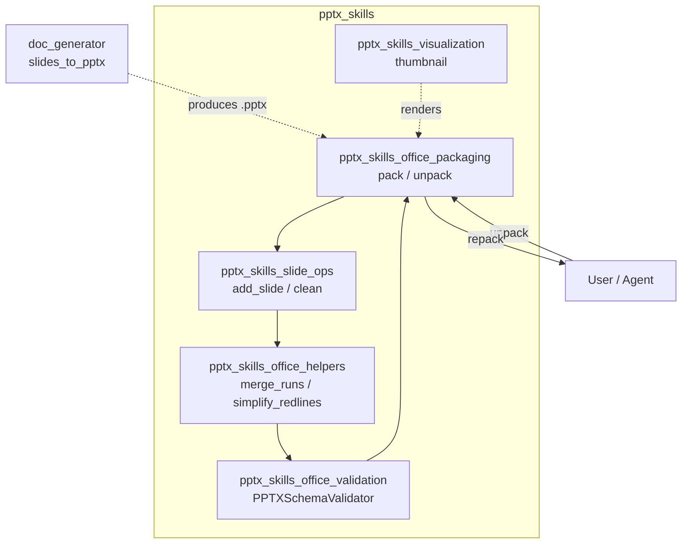
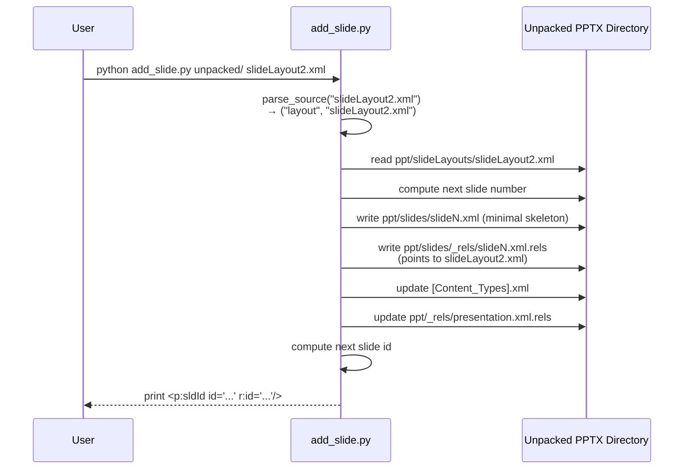
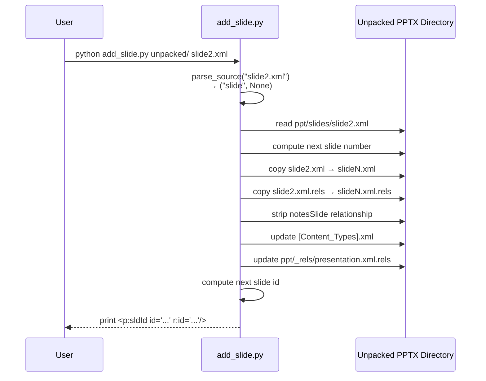
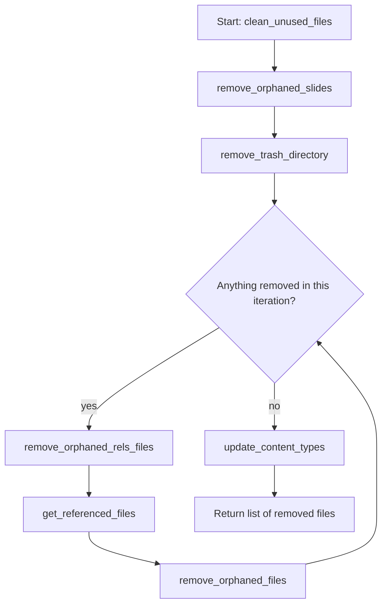

# pptx_skills_slide_ops

## Brief Introduction

`pptx_skills_slide_ops` is a small, focused module inside the broader `pptx_skills` family. It provides command-line scripts that manipulate individual slides within an **unpacked PPTX directory** (the OOXML package format extracted as a folder tree). The module is responsible for two primary operations:

1. **Adding slides** — either by duplicating an existing slide or by creating a new slide from a slide layout template.
2. **Cleaning unused files** — removing orphaned slides, unreferenced media/charts/drawings, stale relationship files, and stale `[Content_Types].xml` overrides.

These scripts are intended to be used after a `.pptx` file has been unpacked (see [pptx_skills_office_packaging](pptx_skills_office_packaging.md)) and before it is repacked and validated (see [pptx_skills_office_packaging](pptx_skills_office_packaging.md) and [pptx_skills_office_validation](pptx_skills_office_validation.md)).

---

## Comprehensive Documentation

### 1. Module Purpose and Scope

PowerPoint files (`.pptx`) are ZIP archives of XML files, media assets, and relationship metadata. When building or modifying presentations programmatically, it is often easier to work on the unpacked directory tree. `pptx_skills_slide_ops` exposes low-level slide operations on that unpacked tree.

The module does **not** handle:

- Packing/unpacking ZIP archives (handled by [pptx_skills_office_packaging](pptx_skills_office_packaging.md)).
- High-level presentation generation (handled by [doc_generator](../documents/doc_generator.md) via `slides_to_pptx`).
- XML run merging or redline simplification (handled by [pptx_skills_office_helpers](pptx_skills_office_helpers.md)).
- XSD validation (handled by [pptx_skills_office_validation](pptx_skills_office_validation.md)).
- Thumbnail generation (handled by [pptx_skills_visualization](pptx_skills_visualization.md)).

Instead, it focuses narrowly on slide lifecycle management within the unpacked package.

---

### 2. Architecture and Component Relationships

#### 2.1 Position in the System



`pptx_skills_slide_ops` sits between the pack/unpack layer and the helper/validation layers. It mutates the unpacked directory directly, so it is typically invoked before validation and repacking.

---

### 3. Core Components

#### 3.1 `add_slide.py`

Entry point for adding a slide to an unpacked PPTX directory.

| Component | Responsibility |
|-----------|----------------|
| `parse_source(source)` | Classifies the CLI `<source>` argument as either a layout file (`slideLayout*.xml`) or a slide file (`slide*.xml`). |
| `create_slide_from_layout(unpacked_dir, layout_file)` | Creates a new `slideN.xml` from a slide layout, writes its `.rels` file pointing to the layout, registers the slide in `[Content_Types].xml` and `presentation.xml.rels`, and prints the `<p:sldId>` element to insert. |
| `duplicate_slide(unpacked_dir, source)` | Copies an existing slide XML and its `.rels` file, strips any `notesSlide` relationship, registers the new slide, and prints the `<p:sldId>` element to insert. |
| `get_next_slide_number(slides_dir)` | *(private helper)* Finds the next available `slideN.xml` number. |
| `_add_to_content_types(unpacked_dir, dest)` | *(private helper)* Adds an `<Override>` entry to `[Content_Types].xml`. |
| `_add_to_presentation_rels(unpacked_dir, dest)` | *(private helper)* Adds a slide relationship to `ppt/_rels/presentation.xml.rels` and returns the new `rId`. |
| `_get_next_slide_id(unpacked_dir)` | *(private helper)* Computes the next `<p:sldId id="...">` value (defaults to `256` if no slides exist). |

##### Data Flow: Adding a Slide from a Layout



##### Data Flow: Duplicating a Slide



> **Note:** The script prints the `<p:sldId>` element but does **not** automatically insert it into `presentation.xml`. The caller must add that element to `<p:sldIdLst>` to make the slide visible in the presentation order.

---

#### 3.2 `clean.py`

Entry point for removing unreferenced files from an unpacked PPTX directory.

| Component | Responsibility |
|-----------|----------------|
| `clean_unused_files(unpacked_dir)` | Orchestrates the full cleanup pass and returns a list of removed relative paths. |
| `get_slides_in_sldidlst(unpacked_dir)` | Resolves which `slide*.xml` files are actually referenced by `<p:sldIdLst>` in `presentation.xml`. |
| `remove_orphaned_slides(unpacked_dir)` | Deletes slide XML files (and their `.rels`) that are not in the slide id list, and removes their relationships from `presentation.xml.rels`. |
| `remove_trash_directory(unpacked_dir)` | Deletes the `[trash]` directory and all files inside it. |
| `get_slide_referenced_files(unpacked_dir)` | Collects files referenced by slide `.rels` files. |
| `remove_orphaned_rels_files(unpacked_dir)` | Removes stale `.rels` files under `charts`, `diagrams`, and `drawings`. |
| `get_referenced_files(unpacked_dir)` | Collects all files referenced by any `.rels` file in the package. |
| `remove_orphaned_files(unpacked_dir, referenced)` | Deletes unreferenced files in `media`, `embeddings`, `charts`, `diagrams`, `tags`, `drawings`, `ink`, orphaned themes, and orphaned notes slides. |
| `update_content_types(unpacked_dir, removed_files)` | Removes `<Override>` entries from `[Content_Types].xml` for deleted files. |

##### Cleanup Process Flow



The iterative pass ensures that removing a slide can cascade into removing its referenced charts/drawings, which in turn can make their own `.rels` files obsolete.

---

### 4. File Structure and OOXML Conventions

The scripts assume a standard unpacked PPTX layout:

```text
unpacked/
├── [Content_Types].xml
├── ppt/
│   ├── presentation.xml
│   ├── _rels/
│   │   └── presentation.xml.rels
│   ├── slides/
│   │   ├── slide1.xml
│   │   ├── slide2.xml
│   │   └── _rels/
│   │       ├── slide1.xml.rels
│   │       └── slide2.xml.rels
│   ├── slideLayouts/
│   │   ├── slideLayout1.xml
│   │   └── slideLayout2.xml
│   ├── slideMasters/
│   ├── notesSlides/
│   ├── theme/
│   ├── media/
│   ├── charts/
│   ├── diagrams/
│   ├── drawings/
│   └── ...
```

Key OOXML concepts used:

- **Relationships (`.rels`)**: Map `rId` tokens to target files using `Relationship` elements.
- **`[Content_Types].xml`**: Declares the MIME type for each part in the package.
- **`presentation.xml`**: Contains `<p:sldIdLst>` which defines the ordered list of slides.
- **Slide IDs vs. file numbers**: A slide file is named `slideN.xml`, but its identifier in `presentation.xml` is a separate numeric `id` attribute.

---

### 5. How the Module Fits into the Overall System

`pptx_skills_slide_ops` is part of the `shared_skills` layer, which provides reusable document-manipulation capabilities used by agents, workers, and the ABStudio backend. The module is typically invoked in workflows such as:

1. **Template-based presentation construction** — An agent or worker unpacks a template, adds slides from layouts, populates content, cleans unused assets, and repacks.
2. **Presentation repair** — After automated edits, `clean.py` removes artifacts left behind by intermediate transformations.
3. **Skill execution** — Anthropic-style skills can call these scripts as subprocess tools to perform deterministic slide operations.

The broader flow through the PPTX skill stack is:


For end-to-end document generation, see [doc_generator](../documents/doc_generator.md). For rendering previews, see [pptx_skills_visualization](pptx_skills_visualization.md).

---

### 6. Usage Examples

#### Add a slide from a layout

```bash
python ABStudio/skills/ainxt-skills/pptx/scripts/add_slide.py unpacked/ slideLayout2.xml
```

Output:

```text
Created slide5.xml from slideLayout2.xml
Add to presentation.xml <p:sldIdLst>: <p:sldId id="257" r:id="rId12"/>
```

#### Duplicate an existing slide

```bash
python ABStudio/skills/ainxt-skills/pptx/scripts/add_slide.py unpacked/ slide2.xml
```

Output:

```text
Created slide5.xml from slide2.xml
Add to presentation.xml <p:sldIdLst>: <p:sldId id="257" r:id="rId12"/>
```

#### Clean unreferenced files

```bash
python ABStudio/skills/ainxt-skills/pptx/scripts/clean.py unpacked/
```

Output:

```text
Removed 4 unreferenced files:
  ppt/slides/slide3.xml
  ppt/slides/_rels/slide3.xml.rels
  ppt/charts/chart1.xml
  ppt/media/image1.png
```

---

### 7. Dependencies and Related Modules

| Dependency | Relationship |
|------------|--------------|
| [pptx_skills_office_packaging](pptx_skills_office_packaging.md) | Provides `unpack` (produces the directory tree consumed by this module) and `pack` (produces the final `.pptx`). |
| [pptx_skills_office_helpers](pptx_skills_office_helpers.md) | Provides `merge_runs` and `simplify_redlines` for Word documents; not directly used by slide ops but part of the same post-edit pipeline. |
| [pptx_skills_office_validation](pptx_skills_office_validation.md) | Validates the unpacked directory after slide ops and cleanup. |
| [pptx_skills_visualization](pptx_skills_visualization.md) | Generates thumbnail grids from the final `.pptx`. |
| [doc_generator](../documents/doc_generator.md) | Higher-level tool that can generate slide content and produce `.pptx` files. |

---

### 8. Important Considerations

- **Manual `<p:sldIdLst>` update required.** `add_slide.py` registers the slide in relationship and content-type metadata but leaves the actual ordering entry for the caller to insert. This design keeps the script idempotent and avoids making assumptions about slide order.
- **Slide IDs must be unique.** `_get_next_slide_id` computes the next ID by scanning existing `id` attributes in `presentation.xml`.
- **Relationship IDs must be unique.** `_add_to_presentation_rels` scans existing `rIdN` values to avoid collisions.
- **Cleanup is destructive.** `clean.py` deletes files from the unpacked directory. It should be run on a copy, not the original source.
- **Iterative orphan removal.** The cleanup loop repeats until no more files are removed, handling cascading unreferenced assets.
- **Notes slides are stripped on duplication.** When duplicating a slide, any `notesSlide` relationship is removed from the new slide's `.rels` to avoid sharing a single notes slide between two slides.
