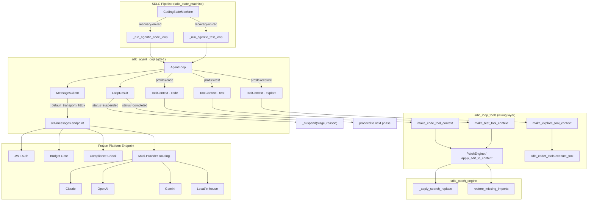
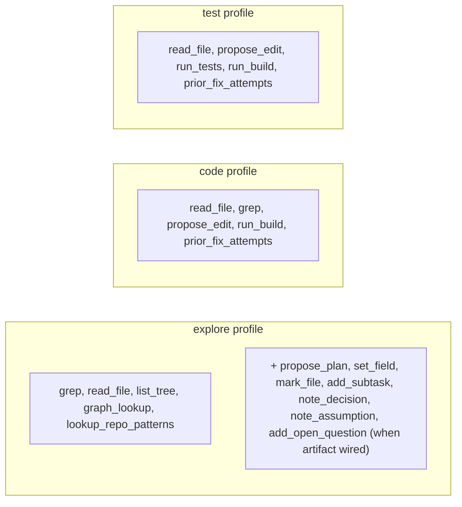
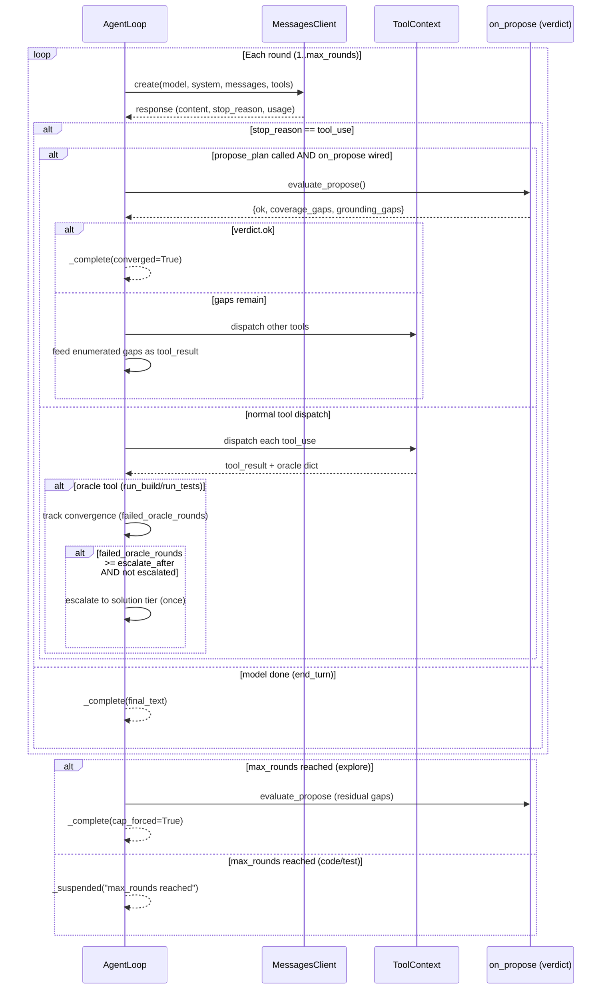
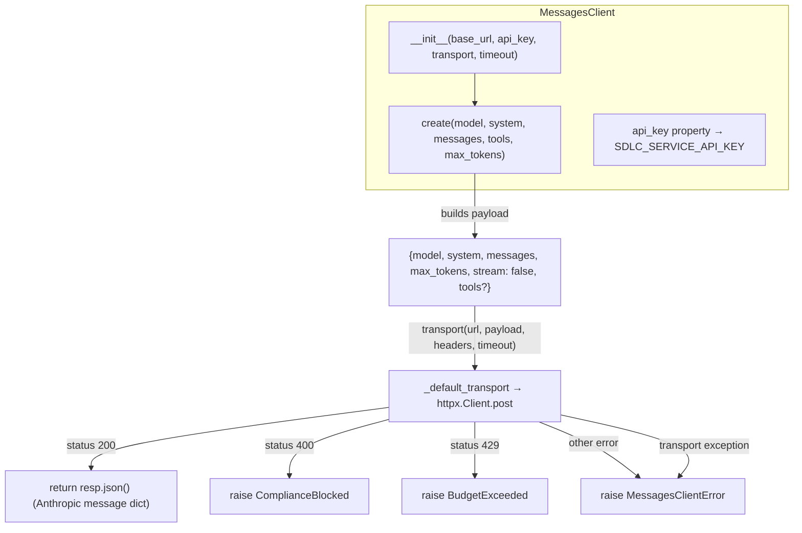
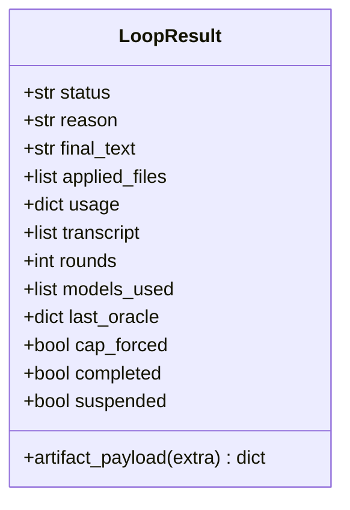
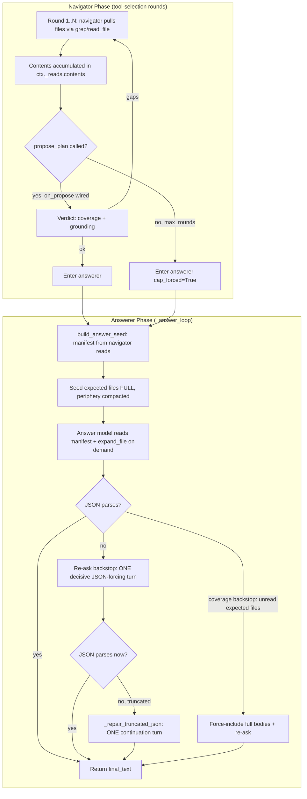
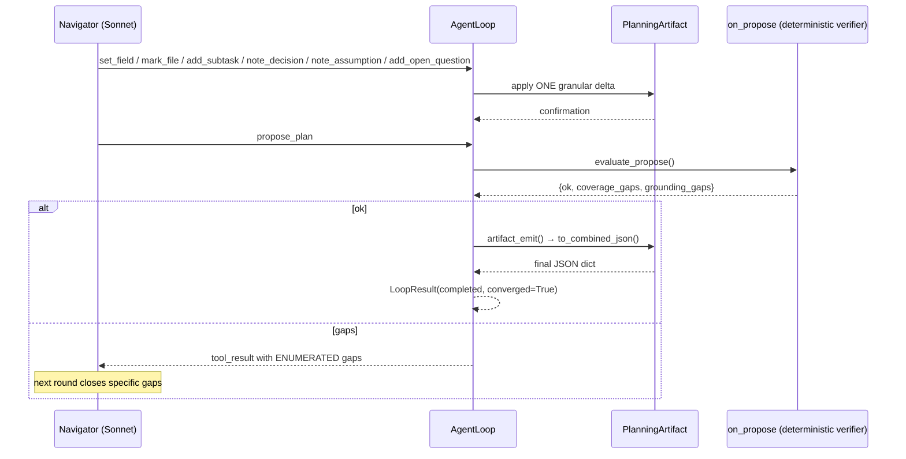
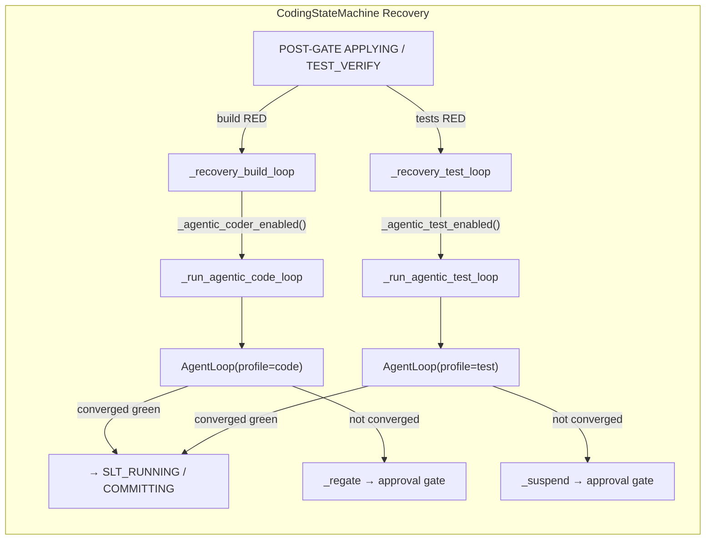

# SDLC Agent Loop

## Introduction

The `sdlc_agent_loop` module (`agents/sdlc_agent_loop.py`) is the **bounded agentic execution-loop primitive** — designated WS-1 in the SDLC Agentic Loop RFD. It provides a Python, in-worker Anthropic tool-use loop that acts as a *client* of the platform's frozen `/v1/messages` endpoint. Every other agentic-loop workstream (WS-2 baseline gate, WS-3 compile-as-oracle coder/fixer, WS-4 test loop, WS-5 agentic pull) builds on top of this module.

The loop is designed around hard constraints: it never calls an LLM SDK or gateway directly, never writes files or commits on its own, and always **suspends rather than fails** on any unrecoverable outcome. All I/O boundaries are injectable for testability, and the entire module is flag-gated (`SDLC_ENABLE_AGENTIC_LOOP`, default off) so it is dark until explicitly opted in.

---

## Architecture Overview



### Core Design Principles

| Principle | Implementation |
|-----------|---------------|
| **Never call LLM SDK directly** | All model calls POST to `{SDLC_MESSAGES_URL}/v1/messages` with `stream=false` via `MessagesClient` |
| **Service-principal auth** | Authenticates with `SDLC_SERVICE_API_KEY` (a platform API key), never a run owner's JWT. Fails closed if unset. |
| **No direct file writes** | The `propose_edit` tool delegates to the deterministic applier (`sdlc_patch_engine`). The loop only dispatches to injected `ToolContext` callables. |
| **Suspend-not-fail** | Any unrecoverable outcome returns `LoopResult(status="suspended", reason=...)`. The loop never raises on normal failure. |
| **Compliance block handling** | Catches HTTP 400 from the endpoint (PCI/PII/secret in tool_result) and suspends with the violation text — never retries the same content. |
| **Flag-gated** | `loop_enabled()` checks `SDLC_ENABLE_AGENTIC_LOOP` (default off). With flags off, the module is never invoked. |
| **Dependency injection** | Transport, tools, and event sinks are all injectable callables for Windows-safe unit testing. |

---

## Component Reference

### `AgentLoop`

The central orchestrator. A bounded Anthropic tool-use loop driven against `/v1/messages`.

```mermaid
stateDiagram-v2
    [*] --> run: run()
    run --> _run_inner: try
    _run_inner --> RoundLoop: for round in 1..max_rounds

    state RoundLoop {
        [*] --> ModelSelect: _model_for_round()
        ModelSelect --> CreateMsg: client.create(model, system, messages, tools)
        CreateMsg --> CheckBudget: token budget guard
        CheckBudget --> CheckStop: stop_reason == tool_use?
        CheckStop --> Complete: no → model done
        CheckStop --> ProposeCheck: yes → has propose_plan?
        
        ProposeCheck --> EvaluatePropose: on_propose wired
        EvaluatePropose --> Complete: verdict.ok == true
        EvaluatePropose --> FeedGaps: verdict.ok == false
        FeedGaps --> RoundLoop: next round

        CheckStop --> DispatchTools: no propose_plan
        DispatchTools --> TrackOracle: oracle tools (run_build/run_tests)
        TrackOracle --> RoundLoop: next round
    }

    Complete --> _complete: explore → synthesis / artifact emit
    _complete --> [*]: LoopResult(completed)
    
    RoundLoop --> CapHit: max_rounds reached
    CapHit --> _complete: explore → forced synthesis (cap_forced=True)
    CapHit --> [*]: LoopResult(suspended)

    run --> Suspended: ComplianceBlocked / BudgetExceeded / MessagesClientError
    Suspended --> [*]: LoopResult(suspended)
```

#### Constructor Parameters

| Parameter | Type | Description |
|-----------|------|-------------|
| `stage` | `str` | Pipeline stage (e.g. `"coding"`, `"testing"`, `"analyze"`) |
| `profile` | `str` | Tool profile: `"explore"`, `"code"`, or `"test"` |
| `tool_context` | `ToolContext` | Injectable tool implementations (read_file, grep, propose_edit, run_build, run_tests, etc.) |
| `client` | `MessagesClient` | Optional; defaults to a new `MessagesClient()` |
| `model_plan` | `ModelPlan` | Optional; defaults to `plan_for_profile(profile, stage)` |
| `goal` | `str` | The single goal the loop works toward |
| `initial_user` | `str` | First user message (task description + context) |
| `system_preamble` | `str` | Optional system prompt prefix |
| `max_rounds` | `int` | Optional; defaults to `_max_rounds_for(profile)` |
| `token_budget` | `int` | Optional; cumulative output-token cap |
| `max_tokens` | `int` | Per-round output token limit (default 8192) |
| `synthesis_max_tokens` | `int` | Terminal synthesis turn budget (default 32000) |
| `event_sink` | `Callable` | Optional event callback `(actor, msg, data)` |
| `run_id` | `str` | SDLC run identifier for logging |
| `expected_files` | `list` | Files-to-change for the explore answerer coverage backstop |
| `on_propose` | `Callable` | Optional deterministic convergence verdict (artifact-planning-loop) |
| `artifact` | `Any` | Optional `PlanningArtifact` handle for granular delta writes |
| `artifact_emit` | `Callable` | Optional final JSON assembler from the artifact |

#### Tool Profiles

Each profile exposes a different set of tools to the model:



#### Model Split Routing

The `ModelPlan` dataclass resolves per-role model hints:

| Role | Explore | Code | Test |
|------|---------|------|------|
| **navigator** | `complex` (Sonnet) | `sdlc_stage_hint("coder")` | `sdlc_stage_hint("fixer")` |
| **escalation** | `solution` (informational only) | configurable (default `medium`) | configurable (default `medium`) |
| **synthesizer** | `sdlc_stage_hint(stage)` | — | — |

Escalation fires **once** after `_escalate_after()` (default 2) consecutive non-converging oracle rounds on the same goal. The explore profile no longer escalates to Opus inside the loop — Opus enters only via the two stage gates.

#### Convergence & Escalation Flow



### `MessagesClient`

Thin client for `POST {base_url}/v1/messages` with `stream=false`. This is the **only** component that touches the network.



**Key behaviours:**
- API key resolved at call time (not construction) so an unset key surfaces as a clear error at the integration boundary.
- Uses a lazily-created pooled `httpx.Client` (module-global `_HTTPX_CLIENT`).
- The transport callable is injectable — tests pass a fake that returns objects with `.status_code`, `.json()`, and `.text`.

### `ComplianceBlocked`

Exception raised when `/v1/messages` returns HTTP 400, indicating PCI/PII/secret content in a tool_result. The loop catches this in `run()` and suspends with the violation detail — it **never retries** the same content (RFD §3.5).

Related exceptions in the same file:
- `BudgetExceeded` — HTTP 429 from the endpoint's budget gate
- `MessagesClientError` — any other non-recoverable transport/upstream failure

### `_outline`

Pure helper that produces a cheap structural outline of a file body (imports + class/def/export/route signatures, capped at 40 lines). Used by the answerer manifest assembly. Deterministic — no LLM, no network. Windows-safe.

### `_default_transport`

The real transport function — a pooled `httpx` POST. Imported lazily so importing the module never requires `httpx` to be installed on the dev box's test path. Signature: `transport(url, payload, headers, timeout) -> object with .status_code, .json(), .text`.

---

## Data Structures

### `LoopResult`



The `cap_forced` flag is `True` when explore synthesis was forced at `max_rounds` (not a volunteered terminal turn). The pre-gate completeness verifier reads this so a cap-forced synthesis is never mistaken for a confident, complete result.

### `ToolContext`

A `@dataclass` holding injectable tool callables. Any callable left `None` reports `"unavailable"` so the model can recover.

| Field | Profile | Signature |
|-------|---------|-----------|
| `read_file` | explore, code, test | `(path, start_line?, end_line?) -> str` |
| `grep` | explore, code | `(pattern, path?) -> str` |
| `list_tree` | explore | `(path?) -> str` |
| `graph_lookup` | explore | `(symbol, direction) -> str` |
| `propose_edit` | code, test | `(path, edits) -> dict` |
| `run_build` | code, test | `() -> dict` |
| `run_tests` | test | `(scope?) -> dict` |
| `lookup_repo_patterns` | explore | `(query) -> str` |
| `prior_fix_attempts` | code, test | `(file?, error_sig?) -> str` |

### `ModelPlan`

```python
@dataclass
class ModelPlan:
    navigator: str       # drives tool selection each round
    escalation: str      # ONE round after escalate_after non-converging oracle rounds
    synthesizer: Optional[str] = None  # explore-only: final synthesis call
```

---

## Explore Profile: Answerer & Synthesis

The explore profile has a sophisticated two-phase design: a **navigator** phase (tool-selection rounds) and an **answerer** phase (terminal synthesis).



### `build_answer_seed`

Assembles the explore answerer's seed manifest. Expected files (analysis.files_to_change) are seeded at **full fidelity**; periphery files are compacted deterministically (grep-focused regions, never an LLM digest). Generated/dump/lock files are never seeded in full — always a grep-focused view.

### `_focus_large_file`

Produces a grep-focused view of an over-cap file: structural outline (signatures + line numbers) plus context windows around lines matching the task's key terms. Falls back to head+tail (tail-preserving) only when nothing matches — never a silent middle cut.

### `_repair_truncated_json`

Issues ONE continuation turn to finish a JSON answer truncated at the output ceiling. Detects truncation via `stop_reason == "max_tokens"` or unbalanced brace counts. Concatenates the continuation and re-checks parseability.

---

## Artifact-Planning-Loop Integration

When the caller wires `on_propose`, `artifact`, and `artifact_emit`, the explore profile gains granular planning tools that mutate a `PlanningArtifact` through **delta writes** (never a whole-artifact re-emit):



This removes the cost regression of re-emitting the full manifest each round (Research Q3) and makes premature/ungrounded stops impossible via deterministic verification (Research Q1).

---

## Integration with the SDLC Pipeline

### How `CodingStateMachine` Uses the Loop

The `AgentLoop` is invoked by `CodingStateMachine` in **recovery-only** contexts — it fires only when a red oracle (failed build or failed tests) is detected post-gate, and only when operator flags are enabled:



**Gate conditions for loop activation:**
- `loop_enabled()` → `SDLC_ENABLE_AGENTIC_LOOP=true`
- `self._recovery_context == True` (set only inside `_phase_applying` / `_phase_test_verify` on a red oracle)
- Profile-specific flag: `SDLC_AGENTIC_CODER` (code) or `SDLC_AGENTIC_TEST` (test)

### How `run_explore_pull` Uses the Loop

The `sdlc_loop_tools.run_explore_pull` function constructs an `AgentLoop` with the explore profile for the WS-5 agentic pull (analysis/design/diagnose stages). It wires the `ToolContext` via `make_explore_tool_context`, which enforces a read cap (≤ `max_reads` distinct file pulls) and a deny-list.

See [sdlc_loop_tools](#) for details on `make_explore_tool_context`, `make_code_tool_context`, and `make_test_tool_context`.

---

## Dependency Map

```mermaid
graph TD
    subgraph "sdlc_agent_loop.py (this module)"
        AL[AgentLoop]
        MC[MessagesClient]
        LR[LoopResult]
        TC[ToolContext]
        MP[ModelPlan]
        CB[ComplianceBlocked]
        BAS[build_answer_seed]
        FLF[_focus_large_file]
        RTJ[_repair_truncated_json]
    end

    subgraph "Direct dependencies"
        AL -->|"model hints"| MR["core.model_registry.sdlc_stage_hint"]
        AL -->|"file outline"| SCT["agents.sdlc_coder_tools._outline_with_lines"]
        AL -->|"logging"| LOG["core.logger"]
        MC -->|"httpx (lazy)"| HTTPX[httpx]
    end

    subgraph "Wiring layer (sdlc_loop_tools.py)"
        REP[run_explore_pull]
        MCTC[make_code_tool_context]
        MTTC[make_test_tool_context]
        METC[make_explore_tool_context]
        BLU[book_loop_usage]
        ETO[evaluate_test_loop_outcome]
        REP --> AL
        MCTC --> TC
        MTTC --> TC
        METC --> TC
    end

    subgraph "Consumer (sdlc_state_machine.py)"
        CSM[CodingStateMachine]
        CSM -->|"_run_agentic_code_loop"| AL
        CSM -->|"_run_agentic_test_loop"| AL
        CSM -->|"loop_enabled()"| AL
    end

    subgraph "Frozen endpoint"
        EP["routers.messages_compat_router.messages_endpoint"]
        MC -->|"POST /v1/messages"| EP
        EP --> AUTH[JWT Auth]
        EP --> BUDGET[Budget Gate]
        EP --> COMP[_compliance_check]
        EP --> ROUTE[Multi-Provider Routing]
    end

    subgraph "Patch engine (sdlc_patch_engine.py)"
        PE[PatchEngine]
        MCTC -->|"apply_edit_to_content"| PE
        PE --> ASR["_apply_search_replace"]
        PE --> RMI[restore_missing_imports]
    end
```



---

## Environment Variables

All env vars are read at **call time** (not import time), so deploy-time flag flips need no restart.

| Variable | Default | Description |
|----------|---------|-------------|
| `SDLC_ENABLE_AGENTIC_LOOP` | `false` | Master switch. Default OFF — the loop is dark until opted in. |
| `SDLC_MESSAGES_URL` | `http://localhost:8000/ainxt/v1/api` | Base URL for the `/v1/messages` endpoint. |
| `SDLC_SERVICE_API_KEY` | (empty) | SDLC service-principal platform API key. No default — if unset, the loop fails closed. |
| `SDLC_LOOP_MAX_ROUNDS_EXPLORE` | `12` | Max rounds for the explore profile. |
| `SDLC_LOOP_MAX_ROUNDS_CODE` | `10` | Max rounds for the code profile. |
| `SDLC_LOOP_MAX_ROUNDS_TEST` | `8` | Max rounds for the test profile. |
| `SDLC_LOOP_TOKEN_BUDGET_ANALYZE` | `80000` | Cumulative output-token budget for analyze stage. |
| `SDLC_LOOP_TOKEN_BUDGET_DESIGN` | `80000` | Cumulative output-token budget for design stage. |
| `SDLC_LOOP_TOKEN_BUDGET_CODING` | `150000` | Cumulative output-token budget for coding stage. |
| `SDLC_LOOP_TOKEN_BUDGET_TESTING` | `100000` | Cumulative output-token budget for testing stage. |
| `SDLC_LOOP_SYNTH_MAX_TOKENS` | `32000` | Output-token budget for the explore synthesis terminal turn. |
| `SDLC_LOOP_ESCALATE_AFTER` | `2` | Non-converging oracle rounds before escalation. |
| `SDLC_LOOP_ESCALATE_TIER_CODE` | `medium` | Escalation model tier for code profile. |
| `SDLC_LOOP_ESCALATE_TIER_TEST` | `medium` | Escalation model tier for test profile. |
| `SDLC_WORKSPACE_MAX_LINE_RANGE` | `300` | Controls tool result size cap (`× 200` chars). |

---

## Related Module Documentation

- **[sdlc_state_machine.md](../sdlc/sdlc_state_machine.md)** — `CodingStateMachine` that consumes `AgentLoop` for recovery-on-red; manages the full pipeline state machine (IDLE → CODING → REVIEWING → TESTING → COMMITTING).
- **[sdlc_loop_tools.md](../sdlc/sdlc_loop_tools.md)** — Wiring layer: `make_explore_tool_context`, `make_code_tool_context`, `make_test_tool_context`, `run_explore_pull`, `book_loop_usage`, `evaluate_test_loop_outcome`, `grep_workspace`.
- **[sdlc_patch_engine.md](../sdlc/sdlc_patch_engine.md)** — `PatchEngine` with `_apply_search_replace` (two-tier matching) and `restore_missing_imports`; the deterministic applier the `propose_edit` tool delegates to.
- **[sdlc_coder_tools.md](../sdlc/sdlc_coder_tools.md)** — `execute_tool` dispatcher and `_outline_with_lines` used by `_focus_large_file`.
- **[sdlc_pipeline.md](../sdlc/sdlc_pipeline.md)** — Top-level SDLC pipeline orchestration (`_env_flag`, `_parse_json`, review/governance phases).
- **[sdlc_governance.md](../sdlc/sdlc_governance.md)** — Governance review engine (`run_review`) that runs as a separate end-gate after commit.
- **[sdlc_baseline_gate.md](../sdlc/sdlc_baseline_gate.md)** — `baseline_failure_class` for build-failure telemetry classification.
- **[sdlc_metrics.md](../sdlc/sdlc_metrics.md)** — `log_exploration_metrics` / `compute_exploration_metrics_for_run` for run-level metrics.
- **[sdlc_normalizer.md](../sdlc/sdlc_normalizer.md)** — `NormalizationAgent` that converts raw Jira issues into locked WorkItems.
- **[core_infrastructure.md](../infrastructure/core_infrastructure.md)** — `core.model_registry.sdlc_stage_hint` for model tier resolution; `core.logger` for structured logging.
- **[messages_compat_router.md](../api/messages_compat_router.md)** — The frozen `/v1/messages` endpoint (`messages_endpoint`, `_compliance_check`, `_translate_in_msgs`) that enforces auth, budget, compliance, and multi-provider routing.
