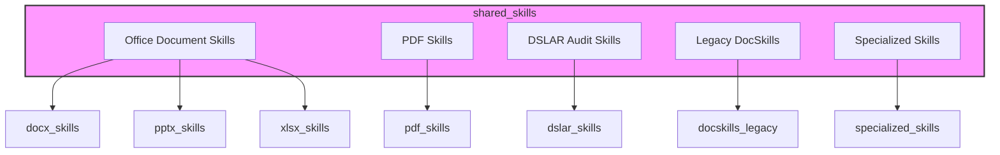
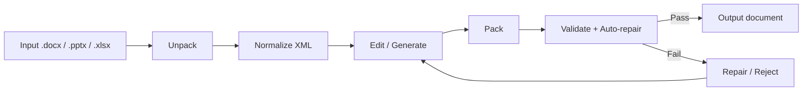
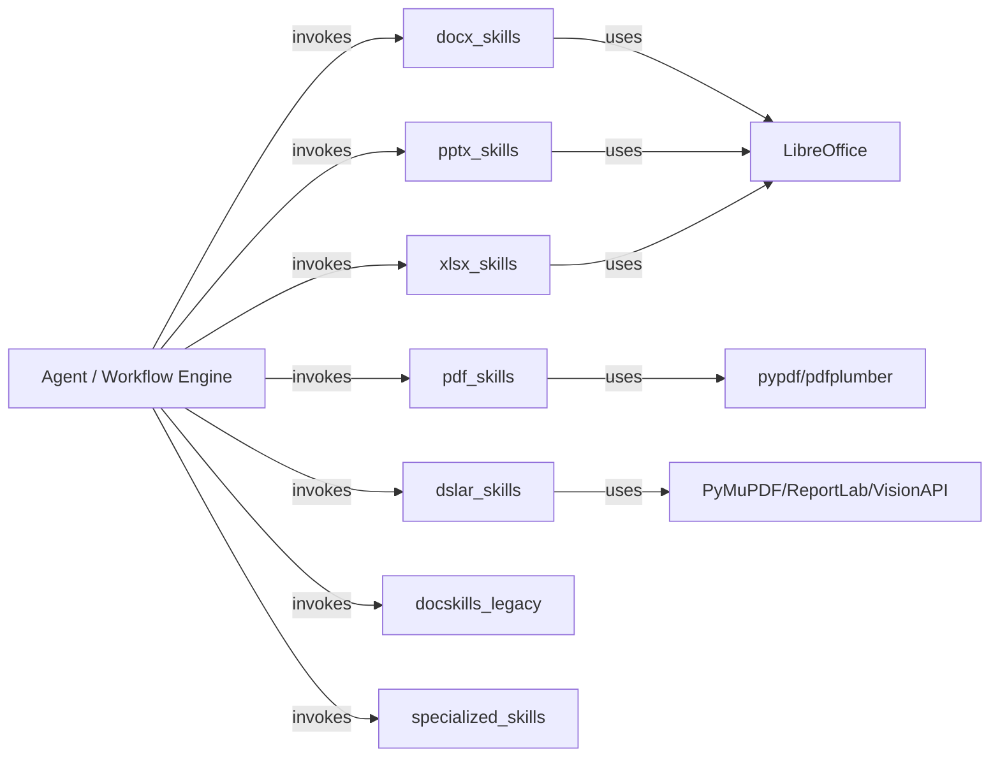

# shared_skills Module Overview

## Purpose

`shared_skills` is a repository-wide skill library that bundles reusable, file-system-based utilities and domain-specific scripts for document processing, skill authoring, and deterministic helper operations. It is organized as a flat collection of format-specific and purpose-specific skill packs that can be invoked standalone, orchestrated by the ABStudio workflow engine, or embedded into agent-generated code running in sandboxed environments.

The module's primary responsibilities are:

1. **Office document lifecycle** — Create, unpack, edit, validate, and repack Microsoft Office Open XML documents (DOCX, PPTX, XLSX).
2. **PDF form processing** — Extract, fill, and validate PDF forms, including both native AcroForm and annotation-based overlays.
3. **Specialized audit pipelines** — Run deterministic, multi-stage document audits such as the NPCI DL-SAR validation pipeline.
5. **Deterministic skill helpers** — Provide narrow, auditable scripts for domain-specific calculations and regulated-data detection.

## Architecture

`shared_skills` is a leaf module under the repository root. It contains no runtime service dependencies; instead, each sub-module is a self-contained script pack.

### Common Office Document Pattern

All Office-oriented skill packs follow the same safe round-trip pattern:

### Skill Pack Interaction

## Core Components

| Component | Responsibility | Documentation |
|-----------|----------------|---------------|
| `docx_skills` | Create, manipulate, validate, and repair Microsoft Word `.docx` files, including comments, tracked changes, and redlining. | [docx_skills](docx_skills.md) |
| `pptx_skills` | Add/duplicate slides, clean orphaned resources, validate, and thumbnail PowerPoint presentations. | [pptx_skills](pptx_skills.md) |
| `xlsx_skills` | Analyze, transform, JSON-export, recalculate, and validate Excel workbooks and other OOXML packages. | [xlsx_skills](xlsx_skills.md) |
| `pdf_skills` | Extract form fields/structure, fill fillable and non-fillable PDFs, and validate bounding boxes visually. | [pdf_skills](pdf_skills.md) |
| `dslar_skills` | Multi-stage NPCI DL-SAR audit pipeline: PDF extraction, image enrichment, clause chunking/validation, and report rendering. | [dslar_skills](dslar_skills.md) |
| `docskills_legacy` | Legacy AiNxt document-skills toolkit covering DOCX/PPTX/XLSX round-trips and PDF form filling. | [docskills_legacy](docskills_legacy.md) |
| `specialized_skills` | Narrow, deterministic helpers for domain-specific skills (e.g., 10X Award scoring, DPDP personal-data detection). | [specialized_skills](specialized_skills.md) |

## Relationship to the Rest of the System

- **ABStudio backend** — The workflow engine and agent factory can invoke these scripts as workflow nodes or tool steps, passing artifacts via `WORKFLOW_ARTIFACT_DIR` and collecting outputs from `OUTPUT_DIR`.
- **Agent runtime / sandbox** — Many scripts are designed to run inside sandboxed code execution environments with minimal or no platform imports.
- **Skill catalog / marketplace** — Packaged skills can be uploaded through the catalog and marketplace APIs.
- **Shared Office toolkit** — `docx_skills`, `pptx_skills`, `xlsx_skills`, and `docskills_legacy` share a common pattern of unpack/pack/validate/soffice helpers, each adapted to its target format.

## Notes

- Most Office scripts depend on external binaries such as `soffice` (LibreOffice), `gcc` (for the socket shim), `pdftoppm`, and optionally `git`.
- Validation is typically baseline-aware: only *new* errors introduced by edits are reported when an original file is supplied.
- The module favors deterministic, auditable operations over silent rewriting, making it suitable for governance-sensitive document workflows.