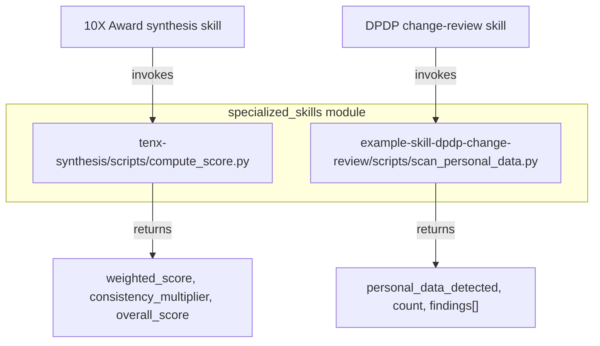
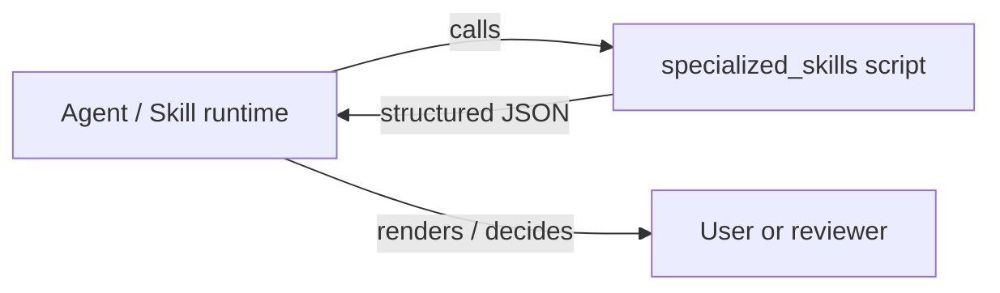

# specialized_skills

The `specialized_skills` module contains small, standalone scripts that implement domain-specific logic for individual platform skills. Each script is intentionally narrow in scope, dependency-light, and safe to invoke either as a CLI utility or as a helper from inside a skill's `run()` implementation. They encapsulate deterministic, auditable operations that agents should not perform by "eyeballing" — such as weighted score calculation or regulated-data detection.

## Purpose

- Provide **reusable, testable helpers** for skills that need exact, repeatable math or pattern matching.
- Keep skill logic **out of prompt engineering** so that dimension weights, scoring caps, and detection patterns are versioned as code.
- Remain **free of platform imports** where possible, so scripts can run inside sandboxed skill environments without pulling in the full backend stack.

## Architecture Overview

The module is a leaf under `shared_skills` and has no internal dependencies. Each script is self-contained:

| Script | Responsibility | Invocation Style |
|--------|----------------|------------------|
| `compute_score.py` | Deterministically compute a 10X Award overall score from per-dimension scores, track weights, and a consistency multiplier. | CLI JSON argument or skill helper call |
| `scan_personal_data.py` | Scan changed files for field-name patterns that indicate personal data, returning evidence for a DPDP review. | CLI `--diff <files...>` |

## Sub-modules

- **[specialized_skills_tenx_award](specialized_skills_tenx_award.md)** - Weighted score synthesis for the 10X Award program (`compute_score.py`).
- **[specialized_skills_dpdp_onboarding](specialized_skills_dpdp_onboarding.md)** - Personal-data field detection for DPDP change reviews (`scan_personal_data.py`).

## How It Fits into the System

`specialized_skills` sits at the edge of the skill ecosystem. The scripts are not part of the runtime engine, API layer, or agent orchestration; instead, they are **called by skill definitions** (typically via `subprocess` or direct function import from a skill's `run()` method). Their outputs are consumed as structured JSON that downstream prompt steps or governance checks can cite as evidence.

Because the scripts avoid platform imports, they can also be exercised locally, unit-tested in isolation, and audited without standing up the full backend.

## Dependencies

- Both scripts use only the **Python standard library** (`json`, `sys`, `argparse`, `re`).
- No imports from `abstudio_backend`, `shared_core`, or other platform modules.
- `compute_score.py` mirrors weights defined in `tenx/config.py` and the 10X Award skill record; the script's `TRACK_WEIGHTS` must be kept in sync with those sources of truth.
