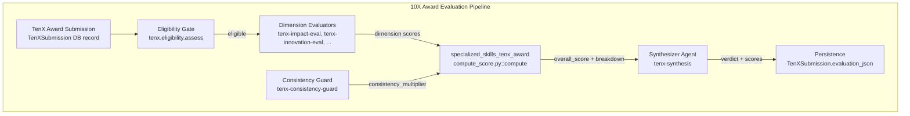
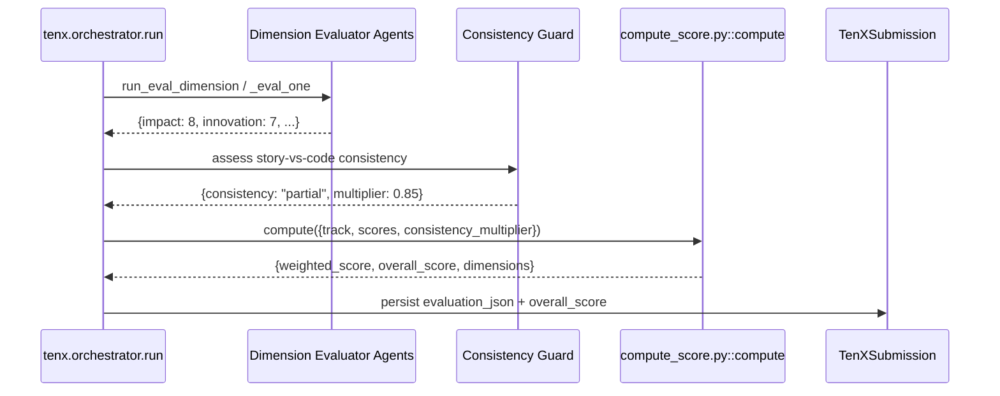
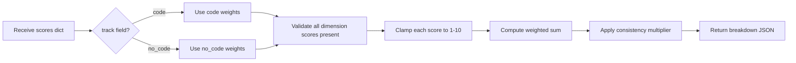

# specialized_skills_tenx_award

## Introduction

The `specialized_skills_tenx_award` module is a small, deterministic scoring utility used by the **10X Award** evaluation pipeline. It lives inside the `tenx-synthesis` skill folder and provides the exact, auditable math that turns per-dimension evaluator scores into a single overall score. By keeping the scoring formula in a standalone, pure-stdlib script, the platform guarantees that the final 10X Award number is reproducible, testable, and independent of any LLM hallucination.

This module is **not** the orchestrator that runs the evaluators, nor is it the UI where employees submit entries. It is the final arithmetic step: weighted sum × consistency multiplier.

---

## Module Purpose and Core Functionality

### What it does

The module exposes one function, `compute(scores: dict) -> dict`, which:

1. Selects the correct dimension set and weights based on the submission track (`code` or `no_code`).
2. Validates that every required dimension score is present.
3. Clamps each score to the 1–10 range.
4. Computes the weighted contribution of each dimension.
5. Applies a consistency multiplier to produce the final overall score.
6. Returns a full breakdown suitable for persistence and leaderboard ranking.

### Submission tracks

The 10X Award recognizes two distinct submission types, each with its own scoring rubric:

| Track | Dimensions scored | Weight sum |
|-------|-------------------|------------|
| `code` | impact, innovation, complexity, quality, ownership, ai_leverage | 1.0 |
| `no_code` | impact, innovation, ai_leverage, usability, adoption | 1.0 |

> **Note:** The human `leverage` dimension exists as an evaluator skill but is intentionally **excluded** from the final 10X score. The `ai_leverage` dimension (HR: "AiNxt Platform Utilization") **is** scored in both tracks.

### Consistency cap

Dimension scores are produced by LLM-based evaluator agents. A separate **consistency guard** assesses whether the submission narrative matches the actual repository/artifacts. The guard outputs a consistency level that maps to a multiplier:

| Consistency level | Multiplier |
|-------------------|------------|
| `high` | 1.0 |
| `partial` | 0.85 |
| `low` | 0.6 |

The overall score is therefore:

```
overall_score = (Σ dimension_score × dimension_weight) × consistency_multiplier
```

### Pure-stdlib design

The script uses only `json` and `sys`. It imports no platform code, which makes it safe to run:

- As a skill `run()` helper inside a sandboxed skill execution.
- From the command line for testing or auditing.
- In isolation without pulling in the full backend dependency tree.

---

## Architecture

### Component diagram



### Data flow



### Scoring process flow



---

## Component Relationships

### Within the 10X Award subsystem

| Related module | Relationship |
|----------------|--------------|
| [tenx_system](../reference/tenx_system.md) | Owns the canonical dimension registry (`DIMENSION_DEFS`), track weights (`TYPE_WEIGHTS`), consistency multipliers, and submission lifecycle (`SubmissionStatus`). The skill script mirrors these weights so it can run standalone. |
| [tenx_evaluation_workers](../workers/tenx_evaluation_workers.md) | RQ workers that execute `tenx.orchestrator.run`, which calls the dimension evaluators and ultimately invokes the scoring logic. |
| [tenx_router](../api/tenx_router.md) | FastAPI router exposing committee-triggered evaluation (`/evaluate`) and award actions (`/award`). It enqueues the worker job whose orchestrator uses this scoring utility. |
| [tenx_award](../reference/tenx_award.md) | React frontend where employees submit entries, committee members review scores, and admins award winners. It displays the `overall_score` and per-dimension breakdown produced by this module. |

### Backend scoring counterpart

The platform also contains `tenx/scoring.py::compute_overall`, which performs the same arithmetic using `weights_for()` and `CONSISTENCY_MULTIPLIERS` from `tenx/config.py`. The skill script in this module is a **mirror** of that function, embedded in the skill so that the synthesizer agent can compute scores without importing the backend. Both implementations must stay in sync; the docstring in `compute_score.py` explicitly calls out `tenx/config.py TYPE_WEIGHTS` and the skill's `SKILL.md` as the sources of truth.

---

## How It Fits Into the Overall System

The 10X Award is a gamified recognition program inside the AiNxt platform. Employees (or their managers) submit entries describing work that delivered outsized impact, optionally backed by a GitLab repository. A committee then triggers an evaluation that:

1. Checks eligibility (mandatory artifacts, optional AiNxt usage corroboration).
2. Runs specialized evaluator agents per dimension.
3. Runs a consistency guard to penalize story-vs-code mismatches.
4. **Computes the final score deterministically** using this module.
5. Generates a synthesizer verdict.
6. Persists results and surfaces them on the leaderboard.

`specialized_skills_tenx_award` is the **single source of arithmetic truth** for step 4. Because it is pure Python and stateless, it can be:

- Unit-tested with fixed inputs/outputs.
- Audited by compliance teams without reading LLM prompts.
- Reused by the synthesizer agent as a tool/skill call.

---

## Interface

### `compute(scores: dict) -> dict`

#### Input

| Field | Type | Required | Description |
|-------|------|----------|-------------|
| `track` | `str` | No | `"code"` (default) or `"no_code"`. |
| `consistency_multiplier` | `float` | No | Defaults to `1.0`. |
| dimension keys | `float` | Yes | One value per dimension for the selected track (1–10). |

#### Output

| Field | Type | Description |
|-------|------|-------------|
| `track` | `str` | The track used. |
| `weighted_score` | `float` | Sum of weighted dimension scores (pre-cap). |
| `consistency_multiplier` | `float` | The multiplier applied. |
| `overall_score` | `float` | Final capped score. |
| `dimensions` | `list[dict]` | Per-dimension score, weight, and contribution. |

#### CLI usage

```bash
# code track
python compute_score.py '{"impact":8,"innovation":7,"complexity":6,"quality":7,"ownership":5,"ai_leverage":8,"consistency_multiplier":0.85}'

# no_code track
python compute_score.py '{"track":"no_code","impact":8,"innovation":7,"ai_leverage":8,"usability":7,"adoption":6,"consistency_multiplier":1.0}'
```

---

## Dependencies

### Runtime dependencies

- `json` (stdlib)
- `sys` (stdlib)

### Logical dependencies

- `tenx/config.py` — canonical weights and consistency multipliers (must be kept in sync).
- `tenx/scoring.py` — backend equivalent of this scoring logic.
- `tenx/orchestrator.py` — calls this logic during evaluation.

There are no external package dependencies, which is intentional for sandbox safety and auditability.

---

## References

- [tenx_system](../reference/tenx_system.md) — canonical configuration, dimension registry, and submission lifecycle.
- [tenx_evaluation_workers](../workers/tenx_evaluation_workers.md) — RQ workers that run the end-to-end evaluation.
- [tenx_router](../api/tenx_router.md) — API surface for evaluation and award management.
- [tenx_award](../reference/tenx_award.md) — frontend for submissions, committee review, and leaderboard.
