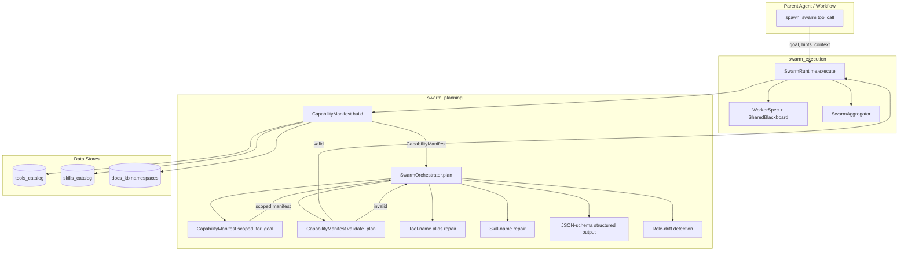
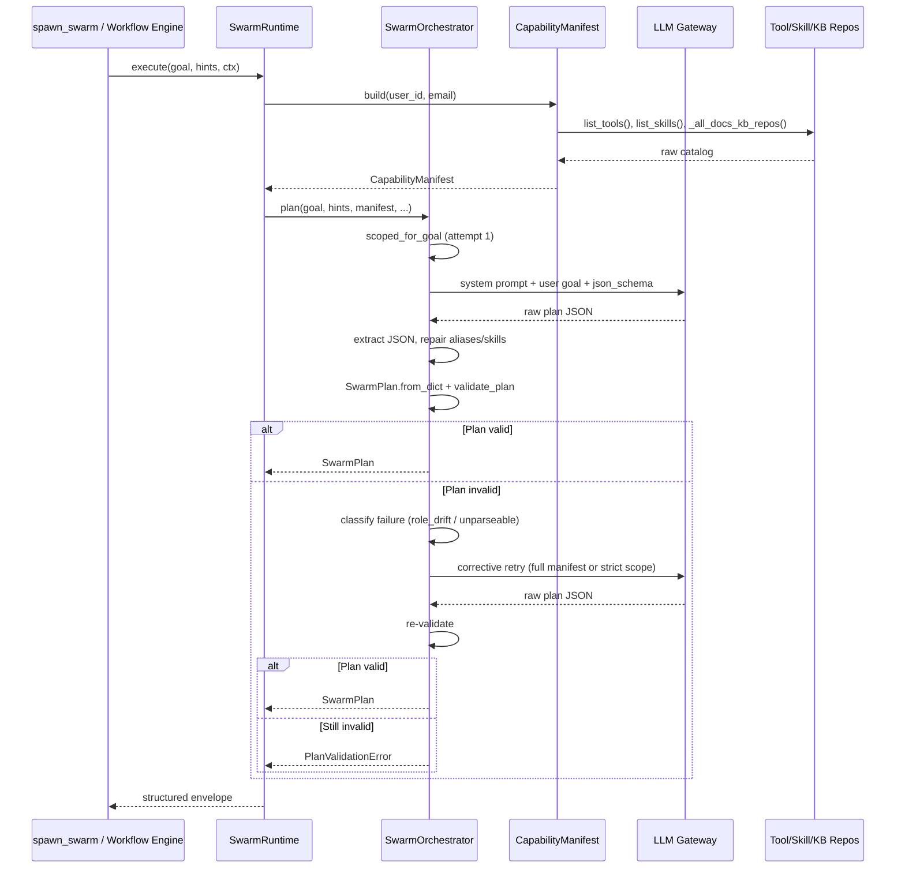
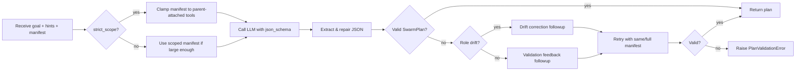

# Swarm Planning Module

## Brief Introduction

The `swarm_planning` module is the **planning brain** of the ABStudio swarm execution subsystem. It transforms a high-level user goal into a validated, capability-grounded `SwarmPlan` that the [swarm_execution](swarm_execution.md) runtime can execute. The module ensures that every tool, skill, and knowledge base referenced in a plan actually exists in the current deployment, eliminating hallucinated capabilities before any worker is spawned.

The planning layer is intentionally separated from execution: `SwarmOrchestrator` produces the plan, while `SwarmRuntime` (in [swarm_execution](swarm_execution.md)) consumes it. This document focuses on the planning components; runtime execution, worker dispatch, and result aggregation are covered in the linked module documentation.

---

## Core Components

### `SwarmOrchestrator`

`SwarmOrchestrator` is a stateless, concurrent-safe planner that issues one or more LLM calls and returns a validated `SwarmPlan`. It receives:

- The parent agent's `goal` (verbatim from the `spawn_swarm.goal` tool argument).
- Optional structured `hints` (e.g. `{"data": <csv>, "jd": <text>}`).
- A grounded `CapabilityManifest` — the only tools, skills, and KBs the plan may reference.

Validation happens in two layers:

1. **Structural validation** via `SwarmPlan.from_dict` — schema, types, bounded numbers, `role_id` regex, and uniqueness.
2. **Capability-grounded validation** via `CapabilityManifest.validate_plan` — every referenced tool/skill/KB exists in the manifest.

On validation failure, the orchestrator retries **exactly once** with the validator's errors appended to the LLM context. A second failure raises `PlanValidationError`, which the runtime converts into a structured `{"error": "plan_validation_failed", ...}` envelope at the parent boundary.

Key responsibilities:

- Enforce the `SWARM_MAX_WORKERS` policy cap.
- Use JSON-schema structured output when the gateway supports it, with per-run value-space enums for tool/skill/KB names.
- Auto-repair common tool-name aliases (e.g. `execute_command` → `code_executor`) and invented skill names before validation.
- Detect and recover from role drift (markdown reports, fake `<tool_call>` blocks) via a hardened corrective retry.
- Detect gateway content-filter rejections (`GatewayBlockedError`) and short-circuit retrying.

### `CapabilityManifest`

`CapabilityManifest` is a frozen snapshot of the local tool, skill, and knowledge-base catalog. It is the single source of truth for what the orchestrator is allowed to plan with.

Sources of truth:

- **Tools** — `workflow_repo.list_tools()` reads the Postgres `tools_catalog` table.
- **Skills** — `workflow_repo.list_skills()` reads `skills_catalog`.
- **KBs** — `kb_retriever._all_docs_kb_repos()` enumerates every `docs_kb:*` namespace.

The manifest is cached per process with a 60-second TTL (`SWARM_MANIFEST_TTL_S`). It provides:

- `build()` — cached or fresh snapshot construction.
- `scoped_for_goal()` — ranker-based subset of tools to keep planner prompts and emitted JSON small.
- `render_for_orchestrator()` — compact markdown rendering for the orchestrator system prompt.
- `validate_plan()` — capability-grounded validation of a `SwarmPlan`.

---

## Architecture

---

## Component Relationships

### Planning is separate from execution

`SwarmOrchestrator` does not spawn workers, call tools, or aggregate results. It only produces a `SwarmPlan`. The [swarm_execution](swarm_execution.md) runtime (`SwarmRuntime`) is the sole consumer of that plan. This separation allows the planning logic to be tested, mocked, and versioned independently of worker execution.

### Manifest is the capability gate

Every plan is validated against the manifest. The orchestrator LLM only sees capabilities that exist in the manifest, and the validator rejects any plan that references names outside the manifest. This closes the loop between the catalog (source of truth) and the planner (consumer).

### Two-attempt planning strategy

1. **Attempt 1** uses a scoped manifest (top-k tools ranked for the goal) to reduce prompt/token bloat.
2. **Attempt 2** falls back to the full manifest if attempt 1 fails validation or the scoped manifest was too thin.

Under `strict_scope` (workflow-node mode), attempt 2 keeps the same parent-attached tool scope so cross-domain tools cannot sneak in on retry.

---

## Data Flow

---

## Process Flow: Producing a Validated Plan

---

## Key Design Decisions

### Capability grounding prevents hallucination

The orchestrator is not allowed to invent tool names. The manifest enumerates the exact legal universe, and the validator rejects anything outside it. This is the central reliability guarantee of the module.

### Scoped manifest controls token bloat

With 100+ tools, feeding the full manifest into every plan call causes the emitted JSON plan to grow and hit output token caps. `scoped_for_goal` ranks tools by relevance to the goal and returns a focused subset. The full manifest remains the safety net on retry.

### Structured output with per-run enums

When the gateway supports `response_format=json_schema`, the orchestrator sends a schema whose `tools[]`, `skills[]`, and `kb_id` enums are populated from the current manifest. This physically prevents the model from emitting invented names. If the gateway silently ignores `strict`, the orchestrator detects the degradation and disables structured attempts for the process.

### Conservative auto-repair

Tool aliases (`execute_command` → `code_executor`) and fuzzy name matches are repaired before validation, but only when the mapping is unambiguous. Skills are repaired using the same prefix-aware suggester that produces `did_you_mean` hints. The server never silently substitutes a semantically different capability.

### Role-drift hardening

Planners sometimes respond as workers (markdown reports, fake tool calls). The orchestrator detects drift markers, classifies the failure, and issues a sharp corrective followup that re-grounds the model as the planner. An assistant prefill of `{` forces the response to continue as JSON.

---

## Configuration

| Environment Variable | Default | Purpose |
|----------------------|---------|---------|
| `SWARM_MAX_WORKERS` | `16` | Maximum workers per plan. |
| `SWARM_ORCHESTRATOR_MAX_TOKENS` | `8192` | Output token cap for the planner LLM. |
| `SWARM_ORCHESTRATOR_TEMPERATURE` | `0.2` | Planner LLM temperature. |
| `SWARM_ORCHESTRATOR_TRUNC_RETRIES` | `3` | Retries for upstream stream truncation. |
| `SWARM_ENABLE_SCOPED_MANIFEST` | `true` | Enable ranker-based manifest scoping. |
| `SWARM_SCOPED_MIN_TOOLS` | `5` | Minimum tools before scoping is considered usable. |
| `SWARM_USE_JSON_SCHEMA` | `true` | Enable structured-output schema pinning. |
| `SWARM_ORCHESTRATOR_PREFILL` | `true` | Enable assistant `{` prefill anti-drift. |
| `SWARM_MANIFEST_TTL_S` | `60` | Process-local manifest cache TTL. |
| `SWARM_MANIFEST_MAX_CHARS` | `16000` | Character budget for rendered manifest. |
| `SWARM_ORCHESTRATOR_DEBUG_DUMP` | `false` | Persist failed plan attempts to disk. |

---

## Error Types

- **`PlanValidationError`** — raised when two planning attempts both fail validation. Carries the validator error list.
- **`GatewayBlockedError`** — subtype of `PlanValidationError` raised when the upstream gateway content-filter rejects the request. Indicates retrying will not help.

---

## Integration with Other Modules

- **[swarm_execution](swarm_execution.md)** — consumes the `SwarmPlan`, dispatches `WorkerSpec` instances, and aggregates results.
- **[core_workflow_repo](../workflows/core_workflow_repo.md)** — provides `list_tools()` and `list_skills()` used to build the manifest.
- **[core_llm_handler](../llm/core_llm_handler.md)** / **[core_factory_utils](core_factory_utils.md)** — the orchestrator calls `call_factory_llm_with_finish_reason` and uses `extract_json_block` for robust JSON extraction.
- **[tools/spawn_swarm_tool](../skills/tools.md)** — the parent-facing entry point that invokes `SwarmRuntime.execute`.
- **[app_models](../core/app_models.md)** — workflow/agent node models may carry `parent_attached_tools`, `strict_scope`, and `allowed_extra_domains` that influence planning.

---

## Testing & Observability

- Failed plan attempts can be dumped to `SWARM_ORCHESTRATOR_DEBUG_DUMP_DIR` when `SWARM_ORCHESTRATOR_DEBUG_DUMP=true`.
- Each dump records the raw LLM response, finish reason, validation errors, and manifest summary.
- The orchestrator logs every auto-repair, gateway degradation, and role-drift detection at `INFO`/`WARNING` level.
- `CapabilityManifest._reset_cache_for_tests()` clears the process cache for deterministic tests.
