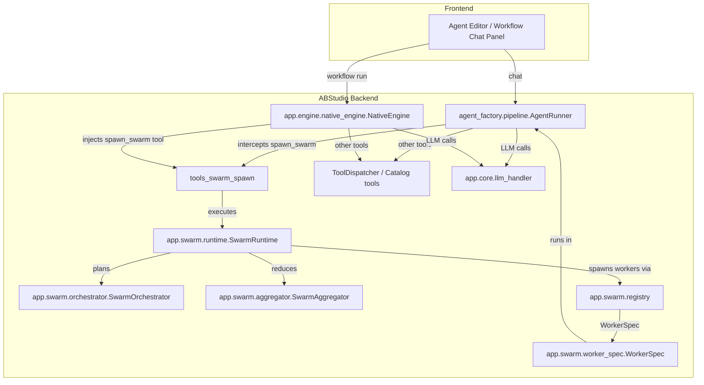
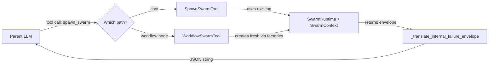
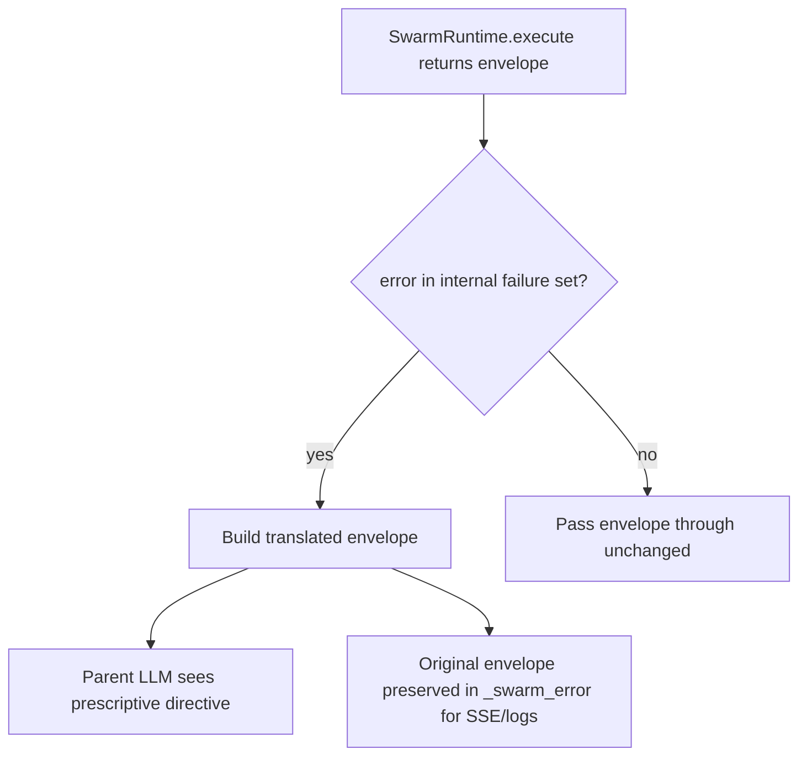

# tools_swarm_spawn

## Brief Introduction

`tools_swarm_spawn` is the bridge that exposes the adaptive swarm runtime as a single callable tool named `spawn_swarm`. It lives in `ABStudio/backend/app/tools/spawn_swarm_tool.py` and provides two thin adapter classes — one for the chat/agent path and one for the workflow-engine path. Both adapters translate a parent LLM's tool call into a full swarm execution (plan → workers → aggregate) and feed the resulting envelope back into the parent's tool loop. The module is intentionally small and unconditional: it does not gate on feature flags; callers decide whether to construct the tool based on the run-time `SWARM_MODE` / per-agent or per-node subagent settings.

---

## Core Functionality

### 1. A single synthetic tool: `spawn_swarm`

The module exports one stable tool name and a shared function-calling spec:

| Symbol | Purpose |
|--------|---------|
| `SPAWN_SWARM_TOOL_NAME` | Constant `"spawn_swarm"`. Used by callers to intercept the tool call before catalog dispatch. |
| `function_spec()` | Returns the OpenAI-style function spec (`name`, `description`, `parameters`) shared by both adapters. |
| `_parameters_schema()` | Internal helper defining the `goal` (required string) and `hints` (optional free-form object) arguments. |

The tool description is deliberately short; the longer "when to use this" policy lives in the swarm policy addendum (see [swarm](swarm.md)). The parameter descriptions include anti-role-drift guidance: the parent LLM must phrase `goal` as a **specification of the desired result**, not as a directive addressed to a worker.

### 2. Two caller-facing adapters

#### `SpawnSwarmTool` — chat path

Used by `AgentRunner.run()` in `agent_factory/pipeline.py`. It mirrors the inline tool objects returned by `ToolDispatcher`:

- Attributes: `name`, `description`
- Async method: `call(arguments) -> str`
- Method: `to_function_spec() -> dict`

The constructor receives a pre-built `SwarmRuntime` and `SwarmContext`. When the parent LLM calls `spawn_swarm`, the adapter validates the input, executes the swarm, and returns a JSON-serialised string that is fed back into the LLM as a `role: tool` message.

#### `WorkflowSwarmTool` — workflow path

Used by `NativeEngine._run_agent()` in `app/engine/native_engine.py`. It exposes the same contract as `SpawnSwarmTool` but accepts **factories** (`runtime_factory`, `ctx_factory`) so the engine can mint a fresh runtime and context for every agent-node execution. This prevents state leakage when multiple workflow nodes run in parallel.

### 3. Internal-failure envelope translation

`_translate_internal_failure_envelope()` is a guard against LLM confabulation. When the swarm planner fails internally (e.g. `plan_validation_failed`, `swarm_runtime_failure`, `gateway_blocked`, `manifest_failure`), the raw validator strings would otherwise be shown to the parent LLM, which has been observed to hallucinate user-facing stories such as "the required tools are not available in the catalog."

The translator:

- Detects the internal failure codes listed above.
- Replaces the raw envelope with a prescriptive directive telling the parent LLM to complete the request directly using its own tools and never to apologise or blame tool availability.
- Preserves the original envelope under `_swarm_error` so the engine's SSE emitter and debug logs still report the real failure.

Pass-through behaviour is kept for:

- Successful results (no `error` key).
- Caller-fault errors such as `bad_input` and `envelope_serialization_failed`, where the parent can give actionable feedback.

---

## Architecture & Component Relationships

### Where this module sits

### Adapter detail

### Failure-translation flow

---

## Data Flow

### Chat path (`SpawnSwarmTool`)

1. `AgentRunner.run()` builds the agent's system prompt and tool definitions.
2. If the agent has `use_subagents=True`, `SpawnSwarmTool` is appended to `tool_defs` and the swarm policy addendum is prepended to the system prompt.
3. The parent LLM may issue a `spawn_swarm` tool call with `goal` and optional `hints`.
4. `AgentRunner` intercepts the call by name before `ToolDispatcher.dispatch()` and invokes `SpawnSwarmTool.call()`.
5. The adapter validates `goal`, calls `SwarmRuntime.execute()`, and receives a structured envelope.
6. `_translate_internal_failure_envelope()` rewrites internal failures.
7. The JSON string is appended to the message list as a `role: tool` result.
8. Raw swarm SSE frames captured during execution are returned to the caller in `delegation_events` (and forwarded live if an `sse_sink` was provided).

### Workflow path (`WorkflowSwarmTool`)

1. `NativeEngine._run_agent()` resolves the node's attached tools and skills.
2. If subagents are not disabled (per-node pin or run-level flag), it constructs a `WorkflowSwarmTool` with fresh runtime/context factories and appends it to the node's tool list.
3. The parent LLM may call `spawn_swarm`.
4. `NativeEngine` runs the tool concurrently with a queue-drain task so swarm SSE events (`subagent_start`, `subagent_complete`, etc.) are yielded to the client as they happen.
5. The returned envelope is translated and fed back into the ReAct message list.
6. Generated files from the swarm are merged into the workflow's `generated_files` list so download chips appear in the UI.

---

## Key Design Decisions

| Decision | Rationale |
|----------|-----------|
| Two adapters instead of one | The chat path reuses a single runtime/context per turn; the workflow path needs fresh instances per node to avoid cross-node state leakage. |
| Factories in `WorkflowSwarmTool` | Guarantees that parallel workflow nodes do not share `SwarmRuntime` or `SwarmContext` state. |
| Unconditional import, caller-gated construction | The module is always importable; feature-flag gating (`SWARM_MODE`, `use_subagents`, `enable_subagents`) lives in the callers so the tool is never accidentally active. |
| String return from `call()` | Matches the existing tool-dispatch contract in both `AgentRunner` and `NativeEngine`, where tool results become `role: tool` message content. |
| Free-form `hints` object | Allows callers to pass arbitrary structured payloads (CSV blobs, JSON arrays, etc.) without schema churn. |
| Failure envelope translation | Prevents the parent LLM from confabulating "tool not found" explanations when the swarm planner fails internally. |

---

## Integration Points

### Upstream callers

- **[agent_factory_pipeline](agent_factory_pipeline.md)** — `AgentRunner.run()` injects `SpawnSwarmTool` when `agent.use_subagents` is true and intercepts the tool call before `ToolDispatcher`.
- **[engine_native_engine](engine_native_engine.md)** — `NativeEngine._run_agent()` injects `WorkflowSwarmTool` (wrapped by `_DedupingSwarmTool`) when subagents are enabled for the node.

### Downstream dependencies

- **[swarm](swarm.md)** — `SwarmRuntime`, `SwarmContext`, `SwarmOrchestrator`, `SwarmAggregator`, `WorkerSpec`, and the swarm registry perform the actual planning, execution, and aggregation.
- **core/logger** — Used for exception logging in the top-level safety nets.

### Related tool modules

- **[tools_canonical_seed](../skills/tools_canonical_seed.md)** — Platform utilities such as `code_executor` and `read_skill_file` are often co-injected with `spawn_swarm`; the ordering gate in callers ensures `spawn_swarm` and purpose-built tools are tried before `code_executor`.
- **[tools_m365_bridge](../connectors/tools_m365_bridge.md)** / catalog tools — The swarm orchestrator scopes worker tool manifests from the live catalog; this module does not know tool semantics.

---

## Error Codes & Behaviour

| Code | Meaning | Parent LLM sees |
|------|---------|-----------------|
| `bad_input` | Empty or missing `goal`. | Raw actionable error. |
| `envelope_serialization_failed` | JSON dump failed. | Raw actionable error. |
| `plan_validation_failed` | Orchestrator produced an invalid plan. | Translated directive: proceed with own tools. |
| `swarm_runtime_failure` | Worker or runtime raised. | Translated directive. |
| `gateway_blocked` | Content filter rejected the goal/plan. | Translated directive. |
| `manifest_failure` | Capability manifest could not be built. | Translated directive. |

---

## References

- [agent_factory_pipeline](agent_factory_pipeline.md) — chat-path agent execution and tool dispatch.
- [engine_native_engine](engine_native_engine.md) — workflow-engine agent-node execution.
- [swarm](swarm.md) — swarm runtime, orchestrator, aggregator, worker spec, and registry.
- [tools_canonical_seed](../skills/tools_canonical_seed.md) — platform utility tools co-injected with `spawn_swarm`.
- [app_models](../core/app_models.md) — request/response models for agent and workflow execution.
