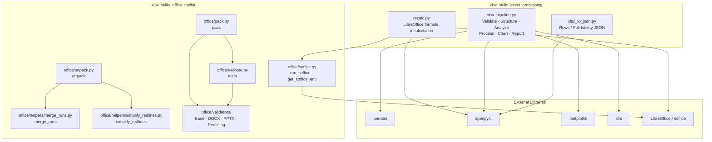
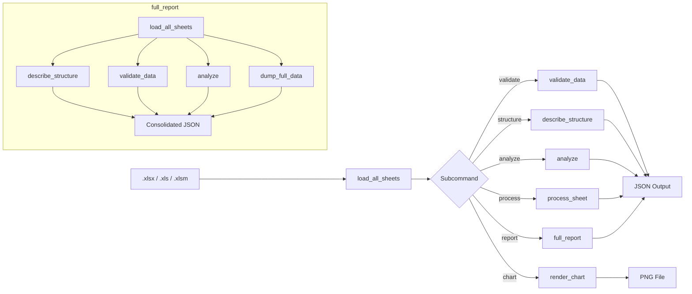
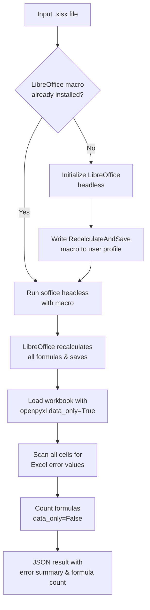
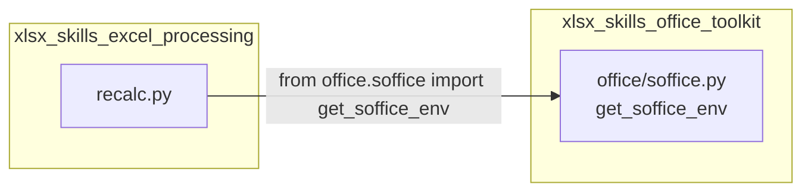
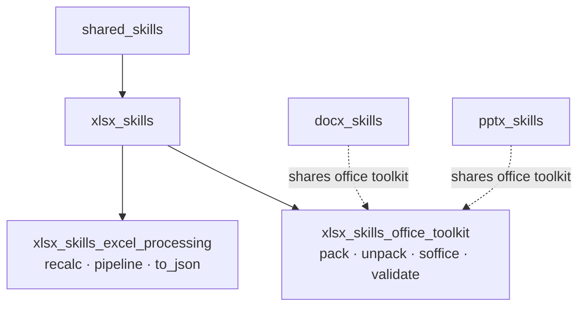
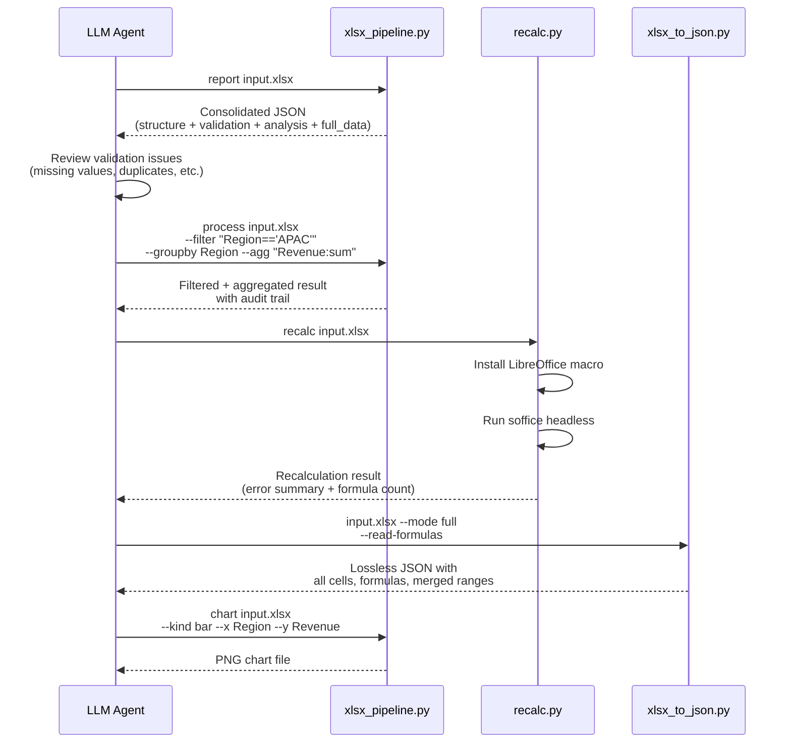

# XLSX Skills — Excel Processing

## Introduction

The `xlsx_skills_excel_processing` module provides a suite of command-line scripts for reading, validating, analyzing, transforming, and converting Microsoft Excel (`.xlsx`/`.xls`/`.xlsm`) workbooks. It is part of the broader [xlsx_skills](xlsx_skills.md) family, which itself belongs to the [shared_skills](shared_skills.md) collection of Anthropic document-processing skills.

The module is built around three core scripts:

| Script | Purpose |
|---|---|
| `xlsx_pipeline.py` | End-to-end pipeline: validate, structure, analyze, process, chart, and consolidated report |
| `xlsx_to_json.py` | Lossless conversion of `.xlsx` workbooks to JSON (rows mode or full-fidelity mode) |
| `recalc.py` | Force-recalculate all formulas in a workbook via LibreOffice and report any Excel errors |

All three scripts are designed to be invoked as standalone CLI tools that emit JSON on stdout (or to a file), making them suitable for orchestration by an LLM agent or a higher-level pipeline.

---

## Architecture Overview



### Design Principles

1. **Non-destructive** — No script mutates the input workbook in place. The `process` subcommand returns a new DataFrame and logs every transformation in an audit trail.
2. **No hallucination** — Column-purpose inference in `xlsx_pipeline.py` is purely rule-based (regex + dtype). Unmatched columns are labelled `unknown` rather than guessed.
3. **Lossless conversion** — `xlsx_to_json.py` preserves every populated cell, merged range, formula, and number format. Cells beyond headers are retained with auto-generated keys.
4. **JSON-first output** — All scripts emit structured JSON so they can be consumed programmatically by agents, pipelines, or frontends.
5. **Integrity verification** — The pipeline cross-checks row counts between load and analysis stages, surfacing any drift rather than hiding it.

---

## Component Documentation

### 1. `xlsx_pipeline.py` — End-to-End Excel Processing Pipeline

This is the primary script for working with Excel data. It exposes six subcommands, each corresponding to a logical step in a data-processing workflow.

#### Subcommands

| Subcommand | Steps | Description |
|---|---|---|
| `validate` | 1, 4 | Verify the file is readable; report missing values, duplicate rows, mixed-type columns, numeric-stored-as-text, and suspicious negative values. **Report only — never modifies data.** |
| `structure` | 2, 3 | Load every sheet and emit sheet names, column names, inferred dtypes, row/column counts, plus a configurable head/tail preview. |
| `analyze` | 5, 7 | Heuristic column-purpose inference, per-column descriptive statistics, and a row-count integrity cross-check. |
| `process` | 6 | Apply non-destructive operations (filter, select, groupby, aggregate, sort, limit) with a full audit log. |
| `chart` | 6 | Render a PNG chart (bar/line/scatter/hist) via matplotlib. |
| `report` | 1–8 | Consolidated JSON combining validate + structure + analyze + full data dump. |

#### Column-Purpose Inference

Purpose is inferred using a rule table that pairs a regex pattern (matched against the column name) with a set of allowed dtype buckets:

```
identifier   → id|uuid|guid|key|code|sku        (object, int)
temporal     → date|time|year|month|timestamp    (datetime, object, int)
monetary     → salary|price|cost|revenue|amount  (float, int)
quantity     → qty|count|units|stock             (int, float)
percentage   → pct|percent|rate|ratio            (float)
person_name  → name|first_name|employee|customer (object)
email        → email|e_mail                      (object)
phone        → phone|mobile|contact              (object)
location     → country|region|city|address       (object)
category     → category|type|status|segment      (object)
```

Dtype-only fallbacks (`datetime` → `temporal`, `bool` → `flag`) are applied with certainty. Everything else is `unknown`.

#### Processing & Audit Trail

The `process` subcommand applies operations in a fixed order — **filter → select → groupby → sort → limit** — and returns both the result DataFrame and an audit log:

```json
{
  "step": "filter",
  "expression": "Region=='APAC'",
  "rows_before": 1000,
  "rows_after": 250
}
```

Each audit entry records the operation type, parameters, and row counts before/after, enabling the caller to verify data integrity at every stage.

#### Full Data Dump (Report Subcommand)

The `report` subcommand includes a `full_data` section that emits each sheet's rows as CSV text with:

- **Excel row numbers** stamped on every row (data row `i` → Excel row `i + 2`)
- **Column legend** mapping Excel letters to column names (e.g., `A=Region, B=Revenue`)
- **Character budget** (default 60,000 chars) shared across all sheets; rows are dropped on whole-row boundaries so the CSV is never cut mid-row
- **Truncation metadata** (`total_rows`, `included_rows`, `truncated` flag) per sheet

CSV is chosen over JSON records for token efficiency — no repeated keys per row.

#### CLI Usage

```bash
# Validate data quality
python xlsx_pipeline.py validate input.xlsx

# Inspect structure
python xlsx_pipeline.py structure input.xlsx --preview-rows 10

# Analyze a specific sheet
python xlsx_pipeline.py analyze input.xlsx --sheet Sales

# Process: filter + group + aggregate
python xlsx_pipeline.py process input.xlsx \
    --sheet Sales --filter "Region=='APAC'" \
    --groupby Region --agg "Revenue:sum,Units:sum"

# Render a chart
python xlsx_pipeline.py chart input.xlsx \
    --sheet Sales --kind bar --x Region --y Revenue --output chart.png

# Consolidated report
python xlsx_pipeline.py report input.xlsx --output report.json
```

#### Data Flow



---

### 2. `xlsx_to_json.py` — Lossless XLSX-to-JSON Conversion

Converts an `.xlsx` workbook into a JSON document with two output modes.

#### Output Modes

| Mode | Description | Use Case |
|---|---|---|
| `rows` (default) | Each sheet becomes a list of row objects keyed by the first row (headers). Cells beyond headers are preserved with `__col_<index>` keys. Duplicate headers are disambiguated with `__<n>` suffixes. | Quick structured access to tabular data |
| `full` | Lossless representation: every populated cell emits its A1 coordinate, row/column indices, raw value, detected Excel data type, formula (if any), and number format. Merged ranges and sheet dimensions are preserved as metadata. | Full-fidelity round-tripping; auditing |

#### Value Serialization

The `_jsonable()` helper handles type conversion without data loss:

| Excel Type | JSON Representation |
|---|---|
| `None` | `null` |
| `bool`, `int`, `float`, `str` | Native JSON types |
| `datetime`, `date`, `time` | ISO-8601 string |
| `timedelta` | Total seconds (float) |
| `bytes` | `{"__bytes_b64__": "<base64>"}` |
| Other | `str(value)` (fallback — never dropped) |

#### Formula Handling

By default (`--read-formulas` omitted), the workbook is opened with `data_only=True`, returning cached calculated values. Passing `--read-formulas` opens with `data_only=False` to emit raw formula strings.

#### CLI Usage

```bash
# Default: rows mode with cached values
python xlsx_to_json.py input.xlsx

# Full-fidelity mode
python xlsx_to_json.py input.xlsx --mode full

# Read raw formulas instead of cached values
python xlsx_to_json.py input.xlsx --mode full --read-formulas

# Write to file with compact JSON
python xlsx_to_json.py input.xlsx --output out.json --indent 0
```

#### Output Structure (Full Mode)

```json
{
  "file": "input.xlsx",
  "mode": "full",
  "sheet_names": ["Sheet1", "Sheet2"],
  "sheets": {
    "Sheet1": {
      "dimensions": "A1:C10",
      "max_row": 10,
      "max_column": 3,
      "merged_cells": ["A1:A2"],
      "cells": [
        {
          "coordinate": "A1",
          "row": 1,
          "column": 1,
          "column_letter": "A",
          "value": "Region",
          "data_type": "s"
        }
      ]
    }
  }
}
```

---

### 3. `recalc.py` — LibreOffice Formula Recalculation

Forces a full recalculation of all formulas in an Excel file using LibreOffice's headless mode, then scans the recalculated workbook for Excel error values.

#### How It Works



#### Macro Installation

The script installs a StarBasic macro (`RecalculateAndSave`) into the LibreOffice user profile:

- **macOS**: `~/Library/Application Support/LibreOffice/4/user/basic/Standard/Module1.xba`
- **Linux**: `~/.config/libreoffice/4/user/basic/Standard/Module1.xba`

The macro calls `ThisComponent.calculateAll()`, `ThisComponent.store()`, and `ThisComponent.close(True)` to recalculate, save, and close the document.

#### Timeout Handling

| Platform | Mechanism |
|---|---|
| Linux | `timeout <seconds>` wrapper |
| macOS (if `gtimeout` available) | `gtimeout <seconds>` wrapper |
| macOS (no `gtimeout`) | No timeout wrapper (runs to completion) |

Default timeout is 30 seconds.

#### Error Detection

After recalculation, the script scans every cell for these Excel error values:

| Error | Meaning |
|---|---|
| `#VALUE!` | Wrong type of argument |
| `#DIV/0!` | Division by zero |
| `#REF!` | Invalid cell reference |
| `#NAME?` | Unrecognized formula name |
| `#NULL!` | Intersection of empty ranges |
| `#NUM!` | Invalid numeric value |
| `#N/A` | Value not available |

Each error type reports a count and up to 20 cell locations (e.g., `Sheet1!B14`).

#### CLI Usage

```bash
# Recalculate with default 30s timeout
python recalc.py input.xlsx

# Recalculate with custom timeout
python recalc.py input.xlsx 60
```

#### Output Example

```json
{
  "status": "errors_found",
  "total_errors": 2,
  "total_formulas": 145,
  "error_summary": {
    "#DIV/0!": {
      "count": 2,
      "locations": ["Sheet1!C5", "Sheet1!C12"]
    }
  }
}
```

---

## Dependencies

### Internal Dependencies



The `recalc.py` script imports `get_soffice_env` from the [xlsx_skills_office_toolkit](xlsx_skills_office_toolkit.md) module to obtain the correct environment variables for running LibreOffice headless. The `xlsx_pipeline.py` and `xlsx_to_json.py` scripts are self-contained and do not import from the office toolkit.

### External Library Dependencies

| Library | Used By | Purpose |
|---|---|---|
| `pandas` | `xlsx_pipeline.py` | DataFrame-based sheet loading, processing, and analysis |
| `openpyxl` | `xlsx_pipeline.py`, `xlsx_to_json.py`, `recalc.py` | Reading `.xlsx`/`.xlsm` files; cell-level access |
| `xlrd` | `xlsx_pipeline.py` | Reading legacy `.xls` (BIFF) files |
| `matplotlib` | `xlsx_pipeline.py` (lazy import) | Chart rendering (`chart` subcommand only) |
| LibreOffice (`soffice`) | `recalc.py` | Headless formula recalculation |

---

## Integration with the Broader System

### Relationship to Parent Modules



The `xlsx_skills_excel_processing` module is a child of [xlsx_skills](xlsx_skills.md), which groups all XLSX-related scripts. The sibling module [xlsx_skills_office_toolkit](xlsx_skills_office_toolkit.md) provides shared Office document utilities (pack/unpack/validate/soffice) that are used across the `docx_skills`, `pptx_skills`, and `xlsx_skills` families.

### Usage by the Platform

These scripts are designed to be invoked by the ABStudio backend's agent runner and document processing pipelines. The `xlsx_pipeline.py` `report` subcommand's `full_data` section is specifically sized to match the agent runner's attachment character budget (`_AGENT_RUNNER_ATTACHMENT_MAX_CHARS` in `app/api/documents.py`), ensuring that row truncation happens on clean boundaries within the skill rather than being blindly sliced by the caller.

The [docskills_legacy](docskills_legacy.md) module contains an older copy of these same scripts under `skills/ainxt_docskills/xlsx/scripts/`, which includes an additional `_lock_dir` helper in its `recalc.py` for file-locking during concurrent recalculation.

---

## Process Flow: End-to-End Excel Analysis

The following diagram illustrates how the three scripts can be composed into a complete Excel processing workflow:



---

## Error Handling & Exit Codes

All three scripts follow a consistent exit-code convention:

| Exit Code | Meaning |
|---|---|
| `0` | Success |
| `1` | Processing error (invalid file format, bad arguments, integrity check failure) |
| `2` | File not found or missing required argument |

Errors are printed to `stderr` as human-readable messages, while successful results are emitted as JSON to `stdout` (or a file via `--output`).

### UTF-8 Output Handling

`xlsx_pipeline.py` writes JSON via `sys.stdout.buffer.write()` with explicit UTF-8 encoding to ensure Unicode characters (en-dashes, curly quotes, non-breaking hyphens) survive on Windows consoles whose default codec is `cp1252`. A fallback to `sys.stdout.write()` is provided for environments where `sys.stdout` has no `.buffer` attribute.

---

## Key Guarantees

| Guarantee | Enforced By |
|---|---|
| Never invents, drops, or silently rewrites data | `xlsx_pipeline.py` — all operations return new DataFrames; audit log records every change |
| Column-purpose inference cannot hallucinate | `xlsx_pipeline.py` — pure regex + dtype rules; unmatched → `unknown` |
| Lossless JSON conversion | `xlsx_to_json.py` — every populated cell preserved; bytes → base64; dates → ISO-8601 |
| Row-count integrity verified | `xlsx_pipeline.py` — `analyze` cross-checks `non_null + null == original_row_count` per column |
| Formula recalculation is verifiable | `recalc.py` — scans all cells for Excel error values post-recalculation; reports formula count |
| Truncation is transparent | `xlsx_pipeline.py` — `full_data` reports `total_rows` vs `included_rows` and `truncated` flag per sheet |
