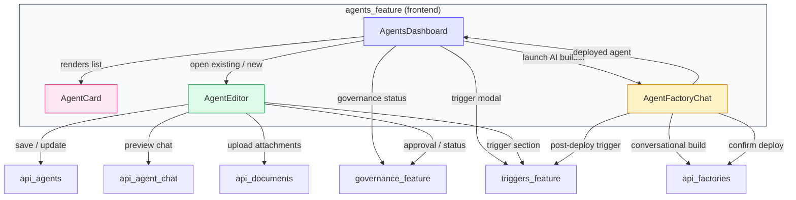
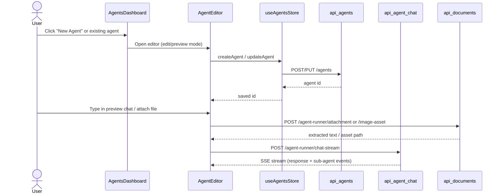
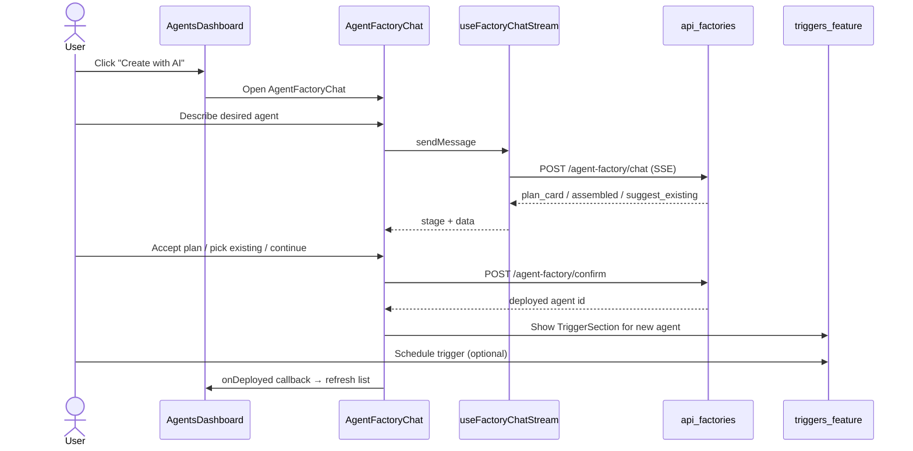
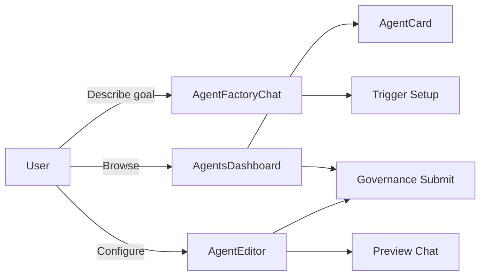

# agents_feature

## Introduction

The `agents_feature` module is the frontend surface for building, configuring, previewing, and deploying AI agents inside **ABStudio**. It lets users:

- Browse a catalog of agent templates and their own saved agents.
- Create an agent from scratch or through a conversational AI assistant (Agent Factory).
- Edit an agent’s instructions, model, tools, skills, knowledge, guardrails, memory, and runtime parameters.
- Preview an agent in a chat pane with file/image attachments, thread history, and live sub-agent delegation feedback.
- Submit agents for governance approval and schedule them via triggers.

This module lives in `ABStudio/frontend/src/features/agents/` and is composed of four React components that together cover the full agent lifecycle.

## Architecture Overview

The module is intentionally thin on business logic. State persistence, catalog lookups, file extraction, governance status, and trigger configuration are delegated to shared stores, common components, and dedicated feature modules. See the linked sub-module documents for component-level details.

## Sub-modules

| Sub-module | File | Responsibility | Documentation |
|------------|------|----------------|---------------|
| Dashboard | `AgentsDashboard.jsx` | Lists saved agents and templates; handles search, sort, visibility filters, governance polling, duplicate/delete, and opening the editor or factory chat. | [agents_feature_dashboard](agents_feature_dashboard.md) |
| Card | `AgentCard.jsx` | Reusable card rendering an agent or template, including capabilities (tools/skills), governance status, visibility badge, and action buttons. | [agents_feature_card](agents_feature_card.md) |
| Editor | `AgentEditor.jsx` | Full-screen agent builder/editor with configuration panels and an integrated preview chat with attachments, thread history, and sub-agent feedback. | [agents_feature_editor.md) |
| Factory Chat | `AgentFactoryChat.jsx` | Conversational AI interface that guides a user through describing an agent, suggests existing matches, presents a plan card, and deploys the resulting agent. | [agents_feature_factory_chat](agents_feature_factory_chat.md) |

## High-Level Data Flows

### 1. Creating or Editing an Agent

### 2. Building an Agent via Agent Factory

## Integration with the Rest of the System

### Backend Services

- **Agent CRUD**: `api_agents` provides `list_agents`, `create_agent_route`, `update_agent_route`, `duplicate_agent_route`, and `delete_agent_route`.
- **Agent Factory Pipeline**: `agent_factory_pipeline` parses intent, generates blueprints, matches tools/skills, and produces the assembled agent consumed by `AgentFactoryChat`. The factory chat/confirm endpoints are exposed through `api_factories`.
- **Agent Chat**: `api_agent_chat` stores thread metadata; the actual streaming chat endpoint is part of `api_factories` (`agent_runner_chat_stream`).
- **Document Processing**: `api_documents` handles `agent_runner_attachment` and `agent_runner_image_asset`, which power file and image uploads in the preview chat.
- **Governance**: `api_governance` and the `governance_feature` frontend module render status badges and submit-for-approval buttons.
- **Triggers**: `api_triggers` and the `triggers_feature` frontend module let users schedule agents.

### Shared Frontend Modules

- **Common Components**: `CatalogPicker`, `ConfirmModal`, `HoverTooltip`, `KnowledgeSection`, `InlinePicker`, `PlanCard`, and `TemplatesEmptyState` are reused across agents, workflows, and skills. See [common_components](common_components.md).
- **Shared Features**: `FactoryChatShell`, `useFactoryChatStream`, `DownloadNotice`, and `ExtractedTextPreview` are shared by the agent, workflow, and skill factory chats. See [shared_features](shared_features.md).
- **Governance Feature**: `StatusBadge` and `SubmitApprovalButton` are imported from [governance_feature](governance_feature.md).
- **Triggers Feature**: `TriggerSection`, `TriggerModal`, and `TriggerNotifications` are imported from [triggers_feature](triggers_feature.md).
- **Workflow Editor**: The editor intentionally hides sub-asset attachment UI; sub-flow/sub-agent linking is configured from the workflow editor via `SubflowPicker`. See [workflow_editor](workflow_editor.md).

## Key Design Decisions

1. **Autosave with eager draft creation**: `AgentEditor` creates the agent row as soon as a new editor opens so that reloads do not lose work. All field changes are debounced and flushed on `beforeunload` and unmount.
2. **Model picker locks user choice**: Once a user selects a model, the editor never overwrites it on later catalog refreshes, avoiding the "selection reverts" race.
3. **Attachments mirror workflow chat semantics**: Document uploads go through the OCR/text-extraction endpoint; image uploads become sandbox assets referenced by path. The same file-download card UX is used across agent and workflow chats.
4. **Sub-agent delegation is opt-in**: The `use_subagents` toggle is off by default. When enabled, the runtime can spawn a swarm of sub-agents; the preview chat renders live worker status via `AgentPreviewThinkingCard`.
5. **Governance-aware UI**: Pending-approval agents are locked in the dashboard (no in-place edit/delete), but owners can cancel the request or duplicate the agent to create an editable copy.

## Visual Summary

