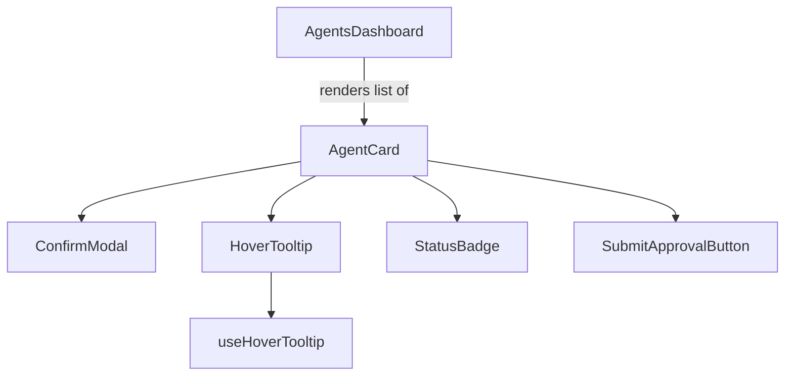
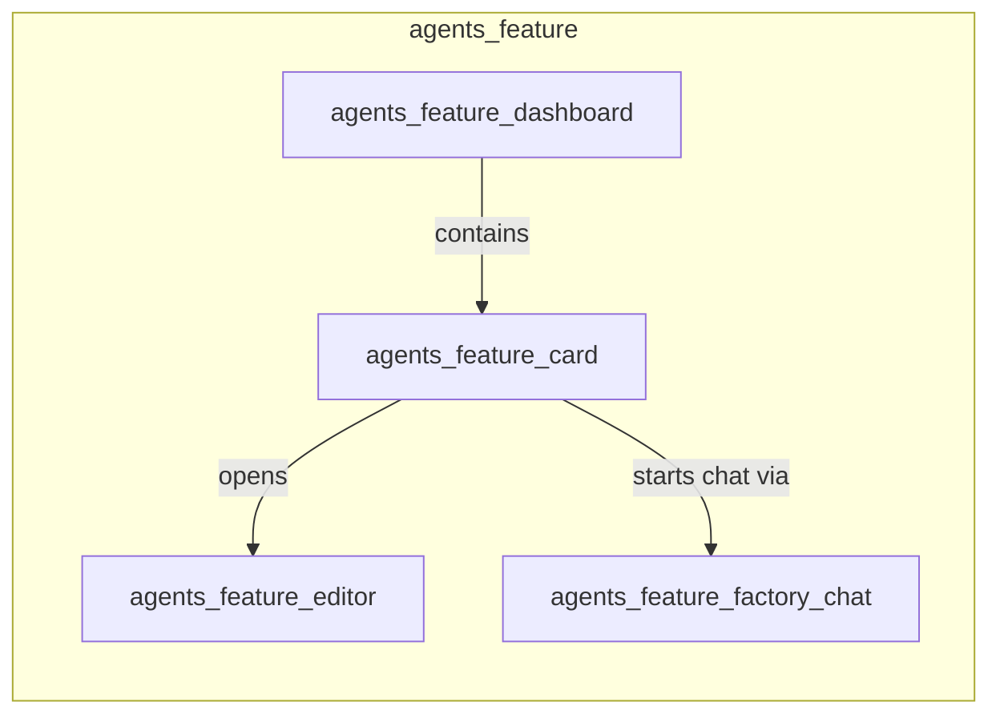
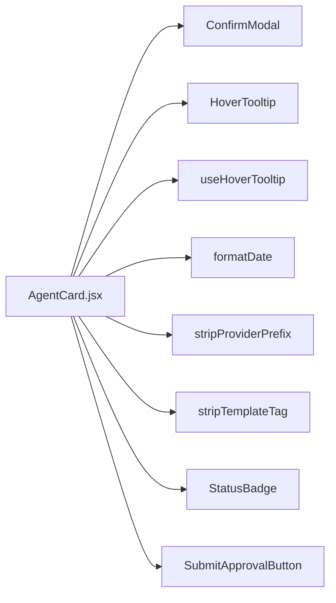
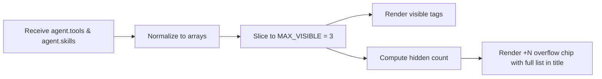
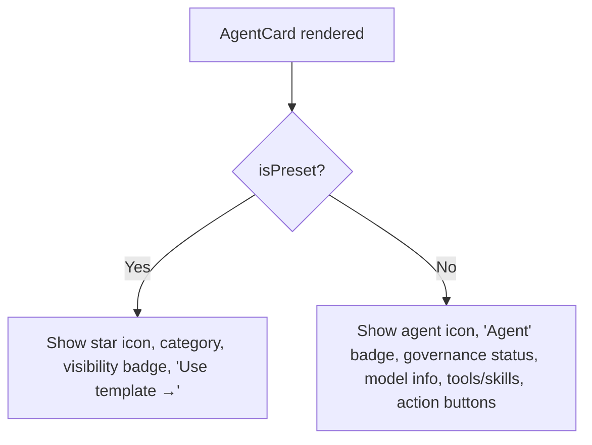

# agents_feature_card

## Brief Introduction

`agents_feature_card` is a React component module in the ABStudio frontend that renders a visual card representing a single **agent** or **agent preset/template**. It is the primary list-item view used inside the [agents_feature_dashboard](agents_feature_dashboard.md) and is responsible for surfacing an agent's identity, capabilities (tools and skills), governance status, model configuration, and available quick actions. The card supports both user-created agents and read-only preset cards, adapting its layout and action set accordingly.

---

## Core Functionality

- **Agent/preset visualization**: Displays name, description, provider, model, category, and update timestamp.
- **Capability summary**: Renders attached tools and skills as tag chips, collapsing overflow into a "+N" indicator.
- **Governance integration**: Shows the agent's approval status via [StatusBadge](governance_feature.md) and exposes a [SubmitApprovalButton](governance_feature.md) for submitting the agent for governance review.
- **Quick actions**: Provides "Talk to Agent", "Duplicate", and "Delete" actions for non-preset agents.
- **Accessibility & UX**: Supports keyboard activation (`Enter`), hover tooltips for long descriptions, and a confirmation modal before destructive deletion.

---

## Architecture

### Component Hierarchy



### Module Placement



`AgentCard` is a leaf presentational component owned by the `agents_feature` family. It delegates all side effects (navigation, API calls) to callback props supplied by its parent dashboard or routing layer.

---

## Component API

### `AgentCard`

| Prop | Type | Description |
|------|------|-------------|
| `agent` | object | Agent or preset data object (name, description, provider, model_name, tools, skills, updated_at, visibility, department, category). |
| `isPreset` | boolean | When `true`, renders in preset/template mode with reduced metadata and no destructive actions. |
| `onClick` | function | Callback invoked when the card body is clicked or activated via keyboard. |
| `onDelete` | function | Callback invoked after the user confirms deletion. |
| `onDuplicate` | function | Callback invoked when the duplicate action is clicked. |
| `onTalkToAgent` | function | Callback invoked when the "Talk to Agent" action is clicked; receives the `agent` object. |
| `className` | string | Optional additional CSS class for the card root. |

### Internal Helpers

| Helper | Purpose |
|--------|---------|
| `handleDeleteClick` | Opens the delete confirmation modal and stops event propagation so the card `onClick` does not fire. |
| `handleDeleteConfirm` | Closes the modal and invokes `onDelete()`. |
| `handleDuplicate` | Stops propagation and invokes `onDuplicate()`. |
| `handleTalkToAgent` | Stops propagation and invokes `onTalkToAgent(agent)`. |

---

## Dependencies

### Internal Frontend Modules



| Module | Role in this component |
|--------|------------------------|
| [common_components](common_components.md) `ConfirmModal` | Destructive-action confirmation dialog. |
| [common_components](common_components.md) `HoverTooltip` | Tooltip shown on hover for long agent descriptions. |
| [hooks](hooks.md) `useHoverTooltip` | Manages tooltip visibility, anchor bindings, and unique ID. |
| [utils](utils.md) `formatDate` | Formats `updated_at` for display. |
| [utils](utils.md) `stripProviderPrefix` | Cleans the model name label (e.g., removes provider prefix). |
| [utils](utils.md) `stripTemplateTag` | Removes template markers from the description text. |
| [governance_feature](governance_feature.md) `StatusBadge` | Displays governance approval state. |
| [governance_feature](governance_feature.md) `SubmitApprovalButton` | Allows submitting the agent for governance approval. |

### Backend/API Modules

The component itself does not call APIs directly. The parent dashboard wires callbacks to the following backend modules as needed:

- [api_agents](api_agents.md) — list, duplicate, delete agents.
- [api_agent_chat](api_agent_chat.md) — initiate a chat thread with the agent.
- [api_agent_templates](api_agent_templates.md) — list and use preset/template agents.
- [api_governance](api_governance.md) — submit/withdraw governance approval.

---

## Data Flow

```mermaid
sequenceDiagram
    participant User
    participant AgentCard
    parent Dashboard
    participant API as Backend API

    Dashboard->>AgentCard: render(agent, callbacks)
    AgentCard-->>User: display card with metadata, capabilities, actions

    alt Card body click / Enter key
        User->>AgentCard: onClick
        AgentCard->>Dashboard: onClick()
        Dashboard->>API: fetch agent details / open editor
    end

    alt Talk to Agent
        User->>AgentCard: click talk button
        AgentCard->>Dashboard: onTalkToAgent(agent)
        Dashboard->>API: create or resume chat thread
    end

    alt Duplicate
        User->>AgentCard: click duplicate
        AgentCard->>Dashboard: onDuplicate()
        Dashboard->>API: POST duplicate agent
    end

    alt Delete
        User->>AgentCard: click delete
        AgentCard->>AgentCard: open ConfirmModal
        User->>AgentCard: confirm
        AgentCard->>Dashboard: onDelete()
        Dashboard->>API: DELETE agent
    end

    alt Governance
        User->>AgentCard: click Submit for Approval
        AgentCard->>SubmitApprovalButton: render(entityType="agents", name)
        SubmitApprovalButton->>API: submit governance request
    end
```

---

## Process Flows

### Delete Flow

```mermaid
flowchart TD
    A[User clicks delete icon] --> B{Event propagation stopped}
    B --> C[Show ConfirmModal]
    C --> D{User confirms?}
    D -->|Yes| E[Invoke onDelete callback]
    D -->|No| F[Close modal]
    E --> G[Parent calls DELETE /agents/{id}]
```

### Capability Rendering Flow



### Preset vs. Agent Mode



---

## How It Fits into the System

`AgentCard` is the visual bridge between the agent management backend and the user. It lives in the [agents_feature](agents_feature.md) subsystem of the ABStudio frontend and is consumed primarily by [AgentsDashboard](agents_feature_dashboard.md). The dashboard fetches agent records from [api_agents](api_agents.md) (and presets from [api_agent_templates](api_agent_templates.md)) and maps each record to an `AgentCard`, binding the card's callbacks to dashboard-level handlers that route to the editor, chat factory, or API layer.

The card also integrates with the platform governance subsystem: it displays the current approval state and lets users submit agents for review without leaving the dashboard. This makes the card a small but central coordination point for agent lifecycle actions.

---

## Related Documentation

- [agents_feature_dashboard](agents_feature_dashboard.md) — parent list view that renders `AgentCard`.
- [agents_feature_editor](agents_feature_editor.md) — destination when opening an agent for editing.
- [agents_feature_factory_chat](agents_feature_factory_chat.md) — conversational agent builder, related to agent creation.
- [api_agents](api_agents.md) — backend CRUD endpoints for agents.
- [api_agent_chat](api_agent_chat.md) — backend chat-thread endpoints for talking to an agent.
- [api_agent_templates](api_agent_templates.md) — backend preset/template agent endpoints.
- [governance_feature](governance_feature.md) — frontend governance components (`StatusBadge`, `SubmitApprovalButton`).
- [api_governance](api_governance.md) — backend governance submission endpoints.
- [common_components](common_components.md) — shared UI primitives (`ConfirmModal`, `HoverTooltip`).
- [hooks](hooks.md) — shared React hooks (`useHoverTooltip`).
- [utils](utils.md) — formatting and text utilities used by the card.
