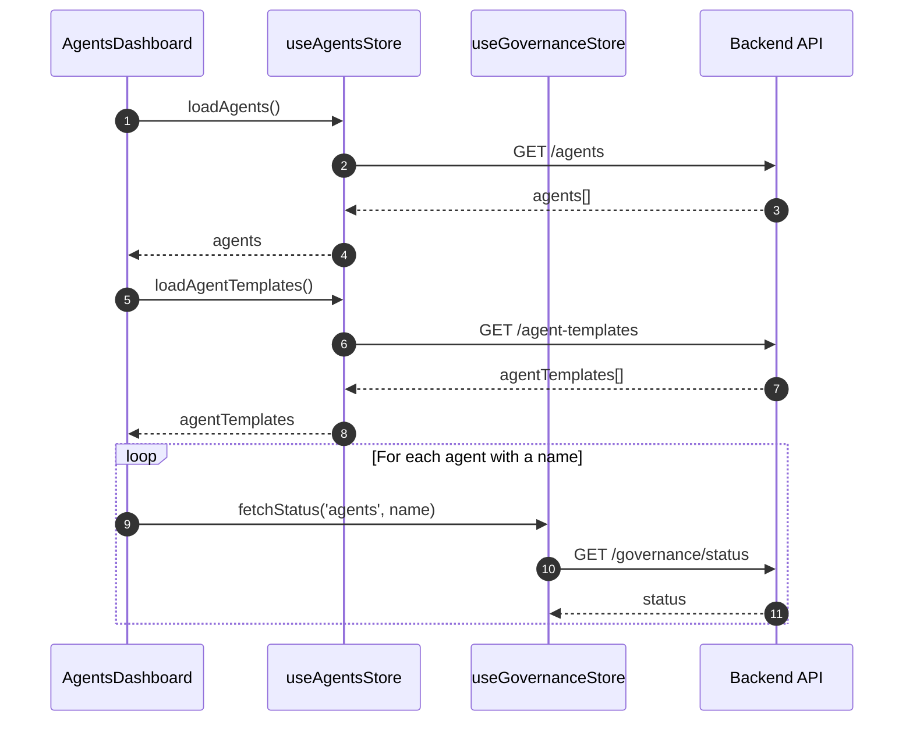
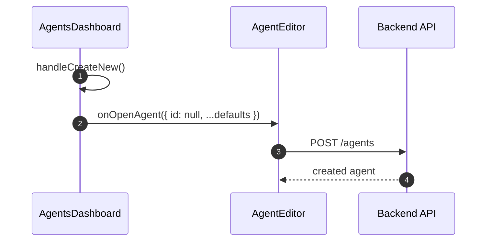
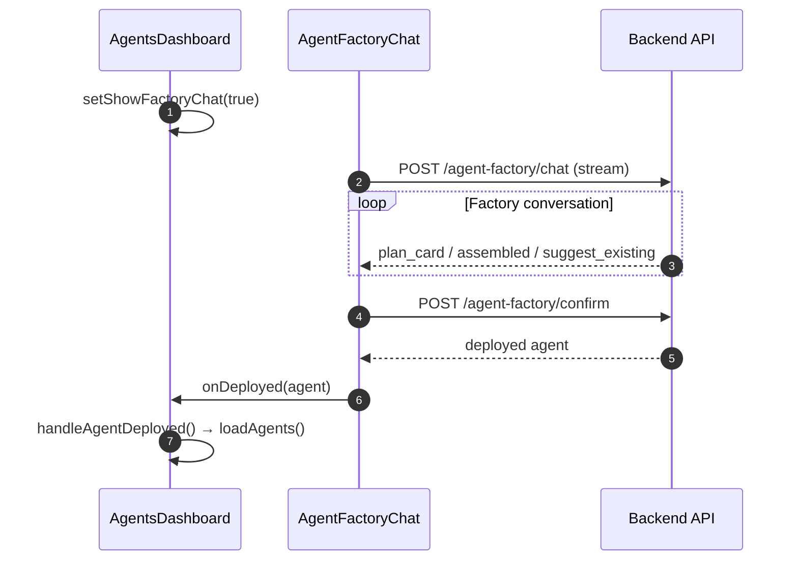
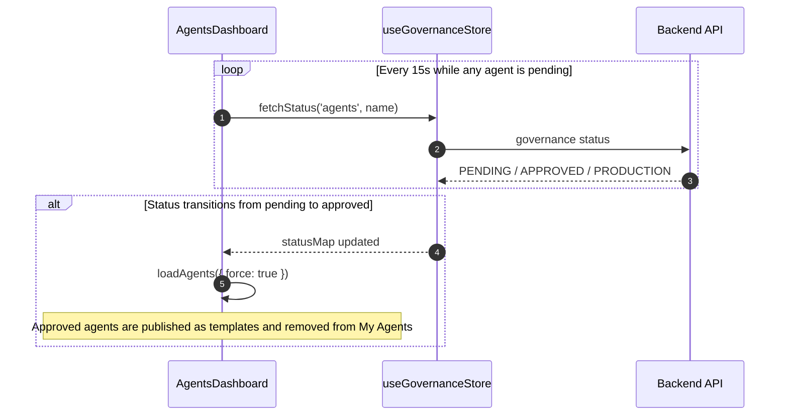
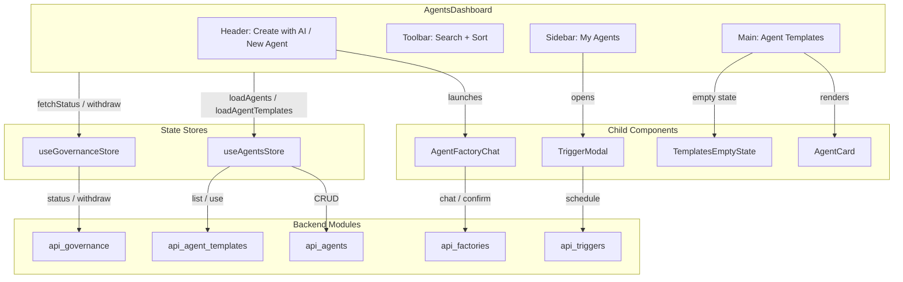
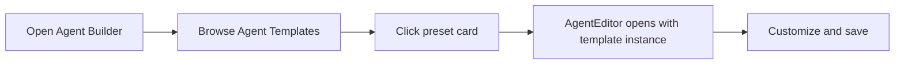
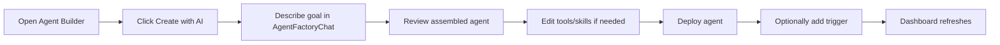
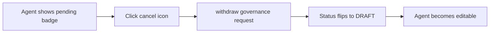

# Agents Feature Dashboard

The **Agents Feature Dashboard** is the primary landing surface for the **Agent Builder** experience in ABStudio. It lets users browse their saved agents, discover pre-built agent templates, create agents from scratch, or build new agents through an AI-guided factory chat. The dashboard also surfaces governance status (pending approvals), visibility-scoped templates, and one-click scheduling.

---

## Purpose and Core Functionality

`AgentsDashboard.jsx` is a React view component that orchestrates the agent lifecycle from discovery to creation:

- **My Agents sidebar**: Lists the current user's saved agents with search, sort, and quick actions (preview, duplicate, delete, schedule, cancel pending approval).
- **Agent Templates gallery**: Displays pre-built, reusable agent presets with visibility filtering (`All`, `Public`, `Department`).
- **Agent creation entry points**: Offers both a blank-slate "New Agent" path and an AI-assisted "Create with AI" path.
- **Governance awareness**: Tracks each agent's approval state (`PENDING_APPROVAL`, `PENDING_L2`, `APPROVED`, `PRODUCTION`, `ACTIVE`) and locks editing for pending agents while allowing the owner to withdraw a deploy request.
- **Scheduling integration**: Opens the trigger scheduler for any saved agent directly from the dashboard.

The component is intentionally read-only for the list view; editing and chat-based building are delegated to sibling feature modules.

---

## Architecture

### Component Hierarchy

```text
AgentsDashboard
├── useAgentsStore        (data: agents, templates, CRUD actions)
├── useGovernanceStore    (data: governance status map, withdraw)
├── AgentCard             (renders each template preset)
├── AgentFactoryChat      (modal AI builder)
├── TriggerModal          (schedule agent runs)
└── TemplatesEmptyState   (empty / no-match state)
```

`AgentsDashboard` itself is a container component. It owns the dashboard-level UI state (search, sort, visibility filter, modal visibility) and delegates rendering of individual cards, the factory chat, and the trigger scheduler to child components.

### Module Map

| Module | Responsibility | Relation to Dashboard |
|--------|--------------|----------------------|
| `agents_feature_card` ([agents_feature_card.md](agents_feature_card.md)) | `AgentCard` rendering and actions | Used for template presets in the gallery. |
| `agents_feature_editor` ([agents_feature_editor.md](agents_feature_editor.md)) | Full agent editor / preview | Dashboard opens it via `onOpenAgent`. |
| `agents_feature_factory_chat` ([agents_feature_factory_chat.md](agents_feature_factory_chat.md)) | AI-guided agent assembly | Dashboard launches it in a modal and refreshes on deploy. |
| `triggers_feature` ([triggers_feature.md](triggers_feature.md)) | Trigger creation and execution history | Dashboard opens `TriggerModal` for a selected agent. |
| `common_components` ([common_components.md](common_components.md)) | Shared UI primitives | Uses `TemplatesEmptyState`. |
| `api_agents` ([api_agents.md](api_agents.md)) | Backend CRUD for agents | Store calls these endpoints. |
| `api_agent_templates` ([api_agent_templates.md](api_agent_templates.md)) | Template listing / instantiation | Store calls these endpoints. |
| `api_factories` ([api_factories.md](api_factories.md)) | Agent factory chat and confirm | Factory chat uses these endpoints. |
| `api_governance` ([api_governance.md](api_governance.md)) | Governance status and withdrawal | Dashboard polls and cancels pending approvals. |
| `api_triggers` ([api_triggers.md](api_triggers.md)) | Trigger scheduling | Trigger modal persists schedules here. |

---

## Data Flow

### Initial Load



### Creating a New Agent



### Building with AI



### Governance Polling



---

## Component Interaction



---

## Key Behaviors

### Pending Approval Locking

Agents in `PENDING_APPROVAL` or `PENDING_L2` are locked for in-place editing. The dashboard shows:

- A **cancel deploy request** icon that calls `withdraw('agents', agent.name)`.
- A **duplicate** icon that clones the agent so the user can iterate on a new draft.
- No delete action while pending.

Template instances (`source_template_id` set) are never treated as pending, even if they carry a governance status, because they are pre-approved presets.

### Visibility Filters

Template presets support three visibility scopes:

| Filter | Meaning |
|--------|---------|
| `All` | Every preset the user can see. |
| `Public` | Presets with `visibility !== 'private'`. |
| `Department` | Presets restricted to the user's department (`visibility === 'private'`). |

### Approval Transition Handling

When a pending agent is approved elsewhere (for example, through the `ai_ui_frontend` Inbox), the backend publishes it as a template and removes the source agent row. The dashboard detects the transition during its 15-second polling loop and refetches both `agents` and `agentTemplates` so the item moves from **My Agents** to **Agent Templates**.

---

## Process Flows

### User Journey: Create from Template



### User Journey: Build with AI



### User Journey: Cancel Pending Approval



---

## Integration with the Overall System

The dashboard sits at the intersection of several ABStudio subsystems:

- **Agent management** ([api_agents.md](api_agents.md)): Provides the CRUD backend for the user's agent library.
- **Template marketplace** ([api_agent_templates.md](api_agent_templates.md)): Supplies reusable presets and handles template instantiation.
- **Factory pipeline** ([api_factories.md](api_factories.md) / [agent_factory_pipeline.md](agent_factory_pipeline.md)): Powers the AI-assisted builder that turns natural language into a deployable agent.
- **Governance** ([api_governance.md](api_governance.md) / [governance_feature.md](governance_feature.md)): Enforces approval workflows before an agent can be promoted to production.
- **Triggers** ([api_triggers.md](api_triggers.md) / [triggers_feature.md](triggers_feature.md)): Allows agents to run on schedules or webhooks.
- **Editor** ([agents_feature_editor.md](agents_feature_editor.md)): The detailed design surface where agents are configured after creation or template selection.

By keeping the dashboard focused on discovery, status, and entry points, the module avoids duplicating editor, factory, or trigger logic and instead delegates to the specialized modules above.
