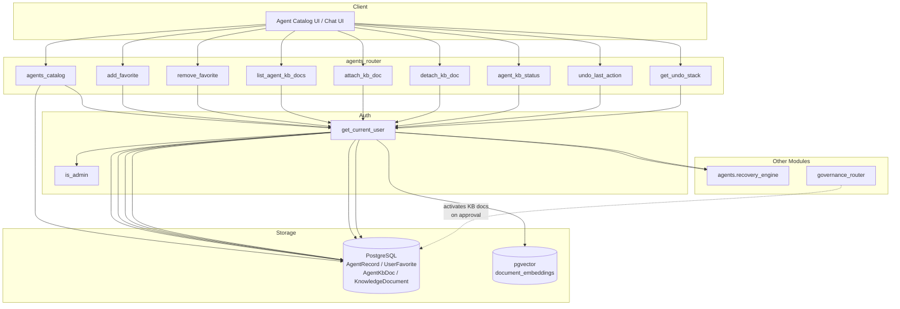
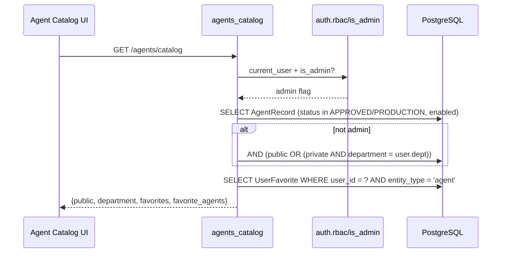
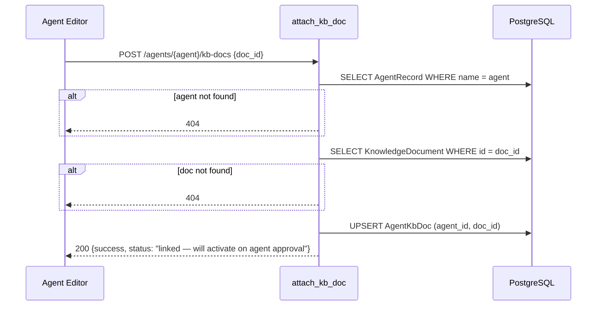
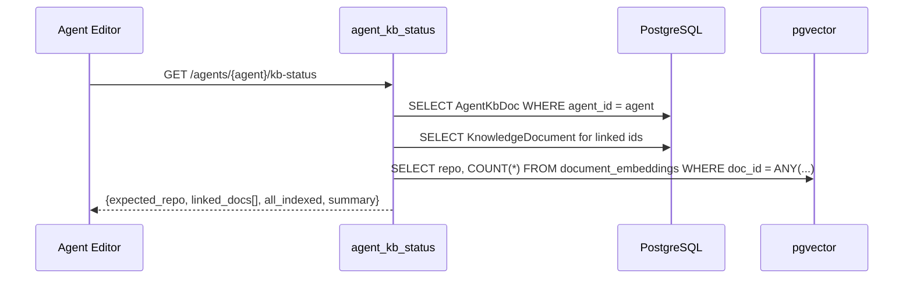
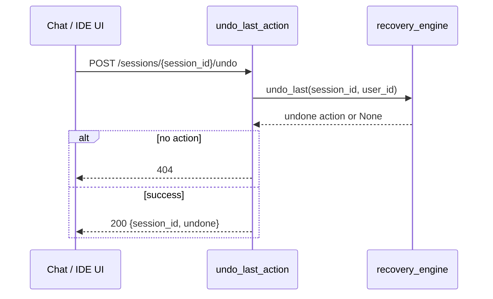

# agents_router

The `agents_router` module exposes a consumer-facing FastAPI router for browsing the agent catalog, managing per-user agent favorites, attaching knowledge-base (KB) documents to agents, and inspecting KB indexing status. It also provides session-level undo operations backed by the recovery engine.

This router is intentionally narrow: it does **not** create, update, or delete agent definitions (see [`api_agents`](api_agents.md) / [`agent_factory_pipeline`](agent_factory_pipeline.md)) and does **not** run agents (see [`api_execution`](api_execution.md) / [`gateway`](gateway.md)). Instead, it sits in front of the agent registry and knowledge document store to serve the agent catalog UI and related self-service operations.

---

## Module Overview

| Concern | Responsibility |
|--------|----------------|
| **Agent catalog** | List agents visible to the current user, grouped by `public`, `department`, and `favorites`. |
| **Favorites** | Idempotent star/unstar of agents using the `UserFavorite` table. |
| **Agent KB attachments** | Link/unlink staged `KnowledgeDocument` rows to an agent; activation happens later via governance approval. |
| **KB diagnostics** | Report per-document vector indexing status for an agent's attached KB docs. |
| **Session undo** | Pop or inspect the undo stack for a user session via the recovery engine. |

---

## Architecture



---

## Component Relationships

### Catalog & Favorites

- `agents_catalog` queries `AgentRecord` for rows whose `status` is `APPROVED` or `PRODUCTION` and `enabled == True`.
- Non-admin users only see `public` agents or `private` agents whose `department` matches their own.
- Favorites are stored in `UserFavorite` with `entity_type == "agent"` and `entity_id == agent.name`.
- The endpoint also resolves favorite agents that have become invisible (e.g., moved to another department) so the UI can still render them.

### Agent KB Attachments

- `AgentKbDoc` is a join table linking `AgentRecord.name` to `KnowledgeDocument.id`.
- `attach_kb_doc` validates that both the agent and the document exist, then upserts the link.
- The actual embedding/activation into pgvector is **not** performed here; it is triggered when the agent is approved through [`governance_router`](governance_router.md).
- `agent_kb_status` queries `document_embeddings` to verify whether each linked doc is indexed under the expected `agent_kb:{agent_name}` repo.

### Session Undo

- `undo_last_action` and `get_undo_stack` delegate to [`agents.recovery_engine`](recovery_engine.md).
- The stack is namespaced by `user_id` and `session_id`, preventing cross-user access.
- Stack inspection sanitizes sensitive input fields (`content`, `password`, `token`, `secret`).

---

## API Endpoints

| Method | Path | Handler | Purpose |
|--------|------|---------|---------|
| `GET` | `/agents/catalog` | `agents_catalog` | List visible agents with favorite flags. |
| `POST` | `/agents/{agent_name}/favorite` | `add_favorite` | Star an agent. |
| `DELETE` | `/agents/{agent_name}/favorite` | `remove_favorite` | Unstar an agent. |
| `GET` | `/agents/{agent_name}/kb-docs` | `list_agent_kb_docs` | List KB docs linked to an agent. |
| `POST` | `/agents/{agent_name}/kb-docs` | `attach_kb_doc` | Link a staged KB doc to an agent. |
| `DELETE` | `/agents/{agent_name}/kb-docs/{doc_id}` | `detach_kb_doc` | Unlink a KB doc from an agent. |
| `GET` | `/agents/{agent_name}/kb-status` | `agent_kb_status` | Diagnostic indexing status for linked KB docs. |
| `POST` | `/sessions/{session_id}/undo` | `undo_last_action` | Undo the last reversible action in a session. |
| `GET` | `/sessions/{session_id}/undo-stack` | `get_undo_stack` | Inspect the session undo stack. |

---

## Data Models

### `AttachDocRequest`

```python
class AttachDocRequest(BaseModel):
    doc_id: str   # UUID of a KnowledgeDocument row
```

### Catalog Response Shape

```json
{
  "public": [ /* agent objects with is_favorited */ ],
  "department": [ /* agent objects with is_favorited */ ],
  "favorites": ["agent-name-1", "agent-name-2"],
  "favorite_agents": [ /* full objects for favorites outside visible set */ ]
}
```

### Agent Dictionary

Each agent is serialized by `_agent_to_dict`:

| Field | Source |
|-------|--------|
| `id` | `AgentRecord.id` |
| `name` | `AgentRecord.name` |
| `description` | `AgentRecord.description` |
| `system_prompt` | `AgentRecord.system_prompt` |
| `tools` | `AgentRecord.tools` |
| `skills` | `AgentRecord.skills` |
| `status` | `AgentRecord.status` (defaults to `PRODUCTION`) |
| `enabled` | `AgentRecord.enabled` |
| `visibility` | `AgentRecord.visibility` (defaults to `private`) |
| `department` | `AgentRecord.department` |
| `created_by` | `AgentRecord.created_by` |
| `version` | `AgentRecord.version` (defaults to `1.0.0`) |
| `kb_namespace` | `AgentRecord.kb_namespace` |
| `preferred_model` | `AgentRecord.preferred_model` |
| `created_at` | ISO timestamp |
| `is_favorited` | Computed from `UserFavorite` |

---

## Data Flows

### Catalog Listing



### Attaching a KB Document



### KB Status Diagnostic



### Session Undo



---

## Security & Access Control

- All endpoints require a valid user via [`get_current_user`](auth_router.md).
- Catalog visibility is restricted for non-admin users to public agents or private agents in their own department.
- Favorites are scoped to `user_id`, preventing users from viewing or modifying other users' favorites.
- Undo stacks are namespaced by `user_id:session_id`; the recovery engine only returns actions belonging to the requesting user.
- KB status inspection does not expose raw vector content, only aggregate counts and repo names.

---

## Error Handling

- Unexpected database errors are logged and returned as `500 Internal Server Error` with the exception message.
- `attach_kb_doc` returns `404` if the agent or document does not exist.
- `undo_last_action` returns `404` when the undo stack is empty for the user/session.
- All write operations use explicit `db.rollback()` on failure.

---

## Dependencies

| Dependency | Module | Purpose |
|------------|--------|---------|
| `get_current_user` | [`auth_router`](auth_router.md) / `auth.dependencies` | Authenticate requests. |
| `is_admin` | [`auth_router`](auth_router.md) / `auth.rbac` | Admin check for catalog visibility. |
| `AgentRecord`, `UserFavorite`, `AgentKbDoc`, `KnowledgeDocument` | [`db/models`](db_models.md) | ORM models. |
| `SessionLocal`, `VectorSessionLocal` | [`db/database`](db_database.md) | Relational and vector database sessions. |
| `logger` | [`core/logger`](core_logger.md) | Structured logging. |
| `recovery_engine` | [`agents/recovery_engine`](recovery_engine.md) | Undo stack operations. |

---

## Related Modules

- [`api_agents`](api_agents.md) — CRUD operations for agent definitions in ABStudio.
- [`agent_factory_pipeline`](agent_factory_pipeline.md) — LLM-driven agent creation pipeline.
- [`governance_router`](governance_router.md) — Approves agents and triggers KB doc activation.
- [`docs_router`](docs_router.md) / [`kb_router`](kb_router.md) — Upload and manage knowledge documents.
- [`api_execution`](api_execution.md) / [`gateway`](gateway.md) — Run agents and workflows.
- [`recovery_engine`](recovery_engine.md) — Reversible action tracking used by the undo endpoints.
