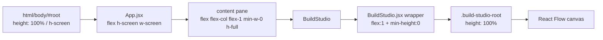
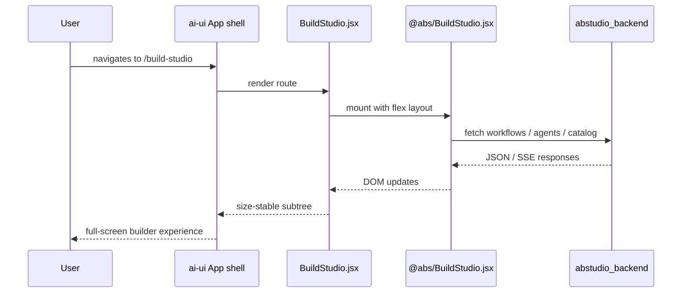
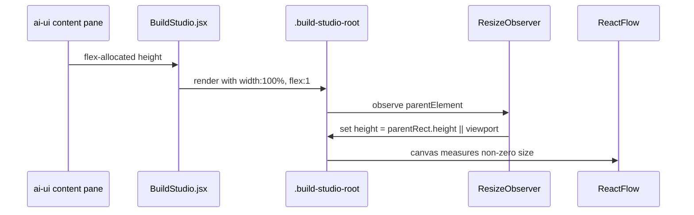
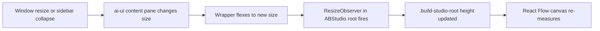

# ai_ui_frontend_build_studio

## Brief Introduction

`ai_ui_frontend_build_studio` is the **integration shim** that embeds the ABStudio visual builder into the `ai-ui` React shell. It does not implement the builder itself; instead, it imports the standalone ABStudio application (`@abs/BuildStudio.jsx`) and provides the CSS flex/height scaffolding required for the embedded app to fill its host pane correctly.

The module's only responsibility is to bridge the layout boundary between the `ai-ui` outer shell and the ABStudio inner application so that the workflow/agent canvas, sidebars, and chat panels render without overflow or zero-height measurement issues.

---

## Core Component

### `BuildStudio` — `ai-ui/src/components/BuildStudio.jsx`

A single default-exported React component that wraps `ABStudioApp`.

```jsx
import ABStudioApp from '@abs/BuildStudio.jsx';

export default function BuildStudio() {
  return (
    <div style={{
      display: 'flex',
      flexDirection: 'column',
      flex: '1 1 0%',
      minHeight: 0,
      minWidth: 0,
      width: '100%',
      overflow: 'hidden',
    }}>
      <ABStudioApp />
    </div>
  );
}
```

#### Responsibilities

| Concern | What this wrapper does |
|---------|------------------------|
| **Height resolution** | Uses `flex: 1 1 0%` + `minHeight: 0` so the child fills the `ai-ui` content pane instead of expanding beyond it. |
| **Width containment** | Sets `width: 100%` and `minWidth: 0` to prevent flex children from blowing out the parent. |
| **Overflow control** | Hides overflow on the wrapper; the inner ABStudio app manages its own scroll regions. |
| **Embedding boundary** | Keeps ABStudio's internal routing, state, and styling isolated from the rest of `ai-ui`. |

> **Note:** The actual builder UI (dashboards, workflow editor, agent editor, factory chats, etc.) is implemented in the [`abstudio_frontend`](abstudio_frontend.md) module. This module only mounts that application.

---

## Architecture

### High-level placement

```mermaid
flowchart TB
    subgraph ai_ui_shell["ai-ui shell"]
        A[App.jsx] -->|renders route| B[BuildStudio.jsx]
    end

    B -->|imports| C[@abs/BuildStudio.jsx]

    subgraph abstudio_app["ABStudio frontend app"]
        C --> D[ABStudio App.jsx]
        D --> E[Workflow Editor]
        D --> F[Agent Editor]
        D --> G[Factory Chats]
        D --> H[Catalog / Templates]
    end

    D -->|HTTP / SSE| I[abstudio_backend APIs]
```

### Layout chain

The wrapper exists because the host `ai-ui` shell uses a flex-based full-screen layout, while ABStudio's root (`build-studio-root`) expects a concrete height to resolve against (especially for React Flow's canvas measurement).



---

## Dependencies

### Runtime dependencies

| Dependency | Module | Purpose |
|------------|--------|---------|
| `@abs/BuildStudio.jsx` | [`abstudio_frontend`](abstudio_frontend.md) | The full ABStudio React application being embedded. |
| `ai-ui` host layout | [`ai_ui_frontend_app_core`](ai_ui_frontend_app_core.md) | Provides the flex content pane that this wrapper fills. |
| Backend APIs | [`abstudio_backend`](abstudio_backend.md) | The embedded ABStudio app calls these endpoints for workflows, agents, skills, catalog, execution, etc. |

### Why no direct state/store dependency?

`BuildStudio.jsx` intentionally does **not** import `ai-ui` stores, auth context, or routing utilities. ABStudio is bundled as a self-contained package (`@abs/*`) and manages its own:

- Internal React Router routes
- Local/editor state
- API clients
- Authentication via shared cookies / bearer tokens injected by the host

This keeps the integration surface minimal and allows ABStudio to be developed and tested independently.

---

## Data Flow

Because this module is a pure mounting wrapper, data flow is delegated entirely to the embedded ABStudio app.



### Height measurement flow

The inner ABStudio root uses a `ResizeObserver` to measure its parent and set an explicit `height` so React Flow does not initialize at `0×0`. The `ai_ui_frontend_build_studio` wrapper guarantees that the parent has a bounded, measurable size.



---

## Component Interaction

```mermaid
flowchart TB
    subgraph ai_ui["ai-ui frontend"]
        App[App.jsx] --> Route{Route /build-studio}
        Route --> BS[BuildStudio.jsx]
    end

    BS -->|mounts| ABS[@abs/BuildStudio.jsx]

    subgraph abstudio["ABStudio frontend"]
        ABS --> AppError[AppErrorBoundary]
        AppError --> App[ABStudio App.jsx]
        App --> Dashboards[Dashboards & Lists]
        App --> Editor[Workflow / Agent Editor]
        App --> Factory[Factory Chats]
        App --> Catalog[Catalog & Templates]
    end

    App -->|REST / SSE| Backend[abstudio_backend]
```

### Interaction notes

- **No props are passed** from `BuildStudio.jsx` to `ABStudioApp`. The embedded app reads route params, query strings, and global auth state on its own.
- **No events are bubbled up** from the wrapper to `ai-ui`. ABStudio handles its own toasts, modals, and confirmations.
- **The wrapper is unmounted** when the user navigates away from the `/build-studio` route, tearing down the entire ABStudio subtree.

---

## Process Flows

### Route mount

```mermaid
flowchart LR
    A[User opens /build-studio] --> B[ai-ui router renders BuildStudio.jsx]
    B --> C[Wrapper div fills content pane]
    C --> D[@abs/BuildStudio.jsx mounts]
    D --> E[ABStudio App initializes]
    E --> F[Fetch initial data from backend]
    F --> G[Render builder UI]
```

### Window resize / pane change



---

## Integration Considerations

### Why `flex: 1 1 0%` instead of `height: 100%`

In a flex container, `height: 100%` can cause a child to become taller than its parent when siblings or padding are present. `flex: 1 1 0%` with `minHeight: 0` is the canonical pattern for a flex child that must fill the remaining space without overflowing.

### Zero-height guard

The inner ABStudio root defensively measures its parent and falls back to the viewport height if the parent is unbounded. The wrapper ensures the common case (parent has a measured height) works correctly.

### Styling isolation

ABStudio's CSS classes (e.g., `.build-studio-root`) are scoped to its own subtree. The wrapper does not apply `ai-ui` Tailwind classes to the inner app, avoiding style collisions.

---

## Related Documentation

- [`abstudio_frontend`](abstudio_frontend.md) — Full ABStudio frontend: dashboards, workflow editor, agent editor, factory chats, catalog, templates.
- [`ai_ui_frontend_app_core`](ai_ui_frontend_app_core.md) — `ai-ui` host shell, routing, and navigation.
- [`abstudio_backend`](abstudio_backend.md) — Backend APIs consumed by the embedded builder (workflows, agents, skills, execution, triggers, etc.).
- [`gateway`](gateway.md) — Optional gateway layer that may proxy ABStudio API calls.

---

## Summary

`ai_ui_frontend_build_studio` is a **minimal, layout-only integration module**. Its single component mounts the standalone ABStudio builder inside the `ai-ui` shell and solves the flex-height boundary problem so that the embedded canvas and panels render correctly. All builder functionality, state, and backend communication live in the [`abstudio_frontend`](abstudio_frontend.md) and [`abstudio_backend`](abstudio_backend.md) modules.
