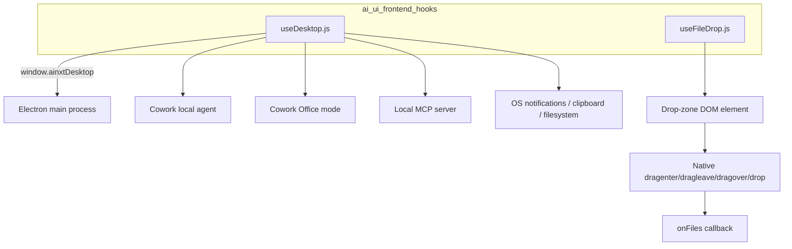
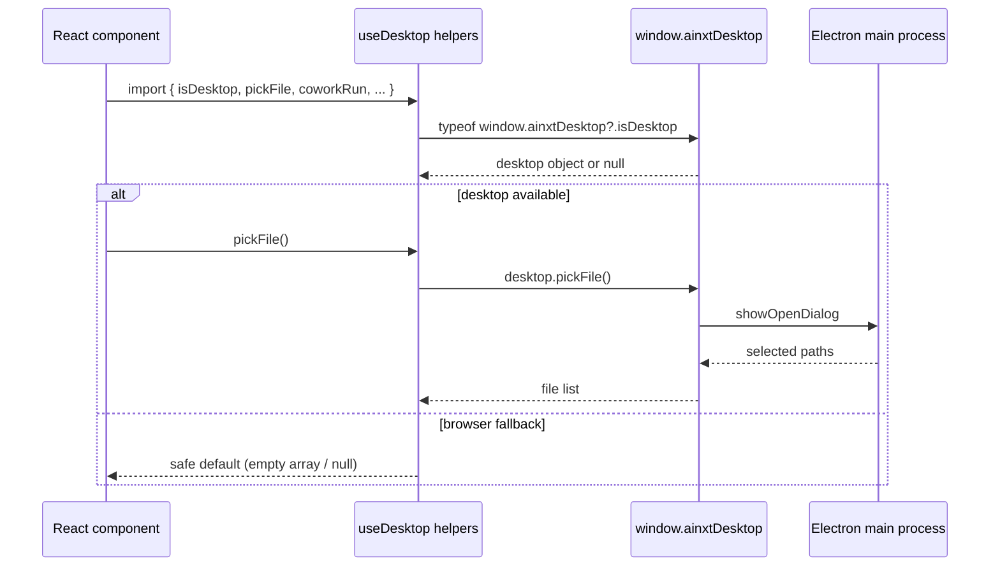
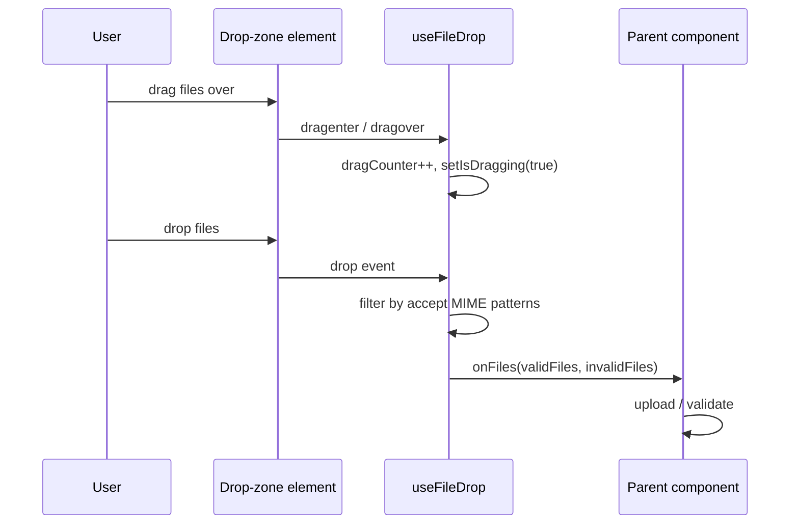

# ai_ui_frontend_hooks

## Overview

`ai_ui_frontend_hooks` is a small React hooks layer inside the `ai-ui` frontend package. It encapsulates two distinct cross-cutting concerns that are reused by multiple UI features:

1. **Desktop integration** — detection of, and communication with, the AiNxt Electron desktop host (`window.ainxtDesktop`). This includes file-system access, workspace watching, clipboard integration, local MCP registration, token sync, and the two Cowork local-agent modes (code/office).
2. **Drag-and-drop file handling** — a robust `useFileDrop` hook that attaches native HTML5 drag-and-drop listeners to any DOM element, with lazy mounting support and MIME-type filtering.

Both hooks are designed to degrade gracefully when the capability is unavailable (browser vs. desktop, disabled drop zones, etc.), keeping calling components free of environment guards.

## Architecture

### Module placement

- `ai-ui/src/hooks/useDesktop.js` — desktop bridge and Cowork helpers.
- `ai-ui/src/hooks/useFileDrop.js` — reusable drag-and-drop React hook.

These hooks are consumed by higher-level components in `ai_ui_frontend` (for example `knowledge_base`, `cowork_desktop`, `chat`, and `kb_chat`). They do not contain business logic themselves; they only abstract platform capabilities and browser events.

## Sub-modules

| Sub-module | File | Responsibility |
|------------|------|----------------|
| Desktop hooks | `useDesktop.js` | Detect desktop runtime, expose Electron APIs, manage Cowork sessions, sync auth tokens, local MCP, clipboard, and filesystem helpers. |
| File drop hook | `useFileDrop.js` | Provide a ref-callback based React hook for drag-and-drop file selection with lazy mounting and accept filtering. |

Detailed documentation:

- [ai_ui_frontend_hooks_desktop](ai_ui_frontend_hooks_desktop.md)
- [ai_ui_frontend_hooks_file_drop](ai_ui_frontend_hooks_file_drop.md)

## Data flow

### Desktop capability detection

### File drop handling

## Integration notes

- `useDesktop.js` is the primary integration point between the web frontend and the `desktop_app` module. For the Electron side of the contract, see [desktop_app](desktop_app.md).
- `useFileDrop.js` is used by upload surfaces such as `knowledge_base` and chat attachment areas. It intentionally avoids React synthetic events and uses native DOM listeners with `{ passive: false }` so that `preventDefault()` can suppress the browser's default drag-and-drop security popup.
- Both hooks are stateless utilities; they do not depend on the global store or router and can be imported by any component.
