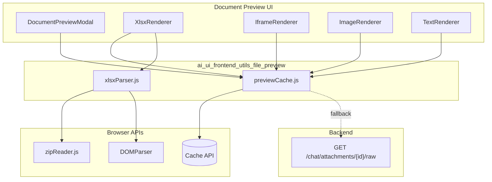
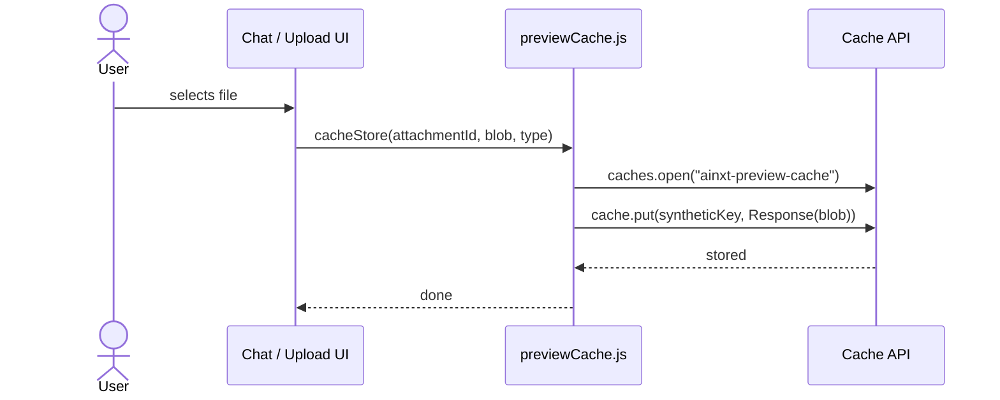
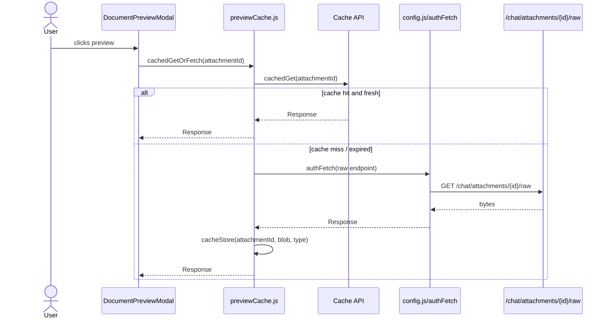
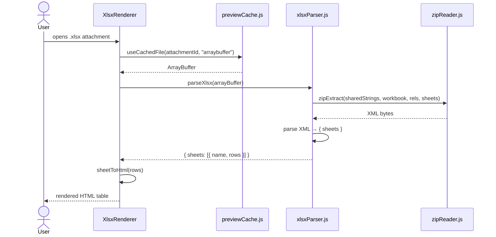

# ai_ui_frontend_utils_file_preview

## Brief Introduction

The `ai_ui_frontend_utils_file_preview` module provides client-side utilities for previewing uploaded files in the AI UI frontend. It is a focused, dependency-free utility layer that sits between the browser's storage APIs and the document preview UI. The module has two responsibilities:

1. **Preview caching** (`previewCache.js`) — stores uploaded file bytes in the browser's Cache API, retrieves them on demand, and falls back to the server when the local copy is missing or expired.
2. **XLSX parsing** (`xlsxParser.js`) — parses `.xlsx` workbooks entirely in the browser using native ZIP and XML APIs, producing structured sheet data that can be rendered as HTML tables.

These utilities are consumed by the [document_preview](document_preview.md) feature, specifically the `DocumentPreviewModal` component and its sub-renderers.

---

## Core Components

### `previewCache.js`

A thin wrapper around the browser's [Cache API](https://developer.mozilla.org/en-US/docs/Web/API/Cache) that treats the cache as a fast, local layer for uploaded attachment bytes. The server remains the source of truth.

| Function | Purpose |
|----------|---------|
| `cacheKey(attachmentId)` | Builds a synthetic URL used as the cache key for an attachment. |
| `cacheStore(attachmentId, blob, contentType)` | Writes a `Blob` into the cache with a timestamp header. |
| `cachedGet(attachmentId)` | Returns a fresh cached `Response` or `null` if missing/expired. |
| `cachedGetOrFetch(attachmentId)` | Cache-first read with authenticated server fallback via [config](ai_ui_frontend_config.md). |
| `cacheRemove(attachmentId)` | Deletes a single cached entry. |
| `cachePurgeExpired()` | Removes all entries older than the configured max age. |

Key behaviors:

- Cache name: `ainxt-preview-cache`
- Max age: 7 days (`MAX_AGE_MS`)
- Expiration is tracked via a custom `x-cached-at` response header.
- Falls back to `GET /chat/attachments/{id}/raw` using `authFetch` from [config](ai_ui_frontend_config.md) when the local entry is unavailable.
- Re-populates the cache after a successful server fetch so subsequent reads remain fast.

### `xlsxParser.js`

A pure-JavaScript `.xlsx` parser that uses the browser's native `DOMParser` and a small ZIP helper (`zipReader.js`) to extract workbook contents without external dependencies.

| Function | Purpose |
|----------|---------|
| `parseXlsx(arrayBuffer)` | Main entry point. Returns `{ sheets: [{ name, rows: string[][] }] }`. |
| `getByLocal(parent, localName)` | Namespace-agnostic helper for selecting child XML elements by local name. |
| `cellRefToRC(ref)` | Converts Excel cell references (`A1`, `AA100`) to zero-indexed `[row, col]`. |
| `parseSharedStrings` | Builds the shared-string table used by cells of type `s`. |
| `parseWorkbook` | Reads sheet names and relationship IDs from `xl/workbook.xml`. |
| `parseRels` | Maps relationship IDs to target filenames. |
| `parseSheet` | Converts a sheet XML document into a 2D array of string values. |

Supported features:

- Multiple sheets with names and tab switching
- Shared strings and inline strings
- Numbers, booleans, and error values
- Sparse cell references

Known limitations (acceptable for preview only):

- Formulas display cached values only
- Merged cells are not visually merged
- Cell formatting/styles are ignored
- Charts and images are ignored
- Date serial numbers are shown as-is

---

## Architecture

---

## Data Flow

### Upload-time caching

### Preview retrieval (cache-first)

### XLSX preview rendering

---

## Component Interactions

| Consumer | Utility used | Interaction |
|----------|--------------|-------------|
| `DocumentPreviewModal` | `cachedGetOrFetch` | Downloads the full file when the user clicks the download button. |
| `useCachedFile` hook (inside `DocumentPreviewModal`) | `cachedGetOrFetch` | Loads bytes as `blob`, `arraybuffer`, or `text` for sub-renderers. |
| `XlsxRenderer` | `parseXlsx` | Parses the workbook and renders sheet tabs + HTML tables. |
| `IframeRenderer` / `ImageRenderer` / `TextRenderer` | `cachedGetOrFetch` (via `useCachedFile`) | Loads bytes in the appropriate format for the viewer strategy. |
| `Chat.jsx` / upload flows | `cacheStore` | Stores file bytes at upload time so previews are instant. |

---

## Module Fit in the System

This module belongs to the `ai_ui_frontend` application's utility layer. It is a sibling of:

- [ai_ui_frontend_utils_chat_message](ai_ui_frontend_utils_chat_message.md) — chat message text helpers
- [ai_ui_frontend_utils_ppt](ai_ui_frontend_utils_ppt.md) — PPT intent detection and parameter parsing
- [ai_ui_frontend_utils_security](ai_ui_frontend_utils_security.md) — input and form validation

It is consumed primarily by the [document_preview](document_preview.md) component and indirectly by the [chat](chat.md) and [kb_chat](kb_chat.md) features that handle file uploads.

The design keeps preview data local and fast while preserving the server as the source of truth. This allows previews to survive browser restarts and re-logins, and enables cross-device access without requiring the frontend to re-upload files.

---

## Configuration & Constants

| Constant | Value | Purpose |
|----------|-------|---------|
| `CACHE_NAME` | `ainxt-preview-cache` | Name of the browser cache used for previews. |
| `MAX_AGE_MS` | `7 * 24 * 60 * 60 * 1000` | Maximum age of a cached entry before it is considered expired. |
| `TIMESTAMP_HEADER` | `x-cached-at` | Custom header storing the cache insertion timestamp. |

---

## Error Handling

- All cache operations are wrapped in `try/catch` and fail silently with a console error, so a cache failure never breaks the UI.
- If `caches` is unavailable (e.g., insecure context or unsupported browser), the module returns early and relies entirely on the server fallback.
- `cachedGetOrFetch` returns `null` when the file is unavailable both locally and on the server; callers should surface a user-friendly message.
- `parseXlsx` throws descriptive errors for malformed workbooks (missing `xl/workbook.xml`, no sheets, etc.).

---

## References

- [document_preview](document_preview.md) — primary consumer of these utilities
- [ai_ui_frontend_config](ai_ui_frontend_config.md) — provides `authFetch` and `API_BASE`
- [chat](chat.md) and [kb_chat](kb_chat.md) — upload flows that populate the cache
- [ai_ui_frontend_utils_ppt](ai_ui_frontend_utils_ppt.md) — related preview utilities for PPT generation
