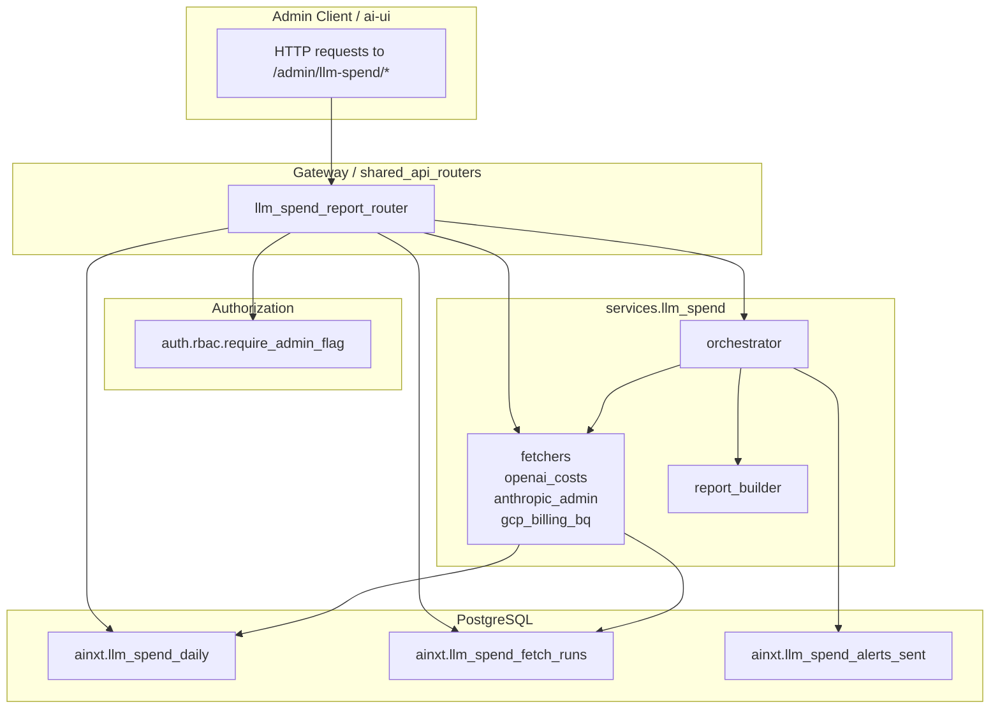
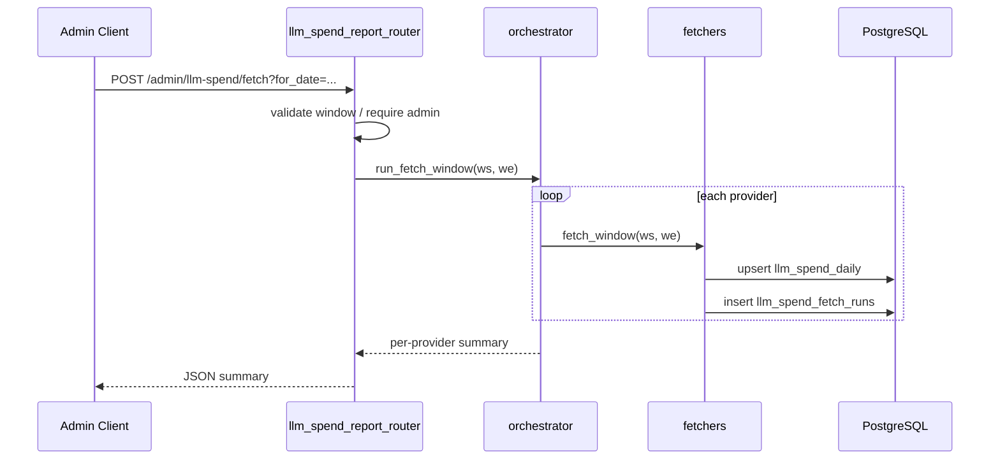
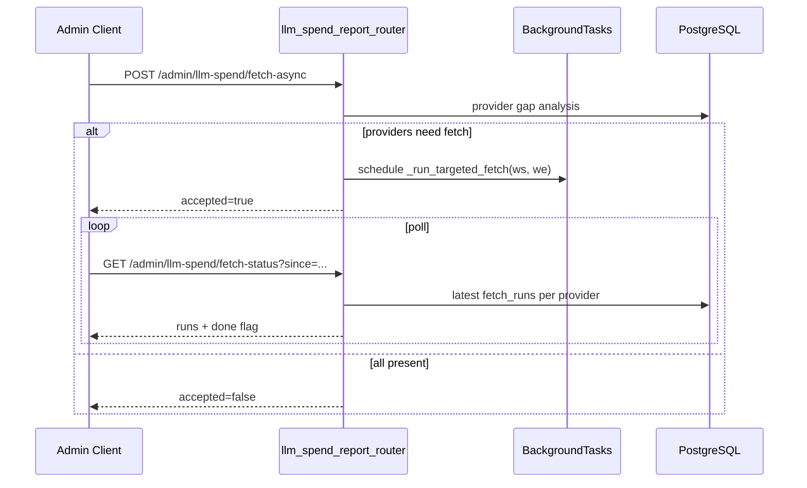
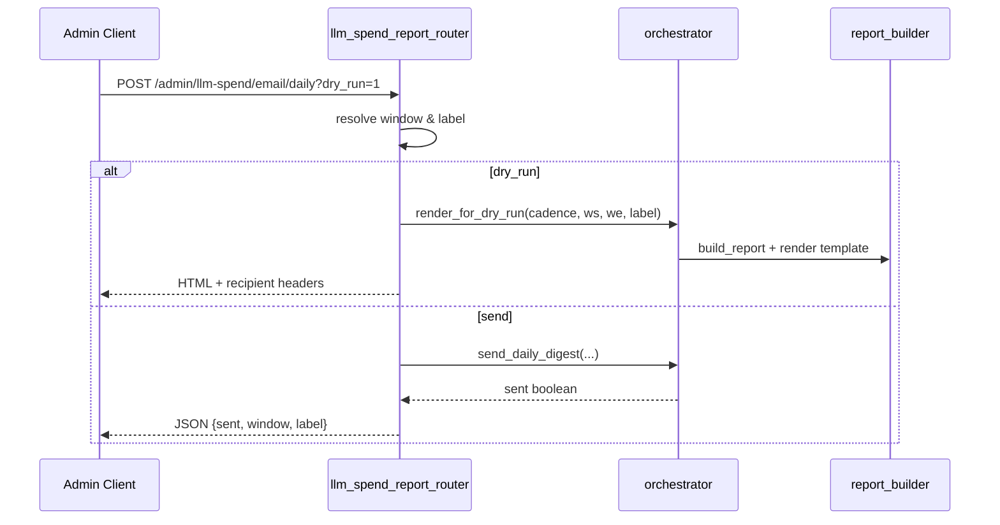

# LLM Spend Report Router

The `llm_spend_report_router` module exposes the **admin-only HTTP surface** for the enterprise LLM spend feature. It lets platform administrators trigger provider fetches, inspect aggregated usage, reconcile internal totals against provider consoles, preview email digests, and send on-demand spend reports.

This router is a thin FastAPI layer that delegates all provider I/O and report rendering to the `services.llm_spend` subsystem. Its responsibilities are limited to: request validation, window resolution, authorization, SQL aggregation for dashboard endpoints, and HTTP response shaping.

---

## Core Functionality

| Capability | Description |
|------------|-------------|
| **Manual / backfill fetch** | `POST /admin/llm-spend/fetch` triggers an immediate fetch across OpenAI, Anthropic, and Gemini for a single day or a date window. |
| **Async targeted fetch** | `POST /admin/llm-spend/fetch-async` runs only stale/missing providers in a background task and exposes a polling endpoint for status. |
| **Reconciliation** | `GET /admin/llm-spend/reconcile` returns DB totals per `(usage_date, provider)` plus the provider console URLs and caveats for manual parity checks. |
| **Usage dashboard** | `GET /admin/llm-spend/usage-summary` returns provider/model/daily aggregates, previous-window comparison, and fetch coverage. |
| **Fetch preview** | `GET /admin/llm-spend/fetch-preview` performs gap analysis without calling provider APIs. |
| **Email digests** | `POST /admin/llm-spend/email/{daily,weekly,monthly,quarterly}` sends or dry-runs spend digests. |

All endpoints require the admin flag via `auth.rbac.require_admin_flag`.

---

## Architecture

### Component Responsibilities

- **`llm_spend_report_router`** — Validates query parameters, resolves reporting windows, enforces admin authorization, runs lightweight SQL aggregations for dashboard/reconcile endpoints, and formats JSON/HTML responses.
- **`services.llm_spend.orchestrator`** — Implements the actual fetch/digest logic, multi-worker claim guards, and provider coordination. See `services_llm_spend.md`.
- **`services.llm_spend.fetchers.*`** — Provider-specific clients that pull cost/usage data and upsert rows into `llm_spend_daily`. See `services_llm_spend_fetchers.md`.
- **`services.llm_spend.report_builder`** — Builds reports, detects missing data, and renders email templates. See `services_llm_spend_report_builder.md`.
- **`auth.rbac.require_admin_flag`** — Dependency that rejects non-admin callers. See `auth_rbac.md`.

---

## Endpoint Reference

### `POST /admin/llm-spend/fetch`
Triggers a synchronous fetch across all required providers.

- **Query params**
  - `for_date` — single day `YYYY-MM-DD`
  - `from`, `to` — inclusive window `YYYY-MM-DD`
- **Default window** — `[today-2, yesterday]` in the configured timezone (`Asia/Kolkata` by default), matching the nightly cron window.
- **Returns** — `window_start`, `window_end`, and per-provider status summary.

### `GET /admin/llm-spend/reconcile`
Returns DB totals side-by-side with provider console URLs for manual parity verification.

- **Query params** — `from`, `to` (default: last 7 days ending yesterday)
- **Returns** — rows per `(usage_date, provider)`, provider/daily totals, fetch coverage, UI compare URLs, and per-provider caveats.

### `GET /admin/llm-spend/usage-summary`
Aggregated usage for the Cloud Usage dashboard.

- **Query params**
  - `granularity` — `day`, `week`, `month`, `quarter`
  - `reference_date` — anchor date `YYYY-MM-DD`
  - `from`, `to` — explicit override
- **Returns** — current/previous window aggregates, percentage changes, model breakdown, daily series, fetch coverage, and provider gap analysis.

### `GET /admin/llm-spend/fetch-preview`
Gap analysis without calling provider APIs.

- **Query params** — same as `usage-summary`
- **Returns** — per-provider classification: `present` (skip), `stale`, or `missing` (fetch), with estimated fetch duration.

### `POST /admin/llm-spend/fetch-async`
Targeted background fetch for stale/missing providers only.

- **Query params** — same as `usage-summary`
- **Returns** — `accepted` flag and provider gap analysis.
- **Polling** — `GET /admin/llm-spend/fetch-status?since=...` returns the latest `llm_spend_fetch_runs` row per provider and a `done` flag.

### `POST /admin/llm-spend/email/{daily,weekly,monthly,quarterly}`
Send or dry-run spend digests.

- **Query params**
  - `for_date`, `week_start`, `month`, `quarter`
  - `dry_run=1` — renders HTML and returns recipient headers without sending
- **Behavior**
  - Daily defaults to yesterday.
  - Weekly defaults to the previous Monday–Sunday window.
  - Monthly defaults to the previous calendar month.
  - Quarterly defaults to the previous completed quarter.

---

## Data Flow

### Manual Fetch Flow

### Async Fetch Flow

### Digest Dry-Run / Send Flow

---

## Window Resolution

The router centralizes date/window parsing in `_resolve_window()`:

1. If both `from` and `to` are supplied, use them directly.
2. Otherwise derive the window from `granularity` and `reference_date`.
3. Default `reference_date` is "today" in the configured timezone (`LLM_SPEND_TZ`, default `Asia/Kolkata`).

This timezone-aware default prevents off-by-one-day errors when admins run manual fetches in the IST evening or early morning.

| Granularity | Window |
|-------------|--------|
| `day` | reference date only |
| `week` | Monday through Sunday containing reference date |
| `month` | full calendar month of reference date |
| `quarter` | full calendar quarter of reference date |

For comparison metrics, `_previous_window()` returns the immediately preceding window of the same length.

---

## Provider Gap Analysis

`_provider_gap_analysis()` classifies each required provider for a window using:

- `llm_spend_fetch_runs` — latest `status='ok'` `window_end`
- `llm_spend_daily` — distinct days present in the window

| State | Condition | Action |
|-------|-----------|--------|
| **missing** | no days present | fetch |
| **stale** | fewer days than window length, or last ok end < window end | fetch |
| **present** | all days present and last ok end >= window end | skip |

Estimated fetch durations are hardcoded in `_PROVIDER_ESTIMATES`:

- OpenAI: ~5s
- Anthropic: ~5s
- Gemini: ~180s

---

## Database Schema Used

The router reads from and writes through the following tables. Full schema details are in `db_models.md`.

| Table | Purpose |
|-------|---------|
| `ainxt.llm_spend_daily` | Aggregated cost/tokens/requests per `(usage_date, provider, model, source)`. |
| `ainxt.llm_spend_fetch_runs` | Audit log of every fetch attempt with status, row count, and error text. |
| `ainxt.llm_spend_alerts_sent` | Dedup guard for digest/alert sends (managed by the orchestrator). |

---

## Integration with the Broader System

- **Cron jobs** — The nightly fetch and scheduled digests are registered by `services.llm_spend.gateway_bootstrap` in the gateway's APScheduler. The admin router provides the manual/on-demand counterpart.
- **Authorization** — Reuses the platform-wide admin flag from `auth.rbac`.
- **Frontend** — The ai-ui Cloud Usage dashboard and admin spend pages call `usage-summary`, `fetch-preview`, `fetch-async`, `fetch-status`, and the email endpoints.
- **Multi-worker safety** — The router itself does not implement claim logic; it delegates to the orchestrator, which uses `llm_spend_alerts_sent` as a distributed claim table.
- **Provider fetchers** — Each fetcher normalizes raw model identifiers to canonical model ids via `services.llm_spend.approved_models` before upserting.

---

## Key Design Decisions

1. **Admin-only surface** — Every endpoint depends on `require_admin_flag`; there is no non-admin read path.
2. **TZ-aware defaults** — Defaults use `Asia/Kolkata` so manual fetches align with the nightly cron's `[today-2, yesterday]` window.
3. **Targeted async fetches** — `fetch-async` only hits providers classified as stale/missing, reducing redundant API calls.
4. **Dry-run mode** — Email endpoints can render templates and recipient lists without sending, supporting QA and template diffing.
5. **No business logic in router** — Report building, SMTP, provider API calls, and claim management live in `services.llm_spend`.

---

## Related Documentation

- `services_llm_spend.md` — Fetch/digest orchestration and multi-worker claim logic.
- `services_llm_spend_fetchers.md` — OpenAI, Anthropic, and Gemini fetcher implementations.
- `services_llm_spend_report_builder.md` — Report construction, missing-data detection, and template rendering.
- `services_llm_spend_gateway_bootstrap.md` — Cron registration for nightly fetches and scheduled digests.
- `auth_rbac.md` — Admin authorization dependency.
- `db_models.md` — `LLMSpendDaily`, `LLMSpendFetchRun`, and `LLMSpendAlertSent` schema.
