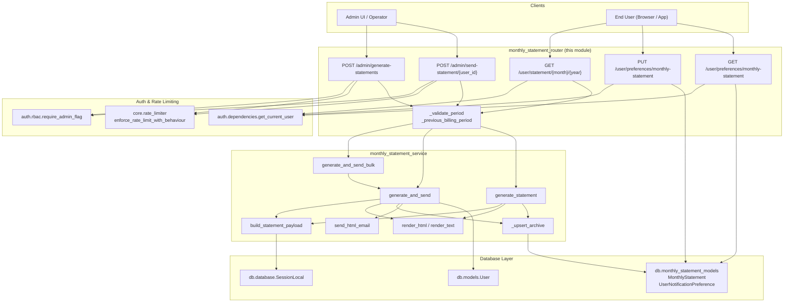
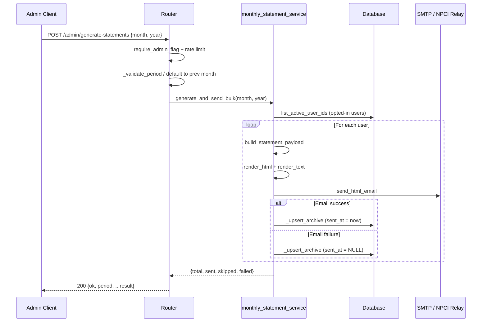
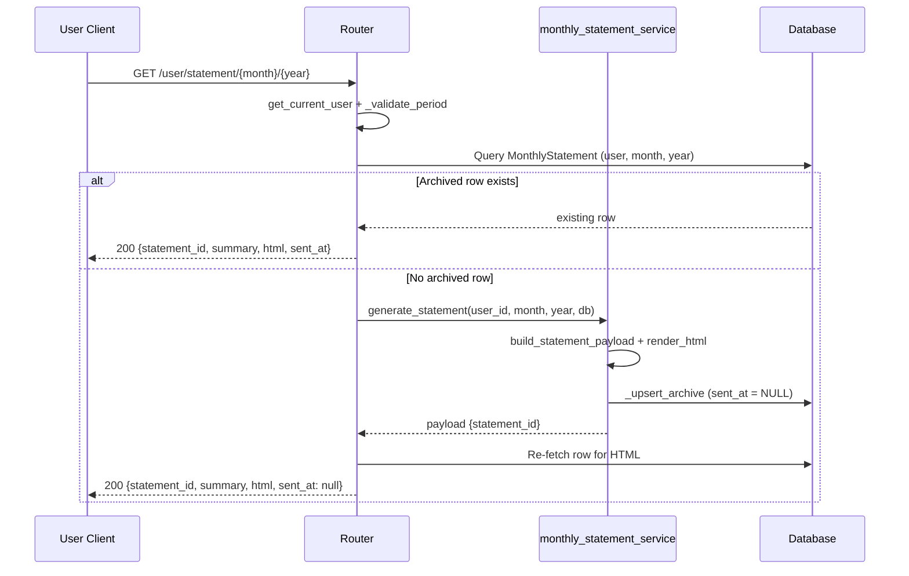
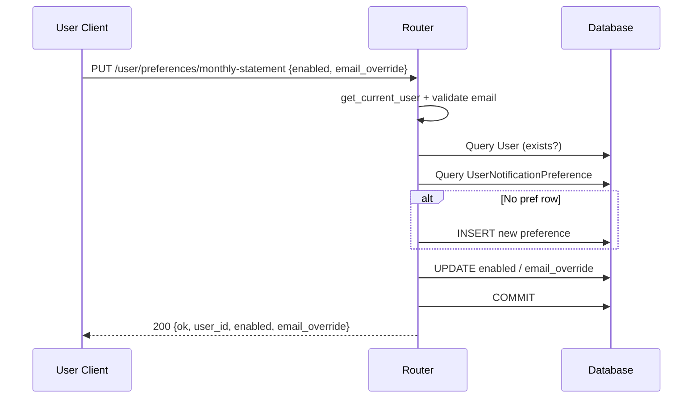
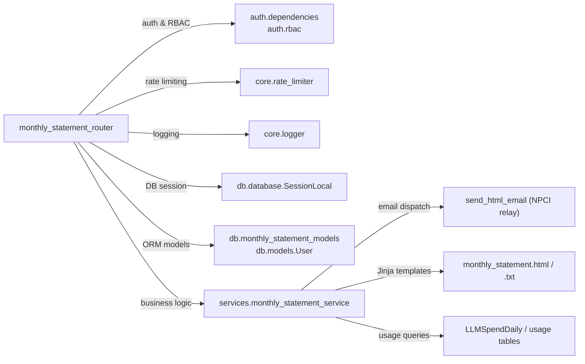

# Monthly Statement Router

## Introduction

The `monthly_statement_router` module is a FastAPI APIRouter that exposes
endpoints for generating, archiving, and delivering **monthly LLM-usage
statements** to platform users. It serves two audiences:

- **Administrators** — who can trigger bulk statement generation for all
  opted-in users, or send an individual statement to a specific user
  (optionally bypassing the user's opt-out preference for legal/audit
  copies).
- **End users** — who can view their own archived statement for a given
  billing period and manage their notification preferences (opt-in/out,
  alternate email address).

The router is a thin HTTP layer: it validates input, enforces
authentication/authorization and rate limits, then delegates all business
logic — payload aggregation, HTML/text rendering, email dispatch, and
database archiving — to the
[`monthly_statement_service`](#service-layer-dependency) module.

---

## Architecture Overview



### Module Boundaries

The router intentionally contains **no business logic**. Its
responsibilities are:

| Responsibility | How |
|---|---|
| Input validation | `_validate_period`, Pydantic models (`BulkRequest`, `PreferenceUpdate`) |
| Authentication | `Depends(get_current_user)` for user endpoints |
| Authorization | `Depends(require_admin_flag)` for admin endpoints |
| Rate limiting | `enforce_rate_limit_with_behaviour(request, SENSITIVE_ADMIN)` |
| Period defaulting | `_previous_billing_period()` |
| Response shaping | Assembling JSON from service-layer return values |

Everything else — querying usage data, rendering templates, sending email,
archiving to the database — lives in the service layer.

---

## Component Reference

### `BulkRequest`

```python
class BulkRequest(BaseModel):
    month: Optional[int]  # 1–12; defaults to previous month
    year:  Optional[int]  # YYYY;  defaults to previous month's year
```

Pydantic request body used by both admin endpoints. When `month`/`year`
are omitted the router falls back to `_previous_billing_period()`.

---

### `PreferenceUpdate`

```python
class PreferenceUpdate(BaseModel):
    enabled:        Optional[bool]  # opt-in / opt-out
    email_override: Optional[str]   # alternate inbox; "" clears override
```

Validated with a `field_validator` that enforces a basic email regex
(`_EMAIL_RE`) on `email_override`. An empty string clears the override;
`None` leaves the existing value untouched.

---

### `_validate_period(month, year)`

Raises `HTTPException(400)` if `month` is outside 1–12 or `year` is
outside 2024–2100.

### `_previous_billing_period()`

Returns the `(month, year)` tuple for the **previous** calendar month
relative to `datetime.utcnow()`. Handles the January → December year
rollover.

---

### Admin Endpoints

#### `admin_bulk_generate` — `POST /admin/generate-statements`

| Aspect | Detail |
|---|---|
| Auth | `require_admin_flag` |
| Rate limit | `SENSITIVE_ADMIN` |
| Body | `BulkRequest` (all fields optional) |
| Delegates to | `generate_and_send_bulk(month, year)` |

Generates and emails statements for **every active, opted-in user**.
Per-user errors are isolated by the service layer — one failure does not
abort the batch. The response includes `total`, `sent`, `skipped`, and a
`failed` list.

#### `admin_send_one` — `POST /admin/send-statement/{user_id}`

| Aspect | Detail |
|---|---|
| Auth | `require_admin_flag` |
| Rate limit | `SENSITIVE_ADMIN` |
| Query param | `?force=true` — bypasses user opt-out |
| Body | `BulkRequest` (all fields optional) |
| Delegates to | `generate_and_send(user_id, month, year, force)` |

Sends a single user's statement. By default honours the user's opt-out
preference; the `force` flag overrides this for legal/audit scenarios.
A `ValueError` from the service (user not found) is translated to
`HTTP 404`.

---

### User Endpoints

#### `user_view_statement` — `GET /user/statement/{month}/{year}`

| Aspect | Detail |
|---|---|
| Auth | `get_current_user` |
| Delegates to | `generate_statement` (on-demand only) |

Returns the archived statement (HTML + JSON summary) for the logged-in
user. If an archived row already exists for the period it is returned
immediately. If none exists, the statement is **generated on-the-fly**
and archived (without sending an email), then returned. This enables
mid-month previews.

#### `user_update_preference` — `PUT /user/preferences/monthly-statement`

| Aspect | Detail |
|---|---|
| Auth | `get_current_user` |
| Body | `PreferenceUpdate` |

Upserts the user's `UserNotificationPreference` row. Creates the row if
it does not yet exist. Returns the updated preference state.

#### `user_get_preference` — `GET /user/preferences/monthly-statement`

| Aspect | Detail |
|---|---|
| Auth | `get_current_user` |

Returns the user's current preference. If no preference row exists,
defaults are returned: `monthly_statement_enabled = True`,
`email_override = None`.

---

## Data Flow

### Bulk Generate & Send Flow



### User On-Demand View Flow



### Preference Update Flow



---

## Database Schema

The router interacts with two tables defined in
`db.monthly_statement_models`:

### `monthly_statements` (`MonthlyStatement`)

| Column | Type | Notes |
|---|---|---|
| `id` | UUID (PK) | Auto-generated |
| `user_id` | UUID (FK → users.id, CASCADE) | |
| `billing_month` | SmallInteger | 1–12 |
| `billing_year` | SmallInteger | |
| `statement_html` | Text | Fully rendered Jinja2 output |
| `statement_json` | JSONB | Structured summary for audits / re-rendering |
| `total_cost` | Numeric(12,4) | |
| `total_tokens` | BigInteger | |
| `total_requests` | Integer | |
| `sent_at` | DateTime | NULL = generated but not emailed |
| `created_at` | DateTime | |

**Constraints:** Unique on `(user_id, billing_month, billing_year)`.

### `user_notification_preferences` (`UserNotificationPreference`)

| Column | Type | Notes |
|---|---|---|
| `user_id` | UUID (PK, FK → users.id, CASCADE) | |
| `monthly_statement_enabled` | Boolean | Default `TRUE` |
| `email_override` | String(255) | NULL = use user's primary email |
| `updated_at` | DateTime | Auto-updated on change |

---

## Dependencies



### Cross-Module References

| Dependency | Module | Purpose |
|---|---|---|
| `auth.dependencies.get_current_user` | [authentication](../auth/authentication.md) | JWT extraction for user endpoints |
| `auth.rbac.require_admin_flag` | [authentication](../auth/authentication.md) | Admin-gate for admin endpoints |
| `core.rate_limiter` | [core_infrastructure](../core/core_infrastructure.md) | `SENSITIVE_ADMIN` rate-limit tier |
| `core.logger` | [core_infrastructure](../core/core_infrastructure.md) | Structured logging |
| `db.database.SessionLocal` | [database](../storage/database.md) | SQLAlchemy session factory |
| `db.models.User` | [database](../storage/database.md) | User ORM model |
| `db.monthly_statement_models` | [database](../storage/database.md) | Statement & preference ORM models |
| `services.monthly_statement_service` | — (service layer) | All business logic |

---

## Security & Compliance Notes

1. **Admin endpoints** are protected by `require_admin_flag` *and* the
   `SENSITIVE_ADMIN` rate-limit tier, which applies stricter throttling
   than standard endpoints.
2. **User endpoints** extract the user identity from the JWT
   (`sub` or `user_id` claim). A missing identity yields `HTTP 401`.
3. **Opt-out enforcement** — `generate_and_send` checks
   `UserNotificationPreference.monthly_statement_enabled` before sending.
   The `?force=true` query param on `admin_send_one` bypasses this for
   legal/audit copies, but the statement is still archived.
4. **Email validation** — `PreferenceUpdate.email_override` is validated
   with a regex before persistence.
5. **Archival** — every generated statement (whether emailed or not) is
   persisted to `monthly_statements` with both rendered HTML and
   structured JSON, providing a complete audit trail.

---

## Error Handling Summary

| Scenario | HTTP Status | Source |
|---|---|---|
| Invalid month/year | 400 | `_validate_period` |
| Missing user identity in token | 401 | user endpoints |
| User not found (admin send) | 404 | `ValueError` → `HTTPException` |
| User not found (preference update) | 404 | explicit check |
| No archived statement + generation fails | 404 | `ValueError` → `HTTPException` |
| Rate limit exceeded | 429 | `enforce_rate_limit_with_behaviour` |
| Invalid email in preference | 422 | Pydantic `field_validator` |
